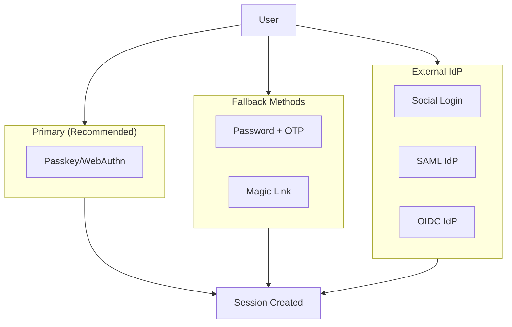
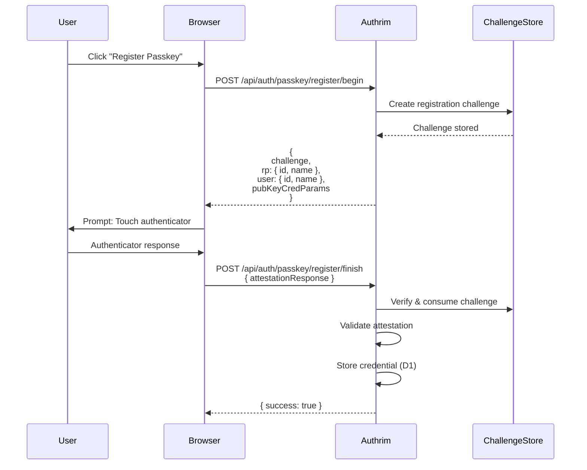
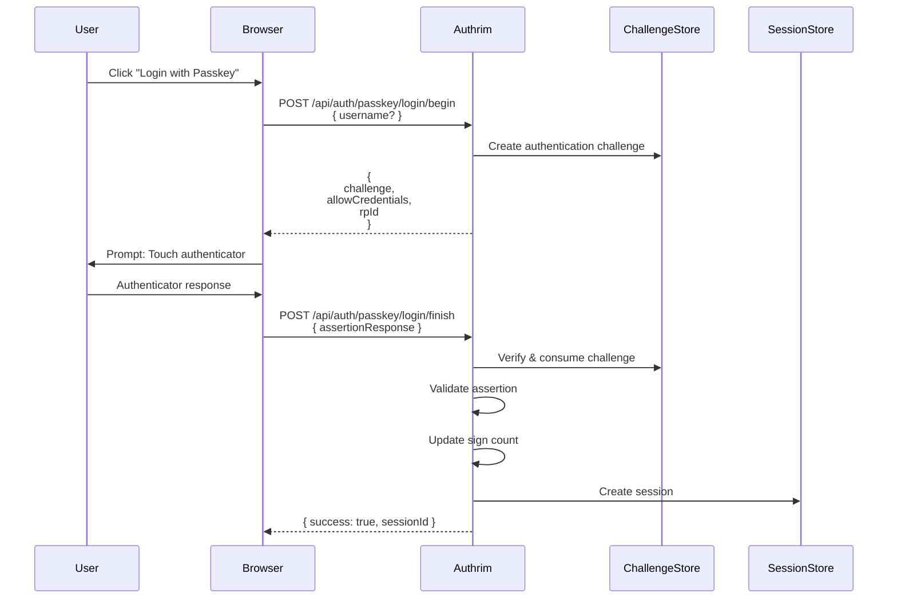
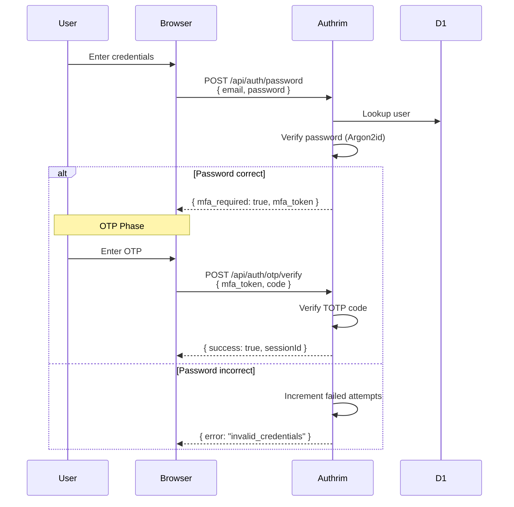
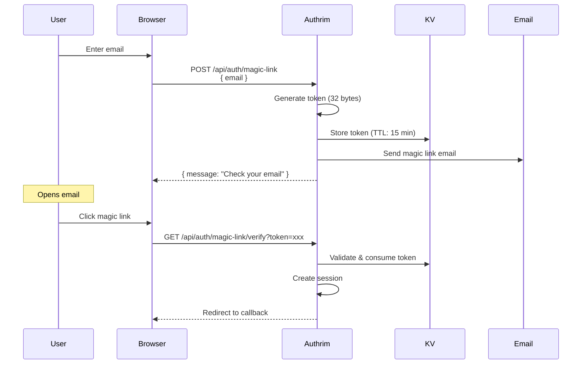
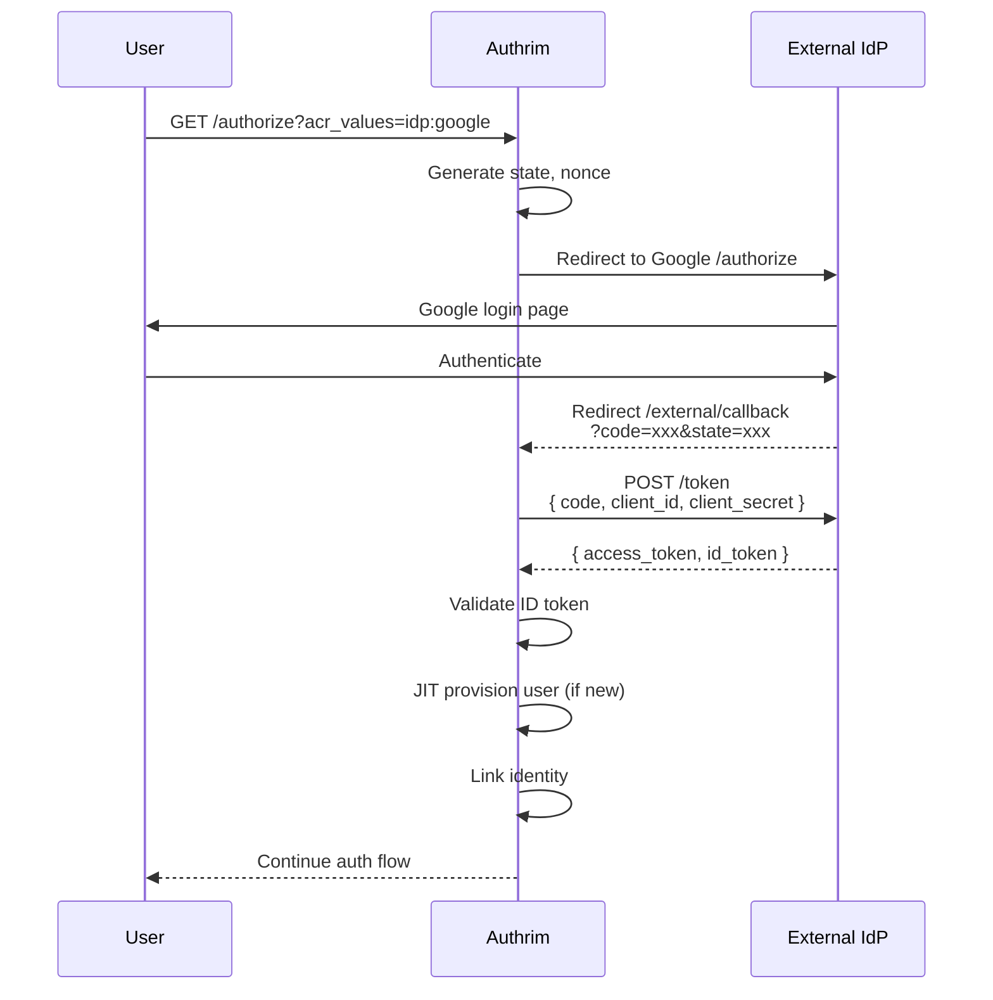
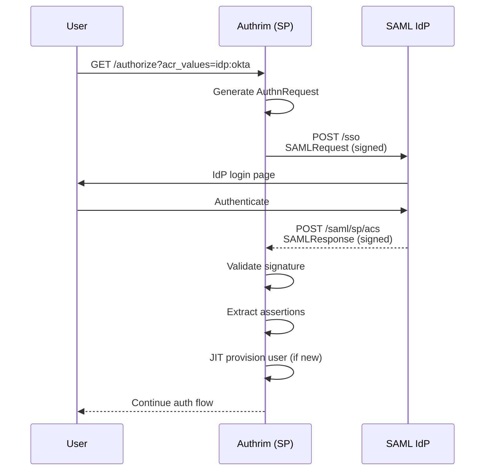
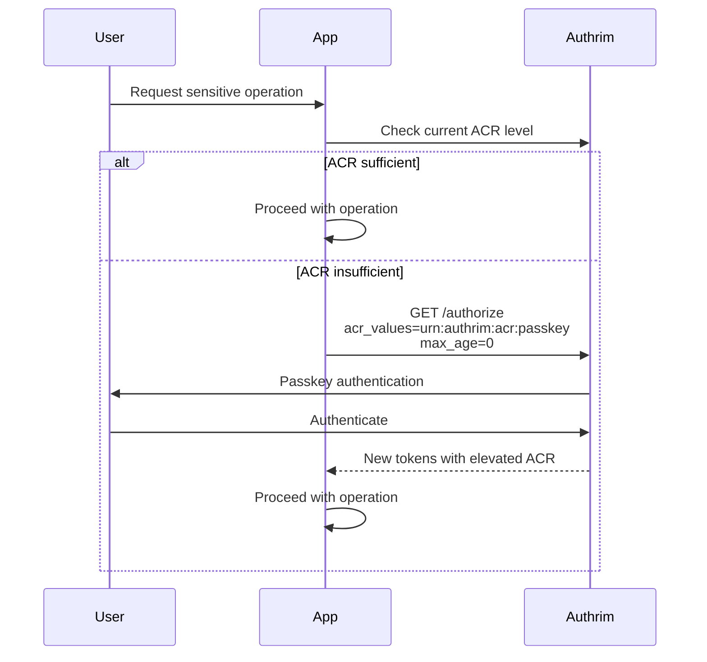
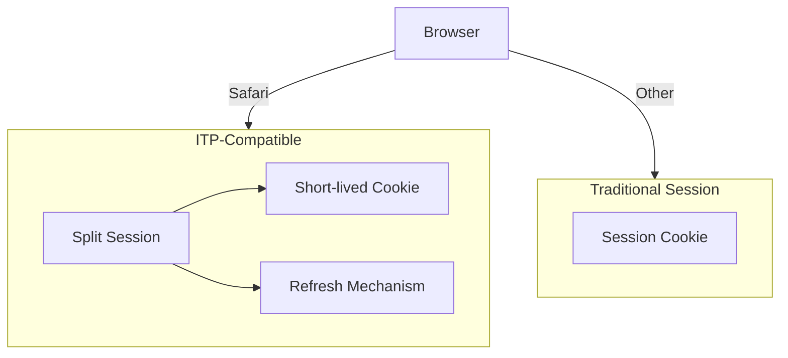

# Authentication Flows

User authentication methods supporting passwordless, multi-factor, and federated identity.

## Overview

| Aspect | Description |
|--------|-------------|
| **Primary Method** | Passkey (WebAuthn/FIDO2) |
| **Fallback Methods** | Password + OTP, Magic Link |
| **Federation** | OIDC, SAML, Social Login |
| **Session Management** | ITP-compatible, secure cookies |

Authrim supports multiple authentication methods to balance security and user experience across different use cases.

---

## Authentication Methods



---

## 1. Passkey (WebAuthn/FIDO2)

The recommended authentication method providing phishing-resistant, passwordless login.

### Registration Flow



### Authentication Flow



### Passkey Configuration

| Setting | Default | Description |
|---------|---------|-------------|
| `rpId` | Domain | Relying Party ID |
| `rpName` | "Authrim" | Display name |
| `attestation` | "none" | Attestation preference |
| `userVerification` | "preferred" | UV requirement |
| `authenticatorSelection` | Platform + Cross-platform | Allowed authenticators |

### Challenge Management

Challenges are stored in `ChallengeStore` Durable Object:
- **TTL**: 5 minutes (configurable)
- **Single-use**: Consumed on verification
- **Sharding**: By tenant and user for scalability

---

## 2. Password + OTP

Traditional password authentication with mandatory second factor.

### Authentication Flow



### Password Security

| Feature | Implementation |
|---------|----------------|
| **Hashing** | Argon2id (OWASP recommended) |
| **Salt** | Unique per-user (32 bytes) |
| **Pepper** | Server-side secret |
| **Lockout** | 5 attempts / 15 minutes |

### OTP Configuration

| Setting | Default | Description |
|---------|---------|-------------|
| `algorithm` | SHA-1 | TOTP algorithm |
| `digits` | 6 | OTP length |
| `period` | 30 | Time step (seconds) |
| `window` | 1 | Clock drift tolerance |

---

## 3. Magic Link

Passwordless email-based authentication.

### Flow



### Security Features

| Feature | Implementation |
|---------|----------------|
| **Token entropy** | 256 bits (crypto.randomBytes) |
| **Single-use** | Deleted on use |
| **TTL** | 15 minutes (configurable) |
| **Rate limit** | 3 per email per hour |

---

## 4. External IdP Federation

### Supported Providers

| Provider | Protocol | Features |
|----------|----------|----------|
| **Google** | OIDC | Email verification, profile |
| **Microsoft** | OIDC | Azure AD, personal accounts |
| **Apple** | OIDC | Hide my email, private relay |
| **GitHub** | OAuth 2.0 | User profile, emails |
| **Generic OIDC** | OIDC | Any OIDC-compliant IdP |
| **SAML IdPs** | SAML 2.0 | Enterprise SSO |

### OIDC Federation Flow



### SAML Federation Flow



### JIT (Just-in-Time) Provisioning

When a user authenticates via external IdP for the first time:

1. **User Creation**: Create local user record from IdP claims
2. **Identity Linking**: Link external identity to local user
3. **Attribute Mapping**: Map IdP claims to local attributes
4. **Group Mapping**: Optional group/role assignment

```typescript
interface JITProvisioningConfig {
  enabled: boolean;
  createUsers: boolean;
  updateAttributes: boolean;
  attributeMapping: {
    email: string;      // e.g., "email"
    name: string;       // e.g., "name"
    picture: string;    // e.g., "picture"
  };
  groupMapping?: {
    [idpGroup: string]: string; // local role
  };
}
```

---

## 5. Step-up Authentication

For sensitive operations, require stronger authentication.

### Step-up Flow



### ACR Values

| ACR Value | Requirement | Use Case |
|-----------|-------------|----------|
| `urn:authrim:acr:password` | Password only | Basic access |
| `urn:authrim:acr:mfa` | Password + OTP | Standard access |
| `urn:authrim:acr:passkey` | Passkey | Sensitive operations |
| `urn:authrim:acr:phishing-resistant` | Passkey | Financial transactions |

---

## Session Management

### Session Creation

After successful authentication, a session is created:

```typescript
interface Session {
  id: string;              // Unique session ID
  userId: string;          // User identifier
  clientId: string;        // OAuth client
  acr: string;             // Authentication level
  amr: string[];           // Methods used
  authTime: number;        // Authentication timestamp
  expiresAt: number;       // Session expiry
  metadata: {
    ip: string;
    userAgent: string;
    location?: string;
  };
}
```

### Session Storage

Sessions are stored in `SessionStore` Durable Object:
- **Hot storage**: In-memory for active sessions
- **Cold storage**: D1 for historical/inactive sessions
- **Sharding**: By session ID for scalability

### ITP Compatibility

For Safari's Intelligent Tracking Prevention:



---

## Authentication Events

### Event Types

| Event | Trigger | Logged Data |
|-------|---------|-------------|
| `auth.started` | Authorization begins | client_id, scopes |
| `auth.method.selected` | Method chosen | method type |
| `auth.success` | Successful auth | user_id, acr, amr |
| `auth.failure` | Failed auth | reason, attempt count |
| `session.created` | New session | session_id, expiry |
| `session.revoked` | Session ended | reason |

---

## Related Documents

| Document | Description |
|----------|-------------|
| [Security](./security.md) | Security architecture |
| [Protocol Flow](./protocol-flow.md) | OAuth/OIDC protocol flows |
| [Session Management](../features/session-management.md) | Session details |
| [Passkey/WebAuthn](../features/passkey-webauthn.md) | Passkey implementation |

---

## References

- [WebAuthn Level 2](https://www.w3.org/TR/webauthn-2/)
- [FIDO2 Specifications](https://fidoalliance.org/specifications/)
- [OpenID Connect Core 1.0](https://openid.net/specs/openid-connect-core-1_0.html)
- [SAML 2.0](https://docs.oasis-open.org/security/saml/v2.0/)
- [TOTP (RFC 6238)](https://datatracker.ietf.org/doc/html/rfc6238)

---

**Last Updated**: 2025-12-20
**Status**: Production
**Methods**: Passkey, Password+OTP, Magic Link, OIDC/SAML Federation
