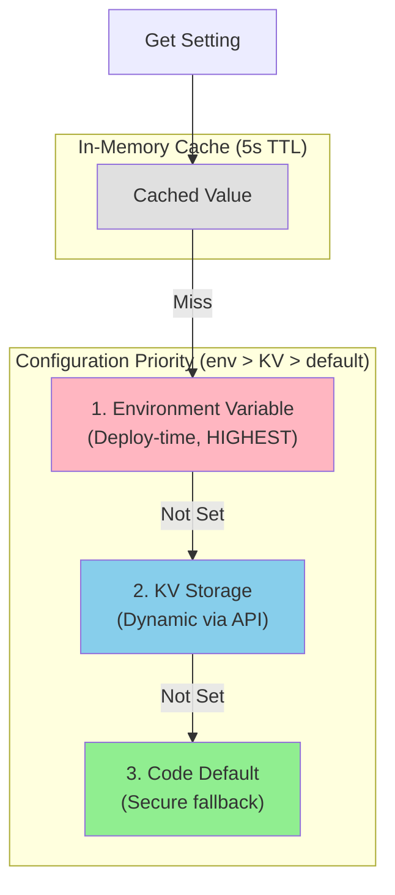

# Configuration Architecture

Hybrid configuration system with dynamic overrides and secure defaults.

**Last Updated**: 2025-12-25

## Overview

| Aspect         | Description                                    |
| -------------- | ---------------------------------------------- |
| **Pattern**    | Hybrid (Environment + KV + Defaults)           |
| **Priority**   | env > KV > default (environment wins)          |
| **Management** | Settings API v2 for dynamic changes            |
| **Defaults**   | Security-first default values                  |
| **Locking**    | Optimistic locking with version hash (ifMatch) |

Authrim uses a layered configuration system that allows runtime configuration changes without redeployment while maintaining secure defaults. **Environment variables take highest priority** to ensure deployment-time constraints cannot be bypassed via API.

---

## Configuration Hierarchy



### Priority Rationale

| Level           | Priority | Use Case                     | Change Method       |
| --------------- | -------- | ---------------------------- | ------------------- |
| **Environment** | Highest  | Deployment-time constraints  | `wrangler deploy`   |
| **KV**          | Medium   | Runtime configuration        | Settings API v2     |
| **Default**     | Lowest   | Security-first fallback      | Code change         |
| **Cache**       | -        | Performance (5s TTL)         | Automatic           |

> **Design Decision**: Environment variables have highest priority so that production deployments can enforce certain settings (e.g., `PKCE_REQUIRED=true`) that cannot be disabled via the Admin API.

---

## Configuration Pattern

### Getting a Setting

```typescript
async function getSetting(env: Env, key: string): Promise<string> {
  // 1. Check in-memory cache (10s TTL)
  const cached = settingsCache.get(key);
  if (cached && !cached.expired) {
    return cached.value;
  }

  // 2. Check KV for dynamic override
  const kvValue = await env.SETTINGS.get(`setting:${key}`);
  if (kvValue) {
    settingsCache.set(key, kvValue, 10000); // Cache for 10s
    return kvValue;
  }

  // 3. Check environment variable
  const envValue = env[key];
  if (envValue) {
    return envValue;
  }

  // 4. Return secure default
  return SECURE_DEFAULTS[key];
}
```

### Secure Defaults

All defaults are configured for maximum security:

```typescript
const SECURE_DEFAULTS = {
  // Token lifetimes (short)
  ACCESS_TOKEN_EXPIRY: '3600', // 1 hour
  REFRESH_TOKEN_EXPIRY: '2592000', // 30 days
  AUTH_CODE_EXPIRY: '60', // 60 seconds

  // Security features (enabled)
  PKCE_REQUIRED: 'true',
  DPOP_REQUIRED: 'false', // Enable for FAPI
  PAR_REQUIRED: 'false', // Enable for FAPI

  // Rate limiting (conservative)
  RATE_LIMIT_TOKEN: '100', // per minute
  RATE_LIMIT_AUTHORIZE: '60', // per minute

  // Session (secure)
  SESSION_COOKIE_SECURE: 'true',
  SESSION_COOKIE_SAMESITE: 'lax',
};
```

---

## Configuration Categories

### Token Settings

| Setting                | Default | Description                 |
| ---------------------- | ------- | --------------------------- |
| `ACCESS_TOKEN_EXPIRY`  | 3600    | Access token TTL (seconds)  |
| `REFRESH_TOKEN_EXPIRY` | 2592000 | Refresh token TTL (seconds) |
| `ID_TOKEN_EXPIRY`      | 3600    | ID token TTL (seconds)      |
| `AUTH_CODE_EXPIRY`     | 60      | Auth code TTL (seconds)     |

### Security Settings

| Setting              | Default | Description                   |
| -------------------- | ------- | ----------------------------- |
| `PKCE_REQUIRED`      | true    | Require PKCE for all flows    |
| `PKCE_PLAIN_ALLOWED` | false   | Allow plain challenge method  |
| `DPOP_REQUIRED`      | false   | Require DPoP binding          |
| `PAR_REQUIRED`       | false   | Require PAR for authorization |
| `JAR_REQUIRED`       | false   | Require signed requests       |

### Session Settings

| Setting                 | Default | Description                |
| ----------------------- | ------- | -------------------------- |
| `SESSION_TTL`           | 86400   | Session duration (seconds) |
| `SESSION_IDLE_TIMEOUT`  | 3600    | Idle timeout (seconds)     |
| `MAX_SESSIONS_PER_USER` | 10      | Concurrent sessions limit  |

### Rate Limiting

| Setting                | Default | Description                   |
| ---------------------- | ------- | ----------------------------- |
| `RATE_LIMIT_TOKEN`     | 100     | Token requests per minute     |
| `RATE_LIMIT_AUTHORIZE` | 60      | Authorize requests per minute |
| `RATE_LIMIT_USERINFO`  | 120     | UserInfo requests per minute  |

---

## KV Storage Structure

### Settings Namespace

```
settings:{key} = {value}
```

Examples:

```
settings:access_token_expiry = "3600"
settings:pkce_required = "true"
settings:rate_limit_token = "100"
```

### Feature Flags

```
feature:{flag_name} = "enabled" | "disabled"
```

Examples:

```
feature:dpop = "enabled"
feature:ciba = "enabled"
feature:scim = "enabled"
```

---

## Admin API (Settings API v2)

### Unified Settings Endpoints

Settings are organized by **category** and **scope** (tenant/client/platform):

| Endpoint                                            | Method | Description               |
| --------------------------------------------------- | ------ | ------------------------- |
| `/api/admin/tenants/:tenantId/settings/:category`   | GET    | Get tenant settings       |
| `/api/admin/tenants/:tenantId/settings/:category`   | PATCH  | Update tenant settings    |
| `/api/admin/clients/:clientId/settings`             | GET    | Get client settings       |
| `/api/admin/clients/:clientId/settings`             | PATCH  | Update client settings    |
| `/api/admin/platform/settings/:category`            | GET    | Get platform settings     |
| `/api/admin/settings/meta/:category`                | GET    | Get category metadata     |
| `/api/admin/settings/meta`                          | GET    | List all categories       |

### Categories

| Category         | Scope    | Description             |
| ---------------- | -------- | ----------------------- |
| `oauth`          | Tenant   | OAuth/OIDC settings     |
| `session`        | Tenant   | Session management      |
| `security`       | Tenant   | Security policies       |
| `rate-limit`     | Tenant   | Rate limiting           |
| `client`         | Client   | Per-client settings     |
| `infrastructure` | Platform | Infrastructure (read-only) |
| `encryption`     | Platform | Encryption (read-only)  |

### Example Requests

**Get Settings (with version for optimistic locking)**

```bash
GET /api/admin/tenants/default/settings/oauth

{
  "category": "oauth",
  "scope": { "type": "tenant", "id": "default" },
  "version": "sha256:9b1c...",
  "values": {
    "oauth.access_token_expiry": 3600,
    "oauth.pkce_required": true
  },
  "sources": {
    "oauth.access_token_expiry": "default",
    "oauth.pkce_required": "env"
  }
}
```

**Update Settings (with optimistic locking)**

```bash
PATCH /api/admin/tenants/default/settings/oauth
Content-Type: application/json

{
  "ifMatch": "sha256:9b1c...",
  "set": { "oauth.access_token_expiry": 1800 },
  "clear": ["oauth.some_override"]
}
```

**Response**

```json
{
  "version": "sha256:aa02...",
  "applied": ["oauth.access_token_expiry"],
  "cleared": ["oauth.some_override"],
  "rejected": {}
}
```

**Conflict Response (409)**

```json
{
  "error": "conflict",
  "message": "Settings were updated by someone else.",
  "currentVersion": "sha256:bb03..."
}
```

> **Note**: Platform settings (`infrastructure`, `encryption`) are read-only via API. Modify via environment variables.

---

## Feature Flags

### Flag Categories


### Flag States

| State      | Behavior                             |
| ---------- | ------------------------------------ |
| `enabled`  | Feature fully available              |
| `disabled` | Feature returns 501/disabled error   |
| `beta`     | Available but marked as experimental |

### Checking Feature Flags

```typescript
async function isFeatureEnabled(env: Env, feature: string): Promise<boolean> {
  const value = await getSetting(env, `feature:${feature}`);
  return value === 'enabled' || value === 'beta';
}

// Usage
if (!(await isFeatureEnabled(env, 'ciba'))) {
  return new Response(
    JSON.stringify({
      error: 'feature_disabled',
      error_description: 'CIBA is not enabled',
    }),
    { status: 501 }
  );
}
```

---

## Environment Variables

### Core Variables

| Variable        | Required | Description                            |
| --------------- | -------- | -------------------------------------- |
| `ISSUER_DOMAIN` | ✅       | Issuer domain (e.g., auth.example.com) |
| `D1`            | ✅       | D1 database binding                    |
| `KV`            | ✅       | KV namespace binding                   |
| `SETTINGS`      | ✅       | Settings KV namespace                  |

### Secret Variables

| Variable                | Required | Description                  |
| ----------------------- | -------- | ---------------------------- |
| `ADMIN_API_SECRET`      | ✅       | Admin API authentication     |
| `KEY_MANAGER_SECRET`    | ✅       | KeyManager DO authentication |
| `PRIVATE_KEY_ENCRYPTED` | ✅       | Encrypted signing key        |
| `AES_KEY_BASE64`        | ✅       | Encryption key for secrets   |

### Optional Variables

| Variable                 | Default | Description               |
| ------------------------ | ------- | ------------------------- |
| `LOG_LEVEL`              | info    | Logging verbosity         |
| `AUTHRIM_CODE_SHARDS`    | 4       | Authorization code shards |
| `AUTHRIM_SESSION_SHARDS` | 4       | Session store shards      |

---

## Caching

### In-Memory Cache

Settings are cached in-memory for performance:

```typescript
interface CacheEntry {
  value: string;
  expiresAt: number;
}

const settingsCache = new Map<string, CacheEntry>();
const CACHE_TTL_MS = 10000; // 10 seconds

function getCached(key: string): string | null {
  const entry = settingsCache.get(key);
  if (entry && Date.now() < entry.expiresAt) {
    return entry.value;
  }
  settingsCache.delete(key);
  return null;
}

function setCache(key: string, value: string): void {
  settingsCache.set(key, {
    value,
    expiresAt: Date.now() + CACHE_TTL_MS,
  });
}
```

### Cache Invalidation


For immediate invalidation (future enhancement):

- Use DO for cache coordination
- Broadcast invalidation via WebSocket

---

## Validation

### Setting Constraints

```typescript
const SETTING_CONSTRAINTS = {
  access_token_expiry: {
    type: 'number',
    min: 60,
    max: 86400,
    description: 'Access token TTL (1 minute to 24 hours)',
  },
  pkce_required: {
    type: 'boolean',
    description: 'Require PKCE for authorization',
  },
  rate_limit_token: {
    type: 'number',
    min: 10,
    max: 10000,
    description: 'Token requests per minute',
  },
};

function validateSetting(key: string, value: string): ValidationResult {
  const constraint = SETTING_CONSTRAINTS[key];
  if (!constraint) {
    return { valid: false, error: 'Unknown setting' };
  }

  // Type-specific validation
  if (constraint.type === 'number') {
    const num = parseInt(value, 10);
    if (isNaN(num) || num < constraint.min || num > constraint.max) {
      return { valid: false, error: `Must be between ${constraint.min} and ${constraint.max}` };
    }
  }

  return { valid: true };
}
```

---

## Monitoring

### Configuration Metrics

| Metric                       | Description              |
| ---------------------------- | ------------------------ |
| `config.cache.hit`           | Cache hit count          |
| `config.cache.miss`          | Cache miss count         |
| `config.kv.reads`            | KV read operations       |
| `config.validation.failures` | Invalid setting attempts |

### Audit Logging

All configuration changes are logged:

```json
{
  "event": "setting.updated",
  "actor": "admin@example.com",
  "setting": "access_token_expiry",
  "oldValue": "3600",
  "newValue": "1800",
  "source": "admin_api",
  "timestamp": "2025-12-20T10:30:00Z"
}
```

---

## Related Documents

| Document                                                | Description              |
| ------------------------------------------------------- | ------------------------ |
| [Security](./security.md)                               | Security settings        |
| [Multi-Tenancy](./multi-tenancy.md)                     | Per-tenant configuration |
| [Storage Strategy](./storage-strategy.md)               | KV storage patterns      |
| [Secret Management](../operations/secret-management.md) | Secret handling          |

---

## References

- [Cloudflare KV](https://developers.cloudflare.com/kv/)
- [Cloudflare Environment Variables](https://developers.cloudflare.com/workers/configuration/environment-variables/)
- [12-Factor App Config](https://12factor.net/config)

---

**Last Updated**: 2025-12-20
**Status**: Production
**Pattern**: Hybrid (KV + Env + Defaults)
