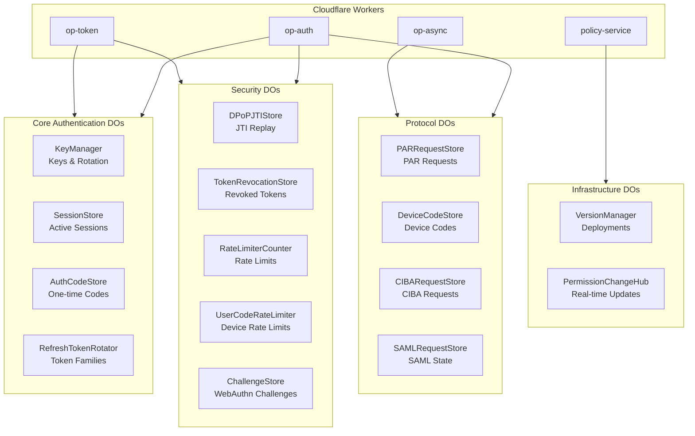
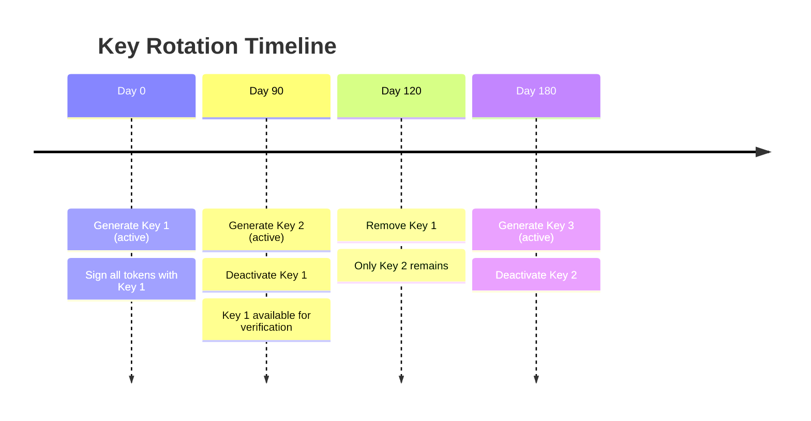
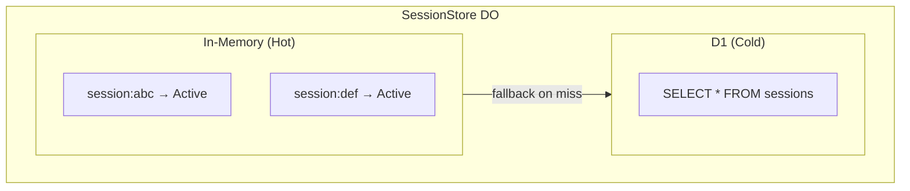
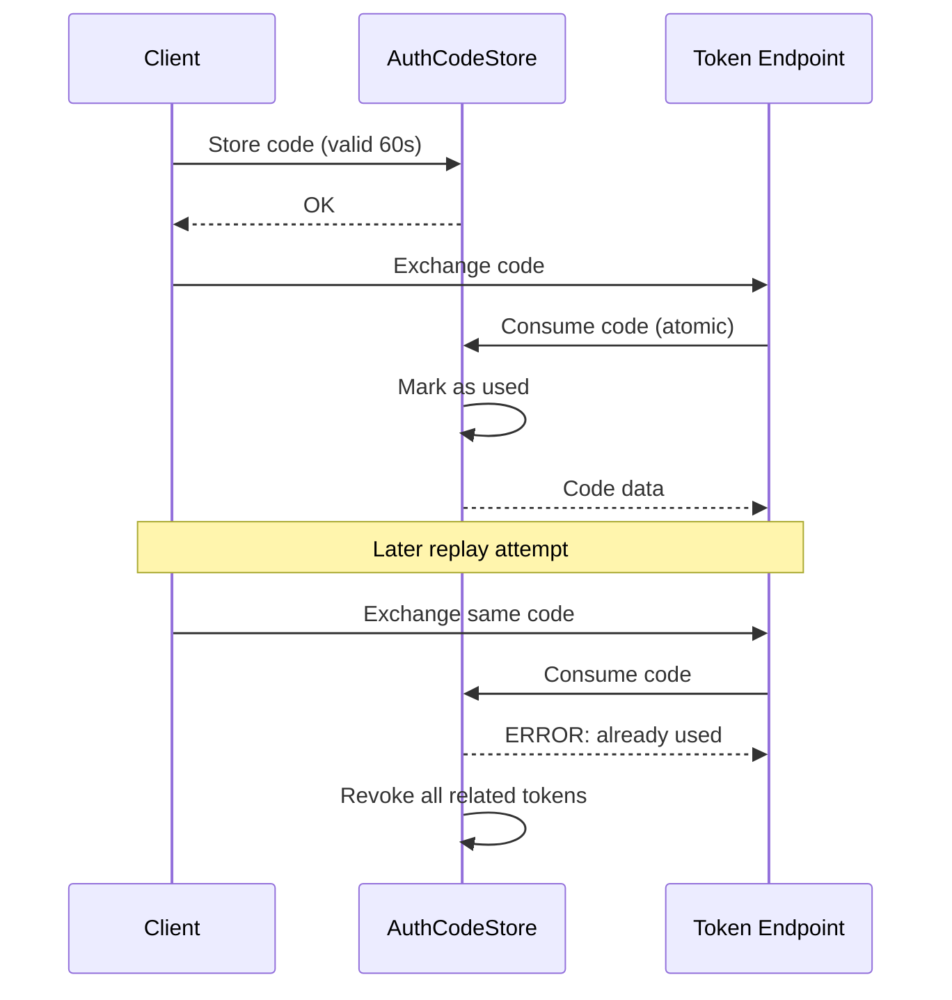
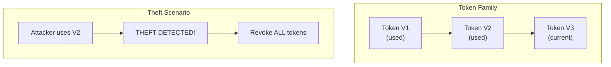
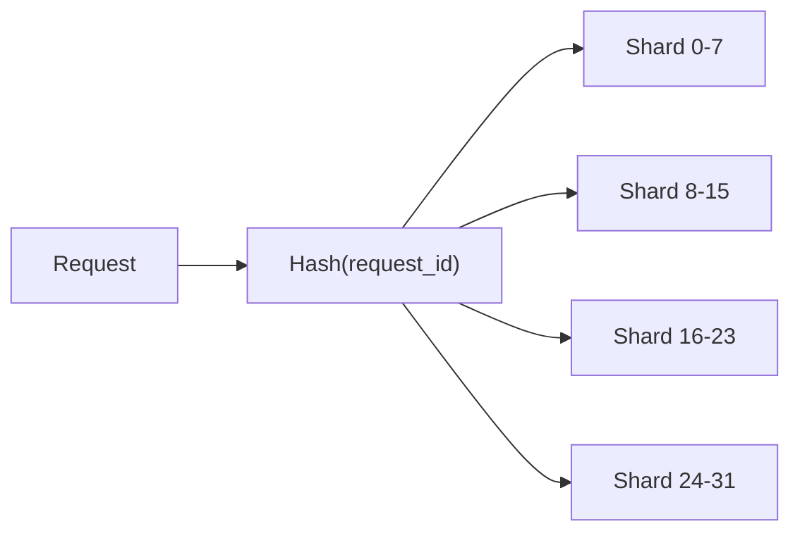

# Durable Objects Architecture

Strong consistency layer for distributed authentication and authorization.

## Overview

| Aspect | Description |
|--------|-------------|
| **Total DOs** | 16 Durable Objects |
| **Purpose** | Strong consistency for auth flows |
| **Pattern** | Single-instance-per-key globally |
| **Storage** | In-memory + persistent (DO storage/D1) |

Authrim uses Cloudflare Durable Objects to provide **strong consistency** guarantees that are critical for security-sensitive operations like authorization codes, sessions, and token rotation.

---

## Durable Objects List

### Core Authentication

| Durable Object | Purpose | Consistency Guarantee |
|----------------|---------|----------------------|
| **KeyManager** | RSA/EC key management & rotation | Atomic key operations |
| **SessionStore** | Active user session state | Real-time invalidation |
| **AuthorizationCodeStore** | One-time auth codes | Single-use guarantee |
| **RefreshTokenRotator** | Token rotation & family tracking | Theft detection |

### Security & Rate Limiting

| Durable Object | Purpose | Consistency Guarantee |
|----------------|---------|----------------------|
| **DPoPJTIStore** | DPoP proof replay prevention | Unique JTI tracking |
| **TokenRevocationStore** | Revoked token registry | Immediate propagation |
| **RateLimiterCounter** | API rate limiting | Atomic counters |
| **UserCodeRateLimiter** | Device flow rate limiting | Per-user limits |
| **ChallengeStore** | WebAuthn challenge management | Single-use verification |

### Protocol Stores

| Durable Object | Purpose | Consistency Guarantee |
|----------------|---------|----------------------|
| **PARRequestStore** | Pushed Authorization Requests | Request URI binding |
| **DeviceCodeStore** | Device Authorization Grant | Polling state management |
| **CIBARequestStore** | CIBA authentication requests | Async flow state |
| **SAMLRequestStore** | SAML request/response binding | Cross-domain state |

### Infrastructure

| Durable Object | Purpose | Consistency Guarantee |
|----------------|---------|----------------------|
| **VersionManager** | Deployment versioning | Atomic version control |
| **PermissionChangeHub** | Real-time permission updates | WebSocket broadcast |

---

## Architecture Diagram



---

## 1. KeyManager

Manages cryptographic keys for JWT signing with automatic rotation.

### Purpose

- Store RSA/EC key pairs for JWT signing
- Manage multiple active keys simultaneously
- Implement automatic key rotation
- Provide JWKS endpoint data
- Support envelope encryption for key protection

### Key Rotation Strategy



### API

| Endpoint | Method | Description |
|----------|--------|-------------|
| `/active` | GET | Get active signing key |
| `/jwks` | GET | Get all public keys (JWKS) |
| `/rotate` | POST | Trigger key rotation |
| `/should-rotate` | GET | Check if rotation needed |
| `/config` | GET/POST | Key rotation configuration |

### Configuration

| Setting | Default | Description |
|---------|---------|-------------|
| Rotation Interval | 90 days | Time between rotations |
| Retention Period | 30 days | Keep old keys for verification |
| Key Algorithm | RS256 | Signing algorithm |
| Key Size | 2048 bits | RSA key size |

---

## 2. SessionStore

Manages active user sessions with instant invalidation capability.

### Purpose

- Store active sessions in memory (hot data)
- Provide sub-millisecond session lookup
- Enable instant session revocation
- Fall back to D1 for cold sessions
- Support ITP-compatible session management

### Hot/Cold Pattern



### API

| Endpoint | Method | Description |
|----------|--------|-------------|
| `/session/:id` | GET | Get session by ID |
| `/session` | POST | Create new session |
| `/session/:id` | DELETE | Invalidate session |
| `/sessions/user/:userId` | GET | List user's sessions |

### Configuration

| Setting | Default | Description |
|---------|---------|-------------|
| Session TTL | 24 hours | Default session lifetime |
| Max per User | 10 | Maximum concurrent sessions |
| Cleanup Interval | 5 minutes | Expired session cleanup |

---

## 3. AuthorizationCodeStore

Stores one-time authorization codes with replay attack prevention.

### Purpose

- Store authorization codes with short TTL
- Guarantee single-use (replay prevention)
- Store PKCE code_challenge for validation
- Atomic consume operation

### Replay Attack Prevention



### API

| Endpoint | Method | Description |
|----------|--------|-------------|
| `/code` | POST | Store authorization code |
| `/code/consume` | POST | Consume code (one-time) |

### Configuration

| Setting | Default | Description |
|---------|---------|-------------|
| Code TTL | 60 seconds | Authorization code lifetime |
| Max per User | 5 | Concurrent codes per user |

---

## 4. RefreshTokenRotator

Manages refresh token rotation with token family tracking and theft detection.

### Purpose

- Track token families for rotation
- Detect token theft via replay
- Atomic rotation guarantees
- Audit logging to D1

### Theft Detection



### API

| Endpoint | Method | Description |
|----------|--------|-------------|
| `/rotate` | POST | Rotate refresh token |
| `/revoke-family` | POST | Revoke entire token family |
| `/validate` | POST | Check if token is current |

---

## 5. DPoPJTIStore

Prevents DPoP proof replay by tracking used JTI values.

### Purpose

- Store used DPoP JTI values
- Prevent proof replay attacks
- Automatic cleanup of expired JTIs
- Per-client tracking

### API

| Endpoint | Method | Description |
|----------|--------|-------------|
| `/jti/check` | POST | Check and record JTI |
| `/jti/cleanup` | POST | Clean expired JTIs |

### Configuration

| Setting | Default | Description |
|---------|---------|-------------|
| JTI TTL | 5 minutes | JTI retention time |
| Cleanup Interval | 1 minute | Automatic cleanup |

---

## 6. TokenRevocationStore

Maintains registry of revoked tokens for immediate invalidation.

### Purpose

- Store revoked token identifiers
- Enable immediate token invalidation
- Support introspection queries
- Automatic cleanup of expired entries

### API

| Endpoint | Method | Description |
|----------|--------|-------------|
| `/revoke` | POST | Revoke a token |
| `/check` | POST | Check if revoked |
| `/cleanup` | POST | Clean expired entries |

---

## 7. RateLimiterCounter

Provides atomic rate limiting counters for API endpoints.

### Purpose

- Per-endpoint rate limiting
- Per-client rate limiting
- Sliding window algorithm
- Atomic counter operations

### API

| Endpoint | Method | Description |
|----------|--------|-------------|
| `/check` | POST | Check and increment counter |
| `/reset` | POST | Reset counter |

---

## 8. UserCodeRateLimiter

Rate limiting specifically for Device Flow user code attempts.

### Purpose

- Prevent brute-force user code guessing
- Per-device-code rate limiting
- Progressive backoff support

---

## 9. ChallengeStore

Manages WebAuthn challenges for passkey authentication.

### Purpose

- Store registration challenges
- Store authentication challenges
- Single-use validation
- Automatic expiration

### API

| Endpoint | Method | Description |
|----------|--------|-------------|
| `/challenge` | POST | Store new challenge |
| `/challenge/verify` | POST | Verify and consume challenge |

---

## 10. PARRequestStore

Stores Pushed Authorization Requests for later authorization.

### Purpose

- Store PAR request data
- Generate request_uri
- Single-use consumption
- Validate client binding

### API

| Endpoint | Method | Description |
|----------|--------|-------------|
| `/request` | POST | Store PAR request |
| `/request/:uri` | GET | Retrieve request |
| `/request/:uri/consume` | POST | Consume request |

---

## 11. DeviceCodeStore

Manages Device Authorization Grant flow state.

### Purpose

- Store device codes and user codes
- Track authorization status
- Support polling from device
- Handle user authorization

### API

| Endpoint | Method | Description |
|----------|--------|-------------|
| `/device` | POST | Create device authorization |
| `/device/:code` | GET | Check authorization status |
| `/device/:code/authorize` | POST | User authorizes device |
| `/device/:code/deny` | POST | User denies device |

---

## 12. CIBARequestStore

Manages Client-Initiated Backchannel Authentication requests.

### Purpose

- Store CIBA auth requests
- Track authentication status
- Support poll, ping, and push modes
- Handle user authentication completion

### API

| Endpoint | Method | Description |
|----------|--------|-------------|
| `/request` | POST | Create CIBA request |
| `/request/:id` | GET | Check request status |
| `/request/:id/complete` | POST | Complete authentication |
| `/request/:id/deny` | POST | Deny authentication |

---

## 13. SAMLRequestStore

Manages SAML 2.0 request/response state.

### Purpose

- Store SAML AuthnRequest data
- Enable response correlation
- Prevent replay attacks
- Support IdP-initiated flows

### API

| Endpoint | Method | Description |
|----------|--------|-------------|
| `/request` | POST | Store SAML request |
| `/request/:id` | GET | Retrieve request |
| `/request/:id/consume` | POST | Consume after response |

---

## 14. VersionManager

Manages deployment versions for canary releases.

### Purpose

- Track active deployment versions
- Support gradual rollouts
- Enable instant rollback
- Version-specific configuration

---

## 15. PermissionChangeHub

Broadcasts real-time permission changes via WebSocket.

### Purpose

- Real-time permission updates
- WebSocket connection management
- Subscription to permission changes
- Multi-client broadcast

### API

| Endpoint | Method | Description |
|----------|--------|-------------|
| `/websocket` | GET | WebSocket upgrade |
| `/broadcast` | POST | Broadcast change event |

---

## Sharding Strategy

For high-throughput scenarios, some DOs use sharding:

### Sharding by Region



### Sharding Documents

| DO | Sharding Doc |
|----|--------------|
| AuthorizationCodeStore | [durable-objects-sharding.md](./durable-objects-sharding.md) |
| RefreshTokenRotator | [refresh-token-sharding.md](./refresh-token-sharding.md) |
| PARRequestStore | [par-sharding.ts](../../packages/shared/src/utils/par-sharding.ts) |

---

## Security Considerations

### Authentication

All DOs implement Bearer token authentication:

```typescript
async fetch(request: Request): Promise<Response> {
  const authHeader = request.headers.get('Authorization');
  if (!authHeader?.startsWith('Bearer ')) {
    return new Response('Unauthorized', { status: 401 });
  }
  const token = authHeader.substring(7);
  if (!timingSafeEqual(token, this.env.DO_SECRET)) {
    return new Response('Unauthorized', { status: 401 });
  }
  // Handle request...
}
```

### Rate Limiting

Per-DO rate limiting prevents abuse:

| DO | Rate Limit |
|----|------------|
| AuthorizationCodeStore | 100/min per client |
| SessionStore | 1000/min global |
| RefreshTokenRotator | 10/min per user |

---

## Performance Characteristics

### Latency Targets (p95)

| Operation | Target | Notes |
|-----------|--------|-------|
| SessionStore GET (hot) | < 5ms | In-memory |
| SessionStore GET (cold) | < 50ms | D1 fallback |
| AuthCode consume | < 10ms | Atomic check |
| Token rotate | < 15ms | + D1 audit |
| KeyManager JWKS | < 5ms | Cached |

### Scalability

| Metric | Value |
|--------|-------|
| Requests per DO | ~1,000/sec |
| Global capacity | Unlimited (auto-scaling) |
| Concurrent ops | Single-threaded per DO |

---

## Related Documents

| Document | Description |
|----------|-------------|
| [Architecture Overview](./overview.md) | System architecture |
| [Storage Strategy](./storage-strategy.md) | Multi-tier storage design |
| [DO Sharding](./durable-objects-sharding.md) | Sharding patterns |
| [Refresh Token Sharding](./refresh-token-sharding.md) | RTR sharding spec |

---

## References

- [Cloudflare Durable Objects](https://developers.cloudflare.com/durable-objects/)
- [OAuth 2.0 Security BCP](https://datatracker.ietf.org/doc/html/draft-ietf-oauth-security-topics)
- [OIDC Core - Key Rotation](https://openid.net/specs/openid-connect-core-1_0.html#RotateSigKeys)

---

**Last Updated**: 2025-12-20
**Status**: Production
**DO Count**: 16
