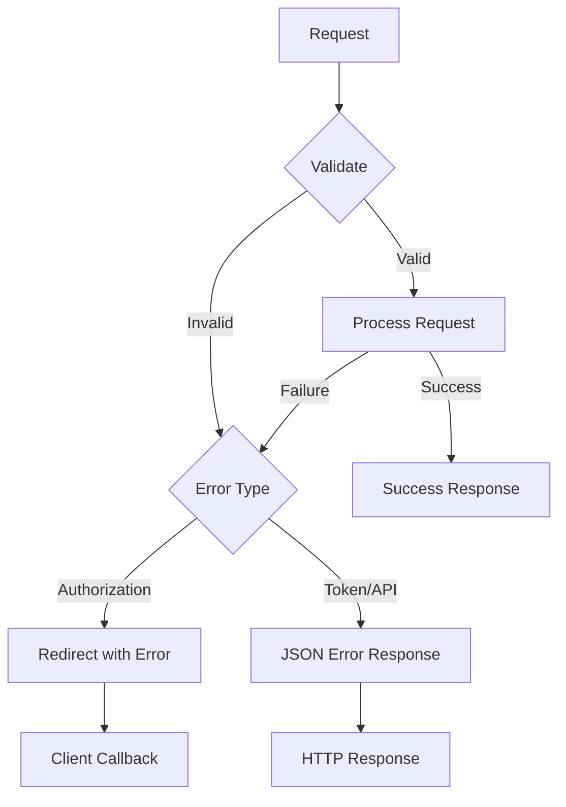
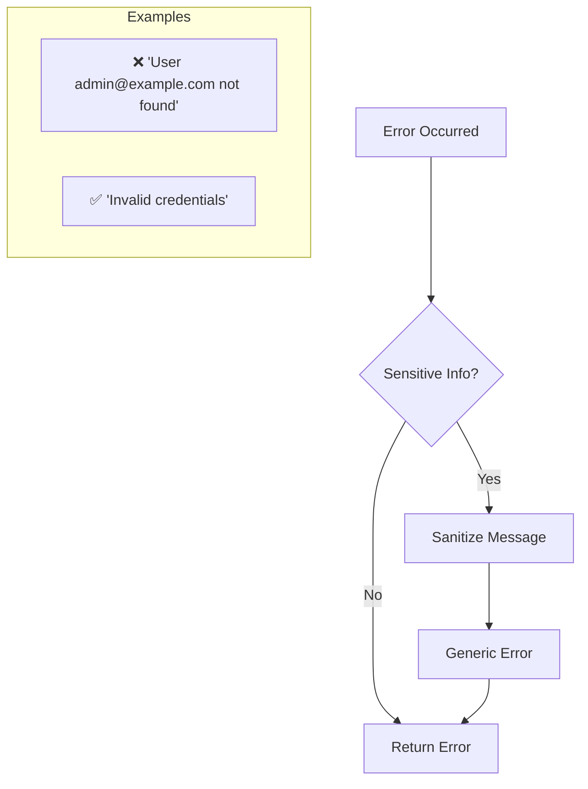
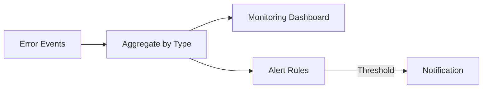

# Error Handling

OAuth 2.0 compliant error responses with structured logging and security considerations.

## Overview

| Aspect           | Description                         |
| ---------------- | ----------------------------------- |
| **Format**       | OAuth 2.0 / OpenID Connect standard |
| **Localization** | `error_description` in English      |
| **Security**     | No sensitive data in responses      |
| **Logging**      | Structured JSON with context        |

Authrim follows OAuth 2.0 and OpenID Connect error response specifications, providing clear error information while protecting sensitive implementation details.

---

## Error Response Format

### OAuth 2.0 Standard Format

```json
{
  "error": "invalid_request",
  "error_description": "The request is missing a required parameter",
  "error_uri": "https://docs.authrim.com/errors/invalid_request"
}
```

### Response Structure

| Field               | Required | Description                   |
| ------------------- | -------- | ----------------------------- |
| `error`             | ✅       | Error code (ASCII, no spaces) |
| `error_description` | ❌       | Human-readable description    |
| `error_uri`         | ❌       | URI to error documentation    |
| `state`             | ❌       | Client state (if provided)    |

---

## Error Categories

### Authorization Endpoint Errors

Errors at `/authorize` are returned via redirect:

```
https://client.example.com/callback?
  error=access_denied&
  error_description=The+user+denied+the+request&
  state=abc123
```

| Error                       | HTTP | Description                 |
| --------------------------- | ---- | --------------------------- |
| `invalid_request`           | 302  | Missing/invalid parameters  |
| `unauthorized_client`       | 302  | Client not authorized       |
| `access_denied`             | 302  | User denied authorization   |
| `unsupported_response_type` | 302  | Response type not supported |
| `invalid_scope`             | 302  | Invalid scope               |
| `server_error`              | 302  | Internal server error       |
| `temporarily_unavailable`   | 302  | Temporary unavailability    |

### Token Endpoint Errors

Errors at `/token` return JSON with HTTP error status:

```json
HTTP/1.1 400 Bad Request
Content-Type: application/json

{
  "error": "invalid_grant",
  "error_description": "The authorization code has expired"
}
```

| Error                    | HTTP | Description                  |
| ------------------------ | ---- | ---------------------------- |
| `invalid_request`        | 400  | Missing/invalid parameters   |
| `invalid_client`         | 401  | Client authentication failed |
| `invalid_grant`          | 400  | Invalid/expired grant        |
| `unauthorized_client`    | 400  | Client not authorized        |
| `unsupported_grant_type` | 400  | Grant type not supported     |
| `invalid_scope`          | 400  | Invalid scope                |

### UserInfo Endpoint Errors

```json
HTTP/1.1 401 Unauthorized
WWW-Authenticate: Bearer error="invalid_token",
  error_description="The access token has expired"

{
  "error": "invalid_token",
  "error_description": "The access token has expired"
}
```

| Error                | HTTP | Description              |
| -------------------- | ---- | ------------------------ |
| `invalid_token`      | 401  | Token invalid/expired    |
| `insufficient_scope` | 403  | Insufficient permissions |

---

## Error Flow Diagram



---

## HTTP Status Codes

### Standard Mappings

| Status  | Usage                               |
| ------- | ----------------------------------- |
| **200** | Success                             |
| **201** | Resource created (DCR)              |
| **204** | Success, no content (revoke)        |
| **302** | Authorization redirect              |
| **400** | Bad request, invalid parameters     |
| **401** | Authentication required/failed      |
| **403** | Forbidden, insufficient permissions |
| **404** | Resource not found                  |
| **429** | Rate limit exceeded                 |
| **500** | Internal server error               |
| **501** | Feature not implemented/disabled    |
| **503** | Service temporarily unavailable     |

### Error-Status Mapping

```typescript
const ERROR_STATUS_MAP: Record<string, number> = {
  // 400 Bad Request
  invalid_request: 400,
  invalid_grant: 400,
  unsupported_grant_type: 400,
  invalid_scope: 400,
  unauthorized_client: 400,
  invalid_dpop_proof: 400,

  // 401 Unauthorized
  invalid_client: 401,
  invalid_token: 401,

  // 403 Forbidden
  access_denied: 403,
  insufficient_scope: 403,

  // 429 Too Many Requests
  slow_down: 429,

  // 500 Server Error
  server_error: 500,

  // 503 Service Unavailable
  temporarily_unavailable: 503,
};
```

---

## DPoP-Specific Errors

### DPoP Error Codes

| Error                | Description                        |
| -------------------- | ---------------------------------- |
| `invalid_dpop_proof` | DPoP proof validation failed       |
| `use_dpop_nonce`     | Nonce required (replay prevention) |

### DPoP Error Response

```json
HTTP/1.1 400 Bad Request
DPoP-Nonce: eyJ0eXAiOiJkcG9wK2p3dCJ9...

{
  "error": "use_dpop_nonce",
  "error_description": "DPoP proof jti has already been used"
}
```

---

## Error Handling Patterns

### Error Creation Helper

```typescript
interface OAuthError {
  error: string;
  error_description?: string;
  error_uri?: string;
}

function createOAuthError(error: string, description?: string, uri?: string): OAuthError {
  return {
    error,
    error_description: description,
    error_uri: uri || `https://docs.authrim.com/errors/${error}`,
  };
}

// Usage
return new Response(
  JSON.stringify(createOAuthError('invalid_grant', 'The authorization code has expired')),
  {
    status: 400,
    headers: { 'Content-Type': 'application/json' },
  }
);
```

### Authorization Endpoint Redirect

```typescript
function redirectWithError(
  redirectUri: string,
  error: string,
  description: string,
  state?: string
): Response {
  const url = new URL(redirectUri);
  url.searchParams.set('error', error);
  url.searchParams.set('error_description', description);
  if (state) {
    url.searchParams.set('state', state);
  }

  return Response.redirect(url.toString(), 302);
}
```

---

## Security Considerations

### Information Disclosure Prevention



### Safe Error Messages

| Scenario         | Bad (Reveals Info)        | Good (Safe)                |
| ---------------- | ------------------------- | -------------------------- |
| User not found   | "User not found"          | "Invalid credentials"      |
| Invalid password | "Wrong password"          | "Invalid credentials"      |
| Client not found | "Client ID xxx not found" | "Invalid client"           |
| Expired token    | "Token expired at 10:30"  | "Token invalid or expired" |

### Consistent Timing

Prevent timing attacks on authentication:

```typescript
async function verifyCredentials(email: string, password: string): Promise<boolean> {
  const user = await db.findUser(email);

  if (!user) {
    // Hash dummy password to maintain consistent timing
    await hashPassword('dummy-password');
    return false;
  }

  return await verifyPassword(password, user.passwordHash);
}
```

---

## Structured Logging

### Log Format

```json
{
  "level": "error",
  "timestamp": "2025-12-20T10:30:00.000Z",
  "requestId": "req_abc123",
  "tenantId": "default",
  "error": {
    "code": "invalid_grant",
    "message": "Authorization code expired",
    "details": {
      "codeAge": 120,
      "maxAge": 60
    }
  },
  "context": {
    "endpoint": "/token",
    "clientId": "client_123",
    "grantType": "authorization_code"
  }
}
```

### Logger Usage

```typescript
const logger = getLogger(c);

try {
  // Process request
} catch (error) {
  logger.error('Token issuance failed', {
    error: {
      code: 'invalid_grant',
      message: error.message,
    },
    context: {
      endpoint: '/token',
      clientId: params.client_id,
      grantType: params.grant_type,
    },
  });

  return jsonError('invalid_grant', 'Authorization code expired', 400);
}
```

### Log Levels

| Level   | Usage                      |
| ------- | -------------------------- |
| `debug` | Development debugging      |
| `info`  | Normal operations          |
| `warn`  | Potential issues           |
| `error` | Errors requiring attention |

---

## Client-Facing Error Pages

### Authorization Errors

For errors that cannot redirect (invalid `redirect_uri`):

```html
<!DOCTYPE html>
<html>
  <head>
    <title>Authorization Error</title>
  </head>
  <body>
    <h1>Authorization Error</h1>
    <p>Error: <code>invalid_redirect_uri</code></p>
    <p>The redirect URI provided is not registered for this client.</p>
    <p>Please contact the application developer.</p>
  </body>
</html>
```

### Error Display Conditions

| Condition              | Response            |
| ---------------------- | ------------------- |
| Valid `redirect_uri`   | Redirect with error |
| Invalid `redirect_uri` | Display error page  |
| Missing `client_id`    | Display error page  |
| Invalid `client_id`    | Display error page  |

---

## Error Monitoring

### Key Error Metrics

| Metric                 | Alert Threshold  |
| ---------------------- | ---------------- |
| `error.invalid_client` | >5% of requests  |
| `error.invalid_grant`  | >10% of requests |
| `error.server_error`   | Any occurrence   |
| `error.rate_limit`     | >100/minute      |

### Error Aggregation



---

## Related Documents

| Document                            | Description                 |
| ----------------------------------- | --------------------------- |
| [Security](./security.md)           | Security architecture       |
| [Protocol Flow](./protocol-flow.md) | OAuth/OIDC flows            |
| [Configuration](./configuration.md) | Error message configuration |

---

## References

- [OAuth 2.0 Error Response (RFC 6749 Section 5.2)](https://datatracker.ietf.org/doc/html/rfc6749#section-5.2)
- [OpenID Connect Error Responses](https://openid.net/specs/openid-connect-core-1_0.html#AuthError)
- [Bearer Token Error Codes (RFC 6750)](https://datatracker.ietf.org/doc/html/rfc6750#section-3.1)
- [DPoP Error Handling (RFC 9449)](https://datatracker.ietf.org/doc/html/rfc9449#section-5)

---

**Last Updated**: 2025-12-20
**Status**: Production
**Format**: OAuth 2.0 / OpenID Connect standard
