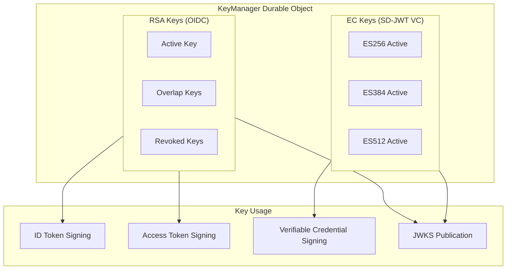
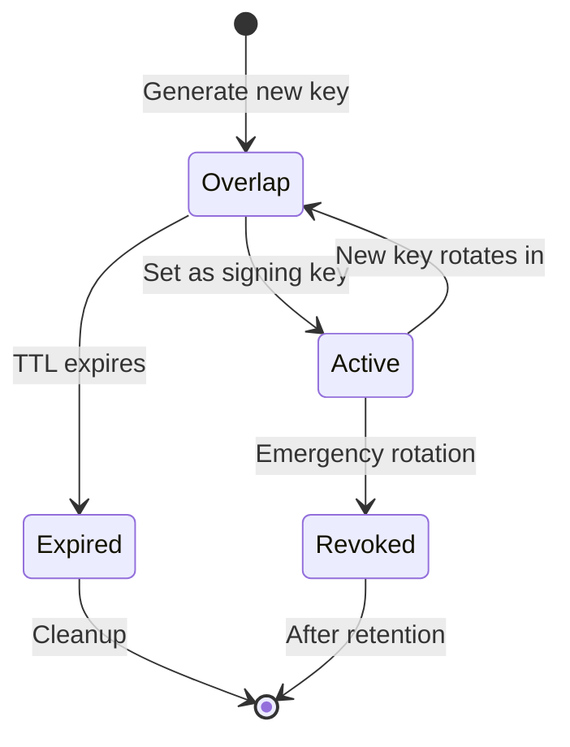
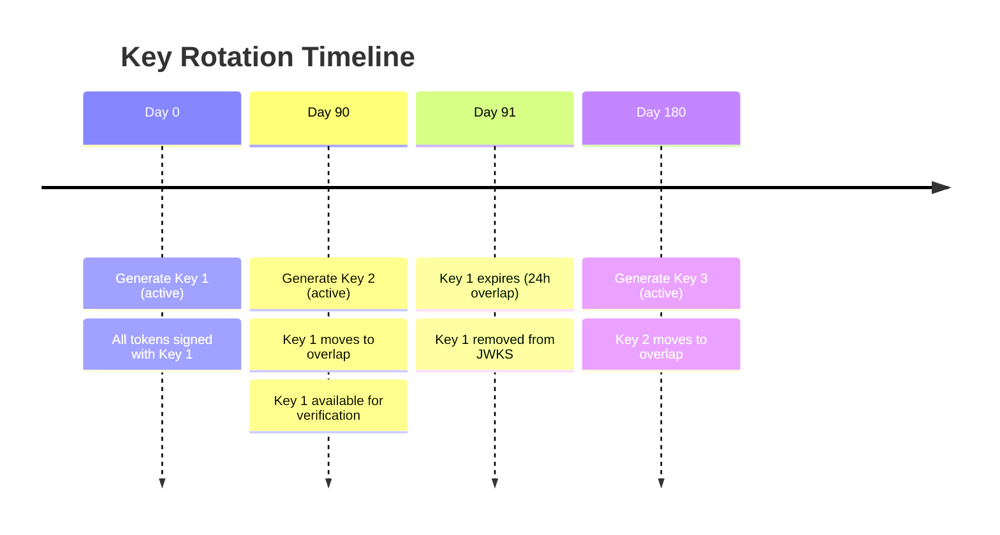
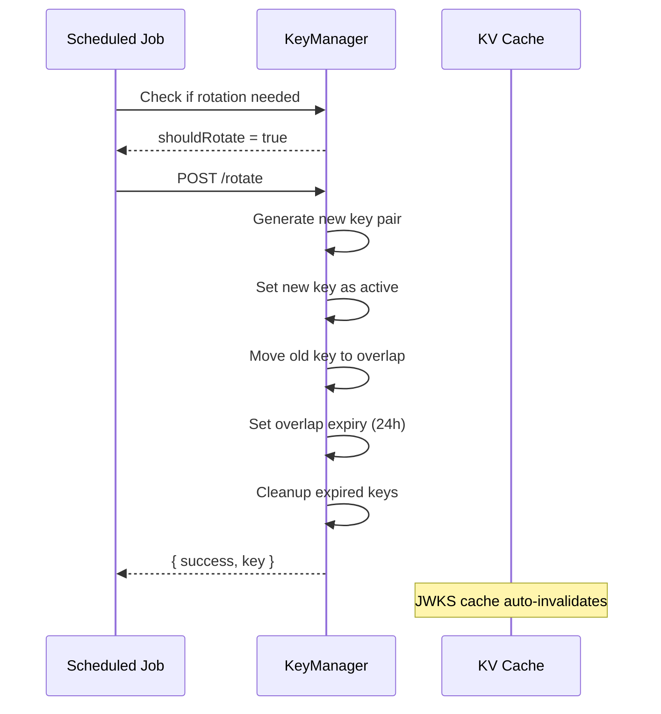
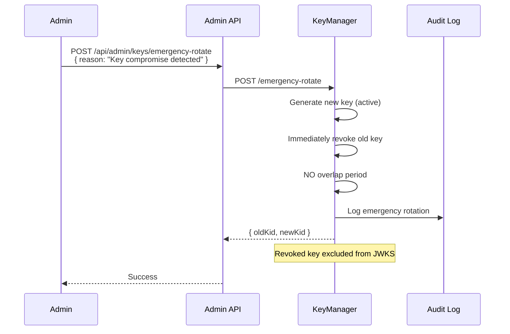
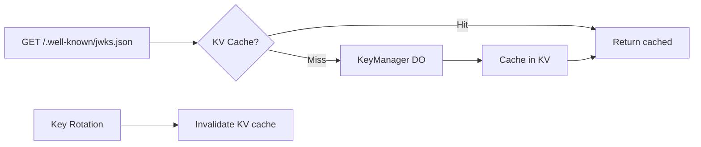
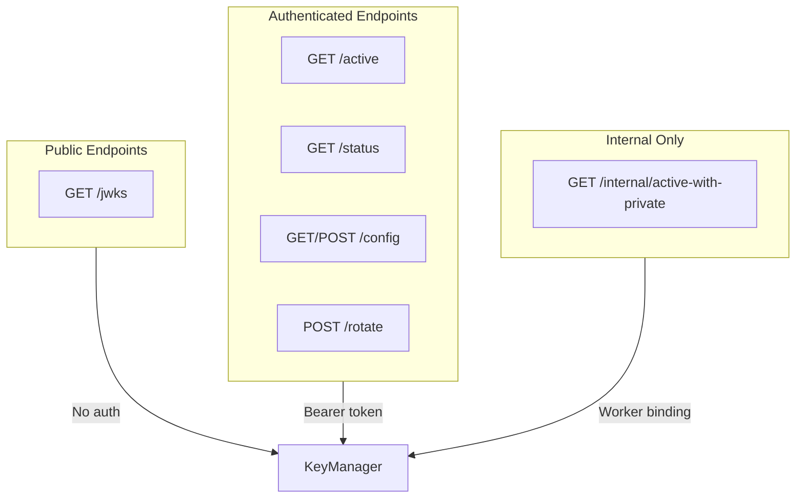

# Key Management

Cryptographic key lifecycle management with automatic rotation and emergency procedures.

## Overview

| Aspect | Description |
|--------|-------------|
| **Key Types** | RSA (RS256), EC (ES256/ES384/ES512) |
| **Storage** | KeyManager Durable Object |
| **Rotation** | Automatic (90 days default) |
| **Emergency** | Immediate revocation capability |

Authrim's KeyManager provides secure cryptographic key management for JWT signing, ensuring zero-downtime key rotation and immediate revocation capabilities.

---

## Key Architecture



---

## Key Types

### RSA Keys (RS256)

Used for standard OIDC token signing:

| Property | Value |
|----------|-------|
| **Algorithm** | RS256 |
| **Key Size** | 2048 bits |
| **Purpose** | ID tokens, Access tokens |
| **Storage** | PEM format (private), JWK (public) |

### EC Keys (ES256/ES384/ES512)

Used for SD-JWT Verifiable Credentials (Phase 9):

| Algorithm | Curve | Purpose |
|-----------|-------|---------|
| **ES256** | P-256 | SD-JWT VC (recommended) |
| **ES384** | P-384 | Higher security |
| **ES512** | P-521 | Maximum security |

---

## Key Lifecycle

### Key States



| State | Description | JWKS Included |
|-------|-------------|---------------|
| **Active** | Current signing key | ✅ Yes |
| **Overlap** | Available for verification | ✅ Yes |
| **Revoked** | Compromised, not usable | ❌ No |
| **Expired** | Past retention, deleted | ❌ Deleted |

### Key State Model

```typescript
interface StoredKey {
  kid: string;           // Unique key identifier
  publicJWK: JWK;        // Public key for JWKS
  privatePEM: string;    // Private key for signing
  createdAt: number;     // Creation timestamp
  status: KeyStatus;     // 'active' | 'overlap' | 'revoked'
  expiresAt?: number;    // When overlap key expires
  revokedAt?: number;    // When key was revoked
  revokedReason?: string; // Reason for revocation
}
```

---

## Key Rotation

### Automatic Rotation



### Rotation Configuration

| Setting | Default | Description |
|---------|---------|-------------|
| `rotationIntervalDays` | 90 | Time between rotations |
| `retentionPeriodDays` | 30 | Keep old keys for audit |
| Overlap window | 24 hours | Time keys remain in JWKS |

### Rotation Process



---

## Emergency Key Rotation

For key compromise scenarios, immediate revocation is available:

### Emergency Procedure



### Emergency vs Normal Rotation

| Aspect | Normal Rotation | Emergency Rotation |
|--------|-----------------|-------------------|
| **Overlap Period** | 24 hours | None |
| **Old Key in JWKS** | Yes (until expiry) | Immediately removed |
| **Token Impact** | Seamless | May invalidate tokens |
| **Audit Logging** | Standard | Enhanced with reason |
| **Trigger** | Scheduled | Manual (requires reason) |

---

## JWKS Publication

### JWKS Endpoint

The `/jwks` endpoint returns all active and overlap public keys:

```json
{
  "keys": [
    {
      "kty": "RSA",
      "n": "...",
      "e": "AQAB",
      "kid": "key-1702000000000-abc123",
      "alg": "RS256",
      "use": "sig"
    },
    {
      "kty": "EC",
      "crv": "P-256",
      "x": "...",
      "y": "...",
      "kid": "ec-es256-1702000000000-def456",
      "alg": "ES256",
      "use": "sig"
    }
  ]
}
```

### JWKS Caching



| Cache Setting | Value |
|---------------|-------|
| **TTL** | 1 hour |
| **Invalidation** | On key rotation |
| **Cache-Control** | `max-age=3600, public` |

---

## Key Storage Security

### Durable Object Storage

Keys are stored in KeyManager Durable Object with:

- **Encryption at rest**: Cloudflare managed
- **Single-threaded access**: No race conditions
- **Atomic operations**: Consistent state
- **Geographic colocation**: Keys near compute

### Access Control



### Authentication

```typescript
// All non-JWKS endpoints require Bearer authentication
const secret = env.KEY_MANAGER_SECRET;
const token = request.headers.get('Authorization')?.substring(7);

if (!timingSafeEqual(token, secret)) {
  return new Response('Unauthorized', { status: 401 });
}
```

---

## Key ID (kid) Format

### RSA Keys

```
key-{timestamp}-{uuid}
```

Example: `key-1702000000000-abc123-def4-5678-90ab-cdef12345678`

### EC Keys

```
ec-{algorithm}-{timestamp}-{uuid}
```

Example: `ec-es256-1702000000000-abc123-def4-5678-90ab-cdef12345678`

---

## Admin API

### Key Management Endpoints

| Endpoint | Method | Description |
|----------|--------|-------------|
| `/api/admin/keys/status` | GET | Get all key statuses |
| `/api/admin/keys/rotate` | POST | Trigger manual rotation |
| `/api/admin/keys/emergency-rotate` | POST | Emergency rotation |
| `/api/admin/keys/config` | GET/PUT | Rotation configuration |
| `/api/admin/keys/ec/rotate/:alg` | POST | Rotate EC key |

### Status Response

```json
{
  "rsa": {
    "keys": [
      {
        "kid": "key-1702000000000-abc123",
        "status": "active",
        "createdAt": 1702000000000
      },
      {
        "kid": "key-1701000000000-def456",
        "status": "overlap",
        "createdAt": 1701000000000,
        "expiresAt": 1702086400000
      }
    ],
    "activeKeyId": "key-1702000000000-abc123",
    "lastRotation": 1702000000000
  },
  "ec": {
    "keys": [...],
    "activeKeyIds": {
      "ES256": "ec-es256-...",
      "ES384": null,
      "ES512": null
    }
  }
}
```

---

## Monitoring & Alerts

### Key Metrics

| Metric | Description | Alert Threshold |
|--------|-------------|-----------------|
| `key.rotation.due` | Days until rotation | < 7 days |
| `key.overlap.count` | Overlap keys count | > 3 |
| `key.emergency.rotation` | Emergency rotations | Any |
| `key.signing.latency` | Key fetch latency | > 50ms |

### Health Checks

```typescript
async function keyHealthCheck(): Promise<KeyHealth> {
  const status = await keyManager.getStatusRpc();

  return {
    hasActiveKey: !!status.activeKeyId,
    keyCount: status.keys.length,
    lastRotation: status.lastRotation,
    rotationDue: await keyManager.shouldRotateKeysRpc(),
  };
}
```

---

## Related Documents

| Document | Description |
|----------|-------------|
| [Security](./security.md) | Security architecture |
| [Durable Objects](./durable-objects.md) | DO patterns |
| [Secret Management](../operations/secret-management.md) | Secret handling |
| [Configuration](./configuration.md) | Settings management |

---

## References

- [RFC 7517 - JSON Web Key (JWK)](https://datatracker.ietf.org/doc/html/rfc7517)
- [RFC 7518 - JSON Web Algorithms (JWA)](https://datatracker.ietf.org/doc/html/rfc7518)
- [OIDC Core - Key Rotation](https://openid.net/specs/openid-connect-core-1_0.html#RotateSigKeys)
- [OAuth 2.0 Security BCP - Key Management](https://datatracker.ietf.org/doc/html/draft-ietf-oauth-security-topics#section-2.5)

---

**Last Updated**: 2025-12-20
**Status**: Production
**Key Types**: RSA (RS256), EC (ES256/ES384/ES512)
