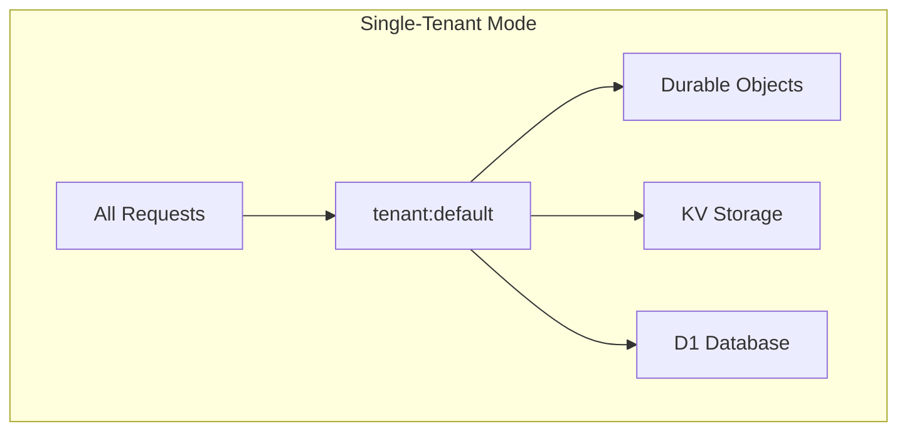
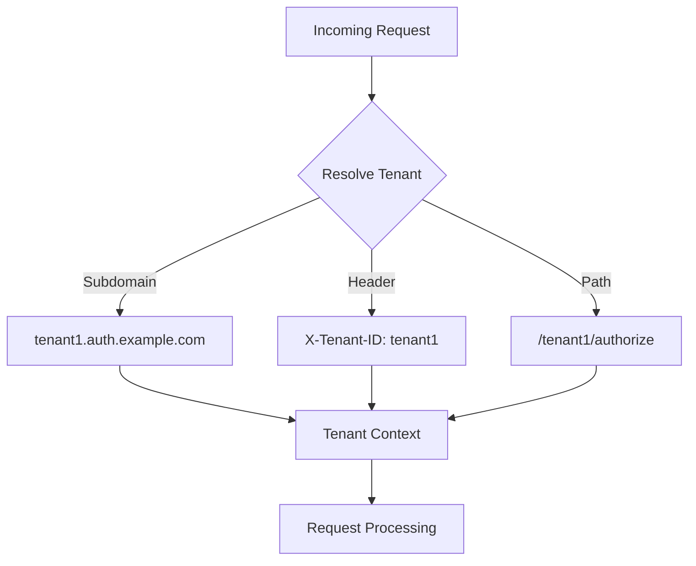
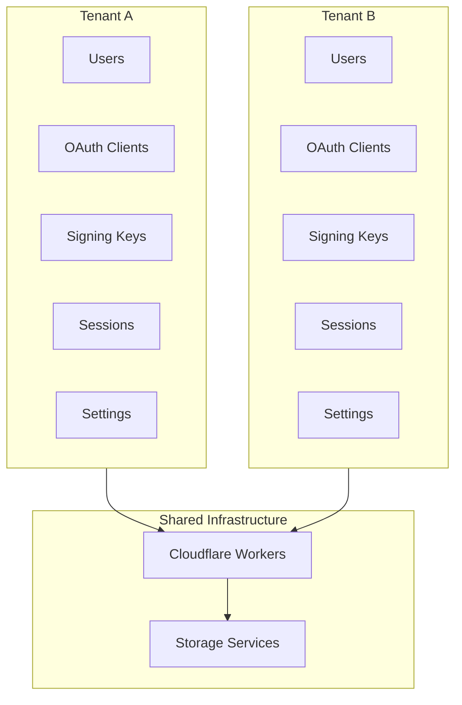
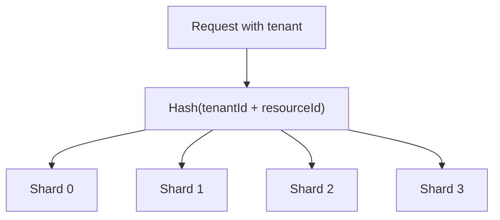
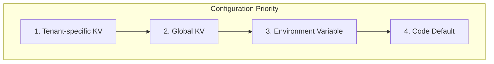
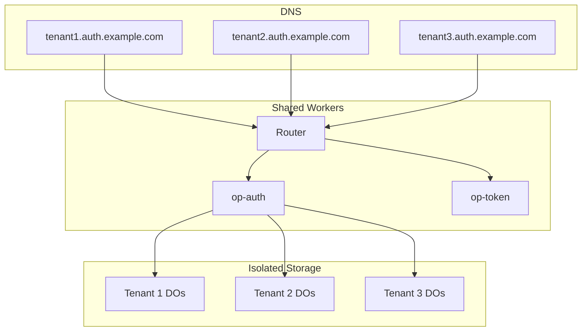

# Multi-Tenancy Architecture

Tenant isolation design with preparation for future multi-tenant deployment.

## Overview

| Aspect | Description |
|--------|-------------|
| **Current Mode** | Single-tenant (default tenant) |
| **Future Ready** | Multi-tenant prepared architecture |
| **Isolation** | Data and configuration per tenant |
| **Identification** | Subdomain or header-based |

Authrim is architected with multi-tenancy in mind from the ground up, even though the current deployment operates in single-tenant mode. This document describes the tenant isolation patterns used throughout the codebase.

---

## Current Architecture

### Single-Tenant Mode

In single-tenant mode, all resources use the `default` tenant ID:



```typescript
// Current implementation: always returns 'default'
export const DEFAULT_TENANT_ID = 'default';

export function getTenantId(): string {
  return DEFAULT_TENANT_ID;
}
```

---

## Future Multi-Tenant Architecture

### Tenant Resolution



### Planned Tenant Identification Methods

| Method | Example | Use Case |
|--------|---------|----------|
| **Subdomain** | `tenant1.auth.example.com` | SaaS deployment |
| **Header** | `X-Tenant-ID: tenant1` | API access |
| **Path** | `/tenant1/authorize` | Shared domain |

---

## Tenant-Prefixed Keys

All storage keys are designed with tenant prefixes for isolation:

### Durable Object Keys

```typescript
// Build tenant-prefixed DO key
export function buildDOKey(resourceType: string, resourceId: string): string {
  return `tenant:${DEFAULT_TENANT_ID}:${resourceType}:${resourceId}`;
}

// Example keys:
// tenant:default:session:abc123
// tenant:default:auth-code:def456
// tenant:tenant1:session:xyz789 (future)
```

### KV Keys

```typescript
// Build tenant-prefixed KV key
export function buildKVKey(prefix: string, key: string): string {
  return `tenant:${DEFAULT_TENANT_ID}:${prefix}:${key}`;
}

// Example keys:
// tenant:default:client:my-client-id
// tenant:default:settings:token_expiry
// tenant:tenant1:client:other-client (future)
```

### DO Instance Names

```typescript
// Build sharded DO instance name
export function buildDOInstanceName(resourceType: string): string {
  return `tenant:${DEFAULT_TENANT_ID}:${resourceType}`;
}

// Example instance names:
// tenant:default:session
// tenant:default:key-manager
// tenant:tenant1:session (future)
```

---

## Data Isolation

### Per-Tenant Resources



### Isolation Levels

| Resource | Isolation | Implementation |
|----------|-----------|----------------|
| **Users** | Full | Tenant-prefixed D1 queries |
| **OAuth Clients** | Full | Tenant-specific client IDs |
| **Signing Keys** | Full | Per-tenant KeyManager DO |
| **Sessions** | Full | Tenant-prefixed session IDs |
| **Settings** | Full | Tenant-prefixed KV keys |
| **Audit Logs** | Full | Tenant column in D1 |

---

## Request Context

### Context Middleware

Every request carries tenant context:

```typescript
interface RequestContext {
  requestId: string;    // Unique request ID
  tenantId: string;     // Resolved tenant
  startTime: number;    // Request start time
  logger: Logger;       // Tenant-aware logger
}

// Middleware sets context
export function requestContextMiddleware() {
  return async (c: Context, next: Next) => {
    const requestId = crypto.randomUUID();
    const tenantId = DEFAULT_TENANT_ID; // Future: resolve from request

    c.set('requestId', requestId);
    c.set('tenantId', tenantId);
    c.set('logger', createLogger({ requestId, tenantId }));

    await next();
  };
}
```

### Accessing Tenant Context

```typescript
// In any handler
function handleRequest(c: Context) {
  const tenantId = getTenantIdFromContext(c);
  const logger = getLogger(c);

  logger.info('Processing request', { tenant: tenantId });
}
```

---

## Sharding by Tenant

### DO Sharding Pattern

Durable Objects are sharded by tenant and additional dimensions:



```typescript
// Calculate shard for auth codes
export function getAuthCodeShardIndex(
  userId: string,
  clientId: string,
  shardCount: number = DEFAULT_CODE_SHARD_COUNT
): number {
  const key = `${userId}:${clientId}`;
  const hash = fnv1a32(key);
  return hash % shardCount;
}

// Build sharded instance name
export function buildAuthCodeShardInstanceName(shardIndex: number): string {
  return `tenant:${DEFAULT_TENANT_ID}:auth-code:shard-${shardIndex}`;
}
```

### Configurable Shard Counts

Shard counts are configurable per tenant (via KV):

```typescript
// Priority: KV → Environment → Default
async function getShardCount(env: Env): Promise<number> {
  // Check tenant-specific KV config
  const kvValue = await env.AUTHRIM_CONFIG.get('code_shards');
  if (kvValue) return parseInt(kvValue, 10);

  // Fall back to environment
  if (env.AUTHRIM_CODE_SHARDS) return parseInt(env.AUTHRIM_CODE_SHARDS, 10);

  // Use default
  return DEFAULT_CODE_SHARD_COUNT; // 4
}
```

---

## Tenant Configuration

### Configuration Hierarchy



### Per-Tenant Settings

| Setting | Scope | Storage |
|---------|-------|---------|
| Token expiry | Per-tenant | KV |
| PKCE requirement | Per-tenant | KV |
| Allowed scopes | Per-tenant | D1 |
| Branding | Per-tenant | KV/D1 |
| Rate limits | Per-tenant | KV |

---

## Future: Multi-Tenant Deployment

### Deployment Pattern C (from patterns.md)



### Migration Path

1. **Current**: Single-tenant with `default` tenant ID
2. **Phase 1**: Enable tenant resolution from subdomain
3. **Phase 2**: Add tenant management API
4. **Phase 3**: Per-tenant billing and quotas
5. **Phase 4**: Tenant isolation verification

---

## Security Considerations

### Tenant Boundary Enforcement

```typescript
// All storage operations must include tenant context
async function getSession(tenantId: string, sessionId: string) {
  const key = buildDOKey('session', sessionId);
  // Key format ensures tenant isolation: tenant:{tenantId}:session:{id}

  const stub = getSessionStore(tenantId, sessionId);
  return stub.getSession(sessionId);
}
```

### Cross-Tenant Protection

| Protection | Implementation |
|------------|----------------|
| **Key Prefix** | All keys include tenant ID |
| **Query Scoping** | SQL WHERE includes tenant |
| **DO Naming** | Tenant in DO instance name |
| **Validation** | Tenant match verified |

---

## Related Documents

| Document | Description |
|----------|-------------|
| [Architecture Overview](./overview.md) | System architecture |
| [Storage Strategy](./storage-strategy.md) | Storage design |
| [Configuration](./configuration.md) | Settings management |
| [Deployment Patterns](./patterns.md) | Deployment architectures |

---

## References

- [Multi-Tenancy Patterns](https://docs.microsoft.com/en-us/azure/architecture/guide/multitenant/overview)
- [Cloudflare Workers Isolation](https://developers.cloudflare.com/workers/learning/security-model/)
- [Durable Objects](https://developers.cloudflare.com/durable-objects/)

---

**Last Updated**: 2025-12-20
**Status**: Production (Single-tenant mode)
**Future**: Multi-tenant ready architecture
