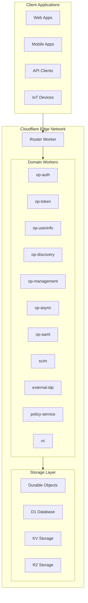
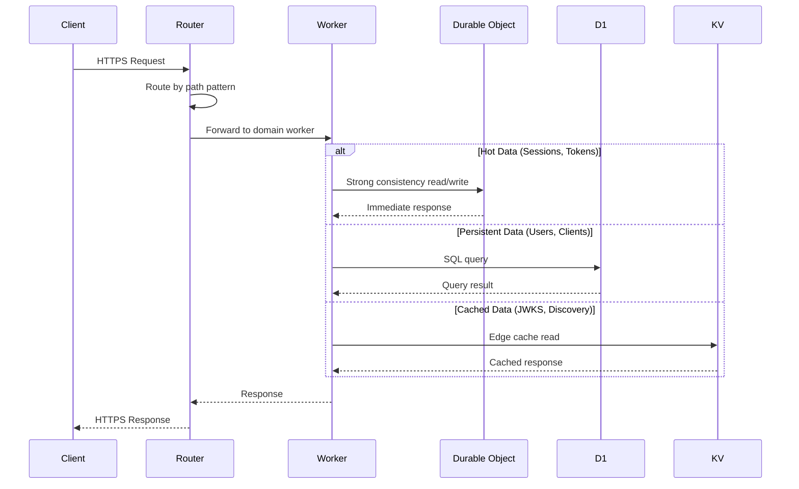
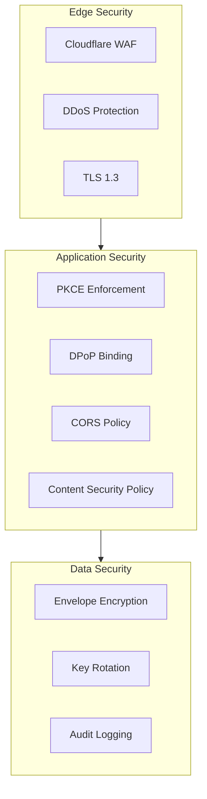

# Architecture Overview

Enterprise-grade OpenID Connect Provider running on Cloudflare's global edge network.

## Overview

| Aspect           | Description                                   |
| ---------------- | --------------------------------------------- |
| **Platform**     | Cloudflare Workers (Edge-native)              |
| **Framework**    | Hono (TypeScript)                             |
| **Storage**      | Hybrid Multi-Tier (Durable Objects + D1 + KV) |
| **Architecture** | Monorepo with Domain-Separated Workers        |

Authrim is a production-ready OpenID Connect Provider (OP) and OAuth 2.0 Authorization Server implemented entirely on Cloudflare's edge platform. It provides comprehensive identity and access management capabilities with sub-50ms global latency.

---

## System Architecture

### High-Level Architecture



### Request Flow



---

## Package Structure

Authrim uses a monorepo architecture with 14 specialized packages:

### Worker Packages (Deployable)

| Package            | Description                    | Key Endpoints                             |
| ------------------ | ------------------------------ | ----------------------------------------- |
| **router**         | Central routing layer          | All incoming requests                     |
| **op-auth**        | Authorization & authentication | `/authorize`, `/logout`, passkey, consent |
| **op-token**       | Token issuance & management    | `/token`, `/introspect`, `/revoke`        |
| **op-userinfo**    | User claims endpoint           | `/userinfo`                               |
| **op-discovery**   | OIDC Discovery & JWKS          | `/.well-known/*`                          |
| **op-management**  | Admin API & management         | `/api/admin/*`                            |
| **op-async**       | Async grant flows              | `/device/*`, `/bc-authorize` (CIBA)       |
| **op-saml**        | SAML SP functionality          | `/saml/*`                                 |
| **scim**           | User provisioning              | `/scim/v2/*`                              |
| **external-idp**   | External IdP integration       | Social login, SAML/OIDC federation        |
| **policy-service** | Policy decision service        | Real-time authorization checks            |
| **vc**             | Verifiable Credentials         | OpenID4VCI, OpenID4VP, DID                |

### Library Packages

| Package         | Description                              |
| --------------- | ---------------------------------------- |
| **shared**      | Common utilities, types, Durable Objects |
| **policy-core** | Policy engine core logic                 |

---

## Durable Objects

Authrim uses 16 Durable Objects for strong consistency:

### Core Authentication

| Durable Object             | Purpose                          | Consistency          |
| -------------------------- | -------------------------------- | -------------------- |
| **AuthorizationCodeStore** | Authorization code storage       | Single-use guarantee |
| **SessionStore**           | Active user sessions             | Real-time state      |
| **RefreshTokenRotator**    | Token rotation & family tracking | One-time use         |
| **KeyManager**             | JWK key lifecycle                | Atomic operations    |

### Security & Rate Limiting

| Durable Object           | Purpose                       | Consistency             |
| ------------------------ | ----------------------------- | ----------------------- |
| **DPoPJTIStore**         | DPoP proof replay prevention  | Unique JTI tracking     |
| **TokenRevocationStore** | Revoked token registry        | Immediate propagation   |
| **RateLimiterCounter**   | API rate limiting             | Atomic counters         |
| **UserCodeRateLimiter**  | Device flow rate limiting     | Per-user limits         |
| **ChallengeStore**       | WebAuthn challenge management | Single-use verification |

### Protocol Stores

| Durable Object       | Purpose                       | Consistency         |
| -------------------- | ----------------------------- | ------------------- |
| **PARRequestStore**  | Pushed Authorization Requests | Request URI binding |
| **DeviceCodeStore**  | Device Authorization Grant    | Polling state       |
| **CIBARequestStore** | CIBA authentication requests  | Async flow state    |
| **SAMLRequestStore** | SAML request/response binding | Cross-domain state  |

### Infrastructure

| Durable Object          | Purpose                      | Consistency            |
| ----------------------- | ---------------------------- | ---------------------- |
| **VersionManager**      | Deployment versioning        | Atomic version control |
| **PermissionChangeHub** | Real-time permission updates | WebSocket broadcast    |

---

## Storage Strategy

### Hybrid Multi-Tier Architecture

```
┌─────────────────────────────────────────────────────────────────────┐
│                         Storage Selection                            │
├─────────────────────────────────────────────────────────────────────┤
│                                                                      │
│  ┌─────────────────┐  ┌─────────────────┐  ┌─────────────────┐     │
│  │ Durable Objects │  │   D1 Database   │  │   KV Storage    │     │
│  ├─────────────────┤  ├─────────────────┤  ├─────────────────┤     │
│  │ • Auth codes    │  │ • Users         │  │ • JWKS cache    │     │
│  │ • Sessions      │  │ • OAuth clients │  │ • Discovery     │     │
│  │ • Token state   │  │ • Audit logs    │  │ • Settings      │     │
│  │ • Rate limits   │  │ • Roles/Perms   │  │ • Magic links   │     │
│  │ • CIBA/Device   │  │ • Credentials   │  │ • Client cache  │     │
│  └─────────────────┘  └─────────────────┘  └─────────────────┘     │
│         │                    │                    │                 │
│    Strong              Persistent            Edge Cache             │
│  Consistency           Relational            (Eventually            │
│  (Single Point)        (ACID)               Consistent)             │
│                                                                      │
└─────────────────────────────────────────────────────────────────────┘
```

### Storage Selection Criteria

| Requirement       | Storage            | Reason                                |
| ----------------- | ------------------ | ------------------------------------- |
| Single-use tokens | Durable Objects    | Atomic check-and-delete               |
| User profile data | D1                 | Relational queries, persistence       |
| Public keys       | KV                 | Global edge caching, high read volume |
| Session state     | Durable Objects    | Real-time invalidation                |
| Audit logs        | D1                 | Queryable, long-term storage          |
| Feature flags     | KV → Env → Default | Dynamic configuration                 |

---

## Specification Compliance

### OpenID Connect

| Specification                 | Status         | Notes                                |
| ----------------------------- | -------------- | ------------------------------------ |
| OIDC Core 1.0                 | ✅ Certified   | Authorization Code, Implicit, Hybrid |
| OIDC Discovery 1.0            | ✅ Certified   | Full metadata support                |
| OIDC Dynamic Registration 1.0 | ✅ Certified   | Full DCR support                     |
| OIDC RP-Initiated Logout 1.0  | ✅ Implemented | All logout mechanisms                |
| OIDC Session Management 1.0   | ✅ Implemented | Check session + ITP-compatible       |
| OIDC Front-Channel Logout 1.0 | ✅ Implemented | Iframe-based logout                  |
| OIDC Back-Channel Logout 1.0  | ✅ Implemented | Server-to-server logout              |

### OAuth 2.0 & Extensions

| Specification                   | Status         | Notes                       |
| ------------------------------- | -------------- | --------------------------- |
| OAuth 2.0 (RFC 6749)            | ✅ Implemented | All grant types             |
| Bearer Token (RFC 6750)         | ✅ Implemented | Token usage                 |
| PKCE (RFC 7636)                 | ✅ Implemented | S256 + plain                |
| Token Introspection (RFC 7662)  | ✅ Implemented | Active token validation     |
| Token Revocation (RFC 7009)     | ✅ Implemented | Immediate revocation        |
| Device Authorization (RFC 8628) | ✅ Implemented | TV/IoT login                |
| Token Exchange (RFC 8693)       | ✅ Implemented | Delegation, impersonation   |
| DPoP (RFC 9449)                 | ✅ Implemented | Proof-of-possession         |
| PAR (RFC 9126)                  | ✅ Implemented | Secure authorization        |
| JAR (RFC 9101)                  | ✅ Implemented | JWT authorization requests  |
| JARM                            | ✅ Implemented | JWT authorization responses |

### Security Profiles

| Specification             | Status         | Notes                    |
| ------------------------- | -------------- | ------------------------ |
| FAPI 2.0 Security Profile | ✅ Implemented | Financial-grade security |
| FAPI 2.0 Message Signing  | ✅ Implemented | HTTP message signatures  |
| FAPI-CIBA                 | ✅ Implemented | Decoupled authentication |

### Enterprise Standards

| Specification            | Status         | Notes                   |
| ------------------------ | -------------- | ----------------------- |
| SCIM 2.0 (RFC 7643/7644) | ✅ Implemented | User/group provisioning |
| SAML 2.0                 | ✅ Implemented | SP functionality        |
| WebAuthn/Passkeys        | ✅ Implemented | FIDO2 authentication    |
| OpenID4VCI               | ✅ Implemented | Credential issuance     |
| OpenID4VP                | ✅ Implemented | Credential presentation |

---

## Deployment Patterns

Authrim supports multiple deployment architectures:

### Pattern A: Unified Deployment

All workers deployed to a single domain. Simplest setup for getting started.

```
https://auth.example.com/
├── /.well-known/*     → op-discovery
├── /authorize         → op-auth
├── /token             → op-token
├── /userinfo          → op-userinfo
├── /api/admin/*       → op-management
└── /scim/*            → scim
```

### Pattern B: Domain Separation

Separate domains for different concerns. Enhanced security isolation.

```
https://auth.example.com/          → op-auth, op-token
https://admin.example.com/         → op-management
https://api.example.com/           → op-userinfo, scim
```

### Pattern C: Multi-Tenant

Tenant-specific subdomains with shared infrastructure.

```
https://tenant1.auth.example.com/  → Tenant 1
https://tenant2.auth.example.com/  → Tenant 2
https://tenant3.auth.example.com/  → Tenant 3
```

### Pattern D: Headless

API-only deployment for custom UI integration.

---

## Security Architecture

### Defense in Depth



### Key Security Features

| Feature                | Implementation                            |
| ---------------------- | ----------------------------------------- |
| **Transport Security** | TLS 1.3, HSTS, certificate transparency   |
| **Token Security**     | DPoP binding, short TTL, one-time codes   |
| **Key Management**     | Automatic rotation, envelope encryption   |
| **Rate Limiting**      | Per-endpoint, per-client, per-user limits |
| **Audit Logging**      | Comprehensive event logging with context  |
| **CSRF Protection**    | State parameter, SameSite cookies         |

---

## Performance Characteristics

### Global Latency

| Operation           | p50  | p99  |
| ------------------- | ---- | ---- |
| Discovery           | 5ms  | 15ms |
| JWKS                | 5ms  | 15ms |
| Token Issuance      | 30ms | 80ms |
| Token Introspection | 15ms | 40ms |
| UserInfo            | 20ms | 50ms |

### Scalability

- **Horizontal**: Cloudflare's global edge network (300+ locations)
- **Vertical**: Automatic scaling with Workers
- **Storage**: Durable Objects for consistency, KV for read scaling

---

## Configuration

### Environment Variables

| Category     | Variable                | Description              |
| ------------ | ----------------------- | ------------------------ |
| **Core**     | `ISSUER_DOMAIN`         | Issuer URL domain        |
| **Keys**     | `PRIVATE_KEY_ENCRYPTED` | Encrypted signing key    |
| **Database** | `D1`                    | D1 database binding      |
| **Storage**  | `KV`, `DO_*`            | Storage bindings         |
| **Security** | `ADMIN_API_SECRET`      | Admin API authentication |

### Feature Flags (KV-Based)

All features configurable via Admin API:

```
Priority: KV → Environment → Code Default
```

---

## Related Documents

| Document                                  | Description                |
| ----------------------------------------- | -------------------------- |
| [Workers Architecture](./workers.md)      | Detailed package structure |
| [Durable Objects](./durable-objects.md)   | DO design and sharding     |
| [Storage Strategy](./storage-strategy.md) | Multi-tier storage details |
| [Database Schema](./database-schema.md)   | D1 schema documentation    |
| [Protocol Flow](./protocol-flow.md)       | OIDC flow sequences        |
| [Deployment Patterns](./patterns.md)      | Architecture patterns      |

---

## References

### Specifications

- [OpenID Connect Core 1.0](https://openid.net/specs/openid-connect-core-1_0.html)
- [OAuth 2.0 (RFC 6749)](https://datatracker.ietf.org/doc/html/rfc6749)
- [FAPI 2.0 Security Profile](https://openid.net/specs/fapi-2_0-security-profile.html)

### Platform

- [Cloudflare Workers](https://developers.cloudflare.com/workers/)
- [Cloudflare Durable Objects](https://developers.cloudflare.com/durable-objects/)
- [Hono Framework](https://hono.dev/)

---

**Last Updated**: 2025-12-20
**Status**: Production
**Version**: Phase 9 (VC/DID Integration Complete)
