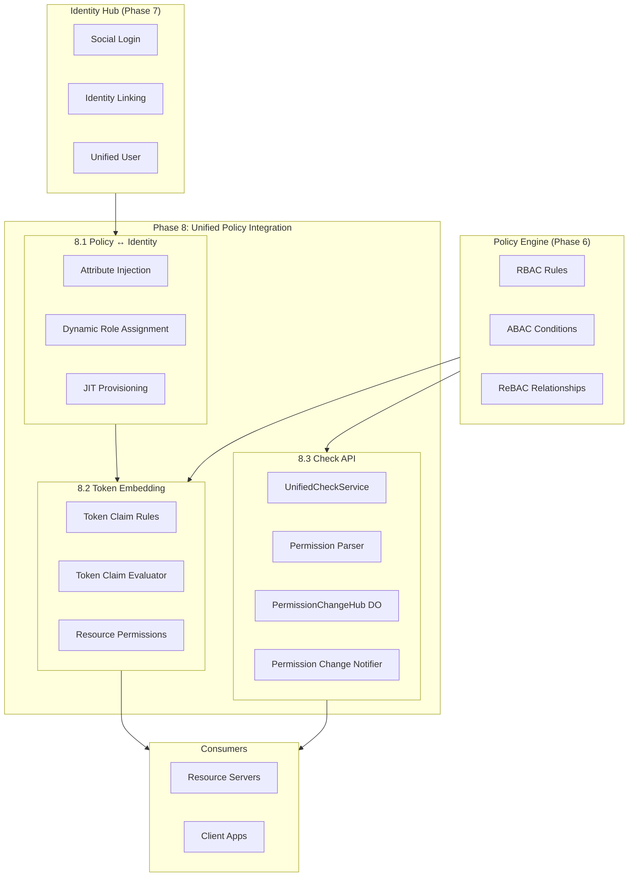
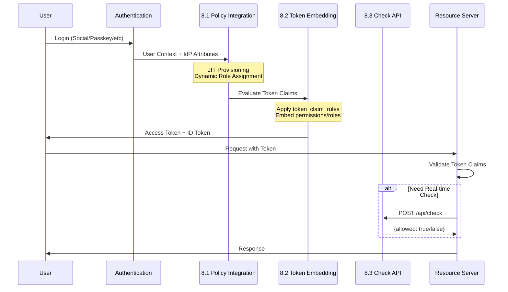
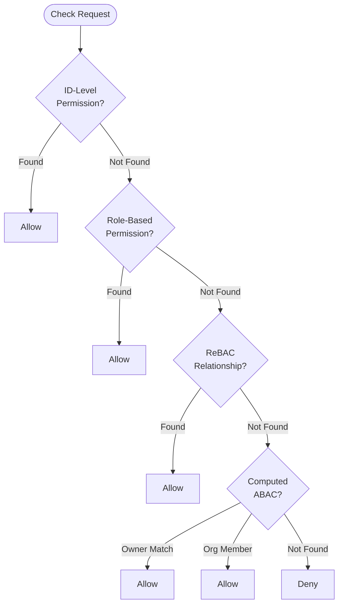

# Phase 8: Unified Policy Integration - Architecture Notes

**Status:** Complete (2025-12-19)
**Author:** Development Team
**Purpose:** Internal architecture reference for site documentation

---

## 1. Overview

Phase 8 integrates authentication (AuthN) and authorization (AuthZ) into a unified flow. Users authenticate through various identity sources and immediately receive properly scoped tokens with embedded permissions.

### 1.1 Key Deliverables

| Sub-Phase | Description | Status |
|-----------|-------------|--------|
| 8.1 Policy ↔ Identity Integration | Connect upstream IdP attributes to policy evaluation | ✅ |
| 8.2 Token Embedding Model | Embed permissions/roles directly into tokens | ✅ |
| 8.3 Real-time Check API | Dynamic authorization decisions via API | ✅ |
| 8.4 Policy Admin Console | Visual policy editor | → Phase 10 |

### 1.2 Design Philosophy

**Two Authorization Models:**

```
┌─────────────────────────────────────────────────────────────────────────┐
│                     Token Embedding (8.2)                               │
│   "Cache authorization decisions in the token"                          │
│   ┌─────────────────────────────────────────────────────────────────┐   │
│   │ Pros: Fast, offline capable, no API calls needed                │   │
│   │ Cons: Stale until token refresh, limited by token size          │   │
│   └─────────────────────────────────────────────────────────────────┘   │
└─────────────────────────────────────────────────────────────────────────┘

┌─────────────────────────────────────────────────────────────────────────┐
│                     Real-time Check API (8.3)                           │
│   "Query authorization decisions on demand"                             │
│   ┌─────────────────────────────────────────────────────────────────┐   │
│   │ Pros: Always current, supports complex queries                  │   │
│   │ Cons: Requires API call, latency overhead                       │   │
│   └─────────────────────────────────────────────────────────────────┘   │
└─────────────────────────────────────────────────────────────────────────┘
```

**Recommended Usage:**
- **Token Embedding**: For common, frequently-checked permissions
- **Check API**: For dynamic, context-dependent, or real-time decisions

---

## 2. Architecture

### 2.1 High-Level Flow



### 2.2 Data Flow



---

## 3. Component Details

### 3.1 Policy ↔ Identity Integration (8.1)

#### 3.1.1 Rule Evaluator

**File:** `packages/shared/src/services/rule-evaluator.ts`

Evaluates conditions for automatic role assignment based on upstream IdP attributes.

```typescript
interface RuleCondition {
  type: 'claim_equals' | 'claim_contains' | 'email_domain' | 'provider' | 'and' | 'or';
  // ... condition-specific params
}

interface RoleAssignmentRule {
  id: string;
  name: string;
  condition: RuleCondition | CompoundCondition;
  role_id: string;
  scope_type: 'global' | 'organization' | 'resource';
  actions: RuleAction[];
  priority: number;
}
```

**Evaluation Flow:**
1. User authenticates via upstream provider
2. Rule Evaluator loads active rules (ordered by priority)
3. Each rule's condition is evaluated against user context
4. Matching rules trigger actions (assign role, add to org, etc.)
5. `stop_processing` flag can halt further evaluation

#### 3.1.2 JIT Provisioning

**File:** `packages/shared/src/types/jit-config.ts`

Just-in-Time user creation on first login:

```typescript
interface JITProvisioningConfig {
  enabled: boolean;
  create_user: boolean;
  default_roles: string[];
  org_auto_join: {
    enabled: boolean;
    match_by: 'email_domain_hash';  // PII-safe matching
  };
  attribute_sync: {
    enabled: boolean;
    sync_fields: string[];  // ['name', 'picture']
  };
}
```

#### 3.1.3 Email Domain Hash (Blind Index)

**File:** `packages/shared/src/utils/email-domain-hash.ts`

PII-compliant domain matching using HMAC-SHA256:

```typescript
// Never store raw email domains - use blind index
const hash = await generateEmailDomainHash(
  'example.com',
  secretKey,
  'tenant_123'
);
// Result: "ed7a8f..." (deterministic, one-way)

// Admin API manages rotation of hash keys
POST /api/admin/domain-hash-keys/rotate
```

---

### 3.2 Token Embedding Model (8.2)

#### 3.2.1 Token Claim Rules

**Table:** `token_claim_rules`

```sql
CREATE TABLE token_claim_rules (
  id TEXT PRIMARY KEY,
  tenant_id TEXT NOT NULL DEFAULT 'default',
  name TEXT NOT NULL,
  claim_name TEXT NOT NULL,        -- e.g., 'permissions', 'roles'
  claim_type TEXT NOT NULL,        -- 'static' | 'dynamic' | 'computed'
  source TEXT,                     -- 'user_roles' | 'resource_permissions' | 'custom'
  transform TEXT,                  -- JSON transformation rules
  target_tokens TEXT DEFAULT '["access_token"]',  -- Which tokens to embed
  condition_json TEXT,             -- When to apply this rule
  priority INTEGER DEFAULT 0,
  is_active INTEGER DEFAULT 1,
  created_at INTEGER NOT NULL,
  updated_at INTEGER NOT NULL
);
```

#### 3.2.2 Token Claim Evaluator

**File:** `packages/shared/src/services/token-claim-evaluator.ts`

```typescript
interface TokenClaimEvaluator {
  // Evaluate all active rules for a user
  evaluate(context: TokenClaimContext): Promise<EvaluatedClaims>;

  // Get claims for specific token type
  getClaimsForToken(
    tokenType: 'access_token' | 'id_token',
    context: TokenClaimContext
  ): Promise<Record<string, unknown>>;
}

// Result embedded in token:
{
  "sub": "user_123",
  "permissions": ["documents:read", "documents:write"],
  "roles": ["editor", "viewer"],
  "org_id": "org_456",
  // ... standard claims
}
```

#### 3.2.3 Resource Permissions

**Table:** `resource_permissions`

ID-level permission grants (e.g., "user X can edit document Y"):

```sql
CREATE TABLE resource_permissions (
  id TEXT PRIMARY KEY,
  tenant_id TEXT NOT NULL DEFAULT 'default',
  subject_type TEXT NOT NULL,      -- 'user' | 'role' | 'org'
  subject_id TEXT NOT NULL,
  resource_type TEXT NOT NULL,     -- 'document' | 'project'
  resource_id TEXT NOT NULL,
  actions_json TEXT NOT NULL,      -- '["read","write"]'
  condition_json TEXT,             -- Optional conditions
  expires_at INTEGER,
  is_active INTEGER DEFAULT 1,
  granted_by TEXT,
  created_at INTEGER NOT NULL,
  updated_at INTEGER NOT NULL
);
```

---

### 3.3 Real-time Check API (8.3)

#### 3.3.1 Permission String Format

**Specification:**

```
Type-level:  resource:action           → "documents:read"
ID-level:    resource:id:action        → "documents:doc_123:read"
```

**Constraints:**
- Components must be URL-safe: `[a-zA-Z0-9_-]`
- Colons (`:`) are reserved as delimiters
- Empty components are invalid

**Parser:** `packages/shared/src/services/unified-check-service.ts`

```typescript
interface ParsedPermission {
  type: 'id_level' | 'type_level';
  resource: string;
  id?: string;        // Only for id_level
  action: string;
  original: string;   // Original input string
}

// Both formats supported:
parsePermission('documents:read');           // String
parsePermission({ resource: 'documents', action: 'read' });  // Object
```

#### 3.3.2 UnifiedCheckService

**File:** `packages/shared/src/services/unified-check-service.ts`

Central service for permission evaluation:

```typescript
interface CheckApiRequest {
  subject_id: string;
  subject_type?: 'user' | 'service';
  permission: string | PermissionObject;
  tenant_id?: string;
  resource_context?: {
    owner_id?: string;
    org_id?: string;
    attributes?: Record<string, unknown>;
  };
}

interface CheckApiResponse {
  allowed: boolean;
  resolved_via: ResolvedVia[];    // ['role', 'id_level', 'computed']
  final_decision: 'allow' | 'deny';
  reason?: string;
  cache_ttl?: number;
  debug?: DebugInfo;              // When debug mode enabled
}

type ResolvedVia = 'direct' | 'role' | 'rebac' | 'id_level' | 'computed';
```

**Evaluation Order (first match wins):**



#### 3.3.3 Authentication

**File:** `packages/policy-service/src/middleware/check-auth.ts`

Dual authentication support:

| Method | Header | Use Case |
|--------|--------|----------|
| API Key | `Authorization: Bearer chk_xxx` | Resource Servers (M2M) |
| Access Token | `Authorization: Bearer eyJ...` | Dynamic clients |
| DPoP | `DPoP: <proof>` + `Authorization: DPoP <token>` | High-security |

**Priority:** DPoP > Access Token > API Key

**API Key Format:**
- Prefix: `chk_` (8 chars)
- Full key: `chk_` + 32 random chars
- Storage: SHA-256 hash only (key_hash)
- Lookup: Via key_prefix index

```sql
CREATE TABLE check_api_keys (
  id TEXT PRIMARY KEY,
  tenant_id TEXT NOT NULL DEFAULT 'default',
  client_id TEXT NOT NULL,
  name TEXT NOT NULL,
  key_hash TEXT NOT NULL,           -- SHA-256(full_key)
  key_prefix TEXT NOT NULL,         -- First 8 chars
  allowed_operations TEXT DEFAULT '["check"]',
  rate_limit_tier TEXT DEFAULT 'moderate',
  is_active INTEGER DEFAULT 1,
  expires_at INTEGER,
  created_at INTEGER NOT NULL,
  updated_at INTEGER NOT NULL
);
```

#### 3.3.4 Rate Limiting

| Tier | Requests/min | Use Case |
|------|--------------|----------|
| strict | 100 | Development, testing |
| moderate | 500 | Standard production |
| lenient | 2000 | High-volume services |

**Batch Check Cost:**
```typescript
// Each check in batch counts toward rate limit
rate_limit_cost = checks.length
```

#### 3.3.5 Caching Strategy

**3-Layer Cache:**

```
┌─────────────────────────────────────────────────────────────────────────┐
│ Layer 1: In-Memory (per-request)                                        │
│ TTL: Request duration                                                   │
│ Purpose: Deduplicate checks within same request                        │
└─────────────────────────────────────────────────────────────────────────┘
                                    ↓
┌─────────────────────────────────────────────────────────────────────────┐
│ Layer 2: KV Cache (REBAC_CACHE)                                         │
│ TTL: Configurable (default 60s)                                        │
│ Key: check:{tenant}:{subject}:{permission_hash}                        │
└─────────────────────────────────────────────────────────────────────────┘
                                    ↓
┌─────────────────────────────────────────────────────────────────────────┐
│ Layer 3: Database (D1)                                                  │
│ Source of truth                                                         │
└─────────────────────────────────────────────────────────────────────────┘
```

**Cache Invalidation:**
- Permission grant/revoke → Invalidate subject's cache
- Role assignment change → Invalidate affected users
- WebSocket notification → Clients invalidate local cache

---

### 3.4 WebSocket Push (PermissionChangeHub)

#### 3.4.1 Durable Object

**File:** `packages/shared/src/durable-objects/PermissionChangeHub.ts`

Uses WebSocket Hibernation API for cost optimization:

```typescript
export class PermissionChangeHub extends DurableObject {
  // Connection management
  async fetch(request: Request): Promise<Response>;

  // Hibernation callbacks
  async webSocketMessage(ws: WebSocket, message: string): Promise<void>;
  async webSocketClose(ws: WebSocket, code: number): Promise<void>;

  // Permission change broadcast
  async broadcastChange(event: PermissionChangeEvent): Promise<void>;
}
```

#### 3.4.2 Message Protocol

**Client → Server:**

```typescript
// Subscribe to changes
{
  "type": "subscribe",
  "subjects": ["user_123"],
  "resources": ["document:*", "project:proj_456"],
  "relations": ["viewer", "editor"]
}

// Keepalive
{ "type": "ping", "timestamp": 1702579200 }

// Unsubscribe
{ "type": "unsubscribe", "subscription_id": "sub_xxx" }
```

**Server → Client:**

```typescript
// Subscription confirmed
{
  "type": "subscribed",
  "subscription_id": "sub_xxx",
  "subscriptions": { ... }
}

// Permission changed
{
  "type": "permission_change",
  "event": "grant" | "revoke",
  "subject_id": "user_123",
  "resource": "document:doc_456",
  "permission": "read,write",
  "timestamp": 1702579200,
  "invalidate_cache": true
}

// Pong
{ "type": "pong", "timestamp": 1702579200 }
```

#### 3.4.3 Permission Change Notifier

**File:** `packages/shared/src/services/permission-change-notifier.ts`

Centralized notification service:

```typescript
interface PermissionChangeNotifier {
  publish(event: PermissionChangeEvent): Promise<PublishResult>;
  invalidateCacheForSubject(tenantId: string, subjectId: string): Promise<void>;
  invalidateCacheForResource(tenantId: string, resource: string): Promise<void>;
}

// Integration points (where notifier.publish() is called):
// 1. POST /api/rebac/write      → grant event
// 2. DELETE /api/rebac/tuple    → revoke event
// 3. POST /api/admin/resource-permissions     → grant event
// 4. DELETE /api/admin/resource-permissions/:id → revoke event
```

#### 3.4.4 Sharding Considerations

**Current Design:** 1 Durable Object per tenant

**Cloudflare Limits:**
- Max WebSocket connections per DO: 32,768

**Future Scaling (if needed):**
```typescript
// Shard by subject_id hash
const shardId = `${tenantId}:${hash(subjectId) % SHARD_COUNT}`;
const doId = env.PERMISSION_CHANGE_HUB.idFromName(shardId);
```

---

## 4. API Reference Summary

### 4.1 Check API Endpoints

| Method | Path | Description |
|--------|------|-------------|
| POST | `/api/check` | Single permission check |
| POST | `/api/check/batch` | Batch permission check |
| GET | `/api/check/health` | Health check |

### 4.2 Admin API Endpoints

| Method | Path | Description |
|--------|------|-------------|
| POST | `/api/admin/check-api-keys` | Create API key |
| GET | `/api/admin/check-api-keys` | List API keys |
| GET | `/api/admin/check-api-keys/:id` | Get API key |
| DELETE | `/api/admin/check-api-keys/:id` | Revoke API key |
| POST | `/api/admin/check-api-keys/:id/rotate` | Rotate API key |
| POST | `/api/admin/resource-permissions` | Grant permission |
| GET | `/api/admin/resource-permissions` | List permissions |
| DELETE | `/api/admin/resource-permissions/:id` | Revoke permission |
| POST | `/api/admin/token-claim-rules` | Create claim rule |
| GET | `/api/admin/token-claim-rules` | List claim rules |
| PUT | `/api/admin/token-claim-rules/:id` | Update claim rule |
| DELETE | `/api/admin/token-claim-rules/:id` | Delete claim rule |

### 4.3 WebSocket Endpoint

| Path | Description |
|------|-------------|
| `/api/check/subscribe` | WebSocket connection for real-time updates |

---

## 5. Database Schema

### 5.1 Migration Files

| File | Tables |
|------|--------|
| `009_policy_identity_integration.sql` | role_assignment_rules, org_domain_mappings |
| `010_token_embedding_model.sql` | token_claim_rules, resource_permissions |
| `011_check_api.sql` | check_api_keys, permission_check_audit, websocket_subscriptions |

### 5.2 Key Tables

```
┌─────────────────────────────────────────────────────────────────────────┐
│ role_assignment_rules                                                    │
│   Automatic role assignment based on IdP attributes                     │
└─────────────────────────────────────────────────────────────────────────┘
┌─────────────────────────────────────────────────────────────────────────┐
│ token_claim_rules                                                        │
│   Rules for embedding claims in tokens                                  │
└─────────────────────────────────────────────────────────────────────────┘
┌─────────────────────────────────────────────────────────────────────────┐
│ resource_permissions                                                     │
│   ID-level permission grants (user X can do Y on resource Z)            │
└─────────────────────────────────────────────────────────────────────────┘
┌─────────────────────────────────────────────────────────────────────────┐
│ check_api_keys                                                           │
│   API keys for Check API authentication                                 │
└─────────────────────────────────────────────────────────────────────────┘
┌─────────────────────────────────────────────────────────────────────────┐
│ permission_check_audit                                                   │
│   Audit log for permission checks (sampling-based)                      │
└─────────────────────────────────────────────────────────────────────────┘
```

---

## 6. Feature Flags

| Flag | Default | Description |
|------|---------|-------------|
| `ENABLE_CHECK_API` | false | Enable Check API endpoints |
| `CHECK_API_WEBSOCKET_ENABLED` | false | Enable WebSocket subscriptions |
| `CHECK_API_DEBUG_MODE` | false | Include debug info in responses |
| `CHECK_API_AUDIT_ENABLED` | true | Enable audit logging |

**Configuration via KV:**
```
config:check_api:enabled → "true"
config:check_api:websocket_enabled → "true"
config:check_api:audit_sample_rate → "0.1"  // 10% sampling for allow
```

---

## 7. Security Considerations

### 7.1 PII Separation

- Check API responses contain **no PII**
- Only IDs, permissions, and boolean results
- Audit logs use Core DB (no PII)
- Email domain matching uses blind index (HMAC hash)

### 7.2 API Key Security

- Keys stored as SHA-256 hash only
- Timing-safe comparison (`timingSafeEqual`)
- Prefix-based lookup to avoid full table scan
- Automatic expiration support

### 7.3 Rate Limiting

- Tier-based limits
- Batch requests count as multiple checks
- Per-API-key rate limiting

---

## 8. Performance Characteristics

| Operation | Target | Actual |
|-----------|--------|--------|
| Single check (cache hit) | <5ms | ~2ms |
| Single check (cache miss) | <20ms | ~10ms |
| Batch check (10 items) | <50ms | ~30ms |
| WebSocket connection | N/A | <100ms |
| Permission change notification | <100ms | ~50ms |

---

## 9. Future Considerations

### 9.1 SDK Integration (Phase 10)

```typescript
// Future TypeScript SDK
const authrim = new AuthrimClient({ apiKey: 'chk_xxx' });

const allowed = await authrim.check('documents:doc_123:read', 'user_123');

const results = await authrim.batchCheck([
  { permission: 'documents:read', subject: 'user_123' },
  { permission: 'documents:write', subject: 'user_123' },
]);

authrim.subscribe('user_123', (event) => {
  console.log('Permission changed:', event);
});
```

### 9.2 Policy Admin Console (Phase 10)

- Visual role editor
- Policy rule builder
- ReBAC relationship viewer
- Audit log viewer

### 9.3 Advanced Features (Future)

- Deny override rules (explicit deny > allow)
- OPA/Cedar policy integration
- Hierarchical resource permissions
- Permission inheritance

---

## 10. Related Documents

- [Check API Reference](../reference/api/policy/CHECK_API.md)
- [Policy Service API](../reference/api/policy/README.md)
- [ROADMAP](../ROADMAP.md)
- [Database Schema](./database-schema.md)

---

> **Last Update:** 2025-12-19
> **Phase 8 Status:** ✅ Complete
