# Protocol Flow Specification

End-to-end protocol flows for all supported OAuth 2.0 and OpenID Connect grants.

## Overview

| Category | Flows Supported |
|----------|-----------------|
| **OIDC Flows** | Authorization Code, Implicit, Hybrid |
| **OAuth 2.0 Grants** | Client Credentials, Refresh Token, Device Code |
| **Advanced Grants** | CIBA, Token Exchange, PAR, JAR/JARM |
| **Security Extensions** | PKCE, DPoP, mTLS |

Authrim implements comprehensive OAuth 2.0 and OpenID Connect flows with enterprise-grade security extensions.

---

## Primary Actors

| Actor | Description |
|-------|-------------|
| **User Agent (UA)** | Web browser or native application |
| **Relying Party (RP)** | Client application requesting authentication |
| **Authrim (OP)** | OpenID Provider / Authorization Server |
| **Resource Server (RS)** | Protected API accepting access tokens |
| **Authenticator** | Passkey, OTP, or external IdP |

---

## 1. Authorization Code Flow (with PKCE)

The most common flow for web and mobile applications.

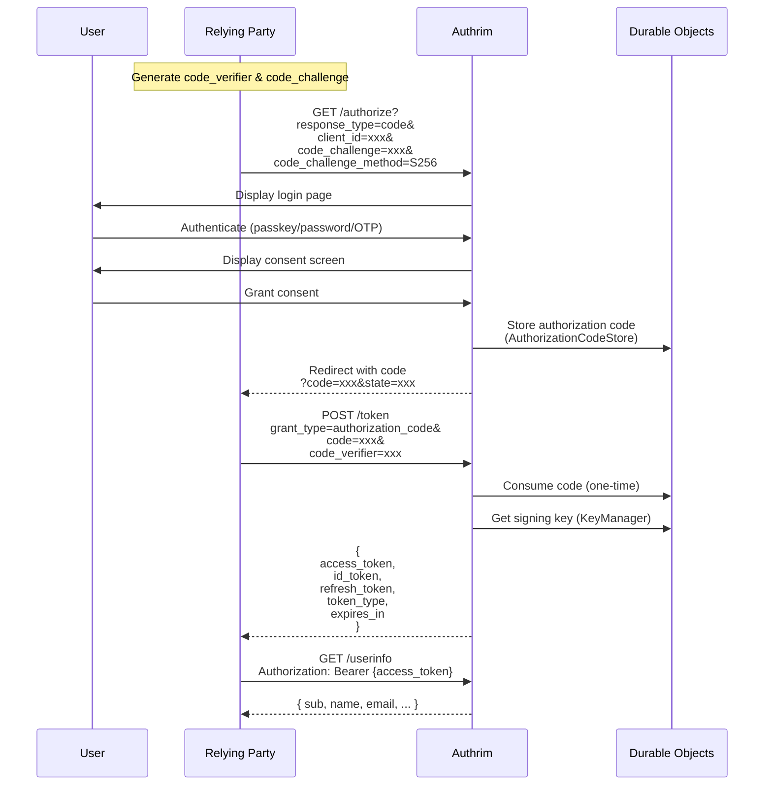

### Request Parameters

| Parameter | Required | Description |
|-----------|----------|-------------|
| `response_type` | ✅ | `code` |
| `client_id` | ✅ | Client identifier |
| `redirect_uri` | ✅ | Callback URL |
| `scope` | ✅ | Space-separated scopes (include `openid`) |
| `state` | Recommended | CSRF protection |
| `nonce` | Recommended | Replay protection for ID token |
| `code_challenge` | ✅ | PKCE challenge (S256) |
| `code_challenge_method` | ✅ | `S256` or `plain` |

---

## 2. Implicit Flow (Legacy)

For JavaScript SPAs without backend (deprecated, use Auth Code + PKCE instead).

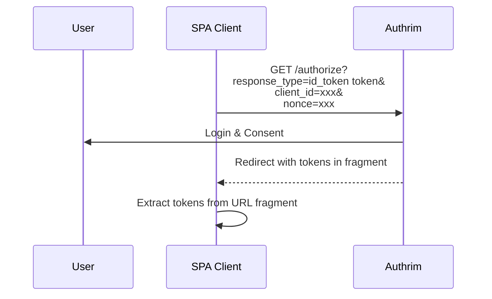

### Security Notes

- Tokens exposed in URL fragment (security risk)
- No refresh tokens issued
- Use Authorization Code + PKCE for new applications

---

## 3. Hybrid Flow

Combines Authorization Code and Implicit for immediate token availability.

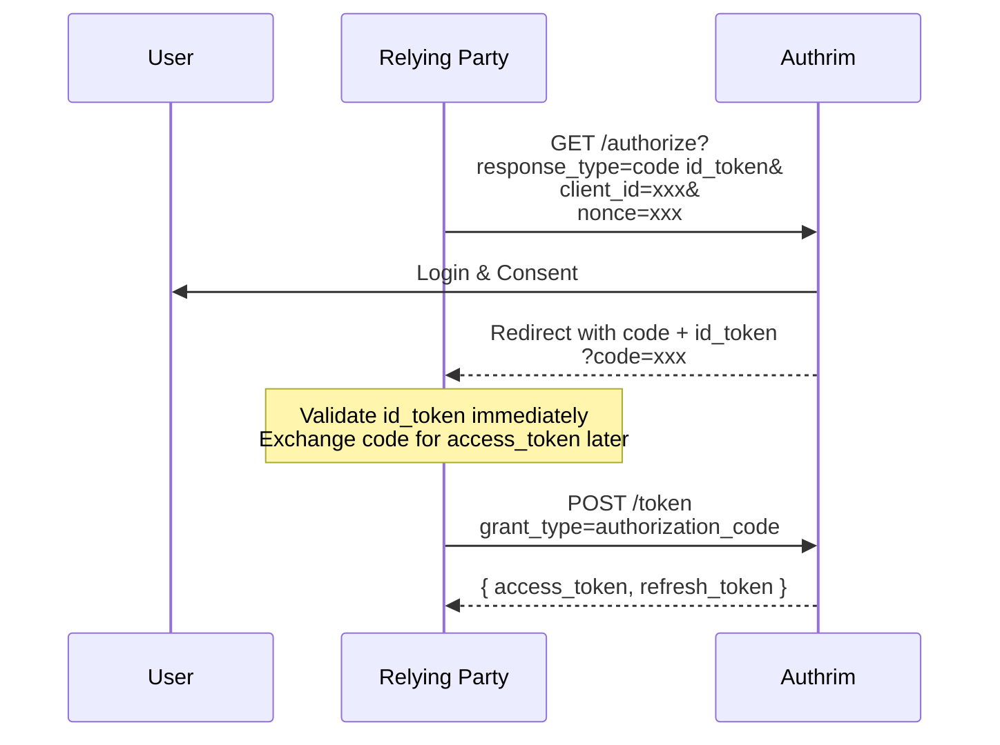

### Response Type Combinations

| response_type | Code | ID Token (fragment) | Access Token (fragment) |
|--------------|------|---------------------|------------------------|
| `code` | ✅ | | |
| `id_token` | | ✅ | |
| `token` | | | ✅ |
| `code id_token` | ✅ | ✅ | |
| `code token` | ✅ | | ✅ |
| `id_token token` | | ✅ | ✅ |
| `code id_token token` | ✅ | ✅ | ✅ |

---

## 4. Client Credentials Flow

Machine-to-machine authentication without user involvement.

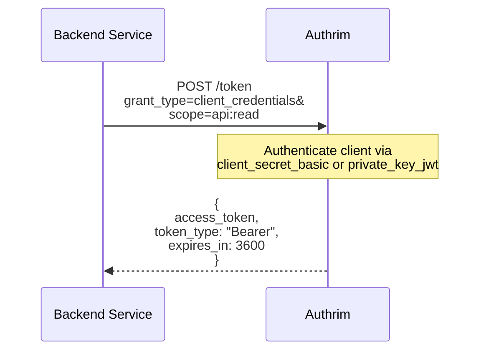

### Client Authentication Methods

| Method | Security | Use Case |
|--------|----------|----------|
| `client_secret_basic` | Standard | Traditional apps |
| `client_secret_post` | Standard | When headers impractical |
| `client_secret_jwt` | High | Symmetric JWT auth |
| `private_key_jwt` | Highest | FAPI compliance |

---

## 5. Refresh Token Flow

Exchange refresh token for new access token (with rotation).

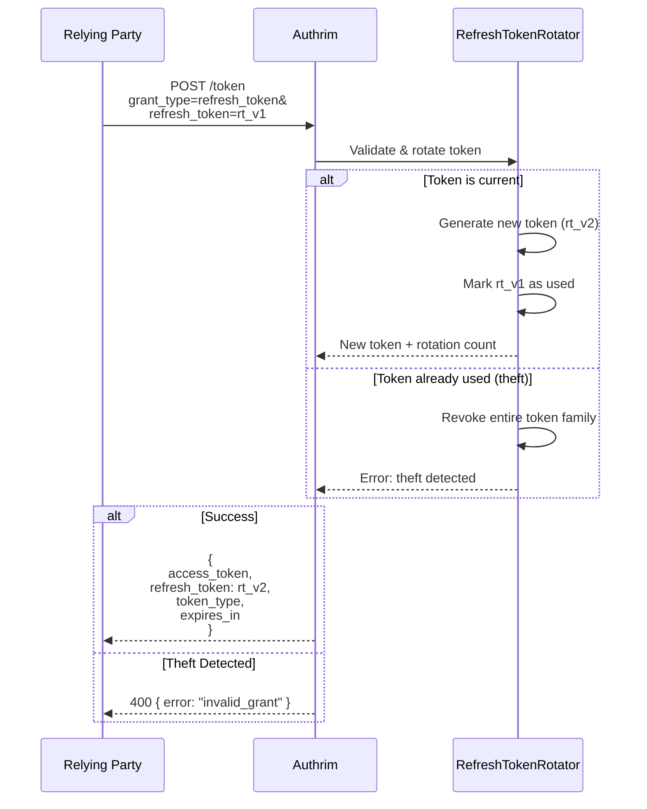

### Token Family Tracking

Refresh token rotation tracks token families to detect theft:

```
rt_v1 → rt_v2 → rt_v3 (current)
         ↑
     If reused: REVOKE ALL
```

---

## 6. Device Authorization Flow

For devices with limited input (TVs, IoT, CLI tools).

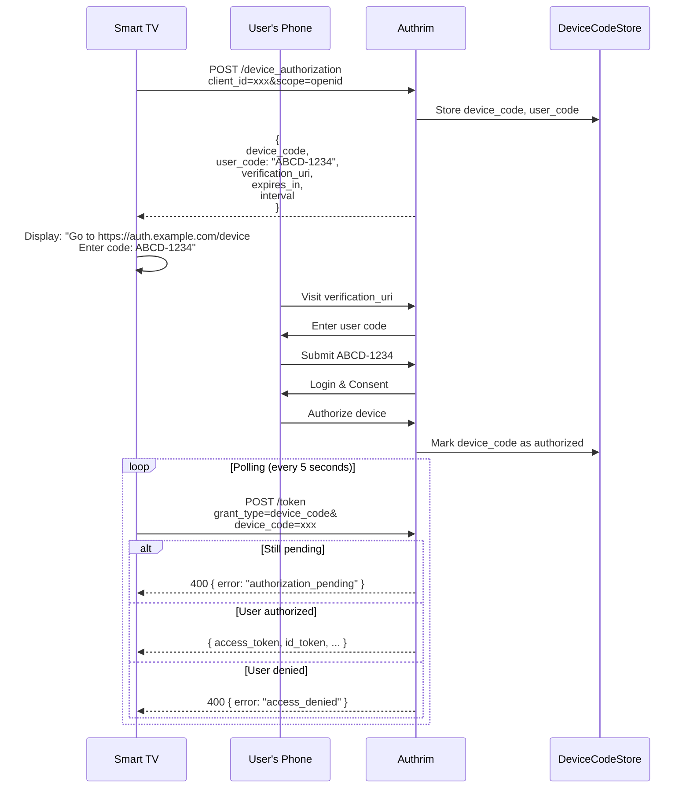

---

## 7. CIBA Flow

Client-Initiated Backchannel Authentication for decoupled flows.

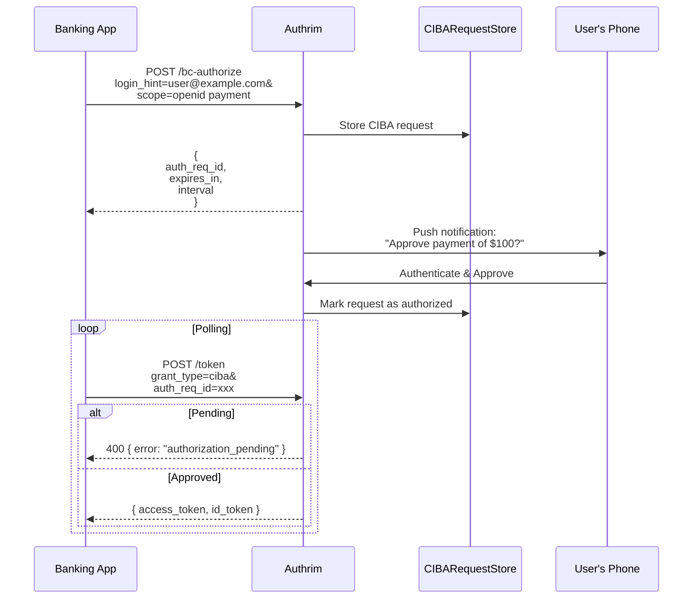

### CIBA Modes

| Mode | Description |
|------|-------------|
| **Poll** | Client polls token endpoint |
| **Ping** | OP calls client's callback when ready |
| **Push** | OP pushes tokens to client's callback |

---

## 8. Token Exchange Flow

Exchange tokens for different audiences, scopes, or delegation.

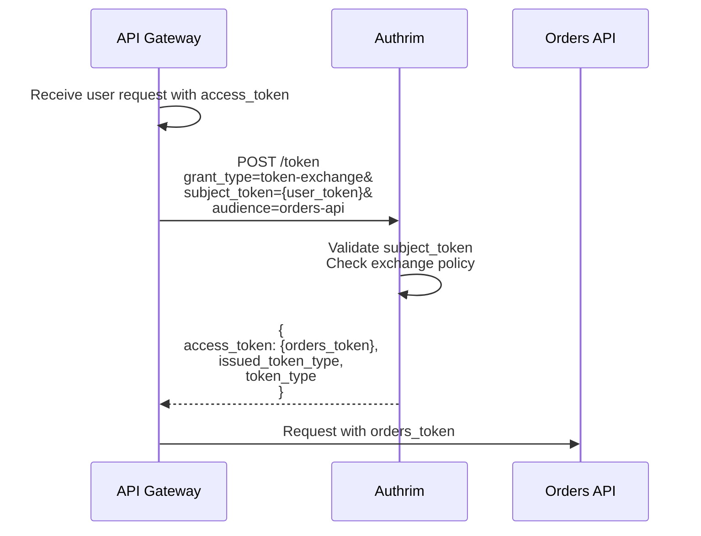

### Exchange Types

| Type | Use Case |
|------|----------|
| Audience Exchange | Service-to-service calls |
| Scope Reduction | Least privilege |
| Delegation | `may_act` claim |
| Impersonation | Admin support tools |

---

## 9. PAR Flow

Pushed Authorization Requests for enhanced security.

```mermaid
sequenceDiagram
    participant RP as Relying Party
    participant OP as Authrim
    participant PAR as PARRequestStore

    RP->>OP: POST /par<br/>client_id=xxx&<br/>redirect_uri=xxx&<br/>scope=openid&<br/>response_type=code

    OP->>OP: Authenticate client

    OP->>PAR: Store request parameters

    OP-->>RP: {<br/>  request_uri: "urn:ietf:params:oauth:request_uri:xxx",<br/>  expires_in: 60<br/>}

    RP->>OP: GET /authorize?<br/>client_id=xxx&<br/>request_uri=urn:ietf:params:oauth:request_uri:xxx

    OP->>PAR: Retrieve & consume request

    Note over OP: Continue with normal auth flow
```

### PAR Benefits

- Request parameters not exposed in browser
- Request authenticated before user interaction
- Supports large/complex requests
- Required for FAPI 2.0

---

## 10. JAR/JARM Flow

JWT-secured Authorization Request and Response Mode.

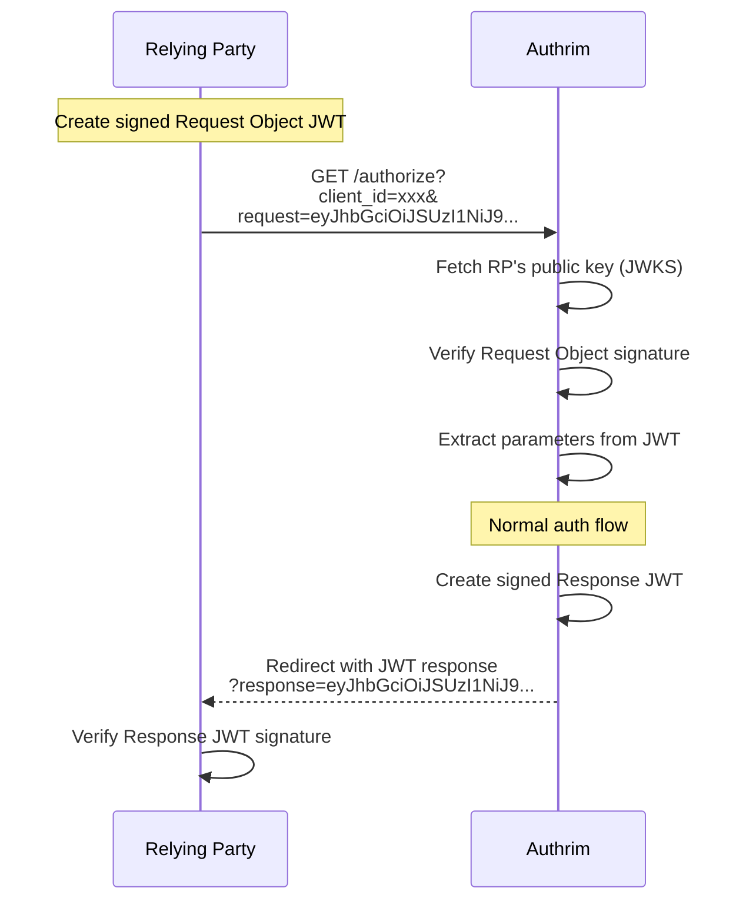

---

## 11. DPoP Flow

Demonstrating Proof of Possession for token binding.

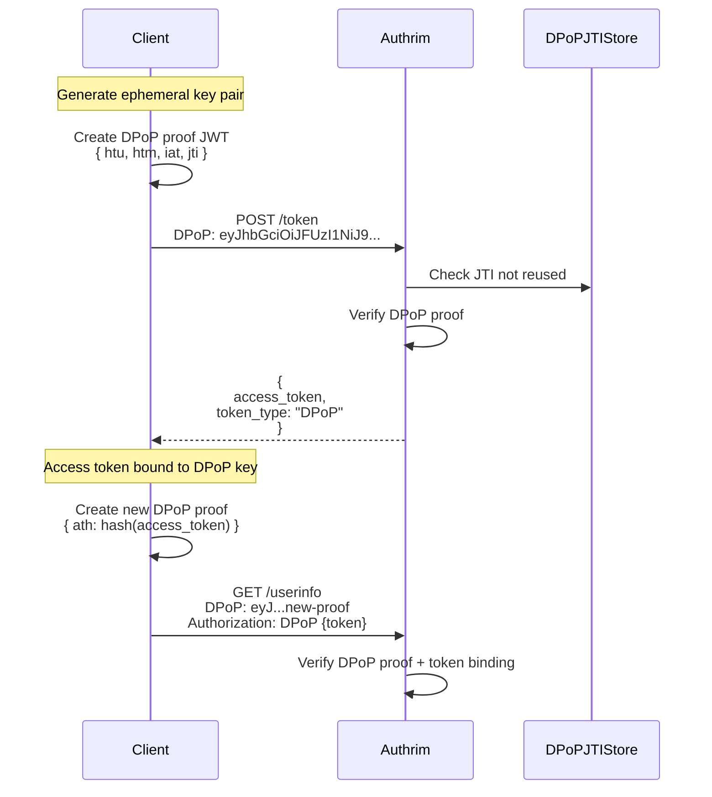

---

## State Machine

### Authorization Session States

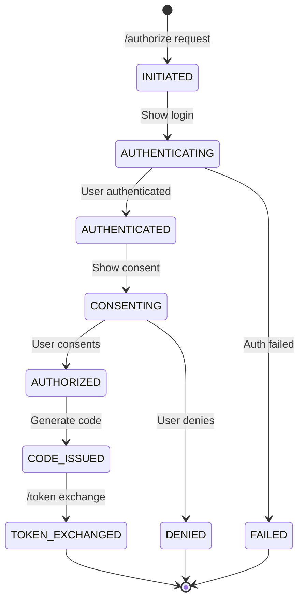

---

## Error Handling

### OAuth 2.0 Error Responses

| Error | Description |
|-------|-------------|
| `invalid_request` | Missing/invalid parameters |
| `invalid_client` | Client authentication failed |
| `invalid_grant` | Code/token invalid or expired |
| `unauthorized_client` | Client not allowed for grant |
| `unsupported_grant_type` | Grant type not supported |
| `invalid_scope` | Requested scope invalid |
| `access_denied` | User denied authorization |
| `server_error` | Internal server error |

### Error Response Format

```json
{
  "error": "invalid_grant",
  "error_description": "Authorization code has expired",
  "error_uri": "https://docs.authrim.com/errors/invalid_grant"
}
```

---

## Temporal Constraints

| Element | TTL | Notes |
|---------|-----|-------|
| Authorization Code | 60 seconds | One-time use |
| PAR Request URI | 60 seconds | One-time use |
| Access Token | 1 hour | Configurable |
| ID Token | 1 hour | Matches access token |
| Refresh Token | 30 days | Rotated on use |
| Device Code | 15 minutes | Polling interval: 5s |
| CIBA Request | 2 minutes | Polling interval: 2s |

---

## Related Documents

| Document | Description |
|----------|-------------|
| [Architecture Overview](./overview.md) | System architecture |
| [Durable Objects](./durable-objects.md) | Consistency layer |
| [Token Management](../features/token-management.md) | Token lifecycle |
| [PKCE](../features/pkce.md) | PKCE implementation |

---

## References

- [OpenID Connect Core 1.0](https://openid.net/specs/openid-connect-core-1_0.html)
- [OAuth 2.0 (RFC 6749)](https://datatracker.ietf.org/doc/html/rfc6749)
- [PKCE (RFC 7636)](https://datatracker.ietf.org/doc/html/rfc7636)
- [Device Authorization (RFC 8628)](https://datatracker.ietf.org/doc/html/rfc8628)
- [CIBA Core](https://openid.net/specs/openid-client-initiated-backchannel-authentication-core-1_0.html)
- [Token Exchange (RFC 8693)](https://datatracker.ietf.org/doc/html/rfc8693)
- [PAR (RFC 9126)](https://datatracker.ietf.org/doc/html/rfc9126)
- [DPoP (RFC 9449)](https://datatracker.ietf.org/doc/html/rfc9449)

---

**Last Updated**: 2025-12-20
**Status**: Production
**Flows**: 11 complete flows documented
