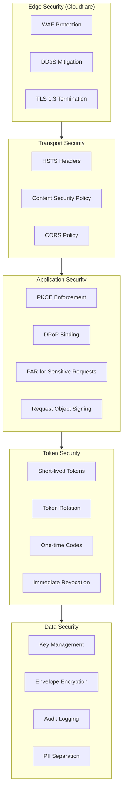
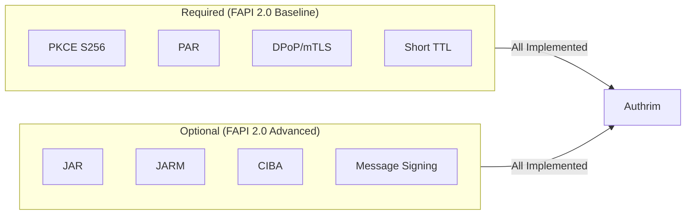
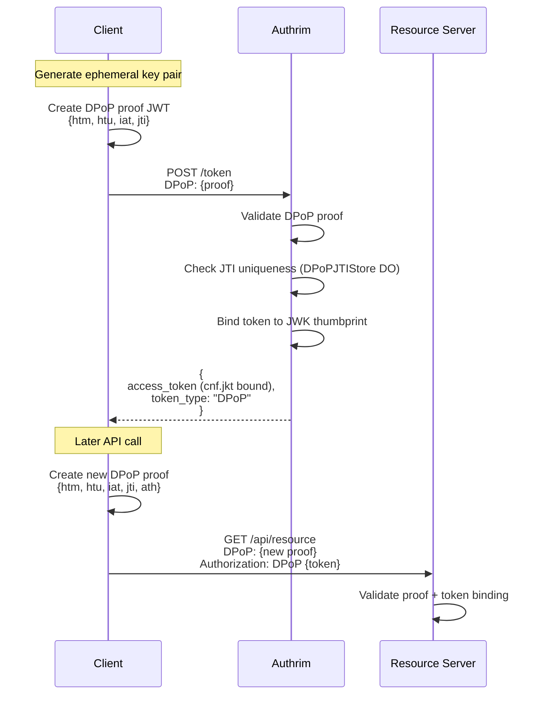
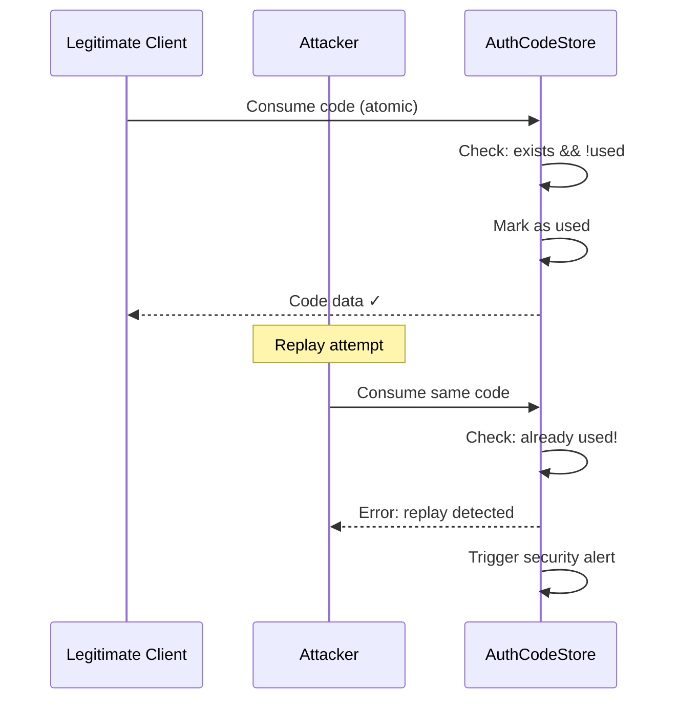
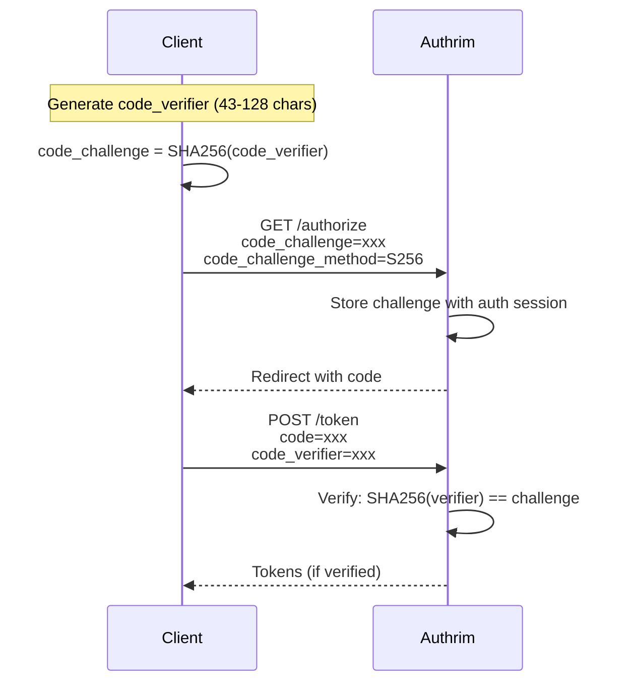
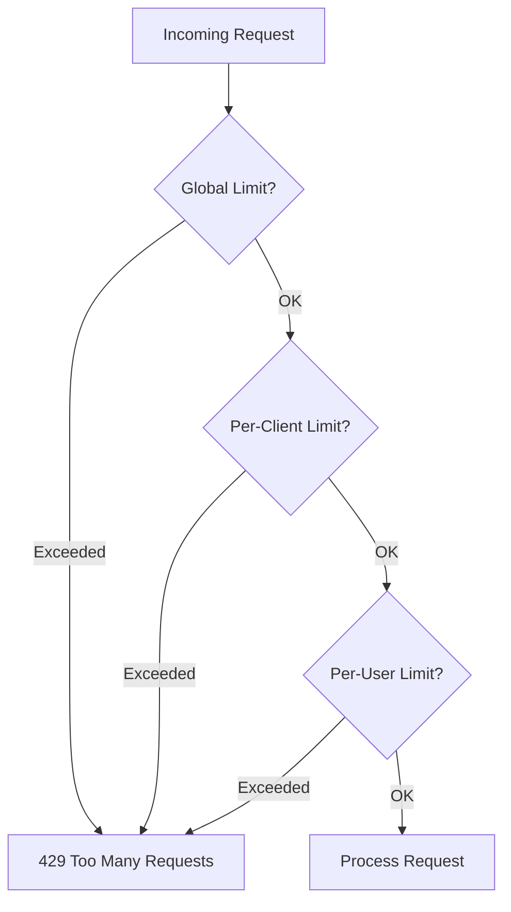

# Security Architecture

Defense-in-depth security model with OAuth 2.0 best practices and FAPI 2.0 compliance.

## Overview

| Aspect               | Description                             |
| -------------------- | --------------------------------------- |
| **Security Profile** | FAPI 2.0 Security Profile compliant     |
| **Token Security**   | DPoP, short TTL, one-time codes         |
| **Key Management**   | Automatic rotation, envelope encryption |
| **Transport**        | TLS 1.3, HSTS, certificate transparency |

Authrim implements a comprehensive security architecture that provides enterprise-grade protection for identity and access management operations.

---

## Security Layers



---

## FAPI 2.0 Security Profile

Authrim implements the [FAPI 2.0 Security Profile](https://openid.net/specs/fapi-2_0-security-profile.html) for financial-grade security.

### Required Security Mechanisms

| Requirement            | Implementation                                      |
| ---------------------- | --------------------------------------------------- |
| **PKCE (S256)**        | Mandatory for all authorization code flows          |
| **DPoP or mTLS**       | Sender-constrained access tokens                    |
| **PAR**                | Pushed Authorization Requests for secure parameters |
| **Short-lived tokens** | Access tokens ≤ 10 minutes (configurable)           |
| **Signed requests**    | JAR support for signed authorization requests       |
| **Signed responses**   | JARM for signed authorization responses             |

### FAPI 2.0 Compliance Matrix



---

## Token Security

### Token Types and TTL

| Token Type         | Default TTL | Purpose                   |
| ------------------ | ----------- | ------------------------- |
| Authorization Code | 60 seconds  | One-time code exchange    |
| Access Token       | 1 hour      | API access (configurable) |
| ID Token           | 1 hour      | User authentication       |
| Refresh Token      | 30 days     | Token renewal (rotated)   |
| DPoP Proof         | 60 seconds  | Proof of possession       |

### DPoP (Demonstrating Proof of Possession)

DPoP binds access tokens to client key pairs, preventing token theft.



### DPoP Implementation Details

| Component             | Description                         |
| --------------------- | ----------------------------------- |
| **Key Type**          | ES256 (P-256 curve) or RS256        |
| **JTI Store**         | DPoPJTIStore DO (sharded by region) |
| **Replay Prevention** | Atomic check-and-store in DO        |
| **Clock Skew**        | ±60 seconds tolerance               |

### One-Time Code Consumption

Authorization codes are designed for single use with atomic consumption:



---

## Authentication Security

### PKCE (Proof Key for Code Exchange)

PKCE is mandatory for all authorization code flows, preventing authorization code interception attacks.



### Supported Challenge Methods

| Method    | Security Level | Usage                        |
| --------- | -------------- | ---------------------------- |
| **S256**  | High           | Recommended (default)        |
| **plain** | Low            | Legacy only (FAPI disallows) |

---

## Pushed Authorization Requests (PAR)

PAR moves authorization parameters from the browser to a server-to-server call, preventing parameter tampering.

```mermaid
sequenceDiagram
    participant Client
    participant OP as Authrim
    participant PAR as PARRequestStore

    Client->>OP: POST /par<br/>client_id, redirect_uri, scope, etc.

    OP->>OP: Authenticate client
    OP->>PAR: Store request parameters

    OP-->>Client: {<br/>  request_uri: "urn:ietf:params:oauth:request_uri:xxx",<br/>  expires_in: 60<br/>}

    Client->>OP: GET /authorize<br/>request_uri=urn:...

    OP->>PAR: Retrieve & consume (one-time)
    OP->>OP: Continue with stored parameters
```

### PAR Security Benefits

| Benefit                    | Description                                  |
| -------------------------- | -------------------------------------------- |
| **Parameter Hiding**       | Sensitive parameters not exposed in browser  |
| **Request Authentication** | Client authenticated before user interaction |
| **Integrity Protection**   | Parameters cannot be tampered                |
| **Size Limit Avoidance**   | Large requests without URL length limits     |

---

## Request and Response Signing

### JAR (JWT-Secured Authorization Request)

Authorization requests can be signed JWTs for integrity and authenticity:

```
GET /authorize?
  client_id=xxx&
  request=eyJhbGciOiJSUzI1NiJ9.eyJpc3MiOiJjbGllbnQiLCJhdWQiOiJhdXRocmltIi4uLn0.signature
```

### JARM (JWT-Secured Authorization Response Mode)

Authorization responses can be signed JWTs:

```
https://client.example.com/callback?
  response=eyJhbGciOiJSUzI1NiJ9.eyJpc3MiOiJhdXRocmltIiwiYXVkIjoiY2xpZW50Ii4uLn0.signature
```

---

## Rate Limiting

Authrim implements multi-layer rate limiting to prevent abuse:

### Rate Limit Layers

| Layer           | Scope              | Implementation         |
| --------------- | ------------------ | ---------------------- |
| **Global**      | Per endpoint       | Cloudflare WAF         |
| **Per-Client**  | OAuth client       | RateLimiterCounter DO  |
| **Per-User**    | User ID            | RateLimiterCounter DO  |
| **Per-IP**      | IP address         | Cloudflare             |
| **Device Flow** | User code attempts | UserCodeRateLimiter DO |

### Rate Limit Configuration



### Default Rate Limits

| Endpoint                | Limit   | Window          |
| ----------------------- | ------- | --------------- |
| `/token`                | 100/min | Per client      |
| `/authorize`            | 60/min  | Per user        |
| `/userinfo`             | 120/min | Per user        |
| `/device_authorization` | 10/min  | Per client      |
| Device code polling     | 1/5s    | Per device code |

---

## CSRF Protection

### State Parameter

All authorization requests require a `state` parameter for CSRF protection:

```typescript
// Client generates random state
const state = crypto.randomUUID();

// Include in authorization request
/authorize?state=${state}&...

// Verify on callback
if (callback.state !== session.state) {
  throw new Error('CSRF attack detected');
}
```

### SameSite Cookies

Session cookies use `SameSite=Lax` attribute to prevent CSRF in cross-origin requests.

---

## Audit Logging

Comprehensive security event logging for compliance and forensics:

### Logged Events

| Category             | Events                                  |
| -------------------- | --------------------------------------- |
| **Authentication**   | Login success/failure, MFA verification |
| **Authorization**    | Code issuance, token exchange           |
| **Token Operations** | Refresh, revoke, introspect             |
| **Key Management**   | Rotation, emergency revocation          |
| **Admin Actions**    | User/client CRUD, settings changes      |

### Audit Log Format

```json
{
  "timestamp": "2025-12-20T10:30:00.000Z",
  "requestId": "req_abc123",
  "tenantId": "default",
  "event": "token_issued",
  "actor": {
    "userId": "user_123",
    "clientId": "client_456"
  },
  "details": {
    "grantType": "authorization_code",
    "scopes": ["openid", "profile"]
  },
  "ip": "203.0.113.42",
  "userAgent": "Mozilla/5.0..."
}
```

---

## Content Security

### HTTP Security Headers

| Header                      | Value                                 | Purpose                |
| --------------------------- | ------------------------------------- | ---------------------- |
| `Strict-Transport-Security` | `max-age=31536000; includeSubDomains` | Force HTTPS            |
| `Content-Security-Policy`   | `default-src 'self'`                  | Prevent XSS            |
| `X-Content-Type-Options`    | `nosniff`                             | Prevent MIME sniffing  |
| `X-Frame-Options`           | `DENY`                                | Prevent clickjacking   |
| `Referrer-Policy`           | `strict-origin-when-cross-origin`     | Limit referrer leakage |

### CORS Policy

```typescript
const corsConfig = {
  origin: (origin) => validateRedirectUri(origin),
  methods: ['GET', 'POST', 'OPTIONS'],
  credentials: true,
  maxAge: 86400,
};
```

---

## Threat Model

### Protected Attack Vectors

| Attack                              | Mitigation                           |
| ----------------------------------- | ------------------------------------ |
| **Authorization Code Interception** | PKCE (S256) mandatory                |
| **Token Theft**                     | DPoP binding, short TTL              |
| **Replay Attack**                   | One-time codes, JTI tracking         |
| **CSRF**                            | State parameter, SameSite cookies    |
| **Parameter Tampering**             | PAR, signed requests (JAR)           |
| **Credential Stuffing**             | Rate limiting, lockout               |
| **XSS**                             | CSP, output encoding                 |
| **Clickjacking**                    | X-Frame-Options: DENY                |
| **Key Compromise**                  | Automatic rotation, emergency revoke |

---

## Security Monitoring

### Key Security Metrics

| Metric                   | Alert Threshold   |
| ------------------------ | ----------------- |
| Failed login rate        | >10% in 5 minutes |
| Token replay attempts    | Any occurrence    |
| Emergency key rotation   | Any occurrence    |
| Rate limit triggers      | >100/minute       |
| DPoP validation failures | >5%               |

---

## Related Documents

| Document                                          | Description                  |
| ------------------------------------------------- | ---------------------------- |
| [Key Management](./key-management.md)             | Cryptographic key lifecycle  |
| [Authentication Flows](./authentication-flows.md) | User authentication methods  |
| [Configuration](./configuration.md)               | Security settings management |
| [Durable Objects](./durable-objects.md)           | Security-critical DO design  |

---

## References

- [FAPI 2.0 Security Profile](https://openid.net/specs/fapi-2_0-security-profile.html)
- [OAuth 2.0 Security BCP (RFC 6819)](https://datatracker.ietf.org/doc/html/rfc6819)
- [OAuth 2.0 Threat Model (draft-ietf-oauth-security-topics)](https://datatracker.ietf.org/doc/html/draft-ietf-oauth-security-topics)
- [DPoP (RFC 9449)](https://datatracker.ietf.org/doc/html/rfc9449)
- [PKCE (RFC 7636)](https://datatracker.ietf.org/doc/html/rfc7636)
- [PAR (RFC 9126)](https://datatracker.ietf.org/doc/html/rfc9126)

---

**Last Updated**: 2025-12-20
**Status**: Production
**Compliance**: FAPI 2.0 Security Profile
