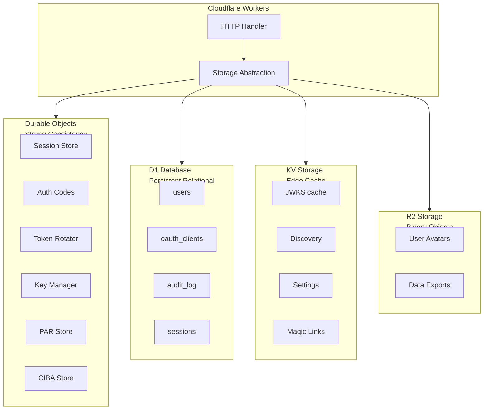
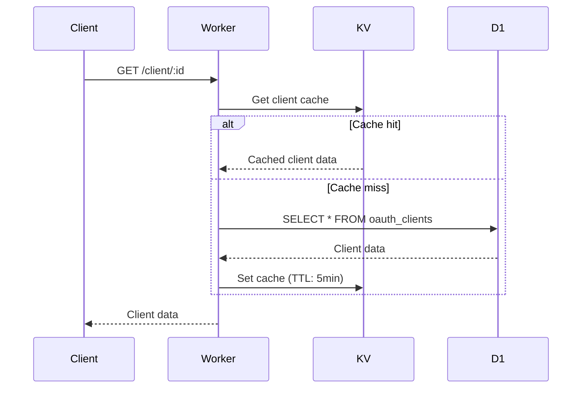
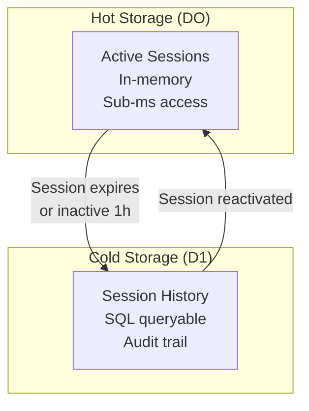
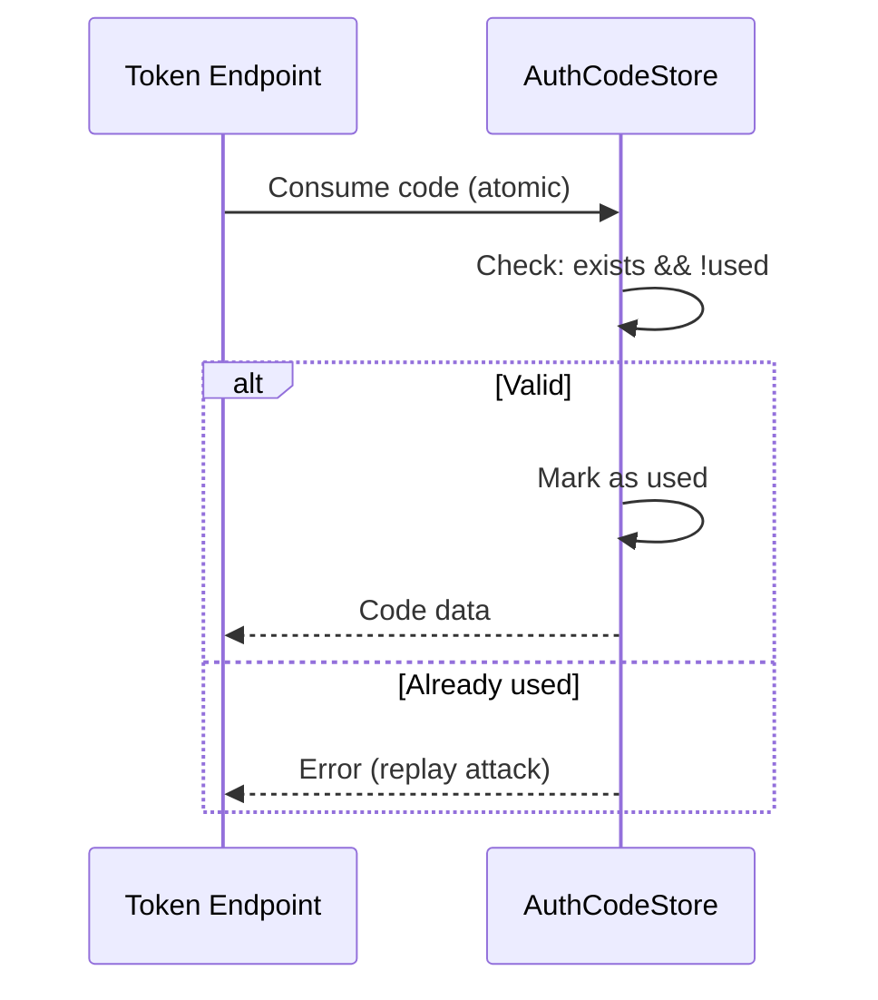
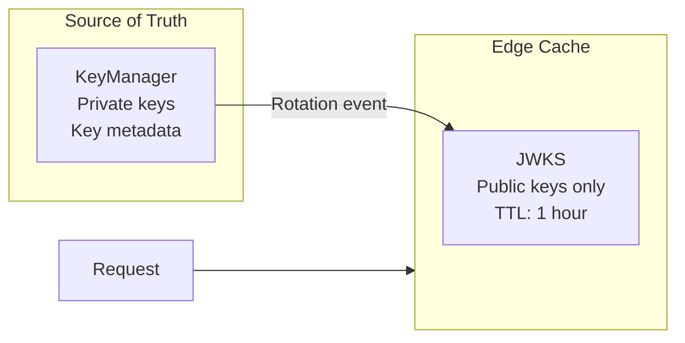

# Storage Strategy

Hybrid multi-tier storage architecture optimized for performance, cost, and consistency.

## Overview

| Aspect | Description |
|--------|-------------|
| **Tiers** | Durable Objects, D1 (SQLite), KV Storage, R2 |
| **Pattern** | Right storage for right data |
| **Consistency** | Strong where critical, eventual elsewhere |
| **Caching** | Multi-layer with TTL management |

Authrim uses a hybrid storage architecture that matches each data type to the most appropriate Cloudflare storage service based on consistency requirements, access patterns, and cost optimization.

---

## Storage Tiers



---

## Tier Comparison

### Feature Matrix

| Feature | Durable Objects | D1 (SQLite) | KV | R2 |
|---------|----------------|-------------|-----|-----|
| **Consistency** | Strong | Strong* | Eventual | Strong |
| **Read Latency** | <1ms (memory) | <10ms | <1ms (edge) | <50ms |
| **Write Latency** | <10ms | <50ms | <500ms | <100ms |
| **TTL Support** | Manual | Manual | Native | Manual |
| **Complex Queries** | No | Yes (SQL) | No | No |
| **Transactions** | Yes (per DO) | Yes | No | No |
| **Best For** | Real-time state | Persistent data | Edge cache | Binary files |

*D1 consistency is within-region; cross-region may have short delays.

### Cost Analysis

| Operation Type | DO | D1 | KV | R2 |
|----------------|----|----|----|----|
| 1M reads | ~$0.02 | Free tier | $0.50 | $0.36 |
| 1M writes | ~$0.02 | Free tier | $5.00 | $4.50 |
| Storage/GB | $0.20 | $0.75 | $0.50 | $0.015 |

---

## Data Classification

### By Consistency Requirement

| Level | Data Types | Storage | Reason |
|-------|-----------|---------|--------|
| **Strong** | Auth codes, Token rotation | DO | One-time use, theft detection |
| **Strong** | Active sessions | DO | Real-time invalidation |
| **Strong** | PAR, CIBA requests | DO | Request binding |
| **Persistent** | Users, Clients | D1 | Relational queries |
| **Eventual** | Discovery, JWKS | KV | High read volume |

### By Lifetime

| Lifetime | Data | Storage | TTL |
|----------|------|---------|-----|
| <60s | Authorization codes | DO | 60s |
| <5min | PAR request_uri | DO | 60s |
| <15min | Magic links | KV | 15min |
| <24h | Active sessions | DO | 24h |
| <30d | Refresh tokens | DO | 30d |
| Indefinite | Users, Clients, Audit | D1 | - |

### By Access Pattern

| Pattern | Data | Storage | Strategy |
|---------|------|---------|----------|
| Write-once-read-once | Auth codes | DO | Atomic consume |
| Write-rare-read-often | JWKS, Discovery | DO → KV | Write-through cache |
| Write-often-read-often | Sessions | DO | In-memory |
| Write-often-read-rare | Audit logs | D1 | Async write |

---

## Storage Patterns

### Pattern 1: Write-Through Cache

For data that changes rarely but reads frequently.



**Used for**: Client metadata, User profiles

### Pattern 2: Hot/Cold Storage

For data with varying access frequency.



**Used for**: Sessions, Rate limit counters

### Pattern 3: Atomic Operation

For security-critical one-time operations.



**Used for**: Authorization codes, PAR requests, Challenges

### Pattern 4: Source of Truth with Cache

For data where DO is authoritative.



**Used for**: JWKS, Discovery metadata

---

## Data Flow by Operation

### Authorization Code Flow

```
/authorize → DO:AuthCodeStore (write code)
/token     → DO:AuthCodeStore (consume code, atomic)
           → DO:KeyManager (sign tokens)
           → DO:RefreshTokenRotator (store refresh token)
```

### Token Refresh

```
/token (refresh) → DO:RefreshTokenRotator (validate & rotate)
                 → DO:KeyManager (sign new tokens)
```

### User Authentication

```
/authorize → D1:users (lookup)
           → KV:client_cache (client info)
           → DO:SessionStore (create session)
           → DO:AuthCodeStore (create code)
```

---

## Configuration Storage

### Priority Hierarchy

```
KV (dynamic) → Environment Variable → Code Default
```

All settings follow this pattern:

```typescript
async function getSetting(key: string): Promise<string> {
  // 1. Check KV for dynamic override
  const kvValue = await env.KV.get(`setting:${key}`);
  if (kvValue) return kvValue;

  // 2. Check environment variable
  if (env[key]) return env[key];

  // 3. Return secure default
  return DEFAULTS[key];
}
```

### Settings Storage

| Setting Type | Storage | Update Method |
|--------------|---------|---------------|
| Feature flags | KV | Admin API |
| Security config | KV + Env | Admin API, deploy |
| Secrets | Env (encrypted) | Deploy only |
| Tenant settings | D1 | Admin API |

---

## Migration Patterns

### KV to DO Migration

For data requiring stronger consistency:

```typescript
// Before: KV-based auth codes
await env.KV.put(`code:${code}`, JSON.stringify(data), { expirationTtl: 60 });

// After: DO-based auth codes
const id = env.AUTH_CODE_STORE.idFromName(getShardId(code));
const stub = env.AUTH_CODE_STORE.get(id);
await stub.fetch('/code', { method: 'POST', body: JSON.stringify(data) });
```

### D1 to DO Migration (Hot Data)

For frequently accessed data:

```typescript
// Hot/cold pattern for sessions
class SessionStore {
  private hot: Map<string, Session> = new Map();

  async get(id: string): Promise<Session | null> {
    // Check hot storage first
    if (this.hot.has(id)) {
      return this.hot.get(id)!;
    }

    // Fall back to D1
    const session = await this.d1.get(id);
    if (session) {
      this.hot.set(id, session); // Promote to hot
    }
    return session;
  }
}
```

---

## Cost Optimization

### Strategies

| Strategy | Implementation | Savings |
|----------|---------------|---------|
| Edge caching | KV for public keys, discovery | 90% DO reads |
| Batch writes | Async audit logging | 50% D1 writes |
| TTL expiration | Native KV TTL | No cleanup cost |
| Read replicas | Multi-region D1 | Lower latency |

### Free Tier Utilization

| Service | Free Tier | Authrim Usage |
|---------|-----------|---------------|
| D1 | 5M reads/day | User lookups |
| KV | 100K reads/day | Discovery, JWKS |
| DO | 1M requests/month | Auth codes, sessions |
| R2 | 10M reads/month | Avatars |

---

## Monitoring

### Key Metrics

| Metric | Storage | Alert Threshold |
|--------|---------|-----------------|
| Cache hit rate | KV | <90% |
| DO latency p99 | DO | >50ms |
| D1 query time | D1 | >100ms |
| Hot session count | DO | >10K/shard |

### Storage Health Check

```typescript
async function healthCheck(): Promise<StorageHealth> {
  const [doHealth, d1Health, kvHealth] = await Promise.all([
    checkDOHealth(env.SESSION_STORE),
    checkD1Health(env.D1),
    checkKVHealth(env.KV),
  ]);

  return {
    healthy: doHealth.ok && d1Health.ok && kvHealth.ok,
    latencies: {
      do: doHealth.latency,
      d1: d1Health.latency,
      kv: kvHealth.latency,
    },
  };
}
```

---

## Related Documents

| Document | Description |
|----------|-------------|
| [Architecture Overview](./overview.md) | System architecture |
| [Durable Objects](./durable-objects.md) | DO design and patterns |
| [Database Schema](./database-schema.md) | D1 schema |
| [DO Sharding](./durable-objects-sharding.md) | Sharding strategies |

---

## References

- [Cloudflare D1](https://developers.cloudflare.com/d1/)
- [Cloudflare KV](https://developers.cloudflare.com/kv/)
- [Cloudflare Durable Objects](https://developers.cloudflare.com/durable-objects/)
- [Cloudflare R2](https://developers.cloudflare.com/r2/)

---

**Last Updated**: 2025-12-20
**Status**: Production
**Version**: 2.0.0
