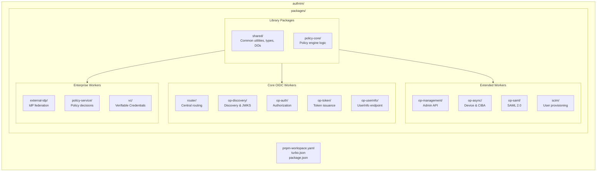
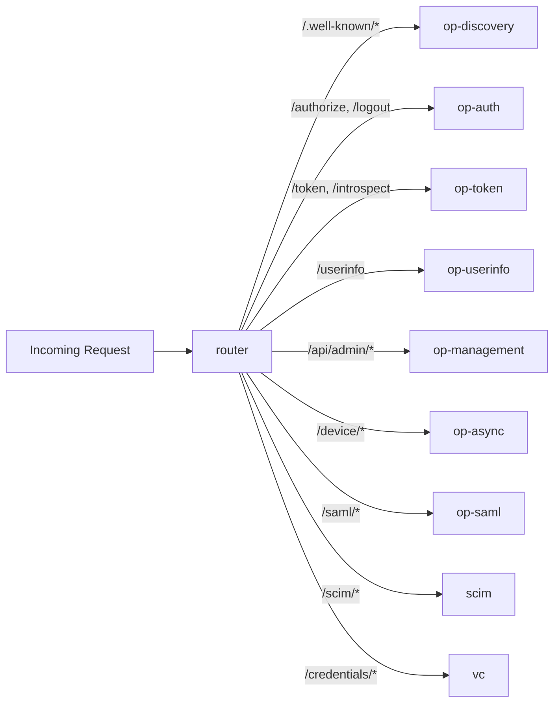
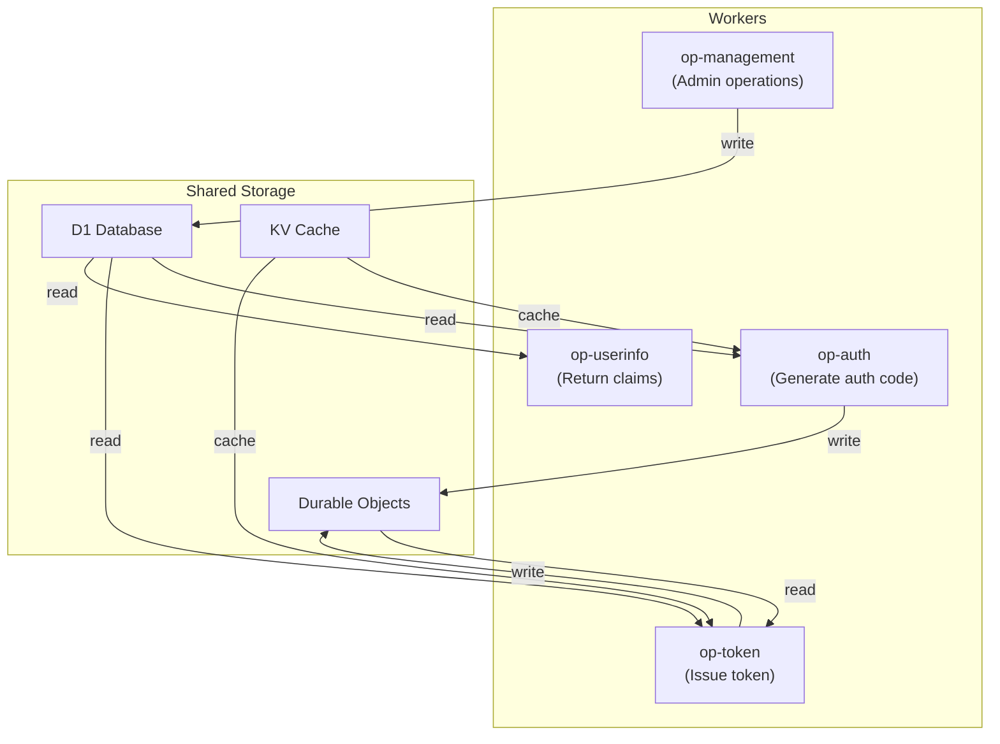

# Workers Architecture

Cloudflare Workers monorepo structure with domain-separated services.

## Overview

| Aspect            | Description                            |
| ----------------- | -------------------------------------- |
| **Package Count** | 14 packages (12 workers + 2 libraries) |
| **Build System**  | Turborepo + pnpm workspaces            |
| **Framework**     | Hono (TypeScript)                      |
| **Deployment**    | Independent per-worker deployment      |

Authrim uses a monorepo architecture where each OAuth/OIDC concern is handled by a dedicated Cloudflare Worker. This enables independent scaling, deployment, and maintenance of each component.

---

## Monorepo Structure



---

## Package Directory

### Library Packages

| Package         | Path                    | Description                                                                           |
| --------------- | ----------------------- | ------------------------------------------------------------------------------------- |
| **shared**      | `packages/shared/`      | Common utilities, TypeScript types, middleware, storage abstractions, Durable Objects |
| **policy-core** | `packages/policy-core/` | ReBAC policy engine core logic (Zanzibar-style)                                       |

### Worker Packages

| Package            | Path                       | Primary Endpoints                    | Description                                   |
| ------------------ | -------------------------- | ------------------------------------ | --------------------------------------------- |
| **router**         | `packages/router/`         | `/*`                                 | Central request router, path-based forwarding |
| **op-discovery**   | `packages/op-discovery/`   | `/.well-known/*`                     | OIDC Discovery, JWKS publication              |
| **op-auth**        | `packages/op-auth/`        | `/authorize`, `/logout`, `/par`      | Authorization, consent, logout, PAR           |
| **op-token**       | `packages/op-token/`       | `/token`, `/introspect`, `/revoke`   | Token issuance, introspection, revocation     |
| **op-userinfo**    | `packages/op-userinfo/`    | `/userinfo`                          | User claims endpoint                          |
| **op-management**  | `packages/op-management/`  | `/api/admin/*`, `/register`          | Admin API, DCR, client management             |
| **op-async**       | `packages/op-async/`       | `/device/*`, `/bc-authorize`         | Device Flow, CIBA                             |
| **op-saml**        | `packages/op-saml/`        | `/saml/*`                            | SAML 2.0 SP functionality                     |
| **scim**           | `packages/scim/`           | `/scim/v2/*`                         | SCIM 2.0 user provisioning                    |
| **external-idp**   | `packages/external-idp/`   | `/external/*`                        | Social login, SAML/OIDC federation            |
| **policy-service** | `packages/policy-service/` | `/policy/*`                          | Real-time policy decisions                    |
| **vc**             | `packages/vc/`             | `/credentials/*`, `/presentations/*` | OpenID4VCI, OpenID4VP, DID                    |

---

## Worker Details

### Router Worker

Central entry point that routes requests to appropriate domain workers.



| Aspect               | Details                        |
| -------------------- | ------------------------------ |
| **Routing Method**   | Path pattern matching          |
| **Service Bindings** | Connects to all domain workers |
| **Overhead**         | Minimal (<1ms routing latency) |

### op-discovery

Publishes OIDC provider metadata and public keys.

| Endpoint                                  | Method | Description           |
| ----------------------------------------- | ------ | --------------------- |
| `/.well-known/openid-configuration`       | GET    | Provider metadata     |
| `/.well-known/jwks.json`                  | GET    | Public signing keys   |
| `/.well-known/oauth-authorization-server` | GET    | OAuth 2.0 AS metadata |

**Caching**: Responses cached at edge (KV) for high performance.

### op-auth

Handles user authorization and authentication flows.

| Endpoint              | Method   | Description                  |
| --------------------- | -------- | ---------------------------- |
| `/authorize`          | GET/POST | Authorization endpoint       |
| `/par`                | POST     | Pushed Authorization Request |
| `/logout`             | GET/POST | RP-Initiated logout          |
| `/session/check`      | GET      | Session check iframe         |
| `/api/auth/passkey/*` | POST     | WebAuthn/Passkey flows       |
| `/api/auth/consent`   | POST     | Consent submission           |

**Features**: PKCE, JAR, PAR, Passkeys, Consent UI, All logout types

### op-token

Token issuance and lifecycle management.

| Endpoint      | Method | Description                      |
| ------------- | ------ | -------------------------------- |
| `/token`      | POST   | Token endpoint (all grant types) |
| `/introspect` | POST   | Token introspection (RFC 7662)   |
| `/revoke`     | POST   | Token revocation (RFC 7009)      |

**Grant Types**:

- `authorization_code` (+ PKCE)
- `refresh_token` (with rotation)
- `client_credentials`
- `urn:ietf:params:oauth:grant-type:device_code`
- `urn:openid:params:grant-type:ciba`
- `urn:ietf:params:oauth:grant-type:token-exchange`

### op-userinfo

Returns user claims based on access token.

| Endpoint    | Method   | Description          |
| ----------- | -------- | -------------------- |
| `/userinfo` | GET/POST | User claims endpoint |

**Features**: Standard claims, custom claims, aggregated/distributed claims, encrypted responses

### op-management

Administrative API for system management.

| Endpoint                  | Method | Description                 |
| ------------------------- | ------ | --------------------------- |
| `/register`               | POST   | Dynamic Client Registration |
| `/api/admin/users/*`      | CRUD   | User management             |
| `/api/admin/clients/*`    | CRUD   | Client management           |
| `/api/admin/sessions/*`   | CRUD   | Session management          |
| `/api/admin/settings/*`   | CRUD   | Feature configuration       |
| `/api/admin/statistics/*` | GET    | Analytics data              |

### op-async

Asynchronous grant flows for device and backchannel authentication.

| Endpoint                | Method | Description                  |
| ----------------------- | ------ | ---------------------------- |
| `/device_authorization` | POST   | Device authorization request |
| `/device`               | GET    | User verification page       |
| `/bc-authorize`         | POST   | CIBA authentication request  |
| `/ciba/callback`        | POST   | CIBA callback                |

### op-saml

SAML 2.0 Service Provider functionality.

| Endpoint            | Method   | Description                |
| ------------------- | -------- | -------------------------- |
| `/saml/sp/metadata` | GET      | SP metadata                |
| `/saml/sp/acs`      | POST     | Assertion Consumer Service |
| `/saml/sp/slo`      | GET/POST | Single Logout              |

### scim

SCIM 2.0 user and group provisioning.

| Endpoint                         | Method | Description            |
| -------------------------------- | ------ | ---------------------- |
| `/scim/v2/Users`                 | CRUD   | User provisioning      |
| `/scim/v2/Groups`                | CRUD   | Group provisioning     |
| `/scim/v2/Schemas`               | GET    | Schema discovery       |
| `/scim/v2/ServiceProviderConfig` | GET    | Provider configuration |
| `/scim/v2/Bulk`                  | POST   | Bulk operations        |

### external-idp

External Identity Provider federation.

| Endpoint             | Method | Description             |
| -------------------- | ------ | ----------------------- |
| `/external/callback` | GET    | OAuth/OIDC callback     |
| `/external/saml/acs` | POST   | SAML assertion callback |

**Supported Providers**: Google, Microsoft, Apple, GitHub, Generic OIDC, SAML IdPs

### policy-service

Real-time authorization policy decisions.

| Endpoint              | Method | Description             |
| --------------------- | ------ | ----------------------- |
| `/policy/check`       | POST   | Permission check        |
| `/policy/check-batch` | POST   | Batch permission check  |
| `/policy/relations`   | CRUD   | Relationship management |

**Features**: Zanzibar-style ReBAC, real-time updates via WebSocket

### vc (Verifiable Credentials)

Verifiable Credentials issuance and presentation.

| Endpoint                 | Method | Description                      |
| ------------------------ | ------ | -------------------------------- |
| `/credentials/offer`     | POST   | Credential offer (OpenID4VCI)    |
| `/credentials/issue`     | POST   | Credential issuance              |
| `/presentations/request` | POST   | Presentation request (OpenID4VP) |
| `/presentations/verify`  | POST   | Presentation verification        |

**Standards**: OpenID4VCI, OpenID4VP, DID:web

---

## Data Flow Architecture

### Worker Communication

Workers communicate through shared storage, not direct calls:



### Storage Responsibilities

| Worker        | DO Usage                              | D1 Usage       | KV Usage                  |
| ------------- | ------------------------------------- | -------------- | ------------------------- |
| op-auth       | Auth codes, sessions, PAR, challenges | Clients, users | Discovery cache, settings |
| op-token      | Refresh tokens, revocation            | Clients, users | Client cache, settings    |
| op-userinfo   | -                                     | Users          | Claim mappings            |
| op-management | -                                     | All tables     | Settings, feature flags   |
| op-async      | Device codes, CIBA requests           | Clients        | Polling config            |

---

## Build & Development

### Setup

```bash
# Install dependencies
pnpm install

# Build all packages
pnpm run build

# Build specific package
pnpm --filter @authrim/op-auth run build
```

### Development

```bash
# Start all workers (parallel)
pnpm run dev

# Start specific worker
pnpm --filter @authrim/op-auth run dev

# Run tests
pnpm run test

# Type checking
pnpm run typecheck

# Linting
pnpm run lint
```

### Deployment

```bash
# Deploy all workers (use deployment script)
./scripts/deploy-with-retry.sh

# Deploy specific worker
pnpm --filter @authrim/op-auth run deploy
```

**Important**: Always use `deploy-with-retry.sh` for production deployments to ensure version tracking.

---

## Configuration

### Environment Variables

Each worker's `wrangler.toml` configures:

```toml
[vars]
ISSUER_URL = "https://auth.example.com"
TOKEN_EXPIRY = 3600
CODE_EXPIRY = 120

[[kv_namespaces]]
binding = "KV"
id = "your_kv_namespace_id"

[[d1_databases]]
binding = "D1"
database_name = "authrim"
database_id = "your_d1_database_id"

[[durable_objects.bindings]]
name = "SESSION_STORE"
class_name = "SessionStore"
```

### Shared Dependencies

When `packages/shared` changes, rebuild all workers:

```bash
pnpm run build
```

Turborepo handles dependency tracking automatically.

---

## Performance Considerations

### Bundle Sizes

| Worker         | Estimated Size | Notes                          |
| -------------- | -------------- | ------------------------------ |
| router         | ~30KB          | Minimal routing logic          |
| op-discovery   | ~50KB          | Static responses, edge cached  |
| op-auth        | ~200KB         | Complex flows, consent UI      |
| op-token       | ~250KB         | Multiple grant types, JWT libs |
| op-userinfo    | ~80KB          | Claims processing              |
| op-management  | ~220KB         | Full CRUD, DCR                 |
| op-async       | ~150KB         | Polling, callbacks             |
| op-saml        | ~200KB         | XML processing                 |
| scim           | ~180KB         | Schema validation              |
| external-idp   | ~150KB         | Multi-provider support         |
| policy-service | ~120KB         | ReBAC engine                   |
| vc             | ~180KB         | DID, VC/VP processing          |

### Memory Optimization

- Each worker loads only required dependencies
- Shared code tree-shaken at build time
- Lazy loading for rarely-used features

---

## Monitoring

Monitor each worker independently:

| Metric        | Description                |
| ------------- | -------------------------- |
| Request Count | Requests per worker        |
| Error Rate    | 4xx/5xx responses          |
| Response Time | p50, p99 latencies         |
| CPU Time      | Worker execution time      |
| Memory Usage  | Peak memory per invocation |

Use Cloudflare Analytics or integrate with external monitoring.

---

## Related Documents

| Document                                  | Description                    |
| ----------------------------------------- | ------------------------------ |
| [Architecture Overview](./overview.md)    | High-level system architecture |
| [Durable Objects](./durable-objects.md)   | DO design and sharding         |
| [Deployment Patterns](./patterns.md)      | Deployment architectures       |
| [Storage Strategy](./storage-strategy.md) | Multi-tier storage design      |

---

## References

- [Cloudflare Workers](https://developers.cloudflare.com/workers/)
- [Turborepo Documentation](https://turbo.build/repo/docs)
- [pnpm Workspaces](https://pnpm.io/workspaces)
- [Hono Framework](https://hono.dev/)

---

**Last Updated**: 2025-12-20
**Status**: Production
**Package Count**: 14 (12 workers + 2 libraries)
