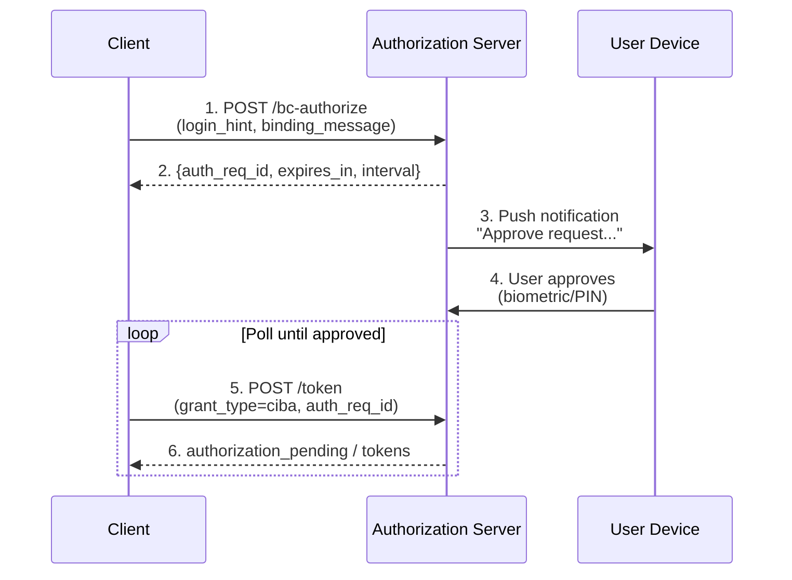

# CIBA (Client Initiated Backchannel Authentication)

## Overview

**OpenID Connect CIBA Flow Core 1.0** - Client Initiated Backchannel Authentication

Authrim implements CIBA, an authentication flow where the client initiates authentication for a user without the user being present at the client device. The authentication happens on a separate device (e.g., mobile phone) via a backchannel.

### Specification

| Attribute | Value |
|-----------|-------|
| **Spec** | [OpenID Connect CIBA 1.0](https://openid.net/specs/openid-client-initiated-backchannel-authentication-core-1_0.html) |
| **Status** | ✅ Implemented |
| **Endpoint** | `POST /bc-authorize` |
| **Delivery Modes** | Poll, Ping, Push |

---

## Benefits

### Security Advantages

1. **🔐 Decoupled Authentication**
   - User authenticates on their own trusted device
   - No credentials entered on potentially compromised terminals
   - Reduces phishing and keylogging risks

2. **📱 Mobile-First Security**
   - Leverages mobile device's biometrics and secure enclave
   - Push notifications to user's registered device
   - Out-of-band verification channel

3. **✅ Transaction Binding**
   - Binding message shows exact transaction details
   - User sees what they're approving on their device
   - Prevents blind authorization

---

## Practical Use Cases

### Use Case 1: High-Value Wire Transfer Approval

**Scenario**: A corporate treasurer uses the bank's web portal to initiate a $500,000 wire transfer. The bank requires step-up authentication for high-value transactions, but the treasurer is at a shared workstation where entering credentials is risky.

**Challenge**: The bank needs strong authentication without requiring the user to enter sensitive credentials on the web portal. Traditional MFA (SMS, TOTP) still requires user interaction on the potentially compromised device.

**CIBA Solution**:
```typescript
// Bank's web portal initiates CIBA request
const cibaRequest = await fetch('https://bank.authrim.com/bc-authorize', {
  method: 'POST',
  headers: { 'Content-Type': 'application/x-www-form-urlencoded' },
  body: new URLSearchParams({
    client_id: 'corporate_banking_portal',
    client_secret: clientSecret,
    scope: 'openid wire:approve',
    login_hint: 'treasurer@acmecorp.com',
    binding_message: 'Approve wire transfer: $500,000 to Vendor Corp (Ref: INV-2024-789)',
    acr_values: 'urn:bank:auth:biometric'
  })
});

const { auth_req_id, interval } = await cibaRequest.json();

// Treasurer receives push notification on mobile banking app:
// "Corporate Portal requests approval:
//  Approve wire transfer: $500,000 to Vendor Corp (Ref: INV-2024-789)
//  [Approve with Face ID] [Deny]"

// Portal polls for token
const tokens = await pollForTokens(auth_req_id, interval);
// Transaction proceeds with cryptographic proof of approval
```

**Result**: The treasurer approves the exact transaction on their secure mobile device using Face ID. The binding message ensures they see the precise amount and recipient. Even if the web portal is compromised, attackers cannot modify the approved transaction details.

---

### Use Case 2: Call Center Customer Verification

**Scenario**: A customer calls their insurance company to make a claim. The agent needs to verify the caller's identity before accessing sensitive policy information or processing the claim.

**Challenge**: Traditional verification (security questions, SMS codes) is cumbersome for phone calls. The customer may not have access to email, and reading SMS codes over the phone is error-prone and insecure.

**CIBA Solution**:
```python
# Call center agent system initiates verification
ciba_response = requests.post(
    'https://insurance.authrim.com/bc-authorize',
    data={
        'client_id': 'call_center_agent',
        'client_secret': agent_secret,
        'scope': 'openid policy:read claims:write',
        'login_hint': f'tel:{customer_phone}',  # Customer's registered phone
        'binding_message': f'Agent {agent_id} at Insurance Co requests access to your account',
        'user_code': 'VERIFY-8472'  # Agent tells customer this code
    }
)

auth_req_id = ciba_response.json()['auth_req_id']

# Agent tells customer: "You'll receive a notification on your phone.
# Please verify the code VERIFY-8472 and tap Approve."

# Customer receives push notification:
# "Agent JSmith at Insurance Co requests access to your account
#  Verification code: VERIFY-8472
#  [Approve] [Deny]"

# Agent's system waits for approval
tokens = poll_for_tokens(auth_req_id)
# Agent can now access customer's policy information
```

**Result**: The customer verifies their identity on their own device without speaking codes aloud. The verification code prevents social engineering (only the customer sees the notification). The binding message shows exactly which agent and company is requesting access.

---

### Use Case 3: Smart TV Streaming Service Login

**Scenario**: A family buys a new smart TV and wants to log into their streaming service. Typing email and password with a TV remote is frustrating and error-prone.

**Challenge**: TVs lack secure input methods. Typing long passwords with a remote control is poor UX. Device Flow exists but still requires entering a code on another device.

**CIBA Solution**:
```javascript
// Smart TV app initiates CIBA request
const cibaRequest = await fetch('https://streaming.authrim.com/bc-authorize', {
  method: 'POST',
  headers: { 'Content-Type': 'application/x-www-form-urlencoded' },
  body: new URLSearchParams({
    client_id: 'smart_tv_app',
    client_secret: tvAppSecret,
    scope: 'openid profile streaming:watch',
    login_hint: userEmailFromSetup,  // From initial TV setup
    binding_message: 'Sign in to StreamMax on Living Room TV'
  })
});

// TV displays: "Check your phone to approve sign-in to Living Room TV"

// User's phone receives notification:
// "StreamMax wants to sign in on your Living Room TV
//  [Approve] [Not Me]"

// User taps Approve with Face ID
const tokens = await pollForTokens(auth_req_id);
// TV immediately shows personalized content
```

**Result**: One-tap login on the user's phone. No codes to type, no QR codes to scan. The user clearly sees which device is requesting access. If the notification is unexpected, they can deny and investigate.

---

## How CIBA Works

### Flow Diagram



### Token Delivery Modes

| Mode | Description | Use Case |
|------|-------------|----------|
| **Poll** | Client polls token endpoint | Default, most compatible |
| **Ping** | Server notifies client, then client fetches tokens | Reduces polling overhead |
| **Push** | Server pushes tokens directly to client | Lowest latency, requires secure callback |

---

## API Reference

### Backchannel Authorization Endpoint

**POST /bc-authorize**

| Parameter | Required | Description |
|-----------|----------|-------------|
| `scope` | ✅ Yes | OAuth scopes (must include `openid`) |
| `client_id` | ✅ Yes | Client identifier |
| `client_secret` | ✅ Yes | Client secret |
| `login_hint` | One of | User identifier (email, phone, username) |
| `login_hint_token` | One of | JWT containing login hint |
| `id_token_hint` | One of | Previously issued ID token |
| `binding_message` | Recommended | Human-readable context (max 140 chars) |
| `user_code` | Optional | Additional verification code |
| `requested_expiry` | Optional | Request expiry in seconds |
| `acr_values` | Optional | Authentication context requirements |

**Success Response** (200 OK):
```json
{
  "auth_req_id": "1c266114-a1be-4252-8ad1-04986c5b9ac1",
  "expires_in": 300,
  "interval": 5
}
```

**Error Responses**:

| Error | Description |
|-------|-------------|
| `invalid_request` | Missing required parameter |
| `unauthorized_client` | Client not registered for CIBA |
| `unknown_user_id` | User not found for given login hint |

---

### Token Endpoint with CIBA

**POST /token**

```http
POST /token HTTP/1.1
Host: your-tenant.authrim.com
Content-Type: application/x-www-form-urlencoded

grant_type=urn:openid:params:grant-type:ciba
&client_id=my_client
&client_secret=my_secret
&auth_req_id=1c266114-a1be-4252-8ad1-04986c5b9ac1
```

**Response States**:

| State | HTTP | Response |
|-------|------|----------|
| Pending | 400 | `{"error": "authorization_pending"}` |
| Too fast | 400 | `{"error": "slow_down"}` |
| Denied | 400 | `{"error": "access_denied"}` |
| Expired | 400 | `{"error": "expired_token"}` |
| Success | 200 | `{"access_token": "...", "id_token": "..."}` |

---

## Usage Examples

### JavaScript/TypeScript

```typescript
async function authenticateViaCIBA(userEmail: string, transactionDetails: string) {
  // Step 1: Initiate CIBA request
  const cibaResponse = await fetch('https://your-tenant.authrim.com/bc-authorize', {
    method: 'POST',
    headers: { 'Content-Type': 'application/x-www-form-urlencoded' },
    body: new URLSearchParams({
      scope: 'openid profile',
      client_id: CLIENT_ID,
      client_secret: CLIENT_SECRET,
      login_hint: userEmail,
      binding_message: transactionDetails
    })
  });

  const { auth_req_id, interval, expires_in } = await cibaResponse.json();

  // Step 2: Poll for tokens
  const deadline = Date.now() + (expires_in * 1000);

  while (Date.now() < deadline) {
    await sleep(interval * 1000);

    const tokenResponse = await fetch('https://your-tenant.authrim.com/token', {
      method: 'POST',
      headers: { 'Content-Type': 'application/x-www-form-urlencoded' },
      body: new URLSearchParams({
        grant_type: 'urn:openid:params:grant-type:ciba',
        client_id: CLIENT_ID,
        client_secret: CLIENT_SECRET,
        auth_req_id
      })
    });

    if (tokenResponse.ok) {
      return await tokenResponse.json();
    }

    const error = await tokenResponse.json();
    if (error.error === 'access_denied') {
      throw new Error('User denied the request');
    }
    if (error.error !== 'authorization_pending') {
      throw new Error(error.error_description);
    }
  }

  throw new Error('Request expired');
}
```

---

### Python

```python
import time
import requests

def authenticate_via_ciba(user_email: str, binding_message: str):
    # Step 1: Initiate CIBA request
    ciba_response = requests.post(
        'https://your-tenant.authrim.com/bc-authorize',
        data={
            'scope': 'openid profile',
            'client_id': CLIENT_ID,
            'client_secret': CLIENT_SECRET,
            'login_hint': user_email,
            'binding_message': binding_message
        }
    )
    ciba_data = ciba_response.json()
    auth_req_id = ciba_data['auth_req_id']
    interval = ciba_data['interval']
    expires_in = ciba_data['expires_in']

    # Step 2: Poll for tokens
    deadline = time.time() + expires_in

    while time.time() < deadline:
        time.sleep(interval)

        token_response = requests.post(
            'https://your-tenant.authrim.com/token',
            data={
                'grant_type': 'urn:openid:params:grant-type:ciba',
                'client_id': CLIENT_ID,
                'client_secret': CLIENT_SECRET,
                'auth_req_id': auth_req_id
            }
        )

        if token_response.status_code == 200:
            return token_response.json()

        error = token_response.json()
        if error.get('error') == 'access_denied':
            raise Exception('User denied the request')
        if error.get('error') != 'authorization_pending':
            raise Exception(error.get('error_description'))

    raise Exception('Request expired')
```

---

## Security Considerations

### Binding Message Security

| Risk | Mitigation |
|------|------------|
| Phishing via fake messages | Display raw text only, no HTML |
| UI overflow attacks | Limit to 140 characters |
| Misleading content | Clearly label as "Requested action" |

### Login Hint Validation

- Validate format (email, phone E.164, etc.)
- Verify user exists before sending notification
- Rate limit per login hint to prevent spam

### Replay Protection

- `auth_req_id` is single-use and cryptographically random
- Requests expire after configured timeout (default 5 minutes)
- Token issuance is atomic

---

## Configuration

### Client Registration

```json
{
  "client_name": "My CIBA App",
  "grant_types": ["urn:openid:params:grant-type:ciba"],
  "backchannel_token_delivery_mode": "poll",
  "backchannel_client_notification_endpoint": "https://app.example.com/ciba/notify",
  "backchannel_user_code_parameter": true
}
```

### Discovery Metadata

```json
{
  "backchannel_authentication_endpoint": "https://your-tenant.authrim.com/bc-authorize",
  "backchannel_token_delivery_modes_supported": ["poll", "ping", "push"],
  "backchannel_user_code_parameter_supported": true,
  "grant_types_supported": ["urn:openid:params:grant-type:ciba"]
}
```

---

## Testing

### Test Scenarios

| Scenario | Expected Result |
|----------|-----------------|
| Valid CIBA request | 200 with auth_req_id |
| Unknown login_hint | 400 unknown_user_id |
| Polling before approval | 400 authorization_pending |
| Polling too fast | 400 slow_down |
| User denies request | 400 access_denied |
| Request expires | 400 expired_token |
| User approves | 200 with tokens |

### Running Tests

```bash
pnpm --filter @authrim/op-async run test
pnpm --filter @authrim/op-token run test
```

---

## Troubleshooting

### "authorization_pending" keeps returning

**Cause**: User hasn't approved the request yet.
**Solution**: Show UI indicating waiting for user, ensure notification was delivered.

### "slow_down" error

**Cause**: Polling faster than the `interval` value.
**Solution**: Respect the interval returned in CIBA response.

### "unknown_user_id"

**Cause**: Login hint doesn't match any registered user.
**Solution**: Verify user exists and login_hint format is correct.

### "expired_token"

**Cause**: User didn't respond within the expiry period.
**Solution**: Initiate a new CIBA request.

---

## References

- [OpenID Connect CIBA Flow Core 1.0](https://openid.net/specs/openid-client-initiated-backchannel-authentication-core-1_0.html)
- [FAPI CIBA Profile](https://openid.net/specs/openid-financial-api-ciba-ID1.html)
- [RFC 8628 - Device Authorization Grant](https://datatracker.ietf.org/doc/html/rfc8628)

---

**Last Updated**: 2025-12-20
**Status**: ✅ Implemented
**Implementation**: `packages/op-async/src/ciba.ts`, `packages/op-token/src/token.ts`
