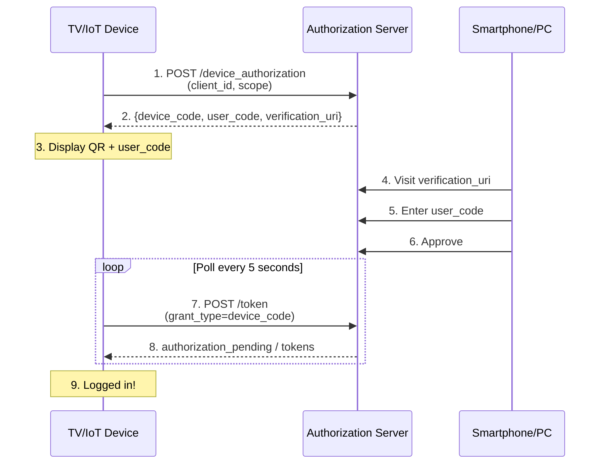

# Device Flow (OAuth 2.0 Device Authorization Grant)

## Overview

**RFC 8628** - OAuth 2.0 Device Authorization Grant

Authrim implements Device Flow, an OAuth 2.0 extension designed for input-constrained devices (smart TVs, IoT devices, CLI tools) that lack a web browser or have limited input capabilities. Users authenticate on a separate device using a simple verification code or QR code.

### Specification

| Attribute     | Value                                                                                  |
| ------------- | -------------------------------------------------------------------------------------- |
| **RFC**       | [RFC 8628 - Device Authorization Grant](https://datatracker.ietf.org/doc/html/rfc8628) |
| **Status**    | ✅ Implemented                                                                         |
| **Endpoints** | `/device_authorization`, `/device`, `/token`                                           |

---

## Benefits

### Security Advantages

1. **📺 Input-Constrained Device Support**
   - No embedded browser required on the device
   - Simple 8-character verification code (e.g., `WDJB-MJHT`)
   - QR code support for instant scanning

2. **🔐 Secure Authentication**
   - User authenticates on their trusted device (smartphone/PC)
   - One-time use device codes prevent replay attacks
   - Automatic code expiration (10 minutes default)
   - Rate limiting with `slow_down` error handling

3. **👤 Excellent User Experience**
   - No complex URL typing on TV remotes
   - Authenticate using familiar device
   - Multi-language UI support

---

## Practical Use Cases

### Use Case 1: Smart TV Streaming App Login

**Scenario**: A family purchases a new smart TV and wants to watch their streaming service. Typing email and password with a TV remote is frustrating and error-prone.

**Challenge**: TV remotes have limited input capabilities. Entering complex passwords character-by-character is poor UX and leads to abandoned logins.

**Device Flow Solution**:

```typescript
// Smart TV app initiates device flow
const response = await fetch('https://streaming.authrim.com/device_authorization', {
  method: 'POST',
  headers: { 'Content-Type': 'application/x-www-form-urlencoded' },
  body: new URLSearchParams({
    client_id: 'smart_tv_app',
    scope: 'openid profile streaming:watch',
  }),
});

const { device_code, user_code, verification_uri_complete, interval } = await response.json();

// TV displays:
// ┌─────────────────────────────────────────────┐
// │        To sign in, scan this QR code        │
// │               [QR CODE IMAGE]               │
// │        or visit: streaming.tv/device        │
// │        and enter code: WDJB-MJHT           │
// └─────────────────────────────────────────────┘

// User scans QR with phone, approves login
// TV polls until approved, then user is logged in
```

**Result**: User scans QR code with their phone, taps "Approve", and the TV immediately shows their personalized content. No typing required.

---

### Use Case 2: Developer CLI Tool Authentication

**Scenario**: A developer needs to authenticate a CLI tool (like AWS CLI or GitHub CLI) to access cloud resources. The tool needs access to APIs but shouldn't store user passwords.

**Challenge**: CLI tools run in terminals without browsers. Storing credentials in config files is insecure. OAuth typically requires a browser redirect, which CLI tools can't handle easily.

**Device Flow Solution**:

```bash
$ mycloud-cli login

🔐 Device Login
━━━━━━━━━━━━━━━━━━━━━━━━━━━━━━━━━━━━━━━

Visit: https://auth.mycloud.com/device

Enter code: WDJB-MJHT

  ┌─────────────────┐
  │ ████████████    │  (Or scan QR code)
  │ ██  ██  ██  ██  │
  │ ████████████    │
  └─────────────────┘

⏳ Waiting for authorization...

✅ Login successful!
   Logged in as: developer@company.com
   Token saved to: ~/.mycloud/credentials
```

**Implementation**:

```python
import qrcode

def cli_login():
    # Request device code
    response = requests.post(f'{AUTH_URL}/device_authorization', data={
        'client_id': 'mycloud-cli',
        'scope': 'openid profile cloud:admin'
    })
    data = response.json()

    # Display QR code in terminal
    qr = qrcode.QRCode(version=1, box_size=1, border=1)
    qr.add_data(data['verification_uri_complete'])
    qr.print_ascii()

    print(f"Code: {data['user_code']}")

    # Poll for completion
    while True:
        time.sleep(data['interval'])
        token_response = poll_for_token(data['device_code'])
        if token_response.get('access_token'):
            save_credentials(token_response)
            print("✅ Login successful!")
            return
```

**Result**: Developer runs one command, scans QR or enters code on their phone, and the CLI is authenticated. Credentials are stored securely and can be revoked centrally.

---

### Use Case 3: IoT Device Initial Setup

**Scenario**: A smart home security camera needs to connect to the user's cloud account during initial setup. The camera has no screen or input method.

**Challenge**: IoT devices often lack displays and input capabilities entirely. Users need to link devices to their accounts securely without typing on the device.

**Device Flow Solution**:

```javascript
// Camera firmware initiates device flow
const deviceAuth = await fetch('https://smarthome.authrim.com/device_authorization', {
  method: 'POST',
  body: new URLSearchParams({
    client_id: 'security_camera_v2',
    scope: 'device:register camera:upload',
  }),
});

const { device_code, user_code, interval } = await deviceAuth.json();

// Camera blinks LED pattern representing the code
// Or displays code on companion mobile app via Bluetooth
blinkUserCode(user_code); // e.g., "W-D-J-B" in LED blinks

// User enters code in mobile app or website
// Camera polls until authorized
const tokens = await pollForAuthorization(device_code, interval);

// Camera is now linked to user's account
await registerDevice(tokens.access_token);
```

**Mobile App Flow**:

```
┌─────────────────────────────────────────────┐
│ Add New Device                               │
│                                              │
│ Enter the code shown on your camera:        │
│                                              │
│  ┌─────────────────────────────────────┐    │
│  │  W  D  J  B  -  M  J  H  T         │    │
│  └─────────────────────────────────────┘    │
│                                              │
│     [Link Camera]    [Cancel]               │
└─────────────────────────────────────────────┘
```

**Result**: User sets up IoT device by entering a short code in the mobile app. No WiFi password entry on the device, no complex pairing protocols.

---

## How Device Flow Works

### Flow Diagram



---

## API Reference

### Device Authorization Endpoint

**POST /device_authorization**

| Parameter   | Required | Description       |
| ----------- | -------- | ----------------- |
| `client_id` | ✅ Yes   | Client identifier |
| `scope`     | ✅ Yes   | Requested scopes  |

**Success Response** (200 OK):

```json
{
  "device_code": "4c9a8e6f-b2d1-4a7c-9e3f-1d2b4a7c9e3f",
  "user_code": "WDJB-MJHT",
  "verification_uri": "https://your-tenant.authrim.com/device",
  "verification_uri_complete": "https://your-tenant.authrim.com/device?user_code=WDJB-MJHT",
  "expires_in": 600,
  "interval": 5
}
```

---

### Token Endpoint (Device Code Grant)

**POST /token**

```http
POST /token HTTP/1.1
Content-Type: application/x-www-form-urlencoded

grant_type=urn:ietf:params:oauth:grant-type:device_code
&device_code=4c9a8e6f-b2d1-4a7c-9e3f-1d2b4a7c9e3f
&client_id=tv_app_123
```

**Response States**:

| State    | Error                   | Action                  |
| -------- | ----------------------- | ----------------------- |
| Pending  | `authorization_pending` | Keep polling            |
| Too fast | `slow_down`             | Increase interval by 5s |
| Denied   | `access_denied`         | Stop, show error        |
| Expired  | `expired_token`         | Start over              |
| Success  | -                       | Tokens returned         |

---

## Usage Examples

### JavaScript/TypeScript

```typescript
async function deviceLogin(clientId: string, scope: string) {
  // Step 1: Get device code
  const authResponse = await fetch('/device_authorization', {
    method: 'POST',
    headers: { 'Content-Type': 'application/x-www-form-urlencoded' },
    body: new URLSearchParams({ client_id: clientId, scope }),
  });

  const { device_code, user_code, verification_uri_complete, interval, expires_in } =
    await authResponse.json();

  console.log(`Visit: ${verification_uri_complete}`);
  console.log(`Code: ${user_code}`);

  // Step 2: Poll for authorization
  const deadline = Date.now() + expires_in * 1000;
  let pollInterval = interval * 1000;

  while (Date.now() < deadline) {
    await new Promise((r) => setTimeout(r, pollInterval));

    const tokenResponse = await fetch('/token', {
      method: 'POST',
      headers: { 'Content-Type': 'application/x-www-form-urlencoded' },
      body: new URLSearchParams({
        grant_type: 'urn:ietf:params:oauth:grant-type:device_code',
        device_code,
        client_id: clientId,
      }),
    });

    if (tokenResponse.ok) {
      return await tokenResponse.json();
    }

    const error = await tokenResponse.json();
    if (error.error === 'slow_down') {
      pollInterval += 5000;
    } else if (error.error !== 'authorization_pending') {
      throw new Error(error.error_description);
    }
  }

  throw new Error('Device code expired');
}
```

---

## Security Considerations

### Device Code Security

| Requirement   | Implementation               |
| ------------- | ---------------------------- |
| Entropy       | UUID v4 (122 bits)           |
| Expiration    | 10 minutes default           |
| Single-use    | Deleted after token issuance |
| Rate limiting | 5-second polling interval    |

### User Code Design

- Characters: `23456789ABCDEFGHJKMNPQRSTUVWXYZ`
- Excludes ambiguous: `0, O, 1, I, L`
- Format: `XXXX-XXXX` for readability
- Case-insensitive validation

---

## Configuration

### Discovery Metadata

```json
{
  "device_authorization_endpoint": "https://your-tenant.authrim.com/device_authorization"
}
```

### Settings

| Setting              | Default | Description                        |
| -------------------- | ------- | ---------------------------------- |
| `device_code_expiry` | `600`   | Device code lifetime (10 min)      |
| `polling_interval`   | `5`     | Minimum polling interval (seconds) |

---

## Testing

### Test Scenarios

| Scenario                  | Expected Result                 |
| ------------------------- | ------------------------------- |
| Valid device auth request | 200 with device_code, user_code |
| Poll before user approval | 400 authorization_pending       |
| Poll too fast             | 400 slow_down                   |
| User approves             | 200 with tokens                 |
| User denies               | 400 access_denied               |
| Code expires              | 400 expired_token               |

### Running Tests

```bash
pnpm --filter @authrim/op-async run test
pnpm --filter @authrim/op-token run test
```

---

## Troubleshooting

### "authorization_pending" keeps returning

**Cause**: User hasn't completed authorization yet.
**Solution**: Show UI indicating waiting, verify user received the code.

### "slow_down" error

**Cause**: Polling faster than interval.
**Solution**: Increase polling interval by 5 seconds each time.

### "expired_token" error

**Cause**: User didn't authorize within 10 minutes.
**Solution**: Start a new device flow.

---

## References

- [RFC 8628 - Device Authorization Grant](https://datatracker.ietf.org/doc/html/rfc8628)
- [OAuth 2.0 for Native Apps (RFC 8252)](https://datatracker.ietf.org/doc/html/rfc8252)
- [OpenID Connect Core 1.0](https://openid.net/specs/openid-connect-core-1_0.html)

---

**Last Updated**: 2025-12-20
**Status**: ✅ Implemented
**Implementation**: `packages/op-async/src/device-authorization.ts`, `packages/op-token/src/token.ts`
