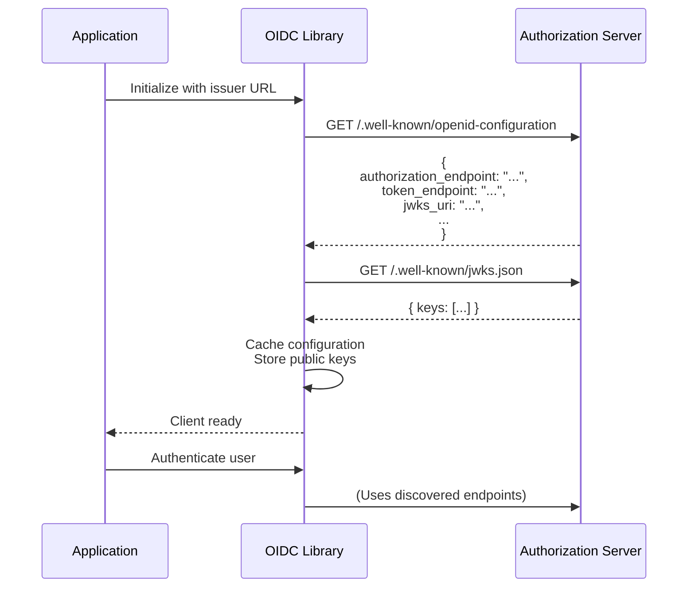
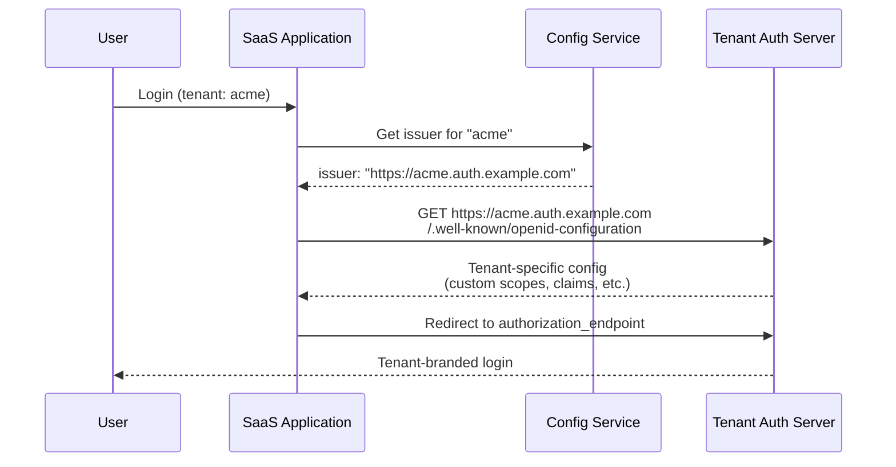
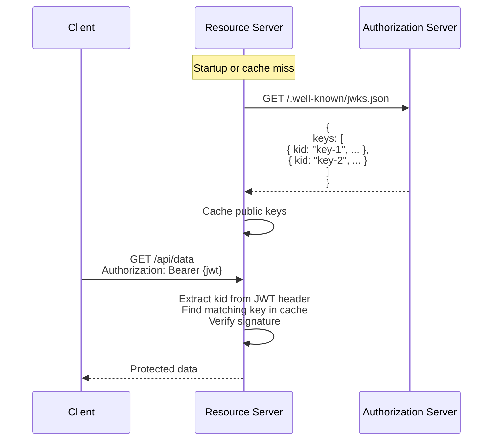

# OpenID Connect Discovery

Auto-configure OIDC clients with standardized metadata discovery.

## Overview

| Specification | Status | Endpoints |
|---------------|--------|-----------|
| [OIDC Discovery 1.0](https://openid.net/specs/openid-connect-discovery-1_0.html) | ✅ Implemented | `/.well-known/openid-configuration` |
| [JWK (RFC 7517)](https://datatracker.ietf.org/doc/html/rfc7517) | ✅ Implemented | `/.well-known/jwks.json` |

OpenID Connect Discovery allows clients to automatically discover authorization server capabilities, endpoints, and signing keys without manual configuration.

---

## Benefits

| Benefit | Description |
|---------|-------------|
| **Zero Configuration** | Clients auto-discover all endpoints |
| **Dynamic Updates** | Configuration changes propagate automatically |
| **Key Rotation** | JWKS enables seamless key rotation |
| **Interoperability** | Standard format works with any OIDC library |
| **Reduced Errors** | No manual endpoint configuration mistakes |

---

## Practical Use Cases

### Use Case 1: Library Auto-Configuration

**Scenario**: A development team integrates authentication using a standard OIDC library (e.g., `openid-client` for Node.js, `oidc-client-ts` for JavaScript). The library should auto-configure from the discovery document.

**Why Discovery**: Manually configuring 10+ endpoints is error-prone. Discovery provides a single URL that returns all configuration.



**Implementation**:

```typescript
// Node.js with openid-client library
import { Issuer } from 'openid-client';

async function initializeOIDC() {
  // Single URL - all endpoints discovered automatically
  const issuer = await Issuer.discover('https://auth.example.com');

  console.log('Discovered issuer:', issuer.issuer);
  console.log('Authorization endpoint:', issuer.authorization_endpoint);
  console.log('Token endpoint:', issuer.token_endpoint);
  console.log('UserInfo endpoint:', issuer.userinfo_endpoint);

  // Create client with discovered configuration
  const client = new issuer.Client({
    client_id: 'my-app',
    client_secret: 'secret',
    redirect_uris: ['https://app.example.com/callback'],
    response_types: ['code']
  });

  return client;
}

// React/Browser with oidc-client-ts
import { UserManager } from 'oidc-client-ts';

const userManager = new UserManager({
  authority: 'https://auth.example.com',  // Discovery URL
  client_id: 'spa-client',
  redirect_uri: 'https://app.example.com/callback',
  scope: 'openid profile email'
  // All other endpoints auto-discovered!
});
```

---

### Use Case 2: Multi-Tenant SaaS with Dynamic Issuers

**Scenario**: A multi-tenant SaaS platform where each tenant has their own subdomain issuer (e.g., `tenant1.auth.example.com`). Clients need to dynamically discover the correct configuration per tenant.

**Why Discovery**: Each tenant may have different configurations (supported scopes, claims, etc.). Discovery provides tenant-specific metadata.



**Implementation**:

```typescript
// Dynamic tenant discovery
async function getTenantOIDCClient(tenantId: string) {
  // Determine issuer from tenant
  const issuerUrl = `https://${tenantId}.auth.example.com`;

  // Discover tenant-specific configuration
  const discoveryUrl = `${issuerUrl}/.well-known/openid-configuration`;
  const config = await fetch(discoveryUrl).then(r => r.json());

  // Validate tenant has required capabilities
  if (!config.scopes_supported?.includes('openid')) {
    throw new Error('Tenant does not support OIDC');
  }

  // Check for required features
  const requirements = {
    pkce: config.code_challenge_methods_supported?.includes('S256'),
    refreshTokens: config.grant_types_supported?.includes('refresh_token'),
    claims: config.claims_parameter_supported
  };

  console.log(`Tenant ${tenantId} capabilities:`, requirements);

  return {
    config,
    issuer: issuerUrl,
    authorizationEndpoint: config.authorization_endpoint,
    tokenEndpoint: config.token_endpoint
  };
}

// Cache discovery results per tenant
const discoveryCache = new Map<string, { config: any; expiresAt: number }>();

async function getCachedDiscovery(tenantId: string) {
  const cached = discoveryCache.get(tenantId);

  if (cached && cached.expiresAt > Date.now()) {
    return cached.config;
  }

  const config = await getTenantOIDCClient(tenantId);

  discoveryCache.set(tenantId, {
    config,
    expiresAt: Date.now() + 3600000 // Cache for 1 hour
  });

  return config;
}
```

---

### Use Case 3: Token Validation with JWKS

**Scenario**: A resource server (API) needs to validate JWT access tokens from Authrim. It fetches public keys from the JWKS endpoint to verify token signatures.

**Why JWKS**: The authorization server can rotate signing keys without notifying all clients. Clients fetch current keys from JWKS.



**Implementation**:

```typescript
// Resource server JWT validation with JWKS
import jwt from 'jsonwebtoken';
import jwksClient from 'jwks-rsa';

// Initialize JWKS client with caching
const client = jwksClient({
  jwksUri: 'https://auth.example.com/.well-known/jwks.json',
  cache: true,
  cacheMaxAge: 600000, // 10 minutes
  rateLimit: true,
  jwksRequestsPerMinute: 10
});

// Get signing key by kid
function getKey(header: jwt.JwtHeader, callback: jwt.SigningKeyCallback) {
  client.getSigningKey(header.kid, (err, key) => {
    if (err) {
      callback(err);
      return;
    }
    const signingKey = key?.getPublicKey();
    callback(null, signingKey);
  });
}

// Middleware to validate JWT
async function validateJWT(req: Request, res: Response, next: NextFunction) {
  const authHeader = req.headers.authorization;

  if (!authHeader?.startsWith('Bearer ')) {
    return res.status(401).json({ error: 'Missing token' });
  }

  const token = authHeader.substring(7);

  jwt.verify(token, getKey, {
    issuer: 'https://auth.example.com',
    audience: 'https://api.example.com',
    algorithms: ['RS256']
  }, (err, decoded) => {
    if (err) {
      return res.status(401).json({ error: 'Invalid token' });
    }

    req.user = decoded;
    next();
  });
}

// Handle key rotation gracefully
async function handleKeyRotation() {
  // Clear cache when receiving tokens with unknown kid
  client.getSigningKeys((err, keys) => {
    if (err) {
      console.error('Failed to refresh JWKS:', err);
      return;
    }
    console.log(`Loaded ${keys?.length} signing keys`);
  });
}
```

---

## Discovery Document Structure

### Full Example

```json
{
  "issuer": "https://auth.example.com",
  "authorization_endpoint": "https://auth.example.com/authorize",
  "token_endpoint": "https://auth.example.com/token",
  "userinfo_endpoint": "https://auth.example.com/userinfo",
  "jwks_uri": "https://auth.example.com/.well-known/jwks.json",
  "registration_endpoint": "https://auth.example.com/register",
  "revocation_endpoint": "https://auth.example.com/revoke",
  "introspection_endpoint": "https://auth.example.com/introspect",
  "end_session_endpoint": "https://auth.example.com/logout",
  "pushed_authorization_request_endpoint": "https://auth.example.com/as/par",
  "device_authorization_endpoint": "https://auth.example.com/device_authorization",
  "backchannel_authentication_endpoint": "https://auth.example.com/bc-authorize",

  "scopes_supported": ["openid", "profile", "email", "address", "phone", "offline_access"],
  "response_types_supported": ["code", "id_token", "id_token token", "code id_token", "code token", "code id_token token"],
  "response_modes_supported": ["query", "fragment", "form_post", "jwt", "query.jwt", "fragment.jwt", "form_post.jwt"],
  "grant_types_supported": ["authorization_code", "implicit", "refresh_token", "client_credentials", "urn:ietf:params:oauth:grant-type:device_code", "urn:ietf:params:oauth:grant-type:jwt-bearer", "urn:openid:params:grant-type:ciba"],
  "subject_types_supported": ["public", "pairwise"],
  "id_token_signing_alg_values_supported": ["RS256"],
  "token_endpoint_auth_methods_supported": ["client_secret_basic", "client_secret_post", "client_secret_jwt", "private_key_jwt"],
  "claims_supported": ["sub", "iss", "aud", "exp", "iat", "auth_time", "nonce", "acr", "name", "email", "email_verified"],
  "code_challenge_methods_supported": ["S256"],
  "claims_parameter_supported": true,
  "request_parameter_supported": true,
  "request_uri_parameter_supported": true,
  "dpop_signing_alg_values_supported": ["RS256", "ES256"],
  "backchannel_token_delivery_modes_supported": ["poll", "ping"],
  "backchannel_user_code_parameter_supported": true
}
```

---

## JWKS Structure

### Example JWKS

```json
{
  "keys": [
    {
      "kty": "RSA",
      "use": "sig",
      "kid": "key-2024-01",
      "alg": "RS256",
      "n": "0vx7agoebGcQSuuPiLJXZptN9nndrQmbXEps2aiAFbWhM78LhWx4cbbfAAtVT86zwu1RK7aPFFxuhDR1L6tSoc_BJECPebWKRXjBZCiFV4n3oknjhMstn64tZ_2W-5JsGY4Hc5n9yBXArwl93lqt7_RN5w6Cf0h4QyQ5v-65YGjQR0_FDW2QvzqY368QQMicAtaSqzs8KJZgnYb9c7d0zgdAZHzu6qMQvRL5hajrn1n91CbOpbISD08qNLyrdkt-bFTWhAI4vMQFh6WeZu0fM4lFd2NcRwr3XPksINHaQ-G_xBniIqbw0Ls1jF44-csFCur-kEgU8awapJzKnqDKgw",
      "e": "AQAB"
    },
    {
      "kty": "RSA",
      "use": "sig",
      "kid": "key-2024-02",
      "alg": "RS256",
      "n": "...",
      "e": "AQAB"
    }
  ]
}
```

### Key Fields

| Field | Description |
|-------|-------------|
| `kty` | Key type (RSA, EC) |
| `use` | Key usage (`sig` for signing) |
| `kid` | Key ID (referenced in JWT header) |
| `alg` | Algorithm (RS256, ES256) |
| `n`, `e` | RSA modulus and exponent |

---

## API Reference

### Discovery Endpoint

```http
GET /.well-known/openid-configuration
Host: auth.example.com
```

**Response**: JSON object with server metadata

### JWKS Endpoint

```http
GET /.well-known/jwks.json
Host: auth.example.com
```

**Response**: JSON Web Key Set

---

## Caching Recommendations

| Resource | Cache Duration | Notes |
|----------|---------------|-------|
| Discovery | 1-24 hours | Rarely changes |
| JWKS | 10-60 minutes | Keys may rotate |
| Individual keys | Until unknown kid | Refresh on miss |

---

## Security Considerations

| Consideration | Implementation |
|---------------|----------------|
| **HTTPS Required** | All discovery URLs must use TLS |
| **Issuer Validation** | Verify `issuer` matches expected |
| **JWKS Pinning** | Consider key pinning for high-security |
| **Rate Limiting** | Don't fetch JWKS on every request |

---

## Implementation Files

| Component | File | Description |
|-----------|------|-------------|
| Discovery | `packages/op-discovery/src/discovery.ts` | Metadata generation |
| JWKS | `packages/op-discovery/src/jwks.ts` | Key set endpoint |
| Key Manager | `packages/shared/src/durable-objects/KeyManager.ts` | Key storage |

---

## References

- [OpenID Connect Discovery 1.0](https://openid.net/specs/openid-connect-discovery-1_0.html)
- [JSON Web Key (RFC 7517)](https://datatracker.ietf.org/doc/html/rfc7517)
- [OAuth 2.0 Authorization Server Metadata (RFC 8414)](https://datatracker.ietf.org/doc/html/rfc8414)

---

**Last Updated**: 2025-12-20
**Status**: ✅ Fully Implemented
**Implementation**: `packages/op-discovery/src/`
