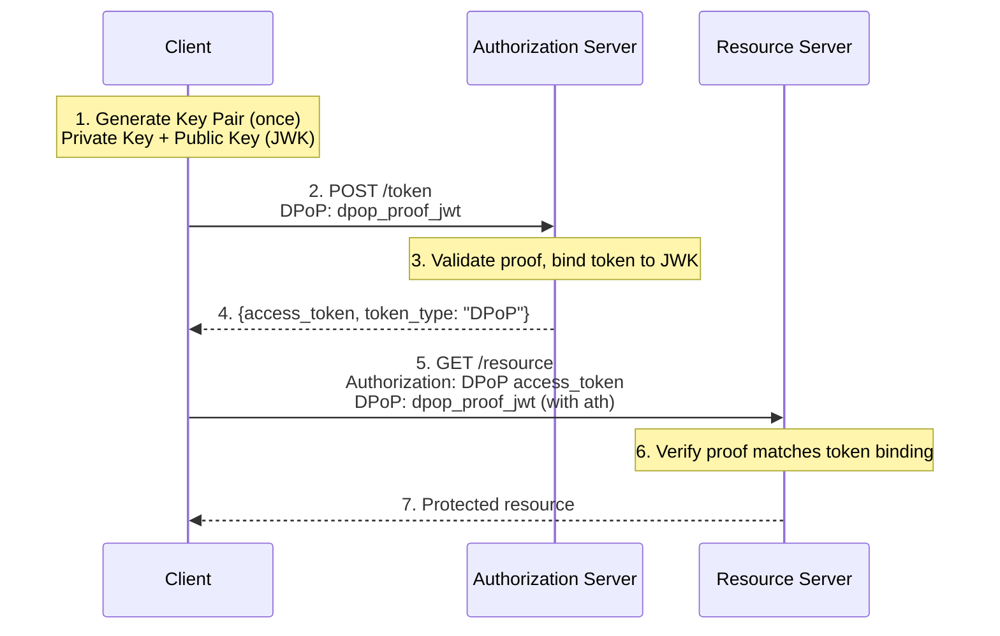

# DPoP (Demonstrating Proof of Possession)

## Overview

**RFC 9449** - OAuth 2.0 Demonstrating Proof of Possession

Authrim implements DPoP, a modern OAuth 2.0 security extension that binds access tokens to a specific client's cryptographic key, preventing token theft and replay attacks even if tokens are intercepted.

### Specification

| Attribute     | Value                                                            |
| ------------- | ---------------------------------------------------------------- |
| **RFC**       | [RFC 9449 - DPoP](https://datatracker.ietf.org/doc/html/rfc9449) |
| **Status**    | ✅ Implemented                                                   |
| **Endpoints** | `/token`, `/userinfo`, `/introspect`                             |

---

## Benefits

### Security Advantages

1. **🔐 Token Theft Protection**
   - Access tokens are cryptographically bound to client's key pair
   - Stolen tokens cannot be used by attackers (no private key)
   - Eliminates bearer token vulnerabilities

2. **🛡️ Replay Attack Prevention**
   - Each request requires fresh DPoP proof (60-second window)
   - Unique `jti` (JWT ID) enforced per proof
   - Automatic replay detection via nonce tracking

3. **🚀 OAuth 2.1 Ready**
   - DPoP is part of OAuth 2.1 draft
   - Recommended by OAuth working group
   - Future-proof security standard

---

## Practical Use Cases

### Use Case 1: Open Banking API Security

**Scenario**: A fintech company builds an app that connects to multiple banks via Open Banking APIs. The app initiates payments, views balances, and manages standing orders on behalf of customers.

**Challenge**: Open Banking APIs handle sensitive financial data and transactions. If an access token is stolen (via network interception, logging, or memory dumps), attackers could initiate unauthorized transactions.

**DPoP Solution**:

```typescript
// Fintech app generates a key pair per device
const keyPair = await crypto.subtle.generateKey({ name: 'ECDSA', namedCurve: 'P-256' }, true, [
  'sign',
  'verify',
]);

// Each API call includes a fresh DPoP proof
async function initiatePayment(accessToken: string, payment: PaymentDetails) {
  const dpopProof = await createDPoPProof({
    privateKey: keyPair.privateKey,
    publicKeyJwk: await exportJWK(keyPair.publicKey),
    method: 'POST',
    url: 'https://bank-api.authrim.com/payments',
    accessToken, // ath claim binds proof to specific token
  });

  return fetch('https://bank-api.authrim.com/payments', {
    method: 'POST',
    headers: {
      Authorization: `DPoP ${accessToken}`,
      DPoP: dpopProof,
    },
    body: JSON.stringify(payment),
  });
}
```

**Result**: Even if an attacker intercepts the access token from logs or network traffic, they cannot use it because:

- They don't have the private key to create valid DPoP proofs
- The `ath` claim in the proof is tied to that specific token
- The `jti` prevents replaying captured proofs

---

### Use Case 2: Enterprise Zero-Trust API Gateway

**Scenario**: A large enterprise adopts Zero Trust architecture. All internal APIs (HR, Finance, Engineering) require cryptographic proof that requests come from authorized applications, not just valid tokens.

**Challenge**: In Zero Trust, even internal network traffic is untrusted. Bearer tokens alone don't prove the request came from the original authorized client—they could be forwarded, stolen, or leaked.

**DPoP Solution**:

```python
class EnterpriseAPIClient:
    def __init__(self, service_name: str):
        # Each microservice has its own key pair stored in HSM
        self.private_key = hsm.get_signing_key(f"{service_name}-dpop")
        self.public_jwk = hsm.get_public_jwk(f"{service_name}-dpop")

    def call_api(self, method: str, url: str, access_token: str, body=None):
        # Create proof with hardware-backed key
        dpop_proof = self.create_dpop_proof(method, url, access_token)

        headers = {
            'Authorization': f'DPoP {access_token}',
            'DPoP': dpop_proof,
            'X-Service-Name': self.service_name
        }

        response = requests.request(method, url, headers=headers, json=body)
        return response

# API Gateway validation
def validate_request(request):
    dpop_proof = request.headers['DPoP']
    access_token = extract_dpop_token(request.headers['Authorization'])

    # Verify: token's cnf.jkt matches proof's jwk thumbprint
    token_jkt = decode_jwt(access_token)['cnf']['jkt']
    proof_jkt = calculate_jwk_thumbprint(dpop_proof.jwk)

    if token_jkt != proof_jkt:
        raise SecurityError("Token not bound to this client")
```

**Result**: Each microservice cryptographically proves it's the legitimate holder of the access token. Forwarded or proxied requests fail because the forwarding service cannot create valid proofs.

---

### Use Case 3: Healthcare Mobile App (HIPAA Compliance)

**Scenario**: A healthcare provider's mobile app allows patients to view lab results, schedule appointments, and message doctors. The app accesses Protected Health Information (PHI) via FHIR APIs.

**Challenge**: HIPAA requires safeguards to protect PHI. Mobile devices can be lost or compromised. If a token is extracted from a compromised device, the attacker shouldn't be able to access another patient's data from a different device.

**DPoP Solution**:

```swift
// iOS app stores DPoP key in Secure Enclave
class SecureAuthClient {
    private let keychain = Keychain(service: "com.healthcare.dpop")
    private var privateKey: SecKey?

    init() {
        // Key never leaves Secure Enclave
        self.privateKey = try! keychain.createSecureEnclaveKey(
            tag: "dpop-signing-key",
            accessControl: .biometryAny  // Require Face ID/Touch ID
        )
    }

    func fetchPatientRecords(accessToken: String) async throws -> [PatientRecord] {
        // Biometric auth required to use key
        let dpopProof = try await createDPoPProof(
            method: "GET",
            url: "https://fhir.hospital.org/Patient",
            accessToken: accessToken
        )

        let request = URLRequest(url: URL(string: "https://fhir.hospital.org/Patient")!)
        request.setValue("DPoP \(accessToken)", forHTTPHeaderField: "Authorization")
        request.setValue(dpopProof, forHTTPHeaderField: "DPoP")

        let (data, _) = try await URLSession.shared.data(for: request)
        return try JSONDecoder().decode([PatientRecord].self, from: data)
    }
}
```

**Result**:

- DPoP key is stored in hardware Secure Enclave, never exportable
- Biometric authentication required to use the key
- Even with a stolen token, attackers cannot use it on a different device
- Meets HIPAA technical safeguard requirements for access control

---

## How DPoP Works

### Flow Diagram



### Token Binding

DPoP-bound access tokens include a `cnf` (confirmation) claim:

```json
{
  "iss": "https://your-tenant.authrim.com",
  "sub": "user-123",
  "exp": 1699880143,
  "cnf": {
    "jkt": "0ZcOCORZNYy-DWpqq30jZyJGHTN0d2HglBV3uiguA4I"
  }
}
```

The `jkt` (JWK Thumbprint) cryptographically binds the token to the client's public key.

---

## API Reference

### DPoP Proof JWT Structure

**Header**:

```json
{
  "typ": "dpop+jwt",
  "alg": "ES256",
  "jwk": {
    "kty": "EC",
    "crv": "P-256",
    "x": "...",
    "y": "..."
  }
}
```

**Payload**:

```json
{
  "jti": "unique-identifier-123",
  "htm": "POST",
  "htu": "https://your-tenant.authrim.com/token",
  "iat": 1699876543,
  "ath": "fUHyO2r2Z3DZ53EsNrWBb0xWXoaNy59IiKCAqksmQEo"
}
```

| Claim | Required         | Description                                     |
| ----- | ---------------- | ----------------------------------------------- |
| `jti` | ✅ Yes           | Unique identifier (prevents replay attacks)     |
| `htm` | ✅ Yes           | HTTP method (uppercase)                         |
| `htu` | ✅ Yes           | HTTP URL (without query/fragment)               |
| `iat` | ✅ Yes           | Issued at timestamp (must be within 60 seconds) |
| `ath` | When using token | SHA-256 hash of access token (base64url)        |

---

### Token Endpoint

**POST /token**

```http
POST /token HTTP/1.1
Host: your-tenant.authrim.com
Content-Type: application/x-www-form-urlencoded
Authorization: Basic <base64(client_id:client_secret)>
DPoP: <dpop_proof_jwt>

grant_type=authorization_code&code=abc123&redirect_uri=...
```

**Success Response**:

```json
{
  "access_token": "eyJhbGciOiJSUzI1NiJ9...",
  "token_type": "DPoP",
  "expires_in": 3600
}
```

Note: `token_type` is `DPoP` instead of `Bearer`.

---

### Resource Endpoint (e.g., UserInfo)

```http
GET /userinfo HTTP/1.1
Host: your-tenant.authrim.com
Authorization: DPoP <access_token>
DPoP: <dpop_proof_jwt_with_ath>
```

Note: Authorization scheme is `DPoP` instead of `Bearer`.

---

## Usage Examples

### JavaScript/TypeScript

```typescript
import { SignJWT, exportJWK, calculateJwkThumbprint } from 'jose';

class DPoPClient {
  private keyPair!: CryptoKeyPair;
  private publicKeyJwk!: JsonWebKey;

  async initialize() {
    this.keyPair = await crypto.subtle.generateKey({ name: 'ECDSA', namedCurve: 'P-256' }, true, [
      'sign',
      'verify',
    ]);
    this.publicKeyJwk = await crypto.subtle.exportKey('jwk', this.keyPair.publicKey);
  }

  async createProof(method: string, url: string, accessToken?: string): Promise<string> {
    const claims: any = {
      jti: crypto.randomUUID(),
      htm: method.toUpperCase(),
      htu: new URL(url).origin + new URL(url).pathname,
      iat: Math.floor(Date.now() / 1000),
    };

    if (accessToken) {
      const hash = await crypto.subtle.digest('SHA-256', new TextEncoder().encode(accessToken));
      claims.ath = btoa(String.fromCharCode(...new Uint8Array(hash)))
        .replace(/\+/g, '-')
        .replace(/\//g, '_')
        .replace(/=/g, '');
    }

    return await new SignJWT(claims)
      .setProtectedHeader({
        typ: 'dpop+jwt',
        alg: 'ES256',
        jwk: this.publicKeyJwk,
      })
      .sign(this.keyPair.privateKey);
  }

  async getTokens(code: string, clientId: string, redirectUri: string) {
    const proof = await this.createProof('POST', 'https://your-tenant.authrim.com/token');

    const response = await fetch('https://your-tenant.authrim.com/token', {
      method: 'POST',
      headers: {
        'Content-Type': 'application/x-www-form-urlencoded',
        DPoP: proof,
      },
      body: new URLSearchParams({
        grant_type: 'authorization_code',
        code,
        client_id: clientId,
        redirect_uri: redirectUri,
      }),
    });

    return response.json(); // token_type: "DPoP"
  }

  async callAPI(url: string, accessToken: string) {
    const proof = await this.createProof('GET', url, accessToken);

    return fetch(url, {
      headers: {
        Authorization: `DPoP ${accessToken}`,
        DPoP: proof,
      },
    });
  }
}
```

---

### Python

```python
import time
import uuid
import hashlib
import base64
from jose import jwt
from cryptography.hazmat.primitives.asymmetric import ec
from cryptography.hazmat.backends import default_backend

class DPoPClient:
    def __init__(self):
        self.private_key = ec.generate_private_key(ec.SECP256R1(), default_backend())
        self.public_key = self.private_key.public_key()
        self.public_jwk = self._export_public_jwk()

    def create_proof(self, method: str, url: str, access_token: str = None) -> str:
        claims = {
            'jti': str(uuid.uuid4()),
            'htm': method.upper(),
            'htu': url.split('?')[0],  # Remove query string
            'iat': int(time.time())
        }

        if access_token:
            ath = hashlib.sha256(access_token.encode()).digest()
            claims['ath'] = base64.urlsafe_b64encode(ath).rstrip(b'=').decode()

        headers = {
            'typ': 'dpop+jwt',
            'alg': 'ES256',
            'jwk': self.public_jwk
        }

        return jwt.encode(claims, self.private_key, algorithm='ES256', headers=headers)

    def get_tokens(self, code: str, client_id: str, redirect_uri: str):
        proof = self.create_proof('POST', 'https://your-tenant.authrim.com/token')

        response = requests.post(
            'https://your-tenant.authrim.com/token',
            headers={'DPoP': proof},
            data={
                'grant_type': 'authorization_code',
                'code': code,
                'client_id': client_id,
                'redirect_uri': redirect_uri
            }
        )
        return response.json()
```

---

## Security Considerations

### Key Management

| Practice       | Recommendation                             |
| -------------- | ------------------------------------------ |
| Key Generation | Use RSA 2048+ or EC P-256+                 |
| Key Storage    | Secure enclave, HSM, or encrypted keychain |
| Key Rotation   | Rotate every 30-90 days                    |
| Private Key    | Never transmit or log                      |

### Proof Validation

| Check        | Requirement                                  |
| ------------ | -------------------------------------------- |
| `typ` header | Must be exactly `dpop+jwt`                   |
| `alg` header | Must not be `none`                           |
| `jwk` header | Must not contain private key (`d`, `p`, `q`) |
| `iat` claim  | Must be within 60 seconds                    |
| `jti` claim  | Must be unique (single-use)                  |
| `htm` claim  | Must match HTTP method                       |
| `htu` claim  | Must match request URL                       |
| `ath` claim  | Must match SHA-256 of access token           |

### Supported Algorithms

- ✅ RS256, RS384, RS512 (RSA)
- ✅ ES256, ES384, ES512 (ECDSA)
- ✅ PS256, PS384, PS512 (RSA-PSS)
- ❌ none, HS256, HS384, HS512 (rejected)

---

## Configuration

### Discovery Metadata

```json
{
  "dpop_signing_alg_values_supported": ["RS256", "ES256", "PS256"]
}
```

---

## Comparison: Bearer vs DPoP

| Aspect                   | Bearer Token | DPoP Token                     |
| ------------------------ | ------------ | ------------------------------ |
| Token binding            | None         | Cryptographically bound to key |
| Stolen token usability   | Fully usable | Unusable without private key   |
| Replay protection        | None         | jti-based single-use           |
| FAPI 2.0 compliance      | ❌ No        | ✅ Yes                         |
| OAuth 2.1 recommendation | Legacy       | Recommended                    |

---

## Testing

### Test Scenarios

| Scenario                       | Expected Result                   |
| ------------------------------ | --------------------------------- |
| Token request with valid DPoP  | 200 with token_type: "DPoP"       |
| Missing DPoP proof             | 200 with Bearer token (downgrade) |
| Invalid proof signature        | 400 invalid_dpop_proof            |
| Expired proof (> 60s)          | 400 invalid_dpop_proof            |
| Reused jti                     | 400 use_dpop_nonce                |
| Wrong htm/htu                  | 400 invalid_dpop_proof            |
| Missing ath on resource access | 401 invalid_token                 |

### Running Tests

```bash
pnpm --filter @authrim/op-token run test
pnpm --filter @authrim/op-userinfo run test
```

---

## Troubleshooting

### "DPoP proof typ header must be 'dpop+jwt'"

**Cause**: Incorrect JWT type header.
**Solution**: Set header `typ` to exactly `dpop+jwt`.

### "DPoP proof is too old"

**Cause**: Proof `iat` is more than 60 seconds ago.
**Solution**: Generate fresh proof for each request with current timestamp.

### "DPoP proof jti has already been used"

**Cause**: Reusing the same proof.
**Solution**: Generate new UUID for `jti` on every request.

### "DPoP proof ath claim does not match access token"

**Cause**: Access token hash mismatch.
**Solution**: Calculate `ath` as base64url(SHA-256(access_token)).

---

## References

- [RFC 9449 - OAuth 2.0 DPoP](https://datatracker.ietf.org/doc/html/rfc9449)
- [OAuth 2.1 Draft](https://datatracker.ietf.org/doc/html/draft-ietf-oauth-v2-1)
- [FAPI 2.0 Security Profile](https://openid.net/specs/fapi-2_0-security-profile.html)
- [OAuth 2.0 Security Best Current Practice](https://datatracker.ietf.org/doc/html/draft-ietf-oauth-security-topics)

---

**Last Updated**: 2025-12-20
**Status**: ✅ Implemented
**Implementation**: `packages/shared/src/utils/dpop.ts`, `packages/op-token/src/token.ts`, `packages/op-userinfo/src/userinfo.ts`
