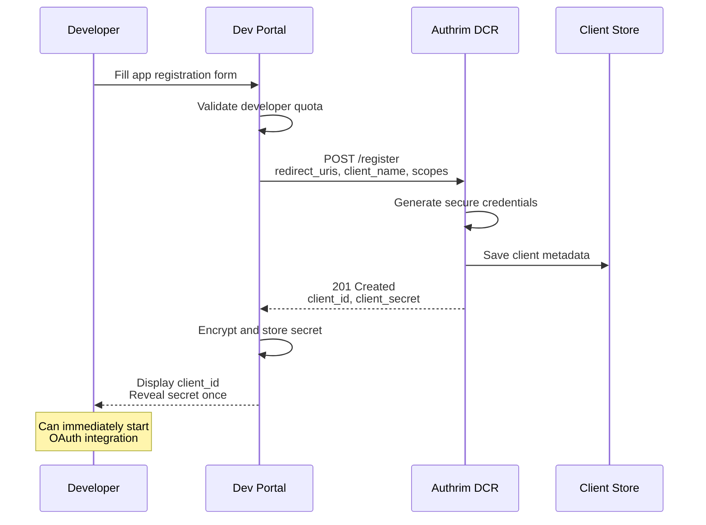
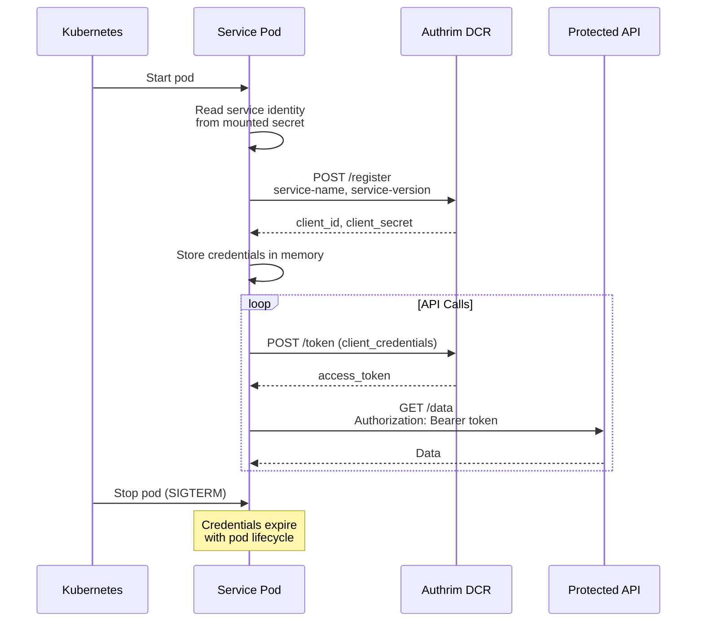
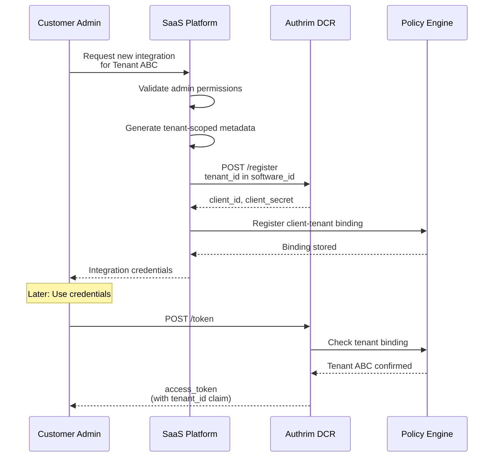

# Dynamic Client Registration (DCR)

Automate OAuth 2.0/OpenID Connect client onboarding with programmatic registration for scalable identity infrastructure.

## Overview

| Specification | Status | Endpoint |
|---------------|--------|----------|
| [OpenID Connect DCR 1.0](https://openid.net/specs/openid-connect-registration-1_0.html) | ✅ Implemented | `POST /register` |
| [RFC 7591](https://tools.ietf.org/html/rfc7591) | ✅ Implemented | OAuth 2.0 DCR Protocol |

Dynamic Client Registration (DCR) enables OAuth 2.0 and OpenID Connect clients to register programmatically without manual administrator intervention, supporting:

- **Self-service client provisioning** for developers
- **Automated CI/CD pipelines** with ephemeral clients
- **Multi-tenant SaaS** with per-tenant isolation
- **Microservices** with dynamic discovery

---

## Benefits

| Benefit | Description |
|---------|-------------|
| **Zero-Touch Onboarding** | Clients register instantly without admin approval |
| **CI/CD Compatible** | Automated test client creation and cleanup |
| **Scalable Architecture** | Supports thousands of clients without bottlenecks |
| **Secure Credentials** | Cryptographically strong client ID (~135 chars) and secret |
| **Standards Compliant** | Full OpenID Connect DCR 1.0 compatibility |

---

## Practical Use Cases

### Use Case 1: Developer Self-Service Portal

**Scenario**: A platform provides OAuth-protected APIs. Developers need to register their applications to get API credentials without waiting for manual approval.

**Why DCR**: Eliminates bottleneck of manual credential provisioning. Developers get immediate access during hackathons, trials, or prototyping.



**Implementation**:

```typescript
// Developer Portal Backend
import { Hono } from 'hono';

const portal = new Hono();

interface AppRegistrationRequest {
  appName: string;
  redirectUris: string[];
  scopes: string[];
  environment: 'development' | 'production';
}

portal.post('/apps', async (c) => {
  const developer = c.get('developer');
  const body = await c.req.json<AppRegistrationRequest>();

  // Check developer quota
  const existingApps = await getAppsForDeveloper(c.env, developer.id);
  if (existingApps.length >= developer.appQuota) {
    return c.json({ error: 'App quota exceeded' }, 429);
  }

  // Register with Authrim DCR
  const dcrResponse = await fetch(`${c.env.AUTHRIM_ISSUER}/register`, {
    method: 'POST',
    headers: { 'Content-Type': 'application/json' },
    body: JSON.stringify({
      redirect_uris: body.redirectUris,
      client_name: body.appName,
      grant_types: ['authorization_code', 'refresh_token'],
      response_types: ['code'],
      scope: body.scopes.join(' '),
      token_endpoint_auth_method:
        body.environment === 'development' ? 'none' : 'client_secret_basic',
      application_type: 'web',
      contacts: [developer.email]
    })
  });

  if (!dcrResponse.ok) {
    const error = await dcrResponse.json();
    return c.json({ error: error.error_description }, 400);
  }

  const client = await dcrResponse.json();

  // Store developer-to-client mapping
  await c.env.DEVELOPER_APPS.put(
    `${developer.id}:${client.client_id}`,
    JSON.stringify({
      developerId: developer.id,
      clientId: client.client_id,
      appName: body.appName,
      environment: body.environment,
      createdAt: new Date().toISOString()
    })
  );

  // Encrypt secret for storage (display once to developer)
  const encryptedSecret = await encryptForStorage(client.client_secret);
  await c.env.CLIENT_SECRETS.put(client.client_id, encryptedSecret);

  return c.json({
    clientId: client.client_id,
    clientSecret: client.client_secret, // Only returned on first registration
    message: 'Save your client secret now. It cannot be retrieved again.'
  }, 201);
});
```

**Developer Portal Frontend**:

```typescript
// React component for app registration
function RegisterApp() {
  const [credentials, setCredentials] = useState<{
    clientId: string;
    clientSecret: string;
  } | null>(null);

  const handleSubmit = async (data: FormData) => {
    const response = await fetch('/api/apps', {
      method: 'POST',
      body: JSON.stringify({
        appName: data.get('appName'),
        redirectUris: [data.get('redirectUri')],
        scopes: ['openid', 'profile', 'email'],
        environment: data.get('environment')
      })
    });

    const result = await response.json();
    setCredentials(result);
  };

  return (
    <div>
      {!credentials ? (
        <form onSubmit={handleSubmit}>
          <input name="appName" placeholder="Application Name" required />
          <input name="redirectUri" placeholder="Redirect URI" required />
          <select name="environment">
            <option value="development">Development</option>
            <option value="production">Production</option>
          </select>
          <button type="submit">Register Application</button>
        </form>
      ) : (
        <div className="credentials-display">
          <h3>Your Application Credentials</h3>
          <div className="warning">
            Save your client secret now. It cannot be retrieved later.
          </div>
          <code>Client ID: {credentials.clientId}</code>
          <code>Client Secret: {credentials.clientSecret}</code>
          <button onClick={() => navigator.clipboard.writeText(
            `CLIENT_ID=${credentials.clientId}\nCLIENT_SECRET=${credentials.clientSecret}`
          )}>
            Copy as .env format
          </button>
        </div>
      )}
    </div>
  );
}
```

---

### Use Case 2: Microservices Auto-Registration

**Scenario**: A cloud-native platform runs ephemeral microservices that need to authenticate to other services. Each service instance registers on startup and deregisters on shutdown.

**Why DCR**: Services can self-provision credentials without pre-configuration. Supports container orchestration, auto-scaling, and blue-green deployments.



**Implementation**:

```typescript
// Service startup registration
import { randomUUID } from 'crypto';

interface ServiceConfig {
  serviceName: string;
  serviceVersion: string;
  authrimIssuer: string;
  requiredScopes: string[];
}

class ServiceAuthClient {
  private clientId: string | null = null;
  private clientSecret: string | null = null;
  private accessToken: string | null = null;
  private tokenExpiry: number = 0;

  constructor(private config: ServiceConfig) {}

  async initialize(): Promise<void> {
    // Generate unique instance identifier
    const instanceId = randomUUID().slice(0, 8);
    const hostname = process.env.HOSTNAME || 'localhost';

    // Register this service instance
    const response = await fetch(`${this.config.authrimIssuer}/register`, {
      method: 'POST',
      headers: { 'Content-Type': 'application/json' },
      body: JSON.stringify({
        redirect_uris: [`https://${hostname}/oauth/callback`],
        client_name: `${this.config.serviceName}-${instanceId}`,
        grant_types: ['client_credentials'],
        response_types: [],
        scope: this.config.requiredScopes.join(' '),
        token_endpoint_auth_method: 'client_secret_basic',
        software_id: this.config.serviceName,
        software_version: this.config.serviceVersion,
        contacts: ['platform-team@company.com']
      })
    });

    if (!response.ok) {
      throw new Error(`Service registration failed: ${await response.text()}`);
    }

    const client = await response.json();
    this.clientId = client.client_id;
    this.clientSecret = client.client_secret;

    console.log(`Service registered with client_id: ${this.clientId}`);

    // Pre-fetch initial access token
    await this.refreshAccessToken();
  }

  async getAccessToken(): Promise<string> {
    // Refresh if expired or expiring soon (5 minute buffer)
    if (Date.now() >= this.tokenExpiry - 300000) {
      await this.refreshAccessToken();
    }
    return this.accessToken!;
  }

  private async refreshAccessToken(): Promise<void> {
    const credentials = Buffer.from(
      `${this.clientId}:${this.clientSecret}`
    ).toString('base64');

    const response = await fetch(`${this.config.authrimIssuer}/token`, {
      method: 'POST',
      headers: {
        'Content-Type': 'application/x-www-form-urlencoded',
        'Authorization': `Basic ${credentials}`
      },
      body: new URLSearchParams({
        grant_type: 'client_credentials',
        scope: this.config.requiredScopes.join(' ')
      })
    });

    if (!response.ok) {
      throw new Error(`Token refresh failed: ${await response.text()}`);
    }

    const token = await response.json();
    this.accessToken = token.access_token;
    this.tokenExpiry = Date.now() + (token.expires_in * 1000);
  }
}

// Usage in service startup
const authClient = new ServiceAuthClient({
  serviceName: 'order-service',
  serviceVersion: '2.1.0',
  authrimIssuer: process.env.AUTHRIM_ISSUER!,
  requiredScopes: ['inventory:read', 'payments:create']
});

await authClient.initialize();

// Use in API calls
const token = await authClient.getAccessToken();
const response = await fetch('https://api.internal/inventory/items', {
  headers: { 'Authorization': `Bearer ${token}` }
});
```

**Kubernetes Deployment**:

```yaml
apiVersion: apps/v1
kind: Deployment
metadata:
  name: order-service
spec:
  replicas: 3
  template:
    spec:
      containers:
        - name: order-service
          image: order-service:2.1.0
          env:
            - name: AUTHRIM_ISSUER
              value: "https://auth.company.com"
            - name: HOSTNAME
              valueFrom:
                fieldRef:
                  fieldPath: metadata.name
          lifecycle:
            preStop:
              exec:
                command: ["/bin/sh", "-c", "sleep 5"]
```

---

### Use Case 3: Multi-Tenant SaaS with Customer-Owned Clients

**Scenario**: A B2B SaaS platform allows enterprise customers to integrate their own applications. Each customer can register OAuth clients that only work with their tenant's data.

**Why DCR**: Customers manage their own integrations without platform admin involvement. Tenant isolation is enforced at registration time.



**Implementation**:

```typescript
// SaaS Platform: Tenant Integration Management
interface TenantIntegration {
  name: string;
  description: string;
  scopes: string[];
  redirectUris: string[];
}

async function createTenantIntegration(
  tenantId: string,
  adminUserId: string,
  integration: TenantIntegration
): Promise<{ clientId: string; clientSecret: string }> {
  // Validate admin has permission for this tenant
  const hasPermission = await checkTenantAdminPermission(tenantId, adminUserId);
  if (!hasPermission) {
    throw new Error('Not authorized to manage tenant integrations');
  }

  // Limit integrations per tenant
  const existingIntegrations = await getTenantIntegrations(tenantId);
  const tenantPlan = await getTenantPlan(tenantId);
  if (existingIntegrations.length >= tenantPlan.maxIntegrations) {
    throw new Error('Integration limit reached for tenant plan');
  }

  // Register client with tenant-specific metadata
  const response = await fetch(`${process.env.AUTHRIM_ISSUER}/register`, {
    method: 'POST',
    headers: { 'Content-Type': 'application/json' },
    body: JSON.stringify({
      redirect_uris: integration.redirectUris,
      client_name: `${integration.name} (Tenant: ${tenantId})`,
      grant_types: ['authorization_code', 'refresh_token'],
      response_types: ['code'],
      scope: integration.scopes.join(' '),
      token_endpoint_auth_method: 'client_secret_basic',

      // Tenant identification in software_id
      software_id: `tenant:${tenantId}`,
      software_version: '1.0',

      // Contact for this integration
      contacts: [await getTenantAdminEmail(tenantId)],

      // Tenant-specific URIs
      client_uri: `https://${tenantId}.saas.example.com`,
      tos_uri: `https://${tenantId}.saas.example.com/terms`,
      policy_uri: `https://${tenantId}.saas.example.com/privacy`
    })
  });

  if (!response.ok) {
    const error = await response.json();
    throw new Error(`Registration failed: ${error.error_description}`);
  }

  const client = await response.json();

  // Store tenant-client binding for authorization
  await storeIntegrationBinding({
    clientId: client.client_id,
    tenantId: tenantId,
    createdBy: adminUserId,
    name: integration.name,
    description: integration.description,
    allowedScopes: integration.scopes,
    createdAt: new Date().toISOString()
  });

  // Audit log
  await createAuditLog({
    action: 'integration.created',
    tenantId,
    actorId: adminUserId,
    resourceId: client.client_id,
    details: { name: integration.name }
  });

  return {
    clientId: client.client_id,
    clientSecret: client.client_secret
  };
}

// Token endpoint middleware: Add tenant claim
async function addTenantClaimToToken(
  clientId: string,
  token: TokenPayload
): Promise<TokenPayload> {
  const binding = await getIntegrationBinding(clientId);

  if (!binding) {
    throw new Error('Unknown client');
  }

  return {
    ...token,
    tenant_id: binding.tenantId,
    allowed_scopes: binding.allowedScopes
  };
}
```

**Customer Admin UI**:

```typescript
// React: Customer Integration Dashboard
function IntegrationDashboard({ tenantId }: { tenantId: string }) {
  const [integrations, setIntegrations] = useState<Integration[]>([]);
  const [showCreateModal, setShowCreateModal] = useState(false);

  const createIntegration = async (data: IntegrationFormData) => {
    const response = await fetch(`/api/tenants/${tenantId}/integrations`, {
      method: 'POST',
      headers: { 'Content-Type': 'application/json' },
      body: JSON.stringify(data)
    });

    const result = await response.json();

    // Show credentials modal (one-time display)
    showCredentialsModal({
      clientId: result.clientId,
      clientSecret: result.clientSecret,
      warning: 'Save these credentials securely. The secret cannot be retrieved again.'
    });

    // Refresh list
    fetchIntegrations();
  };

  return (
    <div className="integration-dashboard">
      <h2>API Integrations</h2>
      <p>Create OAuth clients for your custom integrations</p>

      <button onClick={() => setShowCreateModal(true)}>
        + New Integration
      </button>

      <table>
        <thead>
          <tr>
            <th>Name</th>
            <th>Client ID</th>
            <th>Scopes</th>
            <th>Created</th>
            <th>Actions</th>
          </tr>
        </thead>
        <tbody>
          {integrations.map(integration => (
            <tr key={integration.clientId}>
              <td>{integration.name}</td>
              <td><code>{integration.clientId.slice(0, 20)}...</code></td>
              <td>{integration.scopes.join(', ')}</td>
              <td>{formatDate(integration.createdAt)}</td>
              <td>
                <button onClick={() => rotateSecret(integration.clientId)}>
                  Rotate Secret
                </button>
                <button onClick={() => deleteIntegration(integration.clientId)}>
                  Delete
                </button>
              </td>
            </tr>
          ))}
        </tbody>
      </table>
    </div>
  );
}
```

---

## API Reference

### Registration Endpoint

**POST /register**

#### Request

```http
POST /register HTTP/1.1
Content-Type: application/json

{
  "redirect_uris": ["https://myapp.example.com/callback"],
  "client_name": "My Application",
  "grant_types": ["authorization_code", "refresh_token"],
  "response_types": ["code"],
  "token_endpoint_auth_method": "client_secret_basic",
  "scope": "openid profile email"
}
```

#### Request Parameters

| Parameter | Required | Type | Description |
|-----------|----------|------|-------------|
| `redirect_uris` | ✅ Yes | string[] | Redirect URIs (HTTPS required, except localhost) |
| `client_name` | ❌ No | string | Human-readable name |
| `grant_types` | ❌ No | string[] | OAuth grant types (default: `authorization_code`) |
| `response_types` | ❌ No | string[] | OAuth response types (default: `code`) |
| `token_endpoint_auth_method` | ❌ No | string | Auth method: `client_secret_basic`, `client_secret_post`, `none` |
| `scope` | ❌ No | string | Requested scopes (space-separated) |
| `application_type` | ❌ No | string | `web` (default) or `native` |
| `subject_type` | ❌ No | string | `public` (default) or `pairwise` |
| `contacts` | ❌ No | string[] | Contact email addresses |
| `jwks_uri` | ❌ No | string | JWKS endpoint for client keys |
| `software_id` | ❌ No | string | Unique software identifier |
| `software_version` | ❌ No | string | Software version |

#### Success Response

**Status**: `201 Created`

```json
{
  "client_id": "client_AbCdEfGhIjKlMnOpQrStUvWxYz...",
  "client_secret": "XyZ123AbC456DeF789GhI...",
  "client_id_issued_at": 1734681600,
  "client_secret_expires_at": 0,
  "redirect_uris": ["https://myapp.example.com/callback"],
  "token_endpoint_auth_method": "client_secret_basic",
  "grant_types": ["authorization_code", "refresh_token"],
  "response_types": ["code"]
}
```

#### Error Responses

| Error | HTTP Status | Description |
|-------|-------------|-------------|
| `invalid_redirect_uri` | 400 | Missing, invalid, or insecure redirect URI |
| `invalid_client_metadata` | 400 | Invalid metadata field |
| `invalid_request` | 400 | Malformed JSON body |

---

## Security Considerations

| Consideration | Implementation |
|---------------|----------------|
| **HTTPS Required** | All redirect URIs must use HTTPS (except `localhost`) |
| **Strong Credentials** | Client ID ~135 chars, Secret 32 bytes (base64url) |
| **No Fragments** | Redirect URIs cannot contain `#` fragments |
| **Exact Matching** | Redirect URIs matched exactly during authorization |
| **Sector Identifier** | Required for pairwise with multi-host redirect URIs |

---

## Configuration

### Supported Authentication Methods

| Method | Use Case | Security Level |
|--------|----------|----------------|
| `client_secret_basic` | Server-side apps (default) | High |
| `client_secret_post` | Limited HTTP basic support | Medium |
| `none` | Public clients (mobile, SPA) | Use with PKCE |

### Supported Grant Types

| Grant Type | Use Case |
|------------|----------|
| `authorization_code` | Standard OAuth flow |
| `refresh_token` | Long-lived sessions |
| `client_credentials` | Service-to-service |
| `implicit` | Legacy SPAs (not recommended) |

---

## Discovery Metadata

```json
{
  "registration_endpoint": "https://auth.example.com/register",
  "token_endpoint_auth_methods_supported": [
    "client_secret_basic",
    "client_secret_post",
    "none"
  ],
  "grant_types_supported": [
    "authorization_code",
    "refresh_token",
    "client_credentials"
  ]
}
```

---

## Troubleshooting

### Common Errors

#### "redirect_uris must use HTTPS"

Use HTTPS for production. For development:
```json
{ "redirect_uris": ["http://localhost:3000/callback"] }
```

#### "sector_identifier_uri is required"

Required when using `pairwise` with multiple redirect URI hosts:
```json
{
  "redirect_uris": ["https://app1.com/cb", "https://app2.com/cb"],
  "subject_type": "pairwise",
  "sector_identifier_uri": "https://example.com/.well-known/sector.json"
}
```

---

## Implementation Files

| Component | File | Description |
|-----------|------|-------------|
| Registration Handler | `packages/op-auth/src/register.ts` | DCR endpoint |
| Client Storage | `packages/shared/src/repositories/client.ts` | KV storage |
| Validation | `packages/op-auth/src/validation/client.ts` | Metadata validation |
| Discovery | `packages/op-discovery/src/discovery.ts` | Metadata endpoint |

---

## References

- [OpenID Connect DCR 1.0](https://openid.net/specs/openid-connect-registration-1_0.html)
- [RFC 7591: OAuth 2.0 DCR Protocol](https://tools.ietf.org/html/rfc7591)
- [RFC 7592: DCR Management Protocol](https://tools.ietf.org/html/rfc7592)
- [OAuth 2.0 Security Best Current Practice](https://datatracker.ietf.org/doc/html/draft-ietf-oauth-security-topics)

---

**Last Updated**: 2025-12-20
**Status**: ✅ Fully Implemented
**Tests**: 56+ passing tests
**Implementation**: `packages/op-auth/src/register.ts`
