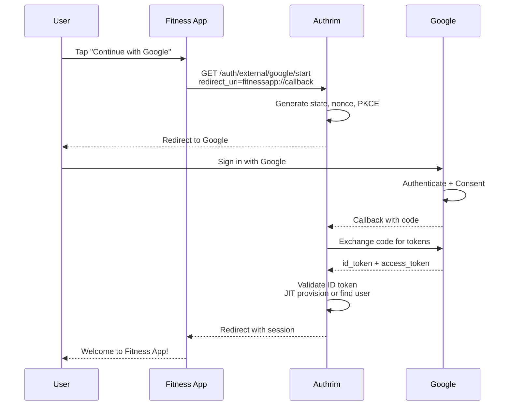
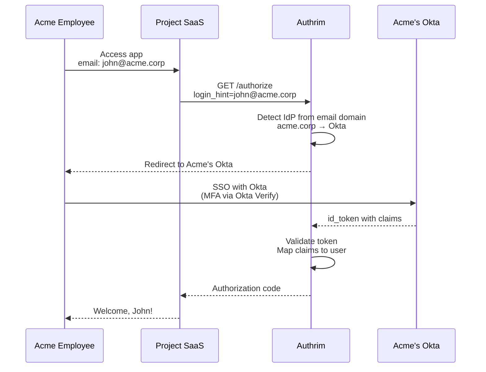
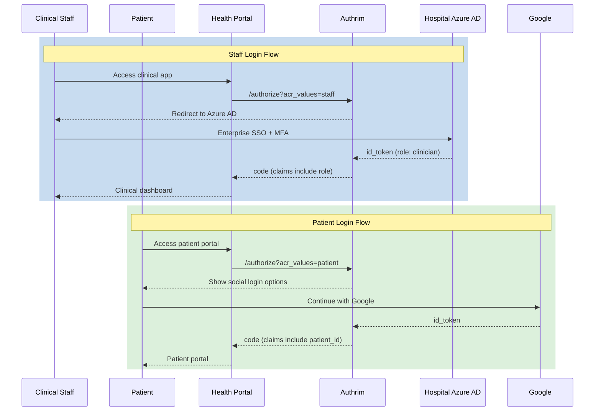
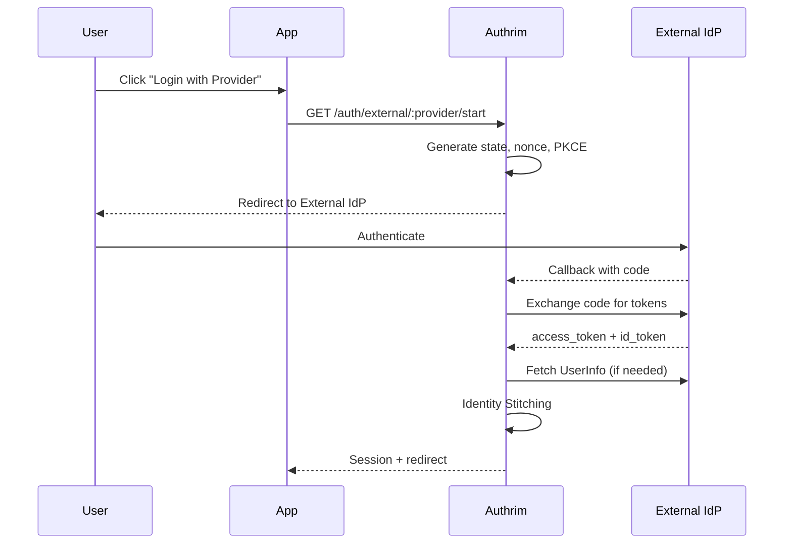

# External Identity Provider Federation

Enable "Login with Google/GitHub/Microsoft" and enterprise SSO by federating with external identity providers.

## Overview

| Specification | Status | Protocols |
|---------------|--------|-----------|
| [OpenID Connect 1.0](https://openid.net/specs/openid-connect-core-1_0.html) | ✅ Implemented | OIDC |
| [OAuth 2.0 (RFC 6749)](https://datatracker.ietf.org/doc/html/rfc6749) | ✅ Implemented | OAuth 2.0 |
| [PKCE (RFC 7636)](https://datatracker.ietf.org/doc/html/rfc7636) | ✅ Required | All flows |

Authrim supports federation with external Identity Providers (IdPs), allowing users to authenticate with existing accounts from Google, Microsoft, GitHub, or any OIDC/OAuth 2.0 compliant provider.

---

## Benefits

| Benefit | Description |
|---------|-------------|
| **Social Login** | One-click login with Google, GitHub, Microsoft |
| **Enterprise SSO** | Integrate with Azure AD, Okta, OneLogin |
| **JIT Provisioning** | Auto-create users on first external login |
| **Account Linking** | Link external identities to existing users |
| **Reduced Friction** | No password registration required |

---

## Supported Providers

| Provider | Type | ID Token | UserInfo | Enterprise |
|----------|------|----------|----------|------------|
| Google | OIDC | ✅ | ✅ | ❌ |
| Microsoft (Entra ID) | OIDC | ✅ | ✅ | ✅ Multi-tenant |
| GitHub | OAuth 2.0 | ❌ | ✅ | ✅ Enterprise Server |
| Custom OIDC | OIDC | ✅ | ✅ | - |
| Custom OAuth 2.0 | OAuth 2.0 | ❌ | ✅ | - |

---

## Practical Use Cases

### Use Case 1: Consumer App with Social Login

**Scenario**: A mobile fitness app wants to minimize registration friction. Users can sign up with one tap using their Google or GitHub accounts. The app needs to handle both new users (JIT provisioning) and returning users.

**Why External IdP**: Social login dramatically increases conversion rates. Users don't need to create and remember yet another password.



**Implementation**:

```typescript
// Mobile app: Initiate social login
async function signInWithGoogle() {
  // 1. Generate PKCE for mobile-to-mobile security
  const codeVerifier = generateCodeVerifier();
  await SecureStore.setItemAsync('code_verifier', codeVerifier);

  // 2. Build authorization URL
  const authUrl = new URL('https://auth.fitnessapp.com/auth/external/google/start');
  authUrl.searchParams.set('redirect_uri', 'fitnessapp://auth/callback');
  authUrl.searchParams.set('code_challenge', await sha256(codeVerifier));
  authUrl.searchParams.set('code_challenge_method', 'S256');

  // 3. Open in-app browser
  await WebBrowser.openAuthSessionAsync(authUrl.toString(), 'fitnessapp://auth/callback');
}

// Handle callback in mobile app
async function handleCallback(url: string) {
  const params = new URL(url).searchParams;

  if (params.get('error')) {
    throw new AuthError(params.get('error_description') || 'Login failed');
  }

  const code = params.get('code');
  const codeVerifier = await SecureStore.getItemAsync('code_verifier');

  // Exchange code for tokens
  const tokens = await fetch('https://auth.fitnessapp.com/oauth/token', {
    method: 'POST',
    headers: { 'Content-Type': 'application/json' },
    body: JSON.stringify({
      grant_type: 'authorization_code',
      code,
      code_verifier: codeVerifier,
      redirect_uri: 'fitnessapp://auth/callback',
      client_id: 'fitness-mobile-app'
    })
  }).then(r => r.json());

  // Store tokens and navigate to main app
  await SecureStore.setItemAsync('access_token', tokens.access_token);
  navigation.navigate('Home');
}
```

**Admin Configuration**:

```bash
# Register Google as external IdP
curl -X POST "https://auth.fitnessapp.com/external-idp/admin/providers" \
  -H "Authorization: Bearer ${ADMIN_API_SECRET}" \
  -H "Content-Type: application/json" \
  -d '{
    "template": "google",
    "name": "Google",
    "slug": "google",
    "client_id": "123456789.apps.googleusercontent.com",
    "client_secret": "GOCSPX-xxxxx",
    "jit_provisioning": true,
    "auto_link_email": true,
    "require_email_verified": true,
    "scopes": "openid email profile"
  }'

# Register GitHub as external IdP
curl -X POST "https://auth.fitnessapp.com/external-idp/admin/providers" \
  -H "Authorization: Bearer ${ADMIN_API_SECRET}" \
  -H "Content-Type: application/json" \
  -d '{
    "template": "github",
    "name": "GitHub",
    "slug": "github",
    "client_id": "Iv1.xxxxxxxxxx",
    "client_secret": "xxxxxxxxxx",
    "jit_provisioning": true,
    "provider_quirks": {
      "fetchPrimaryEmail": true
    }
  }'
```

---

### Use Case 2: B2B SaaS with Enterprise Customer IdP

**Scenario**: A project management SaaS serves multiple enterprise customers. Each customer wants employees to log in with their corporate identity (Okta, Azure AD). Authrim federates with each customer's IdP, creating a seamless SSO experience.

**Why External IdP**: Enterprise customers require SSO with their existing identity systems. Supporting federation eliminates password management overhead and integrates with corporate security policies (MFA, conditional access).



**Implementation**:

```typescript
// SaaS Admin Portal: Customer configures their IdP
interface CustomerIdPConfig {
  customer_id: string;
  email_domains: string[];
  idp_type: 'okta' | 'azure_ad' | 'custom_oidc';
  display_name: string;
  client_id: string;
  client_secret: string;
  issuer?: string;
  tenant_id?: string;
}

async function configureCustomerIdP(config: CustomerIdPConfig) {
  // Build provider configuration based on IdP type
  const providerConfig: ExternalIdPConfig = {
    name: config.display_name,
    slug: `customer-${config.customer_id}`,
    provider_type: 'oidc',
    client_id: config.client_id,
    client_secret: config.client_secret,
    tenant_id: config.customer_id,

    // Identity linking
    jit_provisioning: true,
    auto_link_email: true,
    require_email_verified: true,

    // Map customer's claims to Authrim claims
    attribute_mapping: {
      sub: 'sub',
      email: 'email',
      name: 'name',
      groups: 'groups'
    }
  };

  // Configure issuer based on IdP type
  switch (config.idp_type) {
    case 'okta':
      providerConfig.issuer = config.issuer; // e.g., https://acme.okta.com
      break;
    case 'azure_ad':
      providerConfig.issuer = `https://login.microsoftonline.com/${config.tenant_id}/v2.0`;
      break;
    case 'custom_oidc':
      providerConfig.issuer = config.issuer;
      break;
  }

  // Register with Admin API
  const response = await fetch('/external-idp/admin/providers', {
    method: 'POST',
    headers: {
      'Authorization': `Bearer ${env.ADMIN_API_SECRET}`,
      'Content-Type': 'application/json'
    },
    body: JSON.stringify(providerConfig)
  });

  // Map email domains to this customer
  for (const domain of config.email_domains) {
    await env.KV.put(`idp:domain:${domain}`, JSON.stringify({
      customer_id: config.customer_id,
      provider_slug: providerConfig.slug
    }));
  }

  return response.json();
}

// Authrim authorize endpoint: Detect customer IdP
app.get('/authorize', async (c) => {
  const loginHint = c.req.query('login_hint');

  if (loginHint?.includes('@')) {
    const domain = loginHint.split('@')[1];

    // Look up customer IdP by domain
    const idpMapping = await c.env.KV.get(`idp:domain:${domain}`, 'json');

    if (idpMapping) {
      // Redirect to customer's IdP
      const startUrl = new URL(`/auth/external/${idpMapping.provider_slug}/start`, c.req.url);
      startUrl.searchParams.set('redirect_uri', c.req.query('redirect_uri')!);
      startUrl.searchParams.set('state', c.req.query('state')!);
      return c.redirect(startUrl.toString());
    }
  }

  // Fall back to standard login page
  return renderLoginPage(c);
});
```

**Customer Self-Service Configuration**:

```typescript
// Customer admin portal component
const CustomerSSOSettings = () => {
  const [config, setConfig] = useState<CustomerIdPConfig>({
    idp_type: 'okta',
    email_domains: [],
    display_name: '',
    client_id: '',
    client_secret: ''
  });

  return (
    <div>
      <h2>Single Sign-On Configuration</h2>

      <select
        value={config.idp_type}
        onChange={(e) => setConfig({ ...config, idp_type: e.target.value })}
      >
        <option value="okta">Okta</option>
        <option value="azure_ad">Microsoft Entra ID (Azure AD)</option>
        <option value="custom_oidc">Custom OIDC Provider</option>
      </select>

      <input
        type="text"
        placeholder={
          config.idp_type === 'okta'
            ? 'https://yourcompany.okta.com'
            : config.idp_type === 'azure_ad'
            ? 'Tenant ID (GUID)'
            : 'Issuer URL'
        }
        value={config.issuer}
        onChange={(e) => setConfig({ ...config, issuer: e.target.value })}
      />

      <input
        type="text"
        placeholder="Client ID"
        value={config.client_id}
        onChange={(e) => setConfig({ ...config, client_id: e.target.value })}
      />

      <input
        type="password"
        placeholder="Client Secret"
        value={config.client_secret}
        onChange={(e) => setConfig({ ...config, client_secret: e.target.value })}
      />

      <h3>Your SSO Configuration</h3>
      <table>
        <tr>
          <td>Redirect URI</td>
          <td><code>https://auth.saas.com/auth/external/customer-{customerId}/callback</code></td>
        </tr>
        <tr>
          <td>Required Scopes</td>
          <td><code>openid email profile</code></td>
        </tr>
      </table>

      <button onClick={() => saveConfig(config)}>
        Save SSO Configuration
      </button>
    </div>
  );
};
```

---

### Use Case 3: Healthcare Portal with Multiple User Types

**Scenario**: A healthcare platform serves both clinical staff (authenticated via hospital's Azure AD) and patients (authenticated via patient portal or social login). Different user types require different IdPs and permission levels.

**Why External IdP**: Healthcare requires strict separation of concerns. Staff authenticate through enterprise IdP with compliance controls, while patients use consumer-friendly social login.



**Implementation**:

```typescript
// Healthcare portal: Multi-IdP configuration
async function configureHealthcareIdPs() {
  // 1. Hospital Staff IdP (Azure AD - mandatory MFA)
  await fetch('/external-idp/admin/providers', {
    method: 'POST',
    headers: {
      'Authorization': `Bearer ${env.ADMIN_API_SECRET}`,
      'Content-Type': 'application/json'
    },
    body: JSON.stringify({
      template: 'microsoft',
      name: 'Hospital Staff SSO',
      slug: 'hospital-staff',
      client_id: env.AZURE_AD_CLIENT_ID,
      client_secret: env.AZURE_AD_CLIENT_SECRET,
      provider_quirks: {
        // Single-tenant: only hospital employees
        tenantType: env.AZURE_AD_TENANT_ID
      },
      // Staff-specific settings
      jit_provisioning: true,
      require_email_verified: true,
      // Map Azure AD groups to roles
      attribute_mapping: {
        sub: 'oid',
        email: 'email',
        name: 'name',
        roles: 'groups' // Azure AD group memberships
      },
      // ACR values for policy enforcement
      allowed_acr_values: ['staff', 'clinical']
    })
  });

  // 2. Patient Portal - Google
  await fetch('/external-idp/admin/providers', {
    method: 'POST',
    headers: {
      'Authorization': `Bearer ${env.ADMIN_API_SECRET}`,
      'Content-Type': 'application/json'
    },
    body: JSON.stringify({
      template: 'google',
      name: 'Google',
      slug: 'google-patient',
      client_id: env.GOOGLE_CLIENT_ID,
      client_secret: env.GOOGLE_CLIENT_SECRET,
      jit_provisioning: true,
      auto_link_email: false, // Don't auto-link for security
      require_email_verified: true,
      scopes: 'openid email profile',
      allowed_acr_values: ['patient']
    })
  });

  // 3. Patient Portal - Apple (alternative)
  await fetch('/external-idp/admin/providers', {
    method: 'POST',
    headers: {
      'Authorization': `Bearer ${env.ADMIN_API_SECRET}`,
      'Content-Type': 'application/json'
    },
    body: JSON.stringify({
      name: 'Apple',
      slug: 'apple-patient',
      provider_type: 'oidc',
      issuer: 'https://appleid.apple.com',
      client_id: env.APPLE_CLIENT_ID,
      client_secret: env.APPLE_CLIENT_SECRET,
      jit_provisioning: true,
      allowed_acr_values: ['patient']
    })
  });
}

// Authorization endpoint: Route based on user type
app.get('/authorize', async (c) => {
  const acrValues = c.req.query('acr_values');

  if (acrValues === 'staff' || acrValues === 'clinical') {
    // Staff must use enterprise IdP
    return c.redirect(
      `/auth/external/hospital-staff/start?${new URLSearchParams({
        redirect_uri: c.req.query('redirect_uri')!,
        state: c.req.query('state')!,
        nonce: c.req.query('nonce') || ''
      })}`
    );
  }

  if (acrValues === 'patient') {
    // Patients see social login options
    return renderPatientLoginPage(c, {
      providers: ['google-patient', 'apple-patient'],
      redirect_uri: c.req.query('redirect_uri'),
      state: c.req.query('state')
    });
  }

  // Default login page with all options
  return renderLoginPage(c);
});

// HIPAA-compliant audit logging for external auth
async function auditExternalAuth(event: AuthEvent) {
  await hipaaAuditLog({
    event_type: 'EXTERNAL_AUTHENTICATION',
    timestamp: new Date().toISOString(),
    provider: event.provider,
    user_type: event.acrValues,
    outcome: event.success ? 'SUCCESS' : 'FAILURE',
    // HIPAA: Never log actual identifiers
    user_id_hash: await sha256(event.userId),
    ip_hash: await sha256(event.ip),
    user_agent: event.userAgent
  });
}
```

**Role-Based Access Control**:

```typescript
// Map external IdP claims to internal roles
async function mapExternalClaimsToRoles(
  provider: string,
  externalClaims: Record<string, unknown>
): Promise<string[]> {
  // Hospital staff: Map Azure AD groups to roles
  if (provider === 'hospital-staff') {
    const azureGroups = externalClaims.groups as string[] || [];

    const roleMapping: Record<string, string> = {
      '11111111-aaaa-bbbb-cccc-000000000001': 'physician',
      '11111111-aaaa-bbbb-cccc-000000000002': 'nurse',
      '11111111-aaaa-bbbb-cccc-000000000003': 'admin',
      '11111111-aaaa-bbbb-cccc-000000000004': 'pharmacist'
    };

    return azureGroups
      .map(groupId => roleMapping[groupId])
      .filter(Boolean);
  }

  // Patient social login: Default patient role
  if (provider.includes('patient')) {
    return ['patient'];
  }

  return [];
}
```

---

## Architecture

### Authentication Flow



### Identity Stitching

Account linking follows this priority:

1. **Explicit Link**: `user_id` parameter provided
2. **Email Link**: `auto_link_email=true` + matching verified email
3. **JIT Provisioning**: `jit_provisioning=true` creates new user
4. **Error**: No matching strategy

---

## API Reference

### User Flow Endpoints

| Endpoint | Method | Description |
|----------|--------|-------------|
| `/auth/external/:provider/start` | GET | Initiate external auth |
| `/auth/external/:provider/callback` | GET | Handle IdP callback |
| `/auth/external/:provider/backchannel-logout` | POST | Handle backchannel logout |

### Admin Endpoints

| Endpoint | Method | Description |
|----------|--------|-------------|
| `/external-idp/admin/providers` | GET | List providers |
| `/external-idp/admin/providers` | POST | Create provider |
| `/external-idp/admin/providers/:id` | GET | Get provider |
| `/external-idp/admin/providers/:id` | PUT | Update provider |
| `/external-idp/admin/providers/:id` | DELETE | Delete provider |

---

## Provider Templates

### Google

```bash
curl -X POST "/external-idp/admin/providers" \
  -H "Authorization: Bearer $ADMIN_API_SECRET" \
  -d '{
    "template": "google",
    "name": "Google",
    "slug": "google",
    "client_id": "xxx.apps.googleusercontent.com",
    "client_secret": "GOCSPX-xxx"
  }'
```

### Microsoft (Entra ID)

```bash
curl -X POST "/external-idp/admin/providers" \
  -H "Authorization: Bearer $ADMIN_API_SECRET" \
  -d '{
    "template": "microsoft",
    "name": "Microsoft",
    "slug": "microsoft",
    "client_id": "YOUR_CLIENT_ID",
    "client_secret": "YOUR_SECRET",
    "provider_quirks": {
      "tenantType": "common"
    }
  }'
```

**Tenant Types**:
- `common`: All Microsoft accounts (personal + work)
- `organizations`: Work/school accounts only
- `consumers`: Personal accounts only
- `{tenant-id}`: Specific tenant GUID

### GitHub

```bash
curl -X POST "/external-idp/admin/providers" \
  -H "Authorization: Bearer $ADMIN_API_SECRET" \
  -d '{
    "template": "github",
    "name": "GitHub",
    "slug": "github",
    "client_id": "YOUR_CLIENT_ID",
    "client_secret": "YOUR_SECRET",
    "provider_quirks": {
      "fetchPrimaryEmail": true
    }
  }'
```

### Custom OIDC

```bash
curl -X POST "/external-idp/admin/providers" \
  -H "Authorization: Bearer $ADMIN_API_SECRET" \
  -d '{
    "name": "Custom IdP",
    "slug": "custom-idp",
    "provider_type": "oidc",
    "issuer": "https://idp.example.com",
    "client_id": "YOUR_CLIENT_ID",
    "client_secret": "YOUR_SECRET",
    "scopes": "openid email profile"
  }'
```

---

## Security Considerations

| Consideration | Implementation |
|---------------|----------------|
| **PKCE** | S256 method, required for all flows |
| **State Parameter** | Cryptographically secure, 60s TTL |
| **Nonce** | ID Token replay protection (OIDC) |
| **Secret Encryption** | AES-256-GCM for client secrets |
| **Email Verification** | `require_email_verified: true` by default |

---

## Configuration

### Provider Configuration Fields

| Field | Type | Required | Description |
|-------|------|----------|-------------|
| `name` | string | ✅ | Display name |
| `slug` | string | - | URL-friendly identifier |
| `provider_type` | string | - | `oidc` or `oauth2` |
| `client_id` | string | ✅ | OAuth Client ID |
| `client_secret` | string | ✅ | OAuth Client Secret |
| `issuer` | string | OIDC | OIDC Issuer URL |
| `scopes` | string | - | OAuth scopes |
| `jit_provisioning` | boolean | - | Auto-create users |
| `auto_link_email` | boolean | - | Link by email match |
| `require_email_verified` | boolean | - | Require verified email |

### Environment Variables

| Variable | Description |
|----------|-------------|
| `RP_TOKEN_ENCRYPTION_KEY` | Key for encrypting client secrets |
| `ADMIN_API_SECRET` | Admin API authentication |

---

## Troubleshooting

### "Provider not found"

1. Verify provider exists: `GET /external-idp/admin/providers`
2. Check `slug` matches URL exactly
3. Ensure `enabled: true`

### "State validation failed"

1. User took >60 seconds to complete flow
2. Browser blocked cookies
3. Session expired

### "Provider did not return email"

**GitHub**: Add `user:email` scope, set `fetchPrimaryEmail: true`
**General**: Check `scopes` includes `email`, verify attribute mapping

---

## Implementation Files

| Component | File | Description |
|-----------|------|-------------|
| Start Handler | `packages/external-idp/src/start.ts` | Initiate auth flow |
| Callback Handler | `packages/external-idp/src/callback.ts` | Process IdP response |
| Provider Admin | `packages/external-idp/src/admin-providers.ts` | CRUD operations |
| OIDC Client | `packages/external-idp/src/oidc-client.ts` | Token exchange |
| State Management | `packages/external-idp/src/state.ts` | CSRF protection |

---

## References

- [OpenID Connect Core 1.0](https://openid.net/specs/openid-connect-core-1_0.html)
- [OAuth 2.0 (RFC 6749)](https://datatracker.ietf.org/doc/html/rfc6749)
- [PKCE (RFC 7636)](https://datatracker.ietf.org/doc/html/rfc7636)
- [Google OAuth 2.0](https://developers.google.com/identity/protocols/oauth2)
- [Microsoft Identity Platform](https://learn.microsoft.com/en-us/entra/identity-platform/)
- [GitHub OAuth Apps](https://docs.github.com/en/apps/oauth-apps)

---

**Last Updated**: 2025-12-20
**Status**: ✅ Fully Implemented
**Tests**: 25+ passing tests
**Implementation**: `packages/external-idp/src/`
