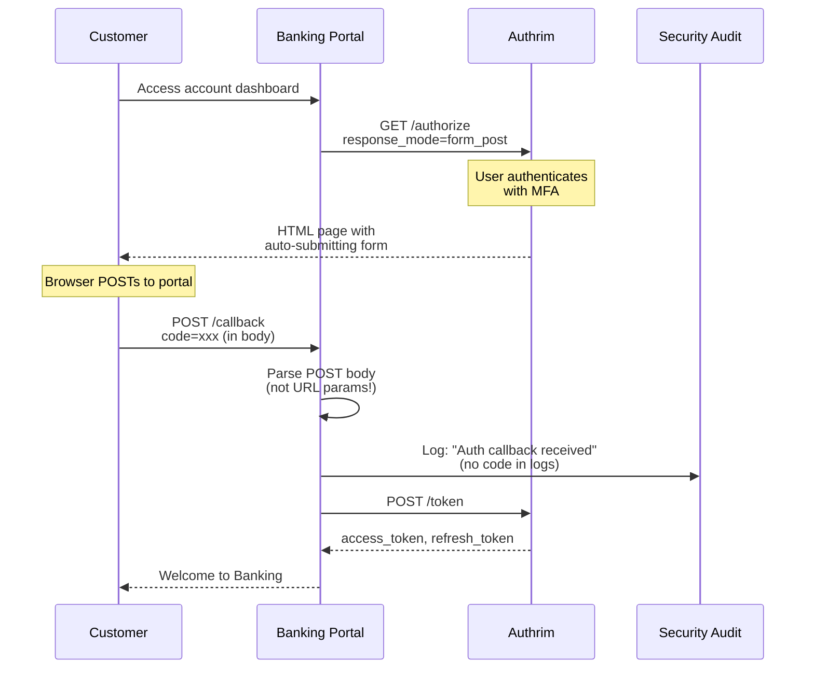
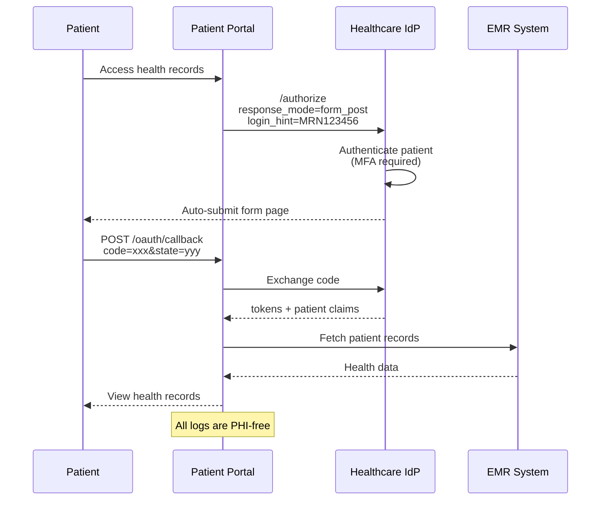
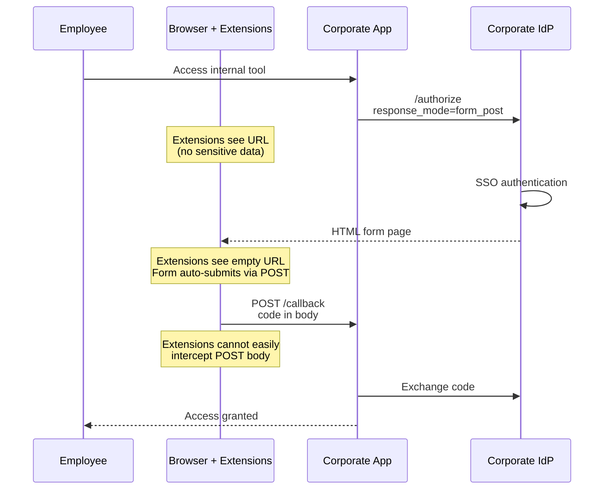

# Form Post Response Mode

Deliver OAuth authorization responses via HTTP POST for enhanced security and privacy.

## Overview

| Specification                                                                             | Status         | Response Mode |
| ----------------------------------------------------------------------------------------- | -------------- | ------------- |
| [OAuth 2.0 Form Post](https://openid.net/specs/oauth-v2-form-post-response-mode-1_0.html) | ✅ Implemented | `form_post`   |

Form Post Response Mode delivers authorization responses (code, state) via HTTP POST instead of URL parameters, providing:

- **Enhanced Security**: Parameters not exposed in URL or browser history
- **Privacy Protection**: No logging in server access logs or Referer leakage
- **URL Length Safety**: Avoids browser/server URL length limits
- **Clean URLs**: Professional appearance without visible parameters

---

## Benefits

| Benefit                | Description                                           |
| ---------------------- | ----------------------------------------------------- |
| **No URL Exposure**    | Authorization code not visible in browser address bar |
| **No History Leakage** | Parameters not saved in browser history               |
| **No Referer Leakage** | Code not leaked via HTTP Referer header               |
| **Server Log Safety**  | POST bodies typically not logged by web servers       |
| **Longer Payloads**    | Supports complex responses without URL limits         |

---

## Practical Use Cases

### Use Case 1: Enterprise Banking Portal with Strict Audit Requirements

**Scenario**: A bank's customer portal requires that authorization codes never appear in logs, browser history, or monitoring systems. Security team mandates POST-based token delivery for PCI DSS compliance.

**Why Form Post**: URL parameters are logged everywhere - web servers, CDNs, monitoring tools. Form POST keeps sensitive data out of logs.



**Implementation**:

```typescript
// Banking Portal: Authorization initiation
function initiateSecureAuth(req: Request, res: Response) {
  const state = crypto.randomUUID();
  const nonce = crypto.randomUUID();

  // Store state for CSRF validation
  req.session.authState = state;
  req.session.authNonce = nonce;

  const authUrl = new URL('https://auth.bank.example.com/authorize');
  authUrl.searchParams.set('response_type', 'code');
  authUrl.searchParams.set('response_mode', 'form_post'); // Critical for security
  authUrl.searchParams.set('client_id', process.env.BANK_CLIENT_ID!);
  authUrl.searchParams.set('redirect_uri', 'https://portal.bank.example.com/auth/callback');
  authUrl.searchParams.set('scope', 'openid accounts:read transactions:read');
  authUrl.searchParams.set('state', state);
  authUrl.searchParams.set('nonce', nonce);
  authUrl.searchParams.set('acr_values', 'urn:bank:mfa:sms');

  res.redirect(authUrl.toString());
}

// Banking Portal: POST callback handler
// IMPORTANT: This MUST be a POST handler, not GET!
app.post('/auth/callback', express.urlencoded({ extended: true }), async (req, res) => {
  // Parameters are in req.body, NOT req.query
  const { code, state, error, error_description } = req.body;

  // CSRF protection
  if (state !== req.session.authState) {
    // Log security event (without exposing code)
    securityLog.warn({
      event: 'auth_state_mismatch',
      session_id: req.session.id,
      expected_state: req.session.authState?.slice(0, 8) + '...',
      received_state: state?.slice(0, 8) + '...',
    });
    return res.status(403).render('error', { message: 'Security validation failed' });
  }

  if (error) {
    return res.status(400).render('error', { message: error_description });
  }

  // Exchange code for tokens
  const tokens = await exchangeCodeForTokens(code);

  // Audit log (no sensitive data)
  auditLog.info({
    event: 'auth_success',
    user_id: tokens.sub,
    session_id: req.session.id,
    // Note: No code or tokens in logs!
  });

  req.session.tokens = tokens;
  res.redirect('/dashboard');
});
```

**Nginx Configuration** (ensure POST bodies are NOT logged):

```nginx
# Ensure POST body is not logged
log_format banking_secure '$remote_addr - $remote_user [$time_local] '
                          '"$request_method $uri" $status $body_bytes_sent '
                          '"$http_referer" "$http_user_agent"';
# Note: No $request_body in log format!

location /auth/callback {
  proxy_pass http://backend;

  # Security headers
  proxy_hide_header X-Powered-By;
  add_header X-Frame-Options DENY;
  add_header X-Content-Type-Options nosniff;
}
```

---

### Use Case 2: Healthcare Patient Portal with HIPAA Logging Requirements

**Scenario**: A healthcare system's patient portal must ensure PHI identifiers never appear in system logs or monitoring tools. Authorization flows must use POST to keep identifiers out of URLs.

**Why Form Post**: HIPAA auditors specifically check for PHI in logs. Form POST prevents codes (which could be correlated to patients) from appearing in any log.



**Implementation**:

```typescript
// Healthcare Portal Configuration
const healthcareOAuthConfig = {
  issuer: 'https://auth.healthcare.example.com',
  clientId: process.env.HEALTHCARE_CLIENT_ID,
  redirectUri: 'https://patient-portal.healthcare.example.com/oauth/callback',

  // HIPAA-compliant settings
  responseMode: 'form_post', // Never expose codes in URLs
  scope: 'openid profile patient/*.read',

  // Audit configuration
  auditConfig: {
    logCodes: false, // Never log authorization codes
    logTokens: false, // Never log tokens
    logUserIds: true, // Log user IDs for audit trail
    maskPHI: true, // Mask any PHI in logs
  },
};

// Callback handler with HIPAA-compliant logging
app.post('/oauth/callback', async (req, res) => {
  const startTime = Date.now();
  const correlationId = crypto.randomUUID();

  try {
    // Extract from POST body (HIPAA-compliant)
    const { code, state } = req.body;

    // Validate state (CSRF protection)
    const expectedState = await redisClient.get(`auth_state:${req.session.id}`);
    if (state !== expectedState) {
      throw new SecurityError('State mismatch');
    }

    // Exchange code for tokens
    const tokens = await exchangeCode(code);

    // HIPAA-compliant audit log
    await hipaaAuditLog({
      correlationId,
      event: 'PATIENT_AUTHENTICATION',
      outcome: 'SUCCESS',
      patientId: maskPHI(tokens.patient_id), // Masked for logs
      timestamp: new Date().toISOString(),
      duration_ms: Date.now() - startTime,
      ip: hashForAudit(req.ip), // Hashed IP for privacy
      userAgent: req.headers['user-agent'],
    });

    req.session.tokens = tokens;
    res.redirect('/dashboard');
  } catch (error) {
    await hipaaAuditLog({
      correlationId,
      event: 'PATIENT_AUTHENTICATION',
      outcome: 'FAILURE',
      error: error.message, // No PHI in error messages
      timestamp: new Date().toISOString(),
    });

    res.status(400).render('auth-error');
  }
});
```

---

### Use Case 3: Corporate SSO with Browser Extension Security Concerns

**Scenario**: A company's employees use browser extensions that may capture URL parameters. IT security requires that OAuth codes be delivered via POST to prevent extension-based data exfiltration.

**Why Form Post**: Malicious or data-collecting browser extensions often capture URL query parameters. POST body data is harder for extensions to intercept.



**Implementation**:

```typescript
// Corporate SSO Middleware
export function corporateSSOMiddleware(config: SSOConfig) {
  return async (req: Request, res: Response, next: NextFunction) => {
    // Check if user is authenticated
    if (req.session.user) {
      return next();
    }

    // Security check: Only allow form_post
    const useFormPost = true; // Mandated by security policy

    const authUrl = buildAuthUrl({
      ...config,
      responseMode: useFormPost ? 'form_post' : 'query',
      state: await generateSecureState(req.session.id),
      // Additional security parameters
      prompt: 'login', // Force fresh authentication
      max_age: 3600, // Max 1 hour since last auth
    });

    res.redirect(authUrl);
  };
}

// POST callback with extension-resistant security
app.post(
  '/sso/callback',
  // Rate limiting
  rateLimit({ windowMs: 60000, max: 10 }),

  // Body parsing
  express.urlencoded({ extended: true }),

  async (req, res) => {
    // Timing-safe state comparison
    const expectedState = req.session.expectedState;
    const receivedState = req.body.state;

    if (!timingSafeEqual(expectedState, receivedState)) {
      securityAlert({
        type: 'sso_state_mismatch',
        session: req.session.id,
        ip: req.ip,
      });
      return res.status(403).send('Security validation failed');
    }

    // Verify the code came from POST body, not URL
    if (req.query.code) {
      securityAlert({
        type: 'code_in_url',
        message: 'Authorization code found in URL, expected POST body',
        ip: req.ip,
      });
      return res.status(400).send('Invalid request');
    }

    const { code } = req.body;

    // Exchange and establish session
    const tokens = await exchangeCodeForTokens(code);
    req.session.user = await getUserFromTokens(tokens);

    res.redirect(req.session.returnTo || '/');
  }
);
```

---

## How Form Post Works

### Flow Diagram

```mermaid
sequenceDiagram
    participant Client
    participant AS as Authorization Server
    participant Browser

    Client->>AS: GET /authorize?response_mode=form_post

    Note over AS: User authenticates

    AS-->>Browser: 200 OK<br/>HTML page with form

    Note over Browser: Form contains:<br/>&lt;input name="code" value="xxx"&gt;<br/>&lt;input name="state" value="yyy"&gt;

    Browser->>Browser: JavaScript auto-submits form

    Browser->>Client: POST /callback<br/>Content-Type: form-urlencoded<br/>code=xxx&state=yyy

    Client->>Client: Parse POST body<br/>Exchange code for tokens
```

### HTML Response Structure

```html
<!DOCTYPE html>
<html lang="en">
  <head>
    <meta charset="UTF-8" />
    <title>Authorization</title>
  </head>
  <body>
    <div class="loading">
      <p>Redirecting to application...</p>
    </div>

    <form id="auth-form" method="post" action="https://app.example.com/callback">
      <input type="hidden" name="code" value="abc123..." />
      <input type="hidden" name="state" value="xyz789" />
    </form>

    <script>
      document.getElementById('auth-form').submit();
    </script>
  </body>
</html>
```

---

## API Reference

### Authorization Request

```http
GET /authorize?
  response_type=code&
  response_mode=form_post&
  client_id=CLIENT_ID&
  redirect_uri=https://app.example.com/callback&
  scope=openid+profile&
  state=RANDOM_STATE
Host: auth.example.com
```

### Form Post Response

**HTTP 200 OK** with HTML containing auto-submitting form.

### Client Receives POST

```http
POST /callback HTTP/1.1
Host: app.example.com
Content-Type: application/x-www-form-urlencoded

code=abc123...&state=xyz789
```

---

## Security Considerations

### XSS Prevention

All parameters are HTML-escaped before embedding:

```typescript
function escapeHtml(unsafe: string): string {
  return unsafe
    .replace(/&/g, '&amp;')
    .replace(/</g, '&lt;')
    .replace(/>/g, '&gt;')
    .replace(/"/g, '&quot;')
    .replace(/'/g, '&#039;');
}
```

### CSRF Protection

- Always use `state` parameter
- Validate state matches on callback
- Use secure, random state values

### Comparison with Query Mode

| Aspect          | Query Mode     | Form Post     |
| --------------- | -------------- | ------------- |
| URL Visibility  | ❌ Code in URL | ✅ Clean URL  |
| Browser History | ❌ Saved       | ✅ Not saved  |
| Server Logs     | ❌ Logged      | ✅ Not logged |
| Referer Leakage | ❌ Possible    | ✅ No leakage |

---

## Client Implementation

### Express.js

```javascript
// IMPORTANT: Use POST handler, not GET
app.post('/callback', express.urlencoded({ extended: true }), (req, res) => {
  const { code, state } = req.body; // NOT req.query!

  if (state !== req.session.expectedState) {
    return res.status(403).send('Invalid state');
  }

  // Exchange code for tokens...
});
```

### Next.js

```typescript
// pages/api/callback.ts
export default async function handler(req: NextApiRequest, res: NextApiResponse) {
  if (req.method !== 'POST') {
    return res.status(405).json({ error: 'Method not allowed' });
  }

  const { code, state } = req.body;
  // ...
}
```

### Hono

```typescript
app.post('/callback', async (c) => {
  const body = await c.req.parseBody();
  const code = body.code as string;
  const state = body.state as string;
  // ...
});
```

---

## Discovery Metadata

```json
{
  "response_modes_supported": ["query", "form_post", "fragment"]
}
```

---

## Configuration

### Environment Variables

| Variable                | Description           | Default  |
| ----------------------- | --------------------- | -------- |
| `FORM_POST_TEMPLATE`    | Custom HTML template  | Built-in |
| `FORM_POST_AUTO_SUBMIT` | Enable auto-submit JS | `true`   |

---

## Troubleshooting

### Client receives GET instead of POST

**Cause**: Callback endpoint only handles GET requests.

**Solution**: Add POST handler:

```javascript
app.post('/callback', handler); // Not app.get()
```

### Parameters not found

**Cause**: Reading from `req.query` instead of `req.body`.

**Solution**: Read from POST body:

```javascript
const code = req.body.code; // NOT req.query.code
```

---

## Implementation Files

| Component         | File                                          | Description         |
| ----------------- | --------------------------------------------- | ------------------- |
| Form Post Handler | `packages/op-auth/src/authorize.ts`           | Response generation |
| HTML Template     | `packages/op-auth/src/templates/form-post.ts` | Form template       |
| Discovery         | `packages/op-discovery/src/discovery.ts`      | Metadata            |

---

## References

- [OAuth 2.0 Form Post Response Mode](https://openid.net/specs/oauth-v2-form-post-response-mode-1_0.html)
- [OAuth 2.0 Multiple Response Types](https://openid.net/specs/oauth-v2-multiple-response-types-1_0.html)
- [OAuth 2.0 Security BCP](https://datatracker.ietf.org/doc/html/draft-ietf-oauth-security-topics)

---

**Last Updated**: 2025-12-20
**Status**: ✅ Fully Implemented
**Tests**: 19+ passing tests
**Implementation**: `packages/op-auth/src/authorize.ts`
