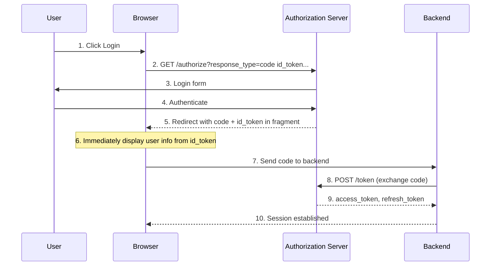

# Hybrid Flow (OIDC Core 3.3)

## Overview

**OpenID Connect Core 1.0 Section 3.3** - Hybrid Flow

Authrim implements Hybrid Flow, which combines the benefits of Authorization Code Flow and Implicit Flow. It allows immediate token delivery to the frontend while enabling secure token exchange on the backend.

### Specification

| Attribute          | Value                                                                                 |
| ------------------ | ------------------------------------------------------------------------------------- |
| **Spec**           | [OIDC Core 3.3](https://openid.net/specs/openid-connect-core-1_0.html#HybridFlowAuth) |
| **Status**         | ✅ Implemented                                                                        |
| **Response Types** | `code id_token`, `code token`, `code id_token token`                                  |

---

## Benefits

### Security Advantages

1. **🔐 Dual-Channel Security**
   - Frontend receives ID token immediately for user display
   - Backend exchanges code for full token set securely
   - Combines security of code flow with convenience of implicit

2. **✅ Token Binding Verification**
   - `c_hash` binds ID token to authorization code
   - `at_hash` binds ID token to access token
   - Prevents token substitution attacks

3. **🚀 Immediate User Experience**
   - User info available instantly on redirect
   - No waiting for backend token exchange
   - Backend can still obtain refresh tokens

---

## Practical Use Cases

### Use Case 1: E-Commerce Checkout with Payment Verification

**Scenario**: An e-commerce site needs to display the user's name and email immediately after login (for personalization) while the backend securely obtains tokens to process payment and access order history.

**Challenge**: Traditional code flow requires waiting for backend exchange before showing user info. Implicit flow can't get refresh tokens. Need both immediate display and long-term access.

**Hybrid Flow Solution**:

```javascript
// Request: response_type=code id_token
// Frontend immediately gets ID token with user info
const params = parseFragmentParams(window.location.hash);
const idToken = parseJwt(params.id_token);

// Display immediately
document.getElementById('welcome').textContent = `Welcome, ${idToken.name}!`;
document.getElementById('email').textContent = idToken.email;

// Meanwhile, send code to backend
fetch('/api/exchange-code', {
  method: 'POST',
  body: JSON.stringify({ code: params.code }),
});

// Backend exchanges code for access + refresh tokens
// Can now access payment APIs, order history, etc.
```

**Result**: User sees their name immediately on redirect. Backend silently obtains refresh tokens for long-term access to process orders and send notifications.

---

### Use Case 2: Real-Time Collaboration App

**Scenario**: A collaborative document editor (like Google Docs) needs to show the user's avatar and name immediately while establishing a WebSocket connection that requires an access token.

**Challenge**: WebSocket connection needs to be established quickly. Waiting for full token exchange adds latency. But access token is needed for the WebSocket auth.

**Hybrid Flow Solution**:

```typescript
// Request: response_type=code id_token token
// Get all tokens immediately in fragment
const params = parseFragmentParams(location.hash);

// Immediately show user avatar (from ID token)
const idToken = parseJwt(params.id_token);
showUserAvatar(idToken.picture, idToken.name);

// Immediately connect WebSocket with access token
const ws = new WebSocket(`wss://collab.example.com/ws?token=${params.access_token}`);

// Send code to backend for refresh token (for reconnection)
await fetch('/api/store-code', {
  method: 'POST',
  body: JSON.stringify({ code: params.code }),
});
```

**Result**: Zero delay for user experience. Avatar appears instantly, WebSocket connects immediately, and backend has refresh token for session recovery.

---

### Use Case 3: Mobile App with Native + Web Components

**Scenario**: A mobile app uses a WebView for authentication but needs tokens in both the native layer (for API calls) and the web layer (for displaying user info in HTML).

**Challenge**: Passing tokens between WebView and native code is complex. Need tokens available in both contexts simultaneously.

**Hybrid Flow Solution**:

```swift
// iOS native code sets up WebView for hybrid flow
let authURL = URL(string: """
    https://auth.example.com/authorize?
    response_type=code+id_token+token&
    client_id=mobile_app&
    redirect_uri=myapp://callback&
    scope=openid+profile&
    nonce=\(nonce)
    """)!

webView.load(URLRequest(url: authURL))

// WebView redirect handler
func webView(_ webView: WKWebView, didFinish navigation: WKNavigation!) {
    if let fragment = webView.url?.fragment {
        let params = parseFragment(fragment)

        // Native layer gets access token for API calls
        let accessToken = params["access_token"]
        self.apiClient.setToken(accessToken)

        // WebView JavaScript gets ID token for display
        webView.evaluateJavaScript("""
            displayUser(\(params["id_token"]))
        """)

        // Send code to backend for refresh token
        sendCodeToBackend(params["code"])
    }
}
```

**Result**: Native code can immediately make API calls. WebView displays user info. Backend stores refresh token for token renewal.

---

## How Hybrid Flow Works

### Flow Diagram



### Response Types

| response_type         | Returns             | c_hash | at_hash |
| --------------------- | ------------------- | ------ | ------- |
| `code id_token`       | Code + ID Token     | ✅     | -       |
| `code token`          | Code + Access Token | -      | -       |
| `code id_token token` | All three           | ✅     | ✅      |

---

## API Reference

### Authorization Request

```http
GET /authorize?
  response_type=code%20id_token&
  client_id=my_client&
  redirect_uri=https://app.example.com/callback&
  scope=openid%20profile%20email&
  state=abc123&
  nonce=xyz789
```

**Required Parameters**:

| Parameter       | Description                                                  |
| --------------- | ------------------------------------------------------------ |
| `response_type` | One of: `code id_token`, `code token`, `code id_token token` |
| `client_id`     | Client identifier                                            |
| `redirect_uri`  | Callback URI                                                 |
| `scope`         | Must include `openid`                                        |
| `nonce`         | **Required** for flows returning id_token                    |
| `state`         | Recommended for CSRF protection                              |

### Response (Fragment)

```
https://app.example.com/callback#
  code=SplxlOBeZQQYbYS6WxSbIA&
  id_token=eyJhbGciOiJSUzI1NiJ9...&
  state=abc123
```

---

## Usage Examples

### JavaScript Client

```javascript
function initiateHybridFlow() {
  const state = crypto.randomUUID();
  const nonce = crypto.randomUUID();

  sessionStorage.setItem('oauth_state', state);
  sessionStorage.setItem('oauth_nonce', nonce);

  const params = new URLSearchParams({
    response_type: 'code id_token',
    client_id: CLIENT_ID,
    redirect_uri: REDIRECT_URI,
    scope: 'openid profile email',
    state,
    nonce,
  });

  window.location.href = `https://your-tenant.authrim.com/authorize?${params}`;
}

function handleCallback() {
  const hash = window.location.hash.slice(1);
  const params = new URLSearchParams(hash);

  // Validate state
  if (params.get('state') !== sessionStorage.getItem('oauth_state')) {
    throw new Error('State mismatch');
  }

  // Validate nonce in ID token
  const idToken = parseJwt(params.get('id_token'));
  if (idToken.nonce !== sessionStorage.getItem('oauth_nonce')) {
    throw new Error('Nonce mismatch');
  }

  // Validate c_hash
  if (!verifyCHash(params.get('code'), idToken.c_hash)) {
    throw new Error('c_hash validation failed');
  }

  // Display user info immediately
  displayUser(idToken);

  // Exchange code on backend
  exchangeCodeOnBackend(params.get('code'));
}

function verifyCHash(code, cHash) {
  const hash = sha256(code);
  const leftHalf = hash.slice(0, hash.length / 2);
  return base64urlEncode(leftHalf) === cHash;
}
```

---

## Security Considerations

### Nonce Requirement

**Important**: `nonce` is **required** for Hybrid Flow and Implicit Flow.

```javascript
// Generate unique nonce
const nonce = crypto.randomUUID();
sessionStorage.setItem('oauth_nonce', nonce);

// Include in request
const authUrl = `/authorize?...&nonce=${nonce}`;

// Validate in callback
if (idToken.nonce !== savedNonce) {
  throw new Error('Replay attack detected');
}
```

### Hash Claim Validation

**c_hash**: Binds ID token to authorization code

```javascript
const expectedCHash = base64url(sha256(code).slice(0, 16));
assert(idToken.c_hash === expectedCHash);
```

**at_hash**: Binds ID token to access token

```javascript
const expectedAtHash = base64url(sha256(accessToken).slice(0, 16));
assert(idToken.at_hash === expectedAtHash);
```

---

## Configuration

### Discovery Metadata

```json
{
  "response_types_supported": [
    "code",
    "id_token",
    "code id_token",
    "code token",
    "code id_token token"
  ],
  "response_modes_supported": ["fragment", "form_post"]
}
```

---

## Testing

### Test Scenarios

| Scenario                    | Expected Result                             |
| --------------------------- | ------------------------------------------- |
| code id_token request       | Fragment with code + id_token (with c_hash) |
| code token request          | Fragment with code + access_token           |
| code id_token token request | All three tokens (with c_hash + at_hash)    |
| Missing nonce               | 400 error                                   |
| Invalid nonce validation    | Client-side rejection                       |

### Running Tests

```bash
pnpm --filter @authrim/op-auth run test
```

---

## Troubleshooting

### "nonce is required for implicit and hybrid flows"

**Cause**: Missing `nonce` parameter.
**Solution**: Include a random nonce in the authorization request.

### "c_hash validation failed"

**Cause**: Incorrect hash calculation.
**Solution**: Ensure using SHA-256 and taking left half (16 bytes) of hash.

### "Unsupported response_type"

**Cause**: Invalid response_type combination.
**Solution**: Use `code id_token`, `code token`, or `code id_token token`.

---

## References

- [OIDC Core 1.0 Section 3.3 - Hybrid Flow](https://openid.net/specs/openid-connect-core-1_0.html#HybridFlowAuth)
- [OAuth 2.0 Multiple Response Types](https://openid.net/specs/oauth-v2-multiple-response-types-1_0.html)
- [OIDC Core Section 3.3.2.11 - ID Token Validation](https://openid.net/specs/openid-connect-core-1_0.html#HybridIDToken)

---

**Last Updated**: 2025-12-20
**Status**: ✅ Implemented
**Implementation**: `packages/op-auth/src/authorize.ts`
