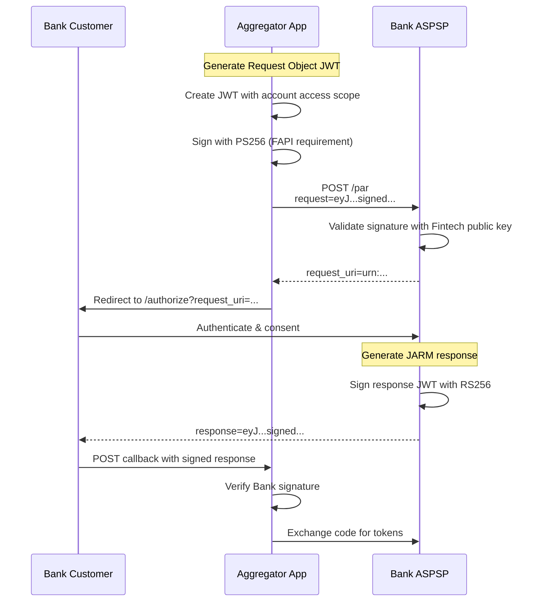
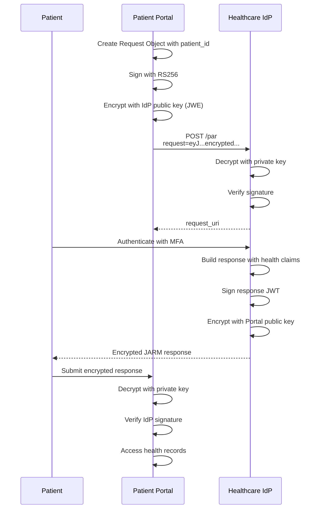
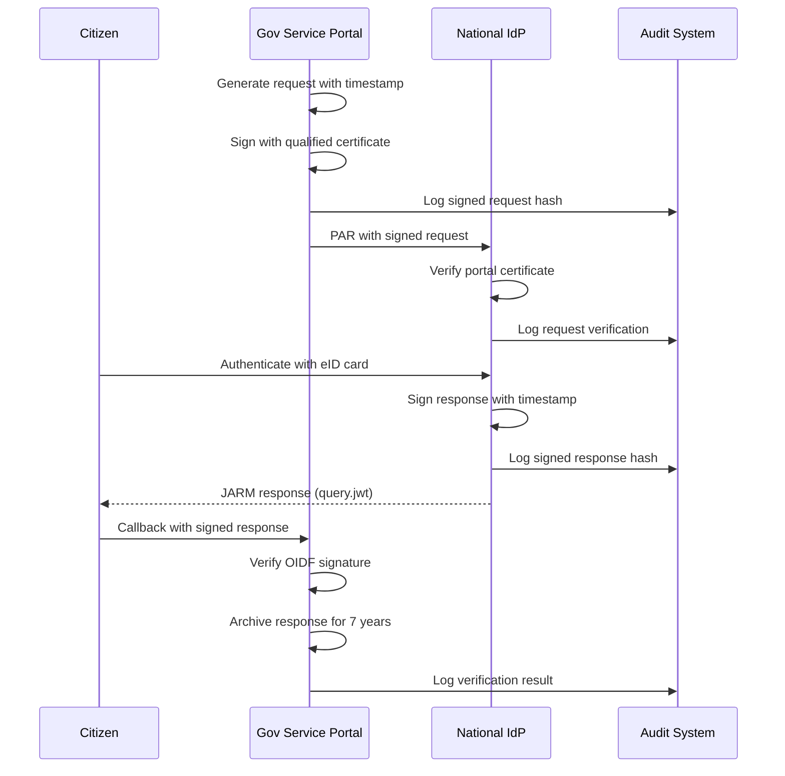
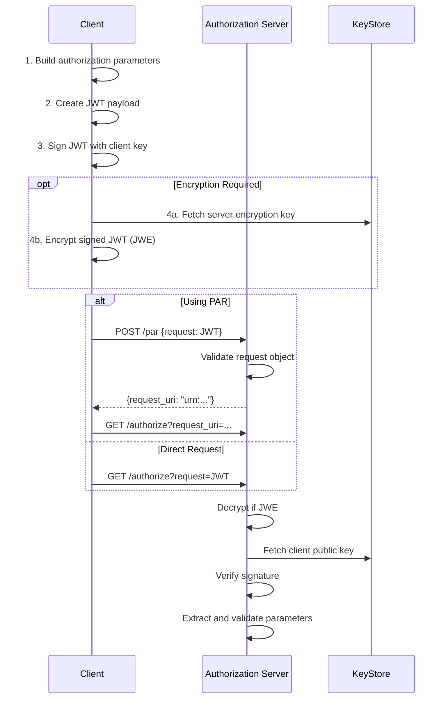
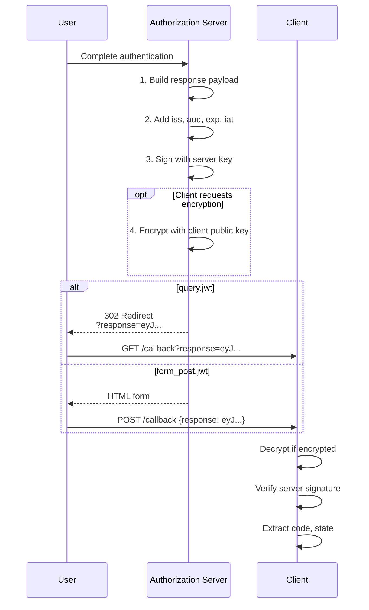

# JAR (JWT-Secured Authorization Request) and JARM (JWT-Secured Authorization Response Mode)

Secure authorization requests and responses using JWT signing and encryption for high-security environments.

## Overview

| Specification                                                        | Status         | Security Level |
| -------------------------------------------------------------------- | -------------- | -------------- |
| **JAR**: [RFC 9101](https://datatracker.ietf.org/doc/html/rfc9101)   | ✅ Implemented | High           |
| **JARM**: [OpenID JARM](https://openid.net/specs/oauth-v2-jarm.html) | ✅ Implemented | High           |

### JAR (JWT-Secured Authorization Request)

JAR enhances authorization request security by packaging request parameters in a signed (and optionally encrypted) JWT. This prevents:

- Parameter tampering during transmission
- Interception of sensitive authorization parameters
- Replay attacks on authorization requests

### JARM (JWT-Secured Authorization Response Mode)

JARM protects authorization responses by returning them as signed JWTs, ensuring:

- Response authenticity verification
- Protection against response injection attacks
- Confidentiality through optional encryption

---

## Benefits

### JAR Benefits

| Benefit               | Description                                                   |
| --------------------- | ------------------------------------------------------------- |
| **Request Integrity** | Cryptographic signature prevents parameter modification       |
| **Confidentiality**   | JWE encryption hides sensitive parameters from intermediaries |
| **Non-repudiation**   | Signed requests prove client identity and intent              |
| **FAPI Compliance**   | Required for FAPI 1.0 Advanced and FAPI 2.0                   |

### JARM Benefits

| Benefit                   | Description                                               |
| ------------------------- | --------------------------------------------------------- |
| **Response Authenticity** | Client can verify response came from legitimate OP        |
| **Injection Prevention**  | Protects against authorization response injection attacks |
| **Regulatory Compliance** | Meets Open Banking and PSD2 security requirements         |
| **Audit Trail**           | Signed responses provide verifiable audit evidence        |

---

## Practical Use Cases

### Use Case 1: Open Banking Account Aggregation

**Scenario**: A fintech app aggregates bank accounts from multiple institutions under PSD2/Open Banking regulations.

**Why JAR/JARM**: Regulatory requirements mandate signed authorization requests to prove request authenticity and protect against MITM attacks.



**Implementation**:

```typescript
// Fintech: Create JAR Request Object
import * as jose from 'jose';

async function createOpenBankingRequest(bankConfig: BankConfig) {
  const privateKey = await jose.importPKCS8(process.env.FINTECH_PRIVATE_KEY!, 'PS256');

  const requestObject = await new jose.SignJWT({
    iss: 'https://fintech.example.com',
    aud: bankConfig.issuer,
    client_id: bankConfig.clientId,
    response_type: 'code',
    response_mode: 'jwt', // Request JARM response
    redirect_uri: 'https://fintech.example.com/callback',
    scope: 'openid accounts',
    state: crypto.randomUUID(),
    nonce: crypto.randomUUID(),
    claims: {
      id_token: {
        acr: {
          essential: true,
          values: ['urn:openbanking:psd2:sca'],
        },
      },
    },
  })
    .setProtectedHeader({ alg: 'PS256', kid: 'fintech-signing-key-1' })
    .setIssuedAt()
    .setExpirationTime('5m')
    .sign(privateKey);

  // Push to PAR endpoint
  const parResponse = await fetch(`${bankConfig.issuer}/as/par`, {
    method: 'POST',
    headers: { 'Content-Type': 'application/x-www-form-urlencoded' },
    body: new URLSearchParams({
      client_id: bankConfig.clientId,
      request: requestObject,
    }),
  });

  return parResponse.json();
}

// Fintech: Verify JARM response
async function verifyBankResponse(responseJwt: string, bankConfig: BankConfig) {
  const JWKS = jose.createRemoteJWKSet(new URL(`${bankConfig.issuer}/.well-known/jwks.json`));

  const { payload } = await jose.jwtVerify(responseJwt, JWKS, {
    issuer: bankConfig.issuer,
    audience: bankConfig.clientId,
    maxTokenAge: '10m',
  });

  // Validate state matches stored value
  if (payload.state !== sessionStorage.getItem('auth_state')) {
    throw new Error('State mismatch - possible CSRF attack');
  }

  return payload.code as string;
}
```

---

### Use Case 2: Enterprise Healthcare Portal with Encrypted Claims

**Scenario**: A healthcare organization's patient portal handles HIPAA-protected health information during authentication.

**Why JAR/JARM**: Authorization requests contain PHI (patient identifiers), and responses may include sensitive claims. Both must be encrypted to meet HIPAA requirements.



**Implementation**:

```typescript
// Portal: Create encrypted JAR Request
async function createHIPAARequest(patientContext: PatientContext) {
  // Sign the request first
  const signedRequest = await new jose.SignJWT({
    iss: 'https://portal.healthcare.example.com',
    aud: 'https://idp.healthcare.example.com',
    client_id: process.env.CLIENT_ID,
    response_type: 'code',
    response_mode: 'form_post.jwt',
    redirect_uri: 'https://portal.healthcare.example.com/callback',
    scope: 'openid profile health_records',
    state: crypto.randomUUID(),
    nonce: crypto.randomUUID(),
    // PHI in claims - must be encrypted
    claims: {
      id_token: {
        patient_id: { value: patientContext.mrn },
        department: { value: patientContext.department },
      },
    },
  })
    .setProtectedHeader({ alg: 'RS256', kid: 'portal-signing-1' })
    .setExpirationTime('3m')
    .sign(await getSigningKey());

  // Encrypt the signed request (nested JWT)
  const idpEncryptionKey = await fetchIdPEncryptionKey();
  const encryptedRequest = await new jose.CompactEncrypt(new TextEncoder().encode(signedRequest))
    .setProtectedHeader({
      alg: 'RSA-OAEP-256',
      enc: 'A256GCM',
      kid: idpEncryptionKey.kid,
      cty: 'JWT', // Indicates nested JWT
    })
    .encrypt(idpEncryptionKey);

  return encryptedRequest;
}

// Portal: Decrypt and verify JARM response
async function handleEncryptedResponse(encryptedResponse: string) {
  // Step 1: Decrypt with portal's private key
  const { plaintext } = await jose.compactDecrypt(encryptedResponse, await getDecryptionKey());

  const signedResponse = new TextDecoder().decode(plaintext);

  // Step 2: Verify IdP signature
  const idpJWKS = jose.createRemoteJWKSet(
    new URL('https://idp.healthcare.example.com/.well-known/jwks.json')
  );

  const { payload } = await jose.jwtVerify(signedResponse, idpJWKS, {
    issuer: 'https://idp.healthcare.example.com',
    audience: process.env.CLIENT_ID!,
  });

  // Safely access health information
  console.log('Patient verified:', payload.sub);
  return payload;
}
```

**Client Registration** (supporting encrypted responses):

```json
{
  "client_id": "healthcare-portal",
  "client_name": "Patient Portal",
  "request_object_signing_alg": "RS256",
  "request_object_encryption_alg": "RSA-OAEP-256",
  "request_object_encryption_enc": "A256GCM",
  "authorization_signed_response_alg": "RS256",
  "authorization_encrypted_response_alg": "RSA-OAEP-256",
  "authorization_encrypted_response_enc": "A256GCM",
  "jwks_uri": "https://portal.healthcare.example.com/.well-known/jwks.json"
}
```

---

### Use Case 3: Government Digital Identity with Detached Signature

**Scenario**: A government e-services portal integrates with a national digital identity system requiring high assurance authentication.

**Why JAR/JARM**: Government systems mandate non-repudiable request/response chains for audit compliance and legal evidence.



**Implementation**:

```typescript
// Government Portal: Create auditable request
async function createGovernmentRequest(serviceContext: ServiceContext) {
  const requestId = crypto.randomUUID();
  const timestamp = new Date().toISOString();

  const requestPayload = {
    jti: requestId,
    iss: 'https://service.gov.example',
    aud: 'https://nationalid.gov.example',
    client_id: process.env.GOV_CLIENT_ID,
    response_type: 'code',
    response_mode: 'query.jwt',
    redirect_uri: 'https://service.gov.example/auth/callback',
    scope: 'openid identity_card:read',
    state: requestId,
    nonce: crypto.randomUUID(),
    acr_values: 'urn:gov:assurance:high',
    // Government-specific claims
    claims: {
      id_token: {
        identity_number: { essential: true },
        birth_date: { essential: true },
        nationality: { essential: true },
      },
    },
    // Audit metadata
    purpose: serviceContext.servicePurpose,
    legal_basis: 'GDPR_6_1_E', // Public task legal basis
    data_controller: 'Ministry of Digital Services',
  };

  // Sign with qualified electronic seal
  const signedRequest = await new jose.SignJWT(requestPayload)
    .setProtectedHeader({
      alg: 'PS256',
      kid: 'gov-qualified-seal-2024',
      x5c: [await getQualifiedCertificateChain()],
    })
    .setIssuedAt()
    .setExpirationTime('2m')
    .sign(await getQualifiedSealKey());

  // Log to audit system
  await auditLog.record({
    action: 'AUTHORIZATION_REQUEST',
    requestId,
    timestamp,
    requestHash: await sha256(signedRequest),
    serviceContext,
  });

  return signedRequest;
}

// Government Portal: Process and archive response
async function processGovernmentResponse(responseJwt: string, expectedState: string) {
  const nationalIdpJWKS = jose.createRemoteJWKSet(
    new URL('https://nationalid.gov.example/.well-known/jwks.json')
  );

  // Verify with certificate validation
  const { payload, protectedHeader } = await jose.jwtVerify(responseJwt, nationalIdpJWKS, {
    issuer: 'https://nationalid.gov.example',
    audience: process.env.GOV_CLIENT_ID!,
    maxTokenAge: '10m',
  });

  // Validate state
  if (payload.state !== expectedState) {
    await auditLog.record({
      action: 'AUTHORIZATION_RESPONSE_INVALID',
      error: 'STATE_MISMATCH',
      responseHash: await sha256(responseJwt),
    });
    throw new SecurityError('State mismatch detected');
  }

  // Archive for legal retention period (7 years)
  await archiveService.store({
    documentType: 'AUTHORIZATION_RESPONSE',
    content: responseJwt,
    metadata: {
      requestId: payload.state,
      timestamp: new Date().toISOString(),
      signatureAlgorithm: protectedHeader.alg,
      issuer: payload.iss,
    },
    retentionYears: 7,
  });

  await auditLog.record({
    action: 'AUTHORIZATION_RESPONSE_VERIFIED',
    requestId: payload.state,
    subject: payload.sub,
    responseHash: await sha256(responseJwt),
  });

  return payload;
}
```

---

## How JAR Works

### Request Object Flow



### Supported Algorithms

#### Signature Algorithms (JAR)

| Algorithm | Type              | Security Level | FAPI Compatible      |
| --------- | ----------------- | -------------- | -------------------- |
| `RS256`   | RSA + SHA-256     | Good           | ✅ FAPI 1.0          |
| `RS384`   | RSA + SHA-384     | Better         | ✅                   |
| `RS512`   | RSA + SHA-512     | Best           | ✅                   |
| `PS256`   | RSA-PSS + SHA-256 | Best           | ✅ FAPI 2.0 Required |
| `ES256`   | ECDSA + SHA-256   | Good           | ✅                   |
| `none`    | No signature      | ⚠️ Dev only    | ❌                   |

#### Encryption Algorithms

**Key Management (alg)**:

- `RSA-OAEP` - RSA with OAEP padding
- `RSA-OAEP-256` - RSA-OAEP with SHA-256
- `ECDH-ES` - Elliptic Curve Diffie-Hellman
- `ECDH-ES+A128KW` - ECDH-ES with AES-128 Key Wrap
- `ECDH-ES+A256KW` - ECDH-ES with AES-256 Key Wrap

**Content Encryption (enc)**:

- `A128GCM` - AES-128-GCM
- `A256GCM` - AES-256-GCM (Recommended)
- `A128CBC-HS256` - AES-128-CBC with HMAC-SHA-256
- `A256CBC-HS512` - AES-256-CBC with HMAC-SHA-512

---

## How JARM Works

### Response JWT Flow



### Response Modes

| Mode            | Delivery Method     | Token Exposure | Use Case              |
| --------------- | ------------------- | -------------- | --------------------- |
| `query.jwt`     | URL query parameter | Low            | Default for code flow |
| `fragment.jwt`  | URL fragment        | Browser only   | Implicit/Hybrid       |
| `form_post.jwt` | HTTP POST body      | Minimal        | High security         |
| `jwt`           | Auto-selected       | Varies         | Generic               |

---

## API Reference

### JAR: Authorization Request with Request Object

**Direct request parameter**:

```http
GET /authorize?
  client_id=client123&
  request=eyJhbGciOiJSUzI1NiIsInR5cCI6Im9hdXRoLWF1dGh6LXJlcStqd3QifQ...
Host: auth.example.com
```

**With PAR request_uri**:

```http
GET /authorize?
  client_id=client123&
  request_uri=urn:ietf:params:oauth:request_uri:abc123xyz
Host: auth.example.com
```

### Request Object Structure

**Header**:

```json
{
  "alg": "RS256",
  "typ": "oauth-authz-req+jwt",
  "kid": "client-signing-key-1"
}
```

**Payload**:

```json
{
  "iss": "client123",
  "aud": "https://auth.example.com",
  "iat": 1703030400,
  "exp": 1703030700,
  "jti": "unique-request-id",
  "client_id": "client123",
  "response_type": "code",
  "response_mode": "query.jwt",
  "redirect_uri": "https://client.example.com/callback",
  "scope": "openid profile email",
  "state": "random-state-value",
  "nonce": "random-nonce-value",
  "code_challenge": "E9Melhoa2OwvFrEMTJguCHaoeK1t8URWbuGJSstw-cM",
  "code_challenge_method": "S256"
}
```

### JARM: Response Format

**Success Response (query.jwt)**:

```http
HTTP/1.1 302 Found
Location: https://client.example.com/callback?response=eyJhbGciOiJSUzI1NiIsInR5cCI6IkpXVCJ9...
```

**Response JWT Payload**:

```json
{
  "iss": "https://auth.example.com",
  "aud": "client123",
  "iat": 1703030500,
  "exp": 1703031100,
  "code": "authorization-code-value",
  "state": "random-state-value"
}
```

**Error Response**:

```json
{
  "iss": "https://auth.example.com",
  "aud": "client123",
  "iat": 1703030500,
  "exp": 1703031100,
  "error": "access_denied",
  "error_description": "User denied consent",
  "state": "random-state-value"
}
```

---

## Client Registration

### JAR Configuration

```json
{
  "client_id": "secure-client",
  "request_object_signing_alg": "PS256",
  "request_object_encryption_alg": "RSA-OAEP-256",
  "request_object_encryption_enc": "A256GCM",
  "jwks_uri": "https://client.example.com/.well-known/jwks.json"
}
```

### JARM Configuration

```json
{
  "client_id": "secure-client",
  "authorization_signed_response_alg": "RS256",
  "authorization_encrypted_response_alg": "RSA-OAEP",
  "authorization_encrypted_response_enc": "A256GCM",
  "jwks": {
    "keys": [
      {
        "kty": "RSA",
        "use": "enc",
        "kid": "client-encryption-1",
        "n": "...",
        "e": "AQAB"
      }
    ]
  }
}
```

---

## Discovery Metadata

```http
GET /.well-known/openid-configuration
```

```json
{
  "issuer": "https://auth.example.com",

  "request_parameter_supported": true,
  "request_uri_parameter_supported": true,
  "require_request_uri_registration": false,
  "request_object_signing_alg_values_supported": [
    "RS256",
    "RS384",
    "RS512",
    "PS256",
    "PS384",
    "PS512",
    "ES256",
    "none"
  ],
  "request_object_encryption_alg_values_supported": [
    "RSA-OAEP",
    "RSA-OAEP-256",
    "ECDH-ES",
    "ECDH-ES+A128KW",
    "ECDH-ES+A256KW"
  ],
  "request_object_encryption_enc_values_supported": [
    "A128GCM",
    "A192GCM",
    "A256GCM",
    "A128CBC-HS256",
    "A256CBC-HS512"
  ],

  "response_modes_supported": [
    "query",
    "fragment",
    "form_post",
    "query.jwt",
    "fragment.jwt",
    "form_post.jwt",
    "jwt"
  ],
  "authorization_signing_alg_values_supported": ["RS256", "PS256", "ES256"],
  "authorization_encryption_alg_values_supported": ["RSA-OAEP", "RSA-OAEP-256", "ECDH-ES+A256KW"],
  "authorization_encryption_enc_values_supported": ["A128GCM", "A256GCM"]
}
```

---

## Security Considerations

### JAR Security

| Consideration           | Recommendation                                    |
| ----------------------- | ------------------------------------------------- |
| **Signature Algorithm** | Use PS256 or ES256 for FAPI compliance            |
| **Request Expiration**  | Set `exp` to 5 minutes or less                    |
| **Unique Requests**     | Include `jti` claim to prevent replay             |
| **Encryption**          | Encrypt when including sensitive parameters       |
| **Key Rotation**        | Support multiple `kid` values for smooth rotation |

### JARM Security

| Consideration           | Recommendation                             |
| ----------------------- | ------------------------------------------ |
| **Response Expiration** | 10 minutes maximum (default)               |
| **Audience Validation** | Always verify `aud` matches client_id      |
| **Issuer Validation**   | Always verify `iss` matches expected OP    |
| **State Binding**       | Verify `state` matches request             |
| **Clock Skew**          | Allow 60 seconds tolerance for `exp`/`iat` |

### Attack Prevention

| Attack                 | Prevention                              |
| ---------------------- | --------------------------------------- |
| **Request Tampering**  | Signature verification                  |
| **Response Injection** | JARM signatures + state validation      |
| **Replay Attack**      | `jti` + short expiration + one-time use |
| **Man-in-the-Middle**  | Encryption + TLS                        |
| **Key Confusion**      | Validate `kid` against registered keys  |

---

## Error Handling

### JAR Errors

| Error Code               | Description                   | Resolution               |
| ------------------------ | ----------------------------- | ------------------------ |
| `invalid_request_object` | Malformed JWT structure       | Check JWT encoding       |
| `invalid_request_object` | Signature verification failed | Verify signing key       |
| `invalid_request_object` | Decryption failed             | Check encryption keys    |
| `invalid_request_uri`    | Cannot fetch request_uri      | Verify URI accessibility |
| `invalid_request_uri`    | request_uri expired           | Use fresh PAR request    |

### JARM Errors

| Error Code       | Description                     | Resolution           |
| ---------------- | ------------------------------- | -------------------- |
| `server_error`   | Response JWT generation failed  | Check server keys    |
| `invalid_client` | Client encryption key not found | Register client JWKS |

---

## Configuration

### Environment Variables

| Variable                 | Description                     | Default             |
| ------------------------ | ------------------------------- | ------------------- |
| `JAR_REQUIRE_SIGNATURE`  | Require signed request objects  | `true`              |
| `JAR_ALLOWED_ALGORITHMS` | Allowed signing algorithms      | `RS256,PS256,ES256` |
| `JARM_RESPONSE_LIFETIME` | Response JWT validity (seconds) | `600`               |
| `JARM_SIGNING_ALGORITHM` | Response signing algorithm      | `RS256`             |

### KV Configuration

```json
{
  "jar_require_encryption": false,
  "jar_max_request_age_seconds": 300,
  "jarm_default_response_mode": "query.jwt",
  "jarm_require_encryption": false
}
```

---

## Testing

### Test JAR Request Object

```bash
# Create and sign request object
node -e "
const jose = require('jose');
(async () => {
  const key = await jose.generateKeyPair('RS256');
  const jwt = await new jose.SignJWT({
    client_id: 'test-client',
    response_type: 'code',
    redirect_uri: 'https://localhost:3000/callback',
    scope: 'openid',
    state: 'test-state'
  })
  .setProtectedHeader({ alg: 'RS256' })
  .setIssuedAt()
  .setExpirationTime('5m')
  .setIssuer('test-client')
  .setAudience('https://auth.example.com')
  .sign(key.privateKey);
  console.log(jwt);
})();
"
```

### Verify JARM Response

```bash
# Decode and verify response JWT
node -e "
const jose = require('jose');
const responseJwt = process.argv[1];
(async () => {
  const JWKS = jose.createRemoteJWKSet(
    new URL('https://auth.example.com/.well-known/jwks.json')
  );
  const { payload } = await jose.jwtVerify(responseJwt, JWKS);
  console.log(JSON.stringify(payload, null, 2));
})();
" "eyJ..."
```

---

## Troubleshooting

### Common Issues

#### "invalid_request_object: signature verification failed"

**Causes**:

- Signing key mismatch
- Key not registered with OP
- Incorrect algorithm

**Solution**:

```bash
# Verify client JWKS is accessible
curl https://client.example.com/.well-known/jwks.json

# Check registered client configuration
curl -H "Authorization: Bearer $ADMIN_TOKEN" \
  https://auth.example.com/api/admin/clients/CLIENT_ID
```

#### "JARM response verification failed"

**Causes**:

- Server key rotation
- Clock skew exceeds tolerance
- Audience mismatch

**Solution**:

```typescript
// Allow clock skew
const { payload } = await jose.jwtVerify(response, JWKS, {
  clockTolerance: 120, // 2 minutes
});
```

#### "JWE decryption failed"

**Causes**:

- Wrong encryption key
- Algorithm mismatch
- Corrupted ciphertext

**Solution**:

- Verify encryption key `kid` matches
- Check `alg` and `enc` header values
- Re-fetch server encryption key

---

## Implementation Files

| Component       | File                                     | Description                           |
| --------------- | ---------------------------------------- | ------------------------------------- |
| JAR Processing  | `packages/op-auth/src/authorize.ts`      | Request object parsing and validation |
| JWT Utilities   | `packages/shared/src/utils/jwt.ts`       | JWT sign/verify functions             |
| JWE Utilities   | `packages/shared/src/utils/jwe.ts`       | Encryption/decryption                 |
| JARM Generation | `packages/op-auth/src/authorize.ts`      | Response JWT creation                 |
| Discovery       | `packages/op-discovery/src/discovery.ts` | Metadata endpoints                    |
| Types           | `packages/shared/src/types/oidc.ts`      | ClientMetadata, OIDCProviderMetadata  |

---

## References

- [RFC 9101: JWT-Secured Authorization Request (JAR)](https://datatracker.ietf.org/doc/html/rfc9101)
- [JARM: JWT-Secured Authorization Response Mode](https://openid.net/specs/oauth-v2-jarm.html)
- [RFC 7516: JSON Web Encryption (JWE)](https://datatracker.ietf.org/doc/html/rfc7516)
- [RFC 7519: JSON Web Token (JWT)](https://datatracker.ietf.org/doc/html/rfc7519)
- [FAPI 2.0 Security Profile](https://openid.net/specs/fapi-2_0-security-profile.html)
- [Open Banking UK Security Profile](https://openbankinguk.github.io/read-write-api-site3/v3.1.10/profiles/security-profile.html)

---

**Last Updated**: 2025-12-20
**Status**: ✅ Fully Implemented
**Implementation**: `packages/op-auth/src/authorize.ts`, `packages/shared/src/utils/jwt.ts`
