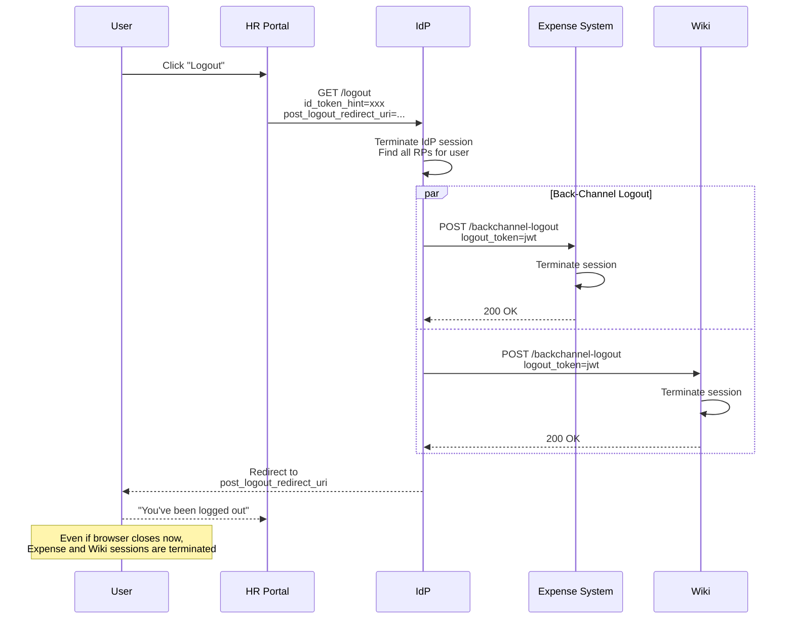
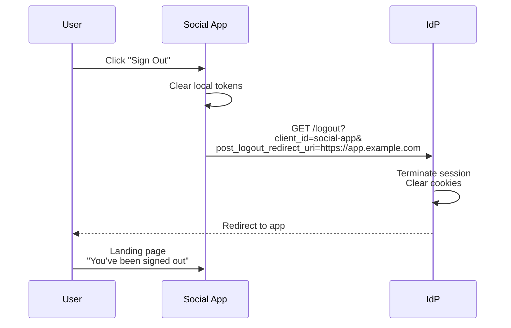

# Logout & Session Termination

Comprehensive logout mechanisms including RP-Initiated, Front-Channel, and Back-Channel Logout.

## Overview

| Specification | Status | Mechanism |
|---------------|--------|-----------|
| [RP-Initiated Logout 1.0](https://openid.net/specs/openid-connect-rpinitiated-1_0.html) | ✅ Implemented | Browser redirect |
| [Front-Channel Logout 1.0](https://openid.net/specs/openid-connect-frontchannel-1_0.html) | ✅ Implemented | Iframe-based |
| [Back-Channel Logout 1.0](https://openid.net/specs/openid-connect-backchannel-1_0.html) | ✅ Implemented | Server-to-server |

Authrim supports multiple logout mechanisms to ensure user sessions are properly terminated across all applications in a single sign-on environment.

---

## Benefits

| Benefit | Description |
|---------|-------------|
| **Single Logout** | Log out from all applications at once |
| **Security** | Prevent session hijacking after logout |
| **Compliance** | Meet GDPR/HIPAA session termination requirements |
| **Flexibility** | Choose mechanism based on architecture |
| **Reliability** | Back-channel works even with blocked iframes |

---

## Logout Mechanisms Comparison

| Mechanism | How It Works | Pros | Cons |
|-----------|--------------|------|------|
| **RP-Initiated** | Browser redirect to IdP | Simple, reliable | User must be present |
| **Front-Channel** | Iframes to each RP | No backend required | May be blocked by browsers |
| **Back-Channel** | Server-to-server POST | Reliable, works offline | Requires backend endpoint |

---

## Practical Use Cases

### Use Case 1: Enterprise SSO with Back-Channel Logout

**Scenario**: A company has multiple internal applications (HR portal, expense system, wiki). When an employee logs out from any app, all apps must terminate their sessions - even if the user closes the browser immediately.

**Why Back-Channel**: Front-channel logout requires the browser. Back-channel ensures logout propagates server-to-server, even if the user closes the browser.



**Implementation**:

```typescript
// Client Registration with Back-Channel Logout
const clientRegistration = {
  client_id: 'hr-portal',
  client_name: 'HR Portal',

  // Enable back-channel logout
  backchannel_logout_uri: 'https://hr.corp.example.com/backchannel-logout',
  backchannel_logout_session_required: true
};

// HR Portal: Initiate logout
app.get('/logout', (req, res) => {
  const idToken = req.session.idToken;

  // Clear local session
  req.session.destroy();

  // Redirect to IdP logout
  const logoutUrl = new URL('https://auth.corp.example.com/logout');
  logoutUrl.searchParams.set('id_token_hint', idToken);
  logoutUrl.searchParams.set('post_logout_redirect_uri', 'https://hr.corp.example.com/logged-out');
  logoutUrl.searchParams.set('state', crypto.randomUUID());

  res.redirect(logoutUrl.toString());
});

// HR Portal: Handle back-channel logout (from IdP)
app.post('/backchannel-logout', express.text({ type: 'application/jwt' }), async (req, res) => {
  const logoutToken = req.body;

  try {
    // Validate logout token
    const payload = await validateLogoutToken(logoutToken, {
      issuer: 'https://auth.corp.example.com',
      audience: 'hr-portal'
    });

    // Token must have either sub or sid (or both)
    if (!payload.sub && !payload.sid) {
      return res.status(400).send('Invalid logout token');
    }

    // Terminate sessions
    if (payload.sid) {
      // Logout specific session
      await sessionStore.deleteBySessionId(payload.sid);
    } else if (payload.sub) {
      // Logout all sessions for user
      await sessionStore.deleteAllForUser(payload.sub);
    }

    console.log('Back-channel logout processed', {
      sub: payload.sub,
      sid: payload.sid
    });

    res.status(200).send();

  } catch (error) {
    console.error('Back-channel logout failed', error);
    res.status(400).send('Invalid logout token');
  }
});

// Validate logout token (JWT)
async function validateLogoutToken(token: string, options: {
  issuer: string;
  audience: string;
}): Promise<LogoutTokenPayload> {
  const jwks = await fetchJWKS(options.issuer);

  const { payload } = await jose.jwtVerify(token, jwks, {
    issuer: options.issuer,
    audience: options.audience
  });

  // Validate required claims
  if (!payload.iat) throw new Error('Missing iat claim');
  if (!payload.jti) throw new Error('Missing jti claim');
  if (!payload.events?.['http://schemas.openid.net/event/backchannel-logout']) {
    throw new Error('Missing logout event claim');
  }

  // nonce must NOT be present in logout tokens
  if (payload.nonce) {
    throw new Error('Logout token must not contain nonce');
  }

  return payload as LogoutTokenPayload;
}
```

---

### Use Case 2: Consumer App with RP-Initiated Logout

**Scenario**: A social media app wants a simple logout flow. When users click "Sign Out", they're redirected to the IdP to end the session, then back to the app's landing page.

**Why RP-Initiated**: Simplest implementation. No backend endpoints required. Perfect for SPAs and simple web apps.



**Implementation**:

```typescript
// SPA: Logout function
function logout() {
  // Clear local storage
  localStorage.removeItem('access_token');
  localStorage.removeItem('id_token');
  sessionStorage.clear();

  // Build logout URL
  const logoutUrl = new URL('https://auth.example.com/logout');

  // Optional: Include ID token hint for better UX
  const idToken = getStoredIdToken();
  if (idToken) {
    logoutUrl.searchParams.set('id_token_hint', idToken);
  }

  // Required: Where to redirect after logout
  logoutUrl.searchParams.set('post_logout_redirect_uri', 'https://app.example.com');

  // Optional but recommended: State for CSRF protection
  logoutUrl.searchParams.set('state', generateState());

  // Redirect to IdP
  window.location.href = logoutUrl.toString();
}

// Handle return from logout
function handleLogoutCallback() {
  const params = new URLSearchParams(window.location.search);

  // Validate state if used
  const state = params.get('state');
  if (state && state !== getStoredLogoutState()) {
    console.warn('Invalid logout state');
  }

  // Show logged out message
  showMessage('You have been signed out');
}
```

---

### Use Case 3: Multi-App Platform with Front-Channel Logout

**Scenario**: A SaaS platform has multiple micro-frontends running in the same browser. When the user logs out from the main shell, all embedded apps need to clean up their state.

**Why Front-Channel**: All apps are running in the browser. Iframes can notify each app to clean up without backend coordination.

```mermaid
sequenceDiagram
    participant User
    participant Shell as App Shell
    participant Authrim as IdP
    participant App1 as Micro-Frontend 1
    participant App2 as Micro-Frontend 2

    User->>Shell: Click "Logout"

    Shell->>Authrim: GET /logout

    Authrim->>Authrim: Generate logout page<br/>with iframes

    Note over Authrim: HTML page contains:<br/>&lt;iframe src="app1/logout"&gt;<br/>&lt;iframe src="app2/logout"&gt;

    Authrim-->>User: Logout page with iframes

    par Front-Channel iframes load
        User->>App1: (iframe) GET /logout?sid=xxx
        App1->>App1: Clear session
        App1-->>User: (iframe) ✓ Logged out
    and
        User->>App2: (iframe) GET /logout?sid=xxx
        App2->>App2: Clear session
        App2-->>User: (iframe) ✓ Logged out
    end

    Note over User: After iframes complete

    Authrim-->>User: Redirect to<br/>post_logout_redirect_uri
```

**Implementation**:

```typescript
// Client Registration with Front-Channel Logout
const clientRegistration = {
  client_id: 'micro-frontend-1',
  client_name: 'Micro Frontend 1',

  // Enable front-channel logout
  frontchannel_logout_uri: 'https://app1.platform.example.com/logout',
  frontchannel_logout_session_required: true
};

// Micro-Frontend: Handle front-channel logout (GET request in iframe)
app.get('/logout', (req, res) => {
  const sid = req.query.sid;
  const iss = req.query.iss;

  // Validate issuer
  if (iss !== 'https://auth.platform.example.com') {
    return res.status(400).send('Invalid issuer');
  }

  // Clear session
  if (sid) {
    sessionStore.deleteBySessionId(sid);
  }

  // Clear any cookies
  res.clearCookie('session');

  // Return simple page (loaded in iframe)
  res.send(`
    <!DOCTYPE html>
    <html>
    <head><title>Logged Out</title></head>
    <body>
      <script>
        // Notify parent window if needed
        if (window.parent !== window) {
          window.parent.postMessage({ type: 'logout', app: 'micro-frontend-1' }, '*');
        }

        // Clear local storage
        localStorage.clear();
        sessionStorage.clear();
      </script>
      <p>Session terminated</p>
    </body>
    </html>
  `);
});

// IdP: Generate front-channel logout page
function generateFrontChannelLogoutPage(
  clients: Client[],
  sessionId: string,
  postLogoutRedirectUri: string
): string {
  const iframes = clients
    .filter(c => c.frontchannel_logout_uri)
    .map(c => {
      const logoutUrl = new URL(c.frontchannel_logout_uri!);
      logoutUrl.searchParams.set('iss', 'https://auth.platform.example.com');
      if (c.frontchannel_logout_session_required) {
        logoutUrl.searchParams.set('sid', sessionId);
      }
      return `<iframe src="${escapeHtml(logoutUrl.toString())}" style="display:none"></iframe>`;
    })
    .join('\n');

  return `
    <!DOCTYPE html>
    <html>
    <head>
      <title>Logging out...</title>
      <script>
        // Wait for iframes to load, then redirect
        setTimeout(() => {
          window.location.href = '${escapeHtml(postLogoutRedirectUri)}';
        }, 2000);
      </script>
    </head>
    <body>
      <p>Logging out from all applications...</p>
      ${iframes}
    </body>
    </html>
  `;
}
```

---

## API Reference

### RP-Initiated Logout

```http
GET /logout?
  id_token_hint=xxx&
  post_logout_redirect_uri=https://app.example.com&
  state=abc&
  client_id=my-app
```

| Parameter | Required | Description |
|-----------|----------|-------------|
| `id_token_hint` | Recommended | ID token for user identification |
| `post_logout_redirect_uri` | Optional | Where to redirect after logout |
| `state` | Optional | State for CSRF protection |
| `client_id` | Conditional | Required if `id_token_hint` not provided |

### Back-Channel Logout Request (from IdP to RP)

```http
POST /backchannel-logout
Content-Type: application/x-www-form-urlencoded

logout_token=eyJhbGciOiJSUzI1NiIs...
```

### Logout Token Claims

```json
{
  "iss": "https://auth.example.com",
  "sub": "user_123",
  "aud": "client_abc",
  "iat": 1703119856,
  "jti": "unique-token-id",
  "sid": "session_xyz",
  "events": {
    "http://schemas.openid.net/event/backchannel-logout": {}
  }
}
```

---

## Security Considerations

| Consideration | Implementation |
|---------------|----------------|
| **Token Validation** | Verify logout token signature |
| **Replay Prevention** | Track `jti` to prevent replay |
| **HTTPS Required** | All logout endpoints must use TLS |
| **Timeout Handling** | Don't block on slow RPs |

---

## Configuration

### Client Configuration

| Field | Description |
|-------|-------------|
| `post_logout_redirect_uris` | Allowed post-logout URLs |
| `frontchannel_logout_uri` | Front-channel logout URL |
| `frontchannel_logout_session_required` | Include `sid` in iframe |
| `backchannel_logout_uri` | Back-channel logout URL |
| `backchannel_logout_session_required` | Include `sid` in token |

---

## Implementation Files

| Component | File | Description |
|-----------|------|-------------|
| RP-Initiated | `packages/op-auth/src/logout.ts` | Logout endpoint |
| Back-Channel | `packages/op-auth/src/backchannel-logout.ts` | Logout propagation |
| Logout Token | `packages/shared/src/utils/logout-token.ts` | Token generation |

---

## References

- [OIDC RP-Initiated Logout 1.0](https://openid.net/specs/openid-connect-rpinitiated-1_0.html)
- [OIDC Front-Channel Logout 1.0](https://openid.net/specs/openid-connect-frontchannel-1_0.html)
- [OIDC Back-Channel Logout 1.0](https://openid.net/specs/openid-connect-backchannel-1_0.html)

---

**Last Updated**: 2025-12-20
**Status**: ✅ Fully Implemented
**Implementation**: `packages/op-auth/src/`
