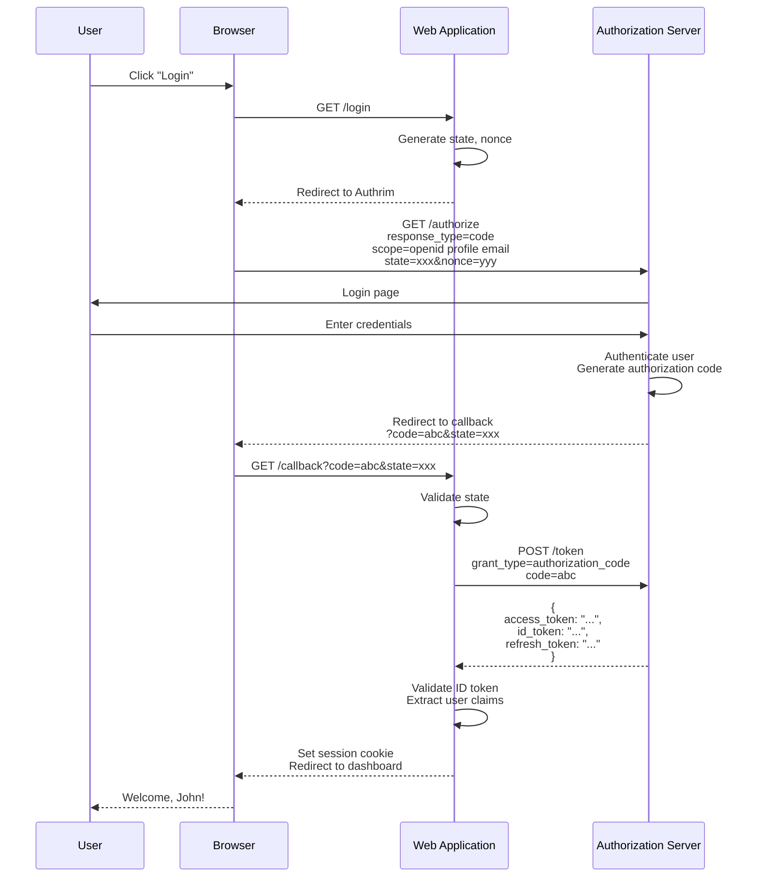
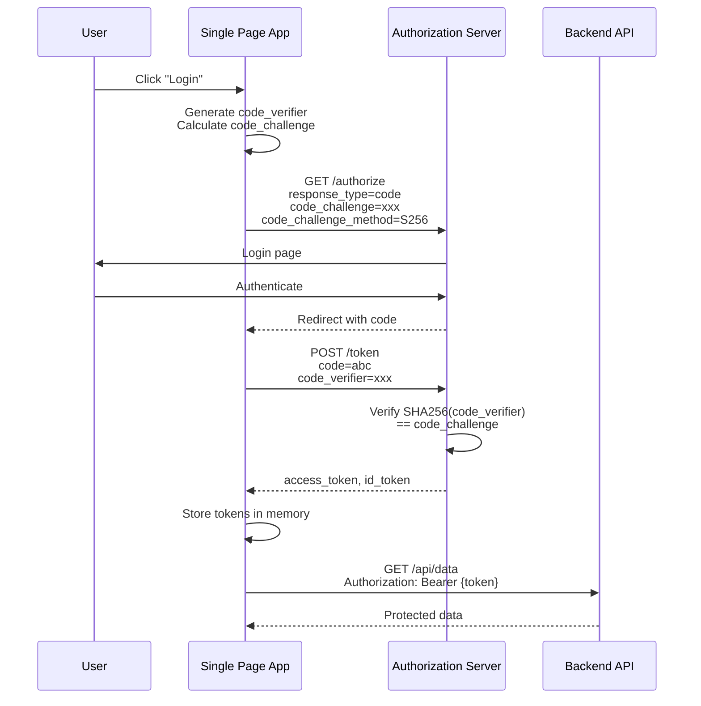
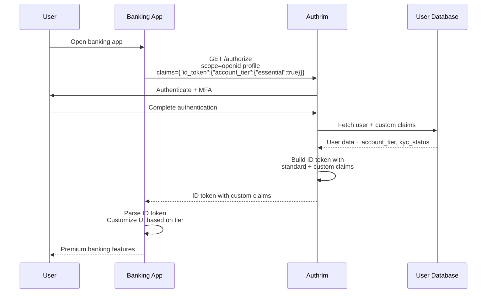

# OpenID Connect Core

The foundation of Authrim's identity layer - standards-compliant OpenID Connect 1.0 implementation.

## Overview

| Specification | Status | Certification |
|---------------|--------|---------------|
| [OIDC Core 1.0](https://openid.net/specs/openid-connect-core-1_0.html) | ✅ Implemented | Dynamic OP |
| [OAuth 2.0 (RFC 6749)](https://datatracker.ietf.org/doc/html/rfc6749) | ✅ Implemented | |
| [JWT (RFC 7519)](https://datatracker.ietf.org/doc/html/rfc7519) | ✅ Implemented | |

OpenID Connect (OIDC) is an identity layer on top of OAuth 2.0 that enables clients to verify user identity and obtain basic profile information. Authrim implements the full OIDC Core specification.

---

## Benefits

| Benefit | Description |
|---------|-------------|
| **Standardized Identity** | Interoperable with any OIDC-compliant client |
| **ID Tokens** | Cryptographically signed identity assertions |
| **Claims & Scopes** | Fine-grained access to user attributes |
| **Multiple Flows** | Authorization Code, Implicit, Hybrid |
| **Extensible** | Custom claims, ACR values, and more |

---

## Practical Use Cases

### Use Case 1: Web Application with Authorization Code Flow

**Scenario**: A traditional web application (server-rendered) needs to authenticate users and access their profile information. The application has a backend that can securely store client secrets.

**Why Authorization Code Flow**: This is the most secure flow for server-side applications. The authorization code is exchanged for tokens on the backend, never exposing tokens to the browser.



**Implementation**:

```typescript
// Express.js Web Application

// 1. Login route - redirect to authorization server
app.get('/login', (req, res) => {
  const state = crypto.randomUUID();
  const nonce = crypto.randomUUID();

  // Store in session for validation
  req.session.authState = state;
  req.session.authNonce = nonce;

  const authUrl = new URL('https://auth.example.com/authorize');
  authUrl.searchParams.set('response_type', 'code');
  authUrl.searchParams.set('client_id', process.env.CLIENT_ID);
  authUrl.searchParams.set('redirect_uri', 'https://app.example.com/callback');
  authUrl.searchParams.set('scope', 'openid profile email');
  authUrl.searchParams.set('state', state);
  authUrl.searchParams.set('nonce', nonce);

  res.redirect(authUrl.toString());
});

// 2. Callback route - exchange code for tokens
app.get('/callback', async (req, res) => {
  const { code, state, error } = req.query;

  // Validate state (CSRF protection)
  if (state !== req.session.authState) {
    return res.status(403).send('Invalid state');
  }

  if (error) {
    return res.status(400).send(`Authentication error: ${error}`);
  }

  // Exchange code for tokens
  const tokenResponse = await fetch('https://auth.example.com/token', {
    method: 'POST',
    headers: {
      'Content-Type': 'application/x-www-form-urlencoded',
      'Authorization': `Basic ${Buffer.from(
        `${process.env.CLIENT_ID}:${process.env.CLIENT_SECRET}`
      ).toString('base64')}`
    },
    body: new URLSearchParams({
      grant_type: 'authorization_code',
      code,
      redirect_uri: 'https://app.example.com/callback'
    })
  });

  const tokens = await tokenResponse.json();

  // Validate ID token
  const idToken = await validateIdToken(tokens.id_token, {
    issuer: 'https://auth.example.com',
    audience: process.env.CLIENT_ID,
    nonce: req.session.authNonce
  });

  // Create session
  req.session.user = {
    sub: idToken.sub,
    email: idToken.email,
    name: idToken.name
  };
  req.session.accessToken = tokens.access_token;

  res.redirect('/dashboard');
});

// 3. Protected route
app.get('/dashboard', requireAuth, (req, res) => {
  res.render('dashboard', { user: req.session.user });
});
```

---

### Use Case 2: Single Page Application with PKCE

**Scenario**: A React/Vue/Angular SPA needs to authenticate users. Since SPAs cannot securely store client secrets, PKCE (Proof Key for Code Exchange) is used to secure the authorization code flow.

**Why PKCE**: Public clients (SPAs, mobile apps) cannot keep secrets. PKCE provides security by using a dynamically generated code verifier that only the legitimate client knows.



**Implementation**:

```typescript
// React SPA with PKCE

class AuthService {
  private codeVerifier: string | null = null;

  // Generate PKCE code verifier and challenge
  private async generatePKCE(): Promise<{ verifier: string; challenge: string }> {
    const array = new Uint8Array(32);
    crypto.getRandomValues(array);
    const verifier = this.base64UrlEncode(array);

    const encoder = new TextEncoder();
    const data = encoder.encode(verifier);
    const hash = await crypto.subtle.digest('SHA-256', data);
    const challenge = this.base64UrlEncode(new Uint8Array(hash));

    return { verifier, challenge };
  }

  async login(): Promise<void> {
    const { verifier, challenge } = await this.generatePKCE();

    // Store verifier for token exchange
    sessionStorage.setItem('pkce_verifier', verifier);

    const state = crypto.randomUUID();
    sessionStorage.setItem('auth_state', state);

    const authUrl = new URL('https://auth.example.com/authorize');
    authUrl.searchParams.set('response_type', 'code');
    authUrl.searchParams.set('client_id', 'spa-client');
    authUrl.searchParams.set('redirect_uri', window.location.origin + '/callback');
    authUrl.searchParams.set('scope', 'openid profile email');
    authUrl.searchParams.set('state', state);
    authUrl.searchParams.set('code_challenge', challenge);
    authUrl.searchParams.set('code_challenge_method', 'S256');

    window.location.href = authUrl.toString();
  }

  async handleCallback(): Promise<User> {
    const params = new URLSearchParams(window.location.search);
    const code = params.get('code');
    const state = params.get('state');

    // Validate state
    if (state !== sessionStorage.getItem('auth_state')) {
      throw new Error('Invalid state');
    }

    const codeVerifier = sessionStorage.getItem('pkce_verifier');

    // Exchange code for tokens
    const response = await fetch('https://auth.example.com/token', {
      method: 'POST',
      headers: { 'Content-Type': 'application/x-www-form-urlencoded' },
      body: new URLSearchParams({
        grant_type: 'authorization_code',
        code: code!,
        redirect_uri: window.location.origin + '/callback',
        client_id: 'spa-client',
        code_verifier: codeVerifier!
      })
    });

    const tokens = await response.json();

    // Store tokens (in memory for security)
    this.accessToken = tokens.access_token;
    this.idToken = tokens.id_token;

    // Clean up
    sessionStorage.removeItem('pkce_verifier');
    sessionStorage.removeItem('auth_state');

    return this.parseIdToken(tokens.id_token);
  }
}
```

---

### Use Case 3: Mobile Application with Custom Claims

**Scenario**: A banking mobile app requires rich user information including custom claims (account tier, KYC status) in the ID token. The app also needs to request specific claims dynamically.

**Why Custom Claims**: Standard OIDC scopes may not include all required user attributes. The claims parameter allows requesting specific claims, and custom claims extend the standard set.



**Implementation**:

```typescript
// Mobile app requesting custom claims

async function authenticateWithCustomClaims() {
  // Request specific claims in ID token
  const claimsRequest = {
    id_token: {
      // Essential claims - authentication fails if not available
      account_tier: { essential: true },
      kyc_status: { essential: true },

      // Optional claims with specific values
      acr: { values: ['urn:bank:mfa:sms', 'urn:bank:mfa:biometric'] },

      // Standard claims with specific requirements
      email: { essential: true },
      email_verified: { essential: true, value: true }
    },
    userinfo: {
      // Additional claims for userinfo endpoint
      transaction_limits: null,
      linked_accounts: null
    }
  };

  const authUrl = new URL('https://auth.bank.example.com/authorize');
  authUrl.searchParams.set('response_type', 'code');
  authUrl.searchParams.set('client_id', 'mobile-banking-app');
  authUrl.searchParams.set('redirect_uri', 'bankapp://callback');
  authUrl.searchParams.set('scope', 'openid profile email accounts:read');
  authUrl.searchParams.set('claims', JSON.stringify(claimsRequest));
  authUrl.searchParams.set('acr_values', 'urn:bank:mfa:biometric');

  // Open authentication
  const result = await InAppBrowser.openAuth(authUrl.toString(), 'bankapp://callback');

  // Exchange code and get tokens
  const tokens = await exchangeCode(result.code);

  // Parse ID token with custom claims
  const idToken = decodeIdToken(tokens.id_token);

  console.log('ID Token claims:', {
    sub: idToken.sub,
    email: idToken.email,
    account_tier: idToken.account_tier,    // Custom claim: "premium" | "standard"
    kyc_status: idToken.kyc_status,        // Custom claim: "verified" | "pending"
    acr: idToken.acr                        // Actual authentication level
  });

  // Customize app based on account tier
  if (idToken.account_tier === 'premium') {
    enablePremiumFeatures();
  }

  return idToken;
}

// Server-side: Configure custom claims in client registration
const clientConfig = {
  client_id: 'mobile-banking-app',
  client_name: 'Mobile Banking App',

  // Custom claims configuration
  custom_claims: {
    id_token: ['account_tier', 'kyc_status'],
    userinfo: ['transaction_limits', 'linked_accounts']
  },

  // Claims source mapping
  claims_mapping: {
    account_tier: 'user.subscription.tier',
    kyc_status: 'user.kyc.status',
    transaction_limits: 'user.limits',
    linked_accounts: 'user.accounts'
  }
};
```

---

## Supported Flows

### Authorization Code Flow

| Aspect | Description |
|--------|-------------|
| **response_type** | `code` |
| **Use Case** | Server-side web applications |
| **Security** | Highest - tokens never exposed to browser |
| **PKCE** | Optional for confidential clients, required for public clients |

### Implicit Flow (Legacy)

| Aspect | Description |
|--------|-------------|
| **response_type** | `id_token`, `id_token token` |
| **Use Case** | Legacy SPAs (not recommended) |
| **Security** | Lower - tokens in URL fragment |
| **Note** | Use Authorization Code + PKCE instead |

### Hybrid Flow

| Aspect | Description |
|--------|-------------|
| **response_type** | `code id_token`, `code token`, `code id_token token` |
| **Use Case** | When immediate ID token is needed |
| **Security** | High - combines code and token flows |

---

## Standard Scopes

| Scope | Claims Returned |
|-------|-----------------|
| `openid` | `sub` (required for OIDC) |
| `profile` | `name`, `family_name`, `given_name`, `nickname`, `picture`, `gender`, `birthdate`, `zoneinfo`, `locale`, `updated_at` |
| `email` | `email`, `email_verified` |
| `address` | `address` (structured) |
| `phone` | `phone_number`, `phone_number_verified` |

---

## ID Token Structure

```json
{
  "iss": "https://auth.example.com",
  "sub": "user_123",
  "aud": "client_abc",
  "exp": 1703123456,
  "iat": 1703119856,
  "auth_time": 1703119850,
  "nonce": "n-0S6_WzA2Mj",
  "acr": "urn:mace:incommon:iap:silver",
  "at_hash": "MTIzNDU2Nzg5MGFiY2RlZg",
  "name": "John Doe",
  "email": "john@example.com",
  "email_verified": true
}
```

---

## API Reference

### Authorization Endpoint

```http
GET /authorize?
  response_type=code&
  client_id=CLIENT_ID&
  redirect_uri=https://app.example.com/callback&
  scope=openid+profile+email&
  state=xyz&
  nonce=abc
```

### Token Endpoint

```http
POST /token
Content-Type: application/x-www-form-urlencoded

grant_type=authorization_code&
code=AUTHORIZATION_CODE&
redirect_uri=https://app.example.com/callback&
client_id=CLIENT_ID&
client_secret=CLIENT_SECRET
```

### Token Response

```json
{
  "access_token": "eyJhbGciOiJSUzI1NiIs...",
  "token_type": "Bearer",
  "expires_in": 3600,
  "refresh_token": "dGhpcyBpcyBhIHJlZnJlc2g...",
  "id_token": "eyJhbGciOiJSUzI1NiIs...",
  "scope": "openid profile email"
}
```

---

## Security Considerations

| Consideration | Implementation |
|---------------|----------------|
| **State Parameter** | Required - prevents CSRF attacks |
| **Nonce** | Required for ID tokens - prevents replay |
| **PKCE** | Required for public clients |
| **Token Validation** | Verify signature, issuer, audience, expiration |
| **HTTPS** | All endpoints require TLS |

---

## Configuration

### Environment Variables

| Variable | Description | Default |
|----------|-------------|---------|
| `OIDC_ISSUER` | Issuer identifier | `https://{domain}` |
| `ID_TOKEN_LIFETIME` | ID token validity (seconds) | `3600` |
| `ACCESS_TOKEN_LIFETIME` | Access token validity (seconds) | `3600` |
| `AUTHORIZATION_CODE_LIFETIME` | Code validity (seconds) | `60` |

---

## Implementation Files

| Component | File | Description |
|-----------|------|-------------|
| Authorize | `packages/op-auth/src/authorize.ts` | Authorization endpoint |
| Token | `packages/op-token/src/token.ts` | Token endpoint |
| ID Token | `packages/shared/src/utils/id-token.ts` | Token generation |
| Claims | `packages/shared/src/utils/claims.ts` | Claim handling |

---

## References

- [OpenID Connect Core 1.0](https://openid.net/specs/openid-connect-core-1_0.html)
- [OAuth 2.0 (RFC 6749)](https://datatracker.ietf.org/doc/html/rfc6749)
- [JWT (RFC 7519)](https://datatracker.ietf.org/doc/html/rfc7519)
- [OAuth 2.0 Security Best Current Practice](https://datatracker.ietf.org/doc/html/draft-ietf-oauth-security-topics)

---

**Last Updated**: 2025-12-20
**Status**: ✅ Fully Implemented
**Certification**: OIDC Dynamic OP
**Implementation**: `packages/op-auth/src/`, `packages/op-token/src/`
