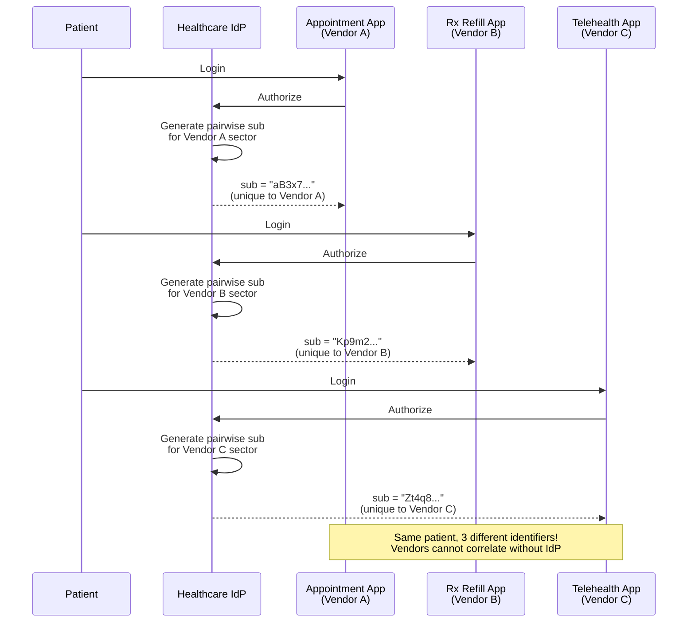
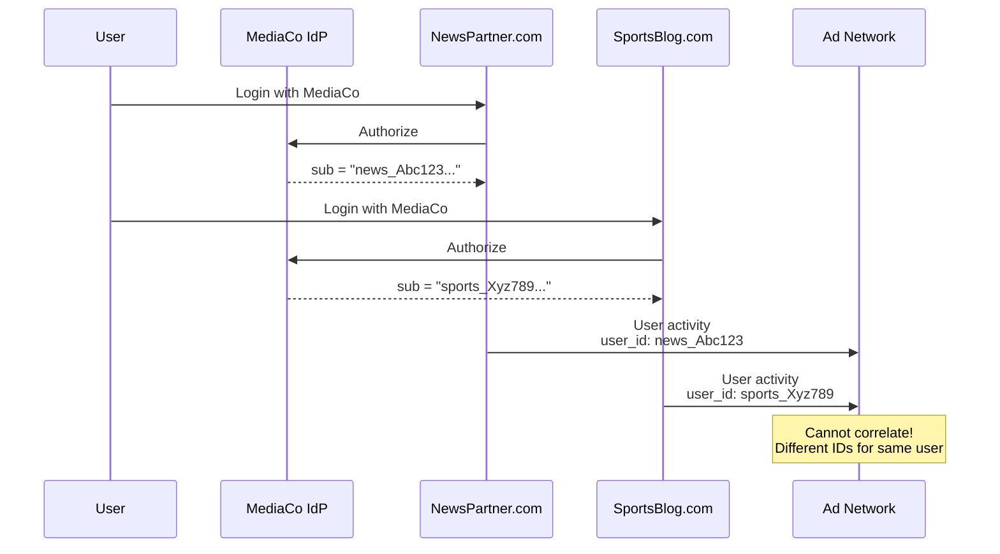
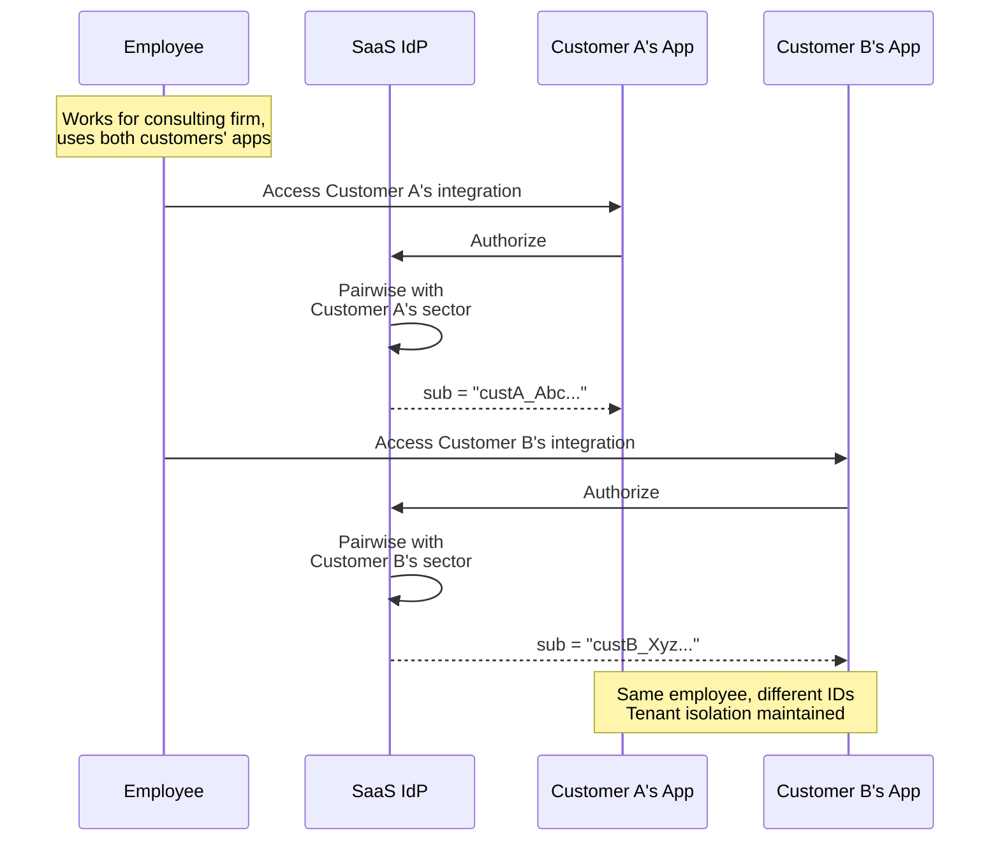

# Pairwise Subject Identifiers

Protect user privacy by issuing different identifiers for the same user across different clients.

## Overview

| Specification                                                                                   | Status         | Configuration              |
| ----------------------------------------------------------------------------------------------- | -------------- | -------------------------- |
| [OIDC Core 1.0 Section 8](https://openid.net/specs/openid-connect-core-1_0.html#SubjectIDTypes) | ✅ Implemented | `subject_type: "pairwise"` |

Pairwise subject identifiers provide different `sub` (subject) values for the same user across different clients, preventing user tracking and correlation across applications.

```
Same User + Different Clients = Different Subject Identifiers
```

---

## Benefits

| Benefit               | Description                                          |
| --------------------- | ---------------------------------------------------- |
| **User Privacy**      | Different `sub` values prevent cross-client tracking |
| **Anti-Collusion**    | Clients cannot correlate users by sharing IDs        |
| **GDPR Compliance**   | Privacy by Design (Article 25)                       |
| **HIPAA Compliance**  | De-identification across applications                |
| **Data Minimization** | Limits identity exposure scope                       |

---

## Practical Use Cases

### Use Case 1: Healthcare App Ecosystem with HIPAA Compliance

**Scenario**: A healthcare system has multiple patient-facing applications (appointment booking, prescription refills, telehealth). Each app is developed by different vendors. HIPAA requires that patient identifiers not be correlatable across vendors.

**Why Pairwise**: Each vendor receives a different patient identifier, preventing vendors from colluding to build comprehensive patient profiles without consent.



**Implementation**:

```typescript
// Healthcare IdP: Pairwise generation for HIPAA compliance
async function generateHIPAACompliantSubject(
  patientId: string,
  clientId: string,
  clientConfig: ClientConfig
): Promise<string> {
  // Use pairwise for third-party vendor apps
  if (clientConfig.vendor_type === 'third_party') {
    const sectorId = extractSectorIdentifier(clientConfig.redirect_uris[0]);

    // HIPAA-compliant pairwise generation
    const pairwiseSub = await generatePairwiseSubject(patientId, sectorId, env.HIPAA_PAIRWISE_SALT);

    // Audit log for compliance
    await auditLog({
      event: 'pairwise_subject_generated',
      patient_id_hash: await hash(patientId), // Never log actual patient ID
      client_id: clientId,
      sector: sectorId,
      timestamp: new Date().toISOString(),
    });

    return pairwiseSub;
  }

  // First-party apps get public subject
  return patientId;
}

// Client registration with HIPAA requirements
app.post('/register', async (c) => {
  const body = await c.req.json();

  // Third-party vendors MUST use pairwise
  if (body.vendor_type === 'third_party' && body.subject_type !== 'pairwise') {
    return c.json(
      {
        error: 'invalid_client_metadata',
        error_description:
          'Third-party vendors must use pairwise subject type for HIPAA compliance',
      },
      400
    );
  }

  // Register client with enforced pairwise
  const client = await registerClient({
    ...body,
    subject_type: body.vendor_type === 'third_party' ? 'pairwise' : body.subject_type,
  });

  return c.json(client, 201);
});
```

**Vendor Registration**:

```bash
# Register third-party appointment app
curl -X POST https://auth.healthcare.example.com/register \
  -H "Content-Type: application/json" \
  -d '{
    "client_name": "AppointmentPro by Vendor A",
    "redirect_uris": ["https://appointments.vendora.com/callback"],
    "subject_type": "pairwise",
    "vendor_type": "third_party",
    "grant_types": ["authorization_code"],
    "scope": "openid profile appointments:read appointments:write"
  }'
```

---

### Use Case 2: Consumer Ad-Tech Privacy Protection

**Scenario**: A media company offers "Login with MediaCo" for partner websites. To prevent ad-tech companies from building shadow profiles by correlating user IDs across sites, all partner integrations use pairwise subjects.

**Why Pairwise**: Even if two partner sites share data with the same ad-tech company, user identifiers from MediaCo cannot be correlated.



**Implementation**:

```typescript
// Consumer IdP: Privacy-focused pairwise configuration
const privacyConfig = {
  // All third-party integrations use pairwise
  default_subject_type: 'pairwise',

  // Prevent tracking with short-lived tokens
  access_token_ttl: 3600, // 1 hour

  // Require PKCE for all public clients
  require_pkce: true,

  // Privacy disclosure in consent screen
  consent_disclosure: {
    pairwise:
      'This site receives a unique identifier that cannot be used to track you across other sites.',
    public: 'This site receives your account identifier.',
  },
};

// Consent screen with privacy explanation
function buildConsentScreen(client: Client, user: User) {
  return {
    client_name: client.client_name,
    requested_scopes: client.scope.split(' '),
    privacy_info:
      client.subject_type === 'pairwise'
        ? `${client.client_name} will receive a unique identifier that only works with this site. This prevents tracking across other sites you use.`
        : `${client.client_name} will receive your account identifier.`,
    data_shared: [
      client.scope.includes('email') && { type: 'email', value: maskEmail(user.email) },
      client.scope.includes('profile') && { type: 'profile', value: user.name },
    ].filter(Boolean),
  };
}
```

**Partner Registration**:

```typescript
// Partner site self-registration
async function registerPartnerSite(partnerData: PartnerRegistration) {
  // Enforce pairwise for all partner sites
  const client = await fetch('https://id.mediaco.com/register', {
    method: 'POST',
    headers: { 'Content-Type': 'application/json' },
    body: JSON.stringify({
      client_name: partnerData.siteName,
      redirect_uris: partnerData.callbackUrls,
      subject_type: 'pairwise', // Mandatory for partners
      grant_types: ['authorization_code'],
      response_types: ['code'],
      scope: 'openid profile email',
      // Privacy metadata
      privacy_policy_uri: partnerData.privacyPolicyUrl,
      tos_uri: partnerData.termsUrl,
    }),
  });

  return client.json();
}
```

---

### Use Case 3: Multi-Tenant B2B SaaS with Tenant Isolation

**Scenario**: A B2B SaaS platform allows customers to build integrations via OAuth. Each customer's integrations should receive different user identifiers, even for the same underlying employee identity.

**Why Pairwise**: Customer A's integration cannot correlate users with Customer B's integration, maintaining tenant isolation even at the identity layer.



**Implementation**:

```typescript
// Multi-tenant SaaS: Per-tenant pairwise
interface TenantClient {
  client_id: string;
  tenant_id: string;
  sector_identifier: string;
  subject_type: 'pairwise' | 'public';
}

async function generateTenantIsolatedSubject(
  userId: string,
  tenantClient: TenantClient
): Promise<string> {
  if (tenantClient.subject_type === 'public') {
    return userId;
  }

  // Use tenant-specific sector for complete isolation
  const effectiveSector = `${tenantClient.tenant_id}:${tenantClient.sector_identifier}`;

  return await generatePairwiseSubject(userId, effectiveSector, env.TENANT_PAIRWISE_SALT);
}

// Customer integration registration
app.post('/api/integrations/:tenantId', async (c) => {
  const tenantId = c.req.param('tenantId');
  const body = await c.req.json();

  // Validate tenant admin permissions
  const admin = c.get('user');
  if (!(await isTenantAdmin(admin.sub, tenantId))) {
    return c.json({ error: 'forbidden' }, 403);
  }

  // Register OAuth client for this tenant's integration
  const client = await registerClient({
    ...body,
    subject_type: 'pairwise', // All tenant integrations use pairwise
    software_id: `tenant:${tenantId}`,
    // Sector is tenant-specific
    effective_sector: `${tenantId}:${extractSector(body.redirect_uris[0])}`,
  });

  await storeTenantIntegration(tenantId, client.client_id, {
    name: body.client_name,
    created_by: admin.sub,
    created_at: new Date().toISOString(),
  });

  return c.json(
    {
      client_id: client.client_id,
      client_secret: client.client_secret,
      subject_type: 'pairwise',
      tenant_isolated: true,
    },
    201
  );
});
```

---

## How Pairwise Works

### Algorithm

```
sub = base64url(SHA-256(sector_identifier || user_id || salt))
```

| Component           | Description                             |
| ------------------- | --------------------------------------- | --- | ------------- |
| `sector_identifier` | Client's host (e.g., `app.example.com`) |
| `user_id`           | User's internal account ID              |
| `salt`              | Server secret for additional security   |
| `                   |                                         | `   | Concatenation |

### Subject Type Comparison

| Aspect      | Public                   | Pairwise                   |
| ----------- | ------------------------ | -------------------------- |
| `sub` value | Same across all clients  | Different per client       |
| Privacy     | ❌ Clients can correlate | ✅ No correlation possible |
| Use case    | First-party apps         | Third-party integrations   |

---

## API Reference

### Client Registration

```http
POST /register
Content-Type: application/json

{
  "redirect_uris": ["https://app.example.com/callback"],
  "client_name": "Privacy-Focused App",
  "subject_type": "pairwise"
}
```

### With Sector Identifier URI

Required when redirect URIs have different hosts:

```json
{
  "redirect_uris": ["https://app1.example.com/callback", "https://app2.example.com/callback"],
  "subject_type": "pairwise",
  "sector_identifier_uri": "https://example.com/.well-known/sector-uris.json"
}
```

### Discovery Metadata

```json
{
  "subject_types_supported": ["public", "pairwise"]
}
```

---

## Security Considerations

| Consideration         | Recommendation                           |
| --------------------- | ---------------------------------------- |
| **Salt Security**     | Store as secret, never expose            |
| **Salt Rotation**     | Support grace period with old salt       |
| **Sector Validation** | HTTPS required for sector_identifier_uri |
| **Mapping Storage**   | Store for account management/deletion    |

---

## Configuration

### Environment Variables

| Variable        | Description                                    |
| --------------- | ---------------------------------------------- |
| `PAIRWISE_SALT` | Secret salt for pairwise generation (required) |

### Set Salt Secret

```bash
wrangler secret put PAIRWISE_SALT
# Enter cryptographically secure value
```

---

## Compliance

### GDPR

- **Article 25**: Privacy by Design (pairwise enables this)
- **Article 32**: Pseudonymization through pairwise
- **Article 17**: Delete mappings on erasure request

### HIPAA

- **De-identification**: Different IDs across applications
- **Minimum Necessary**: Limits identity exposure

### CCPA

- **Do Not Sell**: Prevents unauthorized tracking
- **Right to Delete**: Delete all pairwise mappings

---

## Troubleshooting

### "sector_identifier_uri is required"

**Cause**: Multiple redirect URIs with different hosts

**Solution**: Provide sector_identifier_uri

### Inconsistent `sub` values

**Cause**: Salt changed between issuances

**Solution**: Keep salt consistent; implement rotation with grace period

---

## Implementation Files

| Component           | File                                     | Description             |
| ------------------- | ---------------------------------------- | ----------------------- |
| Pairwise Generation | `packages/shared/src/utils/pairwise.ts`  | SHA-256 hashing         |
| Client Registration | `packages/op-auth/src/register.ts`       | subject_type validation |
| Token Issuance      | `packages/op-token/src/token.ts`         | Sub generation          |
| Discovery           | `packages/op-discovery/src/discovery.ts` | subject_types_supported |

---

## References

- [OIDC Core 1.0 Section 8: Subject Identifier Types](https://openid.net/specs/openid-connect-core-1_0.html#SubjectIDTypes)
- [OIDC Core 1.0 Section 8.1: Pairwise Identifier Algorithm](https://openid.net/specs/openid-connect-core-1_0.html#PairwiseAlg)
- [GDPR Article 25: Privacy by Design](https://gdpr-info.eu/art-25-gdpr/)

---

**Last Updated**: 2025-12-20
**Status**: ✅ Fully Implemented
**Tests**: 22+ passing tests
**Implementation**: `packages/shared/src/utils/pairwise.ts`
