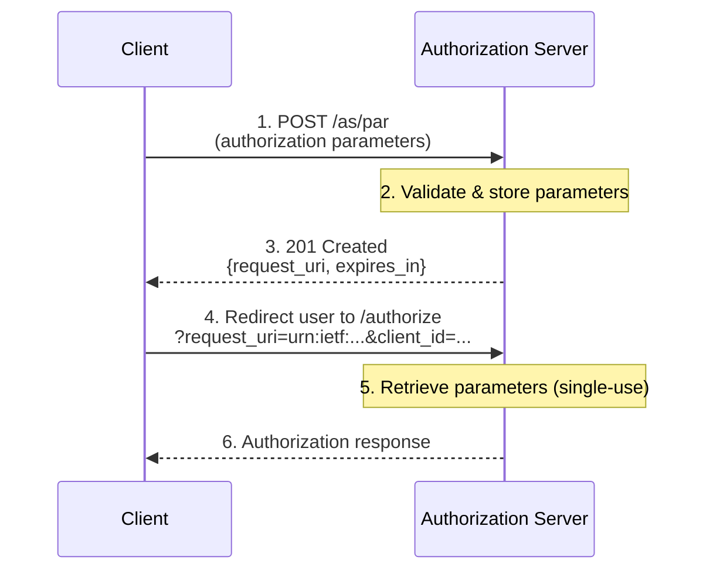

# PAR (Pushed Authorization Requests)

## Overview

**RFC 9126** - OAuth 2.0 Pushed Authorization Requests

Authrim implements Pushed Authorization Requests (PAR), an OAuth 2.0 security extension that allows clients to push authorization request parameters directly to the authorization server before redirecting the user.

### Specification

| Attribute    | Value                                                                                     |
| ------------ | ----------------------------------------------------------------------------------------- |
| **RFC**      | [RFC 9126 - Pushed Authorization Requests](https://datatracker.ietf.org/doc/html/rfc9126) |
| **Status**   | ✅ Implemented                                                                            |
| **Endpoint** | `POST /as/par`                                                                            |

---

## Benefits

### Security Advantages

1. **🔒 Parameter Tampering Prevention**
   - Authorization parameters are sent via secure backend channel
   - Parameters cannot be modified by user or intermediaries
   - Request integrity is guaranteed

2. **🛡️ Privacy Protection**
   - Sensitive parameters not exposed in browser history
   - No leakage through referrer headers
   - Prevents surveillance of authorization requests

3. **📏 No URL Length Limitations**
   - Avoids browser/server URL length limits
   - Enables complex requests with many parameters
   - Supports large request objects (JAR)

4. **✅ Client Authentication**
   - PAR endpoint can require client authentication
   - Prevents unauthorized authorization requests
   - Reduces phishing risks

---

## Practical Use Cases

### Use Case 1: Mobile Banking App (FAPI Compliance)

**Scenario**: A bank develops a mobile banking app that allows customers to view accounts, transfer funds, and manage investments. The app must comply with FAPI 2.0 (Financial-grade API) security requirements.

**Challenge**: FAPI 2.0 mandates that authorization parameters cannot be exposed or tampered with. Traditional OAuth flows put all parameters in the URL, which is logged in browser history, server logs, and potentially intercepted.

**PAR Solution**:

```typescript
// Bank's mobile app backend pushes authorization request
const parResponse = await fetch('https://bank.authrim.com/as/par', {
  method: 'POST',
  headers: {
    'Content-Type': 'application/x-www-form-urlencoded',
    Authorization: `Basic ${btoa(clientId + ':' + clientSecret)}`,
  },
  body: new URLSearchParams({
    response_type: 'code',
    redirect_uri: 'bankapp://callback',
    scope: 'openid accounts:read transfers:write',
    state: secureRandom(),
    nonce: secureRandom(),
    code_challenge: pkceChallenge,
    code_challenge_method: 'S256',
    // FAPI requires these to be sent via PAR
    acr_values: 'urn:openbanking:psd2:sca',
  }),
});

// Only request_uri is exposed in browser
const { request_uri } = await parResponse.json();
window.location.href = `https://bank.authrim.com/authorize?request_uri=${request_uri}&client_id=${clientId}`;
```

**Result**: The authorization request is transmitted securely via backend POST, meeting FAPI 2.0 compliance. Only a short-lived, cryptographically random `request_uri` appears in the browser URL.

---

### Use Case 2: Enterprise SSO with Complex Claims

**Scenario**: A large enterprise uses Authrim for SSO across 50+ applications. Some applications require specific user claims (department, cost center, manager, permissions) that result in authorization URLs exceeding 2,000 characters.

**Challenge**: Many browsers and web servers truncate or reject URLs longer than 2,048 characters. When applications request detailed claims, the URL exceeds this limit.

**PAR Solution**:

```javascript
const claims = {
  userinfo: {
    email: { essential: true },
    department: null,
    cost_center: null,
    manager: null,
    employee_id: { essential: true },
    permissions: null,
    groups: null,
    entitlements: null,
  },
  id_token: {
    auth_time: { essential: true },
    acr: { values: ['urn:enterprise:mfa:required'] },
  },
};

// Complex request pushed via PAR (no URL length issues)
const parResponse = await fetch('/as/par', {
  method: 'POST',
  headers: { 'Content-Type': 'application/x-www-form-urlencoded' },
  body: new URLSearchParams({
    client_id: 'hr_portal_app',
    response_type: 'code',
    redirect_uri: 'https://hr.enterprise.com/callback',
    scope: 'openid profile email hr:read',
    claims: JSON.stringify(claims),
    acr_values: 'urn:enterprise:mfa:required',
    state: generateState(),
    nonce: generateNonce(),
  }),
});

// Short, clean authorization URL
const { request_uri } = await parResponse.json();
redirect(`/authorize?request_uri=${request_uri}&client_id=hr_portal_app`);
```

**Result**: Complex authorization requests with detailed claims are handled seamlessly, regardless of size. The browser only sees a short URL.

---

### Use Case 3: Healthcare Patient Portal (PHI Protection)

**Scenario**: A hospital's patient portal allows patients to view medical records. Authorization requests may include `login_hint` with patient identifiers (MRN, email) that constitute Protected Health Information (PHI).

**Challenge**: HIPAA regulations prohibit exposing PHI in URLs. Browser history, bookmarks, and server logs could inadvertently store patient identifiers if they appear in authorization URLs.

**PAR Solution**:

```python
# Healthcare app backend pushes request with sensitive hints
par_response = requests.post(
    'https://healthcare.authrim.com/as/par',
    data={
        'client_id': 'patient_portal',
        'response_type': 'code',
        'redirect_uri': 'https://patient.hospital.org/callback',
        'scope': 'openid fhir:patient.read',
        # PHI sent via secure POST, never in URL
        'login_hint': 'MRN:12345678',
        'id_token_hint': previous_id_token,  # Re-authentication
        'max_age': 300,  # Require recent authentication
        'acr_values': 'urn:healthcare:mfa'
    },
    auth=(client_id, client_secret)
)

request_uri = par_response.json()['request_uri']

# Patient redirected with opaque request_uri only
return redirect(f'/authorize?request_uri={request_uri}&client_id=patient_portal')
```

**Result**: Patient identifiers and sensitive hints are transmitted securely via backend channel. No PHI appears in browser URLs, logs, or history, ensuring HIPAA compliance.

---

## How PAR Works

### Flow Diagram



### Process Steps

1. **Client pushes parameters**: Client sends authorization parameters to PAR endpoint
2. **Server validates & stores**: Server validates and stores parameters in KV storage
3. **Server returns request_uri**: Server responds with a unique `request_uri`
4. **Client redirects user**: Client redirects user to authorization endpoint with `request_uri`
5. **Server retrieves parameters**: Authorization endpoint retrieves and deletes parameters
6. **Normal flow continues**: Authorization proceeds as normal

---

## API Reference

### PAR Endpoint

**POST /as/par**

**Headers**:

```http
Content-Type: application/x-www-form-urlencoded
Authorization: Basic <base64(client_id:client_secret)>  # Optional
```

**Body Parameters**:

| Parameter               | Required    | Description                                |
| ----------------------- | ----------- | ------------------------------------------ |
| `client_id`             | ✅ Yes      | The client identifier                      |
| `response_type`         | ✅ Yes      | OAuth response type (e.g., `code`)         |
| `redirect_uri`          | ✅ Yes      | Client's registered redirect URI           |
| `scope`                 | ✅ Yes      | Requested scopes (space-separated)         |
| `state`                 | Recommended | Opaque value for CSRF protection           |
| `nonce`                 | Recommended | Nonce for ID token binding (OIDC)          |
| `code_challenge`        | Recommended | PKCE code challenge                        |
| `code_challenge_method` | Recommended | PKCE method (must be `S256`)               |
| `response_mode`         | Optional    | Response mode (query, fragment, form_post) |
| `prompt`                | Optional    | OIDC prompt parameter                      |
| `login_hint`            | Optional    | Login hint (email, username)               |
| `acr_values`            | Optional    | Authentication Context Class References    |
| `claims`                | Optional    | OIDC claims parameter (JSON)               |

**Success Response** (201 Created):

```json
{
  "request_uri": "urn:ietf:params:oauth:request_uri:6esc_11ACC5bwc014ltc14eY22c",
  "expires_in": 600
}
```

**Error Responses**:

| HTTP Status | Error                       | Description                            |
| ----------- | --------------------------- | -------------------------------------- |
| 400         | `invalid_request`           | Missing or invalid required parameters |
| 400         | `invalid_client`            | Client not found or not authorized     |
| 400         | `invalid_scope`             | Invalid or unauthorized scope          |
| 400         | `unsupported_response_type` | Response type not supported            |
| 405         | `invalid_request`           | PAR endpoint only accepts POST         |

---

### Authorization Endpoint with PAR

**GET /authorize**

| Parameter     | Required | Description                           |
| ------------- | -------- | ------------------------------------- |
| `request_uri` | ✅ Yes   | The request URI from PAR response     |
| `client_id`   | ✅ Yes   | Must match client_id from PAR request |

**Example**:

```http
GET /authorize?request_uri=urn:ietf:params:oauth:request_uri:6esc_11ACC5bwc014ltc14eY22c&client_id=my_client_id
```

**Validation**:

- `request_uri` must start with `urn:ietf:params:oauth:request_uri:`
- `request_uri` must exist in storage and not be expired
- `client_id` must match the one from PAR request
- `request_uri` is single-use (deleted after retrieval)

---

## Usage Examples

### JavaScript/TypeScript

```typescript
async function authorizeWithPAR(config: { clientId: string; redirectUri: string; scope: string }) {
  // Generate PKCE
  const codeVerifier = generateCodeVerifier();
  const codeChallenge = await generateCodeChallenge(codeVerifier);
  sessionStorage.setItem('code_verifier', codeVerifier);

  // Step 1: Push authorization request
  const parResponse = await fetch('https://your-tenant.authrim.com/as/par', {
    method: 'POST',
    headers: { 'Content-Type': 'application/x-www-form-urlencoded' },
    body: new URLSearchParams({
      client_id: config.clientId,
      response_type: 'code',
      redirect_uri: config.redirectUri,
      scope: config.scope,
      state: crypto.randomUUID(),
      nonce: crypto.randomUUID(),
      code_challenge: codeChallenge,
      code_challenge_method: 'S256',
    }),
  });

  const { request_uri } = await parResponse.json();

  // Step 2: Redirect to authorization endpoint
  const authUrl = new URL('https://your-tenant.authrim.com/authorize');
  authUrl.searchParams.set('request_uri', request_uri);
  authUrl.searchParams.set('client_id', config.clientId);
  window.location.href = authUrl.toString();
}
```

---

### Python

```python
import requests
from urllib.parse import urlencode

def authorize_with_par(client_id: str, client_secret: str, redirect_uri: str, scope: str):
    # Step 1: Push authorization request
    par_response = requests.post(
        'https://your-tenant.authrim.com/as/par',
        data={
            'client_id': client_id,
            'response_type': 'code',
            'redirect_uri': redirect_uri,
            'scope': scope,
            'state': generate_state(),
            'nonce': generate_nonce(),
            'code_challenge': generate_code_challenge(),
            'code_challenge_method': 'S256'
        },
        auth=(client_id, client_secret)
    )

    request_uri = par_response.json()['request_uri']

    # Step 2: Build authorization URL
    return f'https://your-tenant.authrim.com/authorize?{urlencode({
        "request_uri": request_uri,
        "client_id": client_id
    })}'
```

---

### cURL

```bash
# Step 1: Push authorization request
curl -X POST https://your-tenant.authrim.com/as/par \
  -H "Content-Type: application/x-www-form-urlencoded" \
  -d "client_id=my_client_id" \
  -d "response_type=code" \
  -d "redirect_uri=https://myapp.example.com/callback" \
  -d "scope=openid profile email" \
  -d "state=abc123" \
  -d "nonce=xyz789" \
  -d "code_challenge=E9Melhoa2OwvFrEMTJguCHaoeK1t8URWbuGJSstw-cM" \
  -d "code_challenge_method=S256"

# Response:
# {"request_uri":"urn:ietf:params:oauth:request_uri:6esc_11ACC...","expires_in":600}

# Step 2: Redirect user to:
# https://your-tenant.authrim.com/authorize?request_uri=urn:ietf:params:oauth:request_uri:6esc_11ACC...&client_id=my_client_id
```

---

## Security Considerations

### Request URI Security

| Security Feature  | Description                                               |
| ----------------- | --------------------------------------------------------- |
| Random Generation | Uses cryptographically secure random strings (~128 chars) |
| URN Format        | Follows `urn:ietf:params:oauth:request_uri:` scheme       |
| Short Lifetime    | Default 10 minutes (600 seconds)                          |
| Single-Use        | Deleted immediately after retrieval                       |

### Client ID Matching

Per RFC 9126, the `client_id` in the authorization request must match the one from the PAR request:

```typescript
if (client_id !== storedData.client_id) {
  return error('invalid_request', 'client_id mismatch');
}
```

### PKCE Support

PAR fully supports PKCE parameters:

- `code_challenge` and `code_challenge_method` are stored with the request
- Verification occurs during token exchange

---

## Configuration

### Discovery Metadata

PAR endpoints are advertised in OpenID Provider metadata:

```json
{
  "pushed_authorization_request_endpoint": "https://your-tenant.authrim.com/as/par",
  "require_pushed_authorization_requests": false
}
```

### Settings

| Setting              | Default | Description                             |
| -------------------- | ------- | --------------------------------------- |
| `par_expiry_seconds` | `600`   | Request URI lifetime (10 minutes)       |
| `require_par`        | `false` | Whether PAR is required for all clients |

---

## Comparison: Traditional vs PAR

| Aspect                   | Traditional       | PAR          |
| ------------------------ | ----------------- | ------------ |
| Parameter transmission   | URL query string  | Backend POST |
| Browser history exposure | ✅ Visible        | ❌ Hidden    |
| URL length limits        | Subject to limits | No limits    |
| Parameter tampering      | Possible          | Prevented    |
| Client authentication    | Not possible      | Supported    |
| FAPI 2.0 compliance      | ❌ No             | ✅ Yes       |

---

## Testing

### Test Scenarios

| Scenario                         | Expected Result         |
| -------------------------------- | ----------------------- |
| Successful PAR request           | 201 with request_uri    |
| Missing client_id                | 400 invalid_request     |
| Invalid redirect_uri             | 400 invalid_request     |
| Request URI expiration           | 400 invalid_request_uri |
| Request URI reuse                | 400 invalid_request_uri |
| client_id mismatch at /authorize | 400 invalid_request     |

### Running Tests

```bash
pnpm --filter @authrim/op-auth run test
```

---

## Troubleshooting

### "Invalid or expired request_uri"

**Causes**:

- Request URI expired (> 10 minutes old)
- Request URI already used (single-use)
- Invalid request URI format

**Solution**: Generate a new request URI via PAR endpoint.

### "client_id mismatch"

**Cause**: `client_id` in authorization request differs from PAR request.

**Solution**: Use the same `client_id` for both PAR and authorization requests.

### "Client not found"

**Cause**: Client is not registered.

**Solution**: Register client via Dynamic Client Registration or Admin API.

---

## References

- [RFC 9126 - OAuth 2.0 Pushed Authorization Requests](https://datatracker.ietf.org/doc/html/rfc9126)
- [FAPI 2.0 Security Profile](https://openid.net/specs/fapi-2_0-security-profile.html)
- [OAuth 2.0 Security Best Current Practice](https://datatracker.ietf.org/doc/html/draft-ietf-oauth-security-topics)
- [OpenID Connect Core 1.0](https://openid.net/specs/openid-connect-core-1_0.html)

---

**Last Updated**: 2025-12-20
**Status**: ✅ Implemented
**Implementation**: `packages/op-auth/src/par.ts`, `packages/op-auth/src/authorize.ts`
