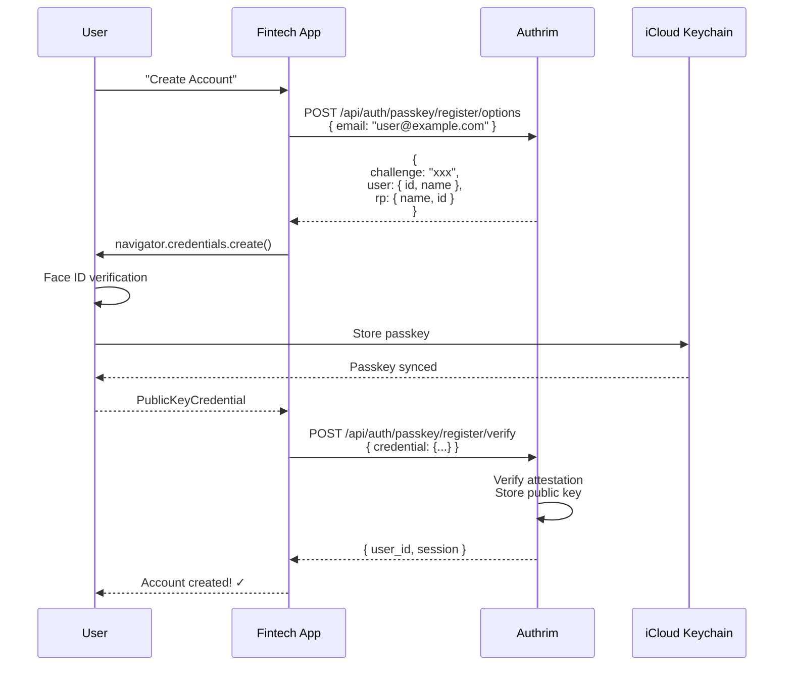
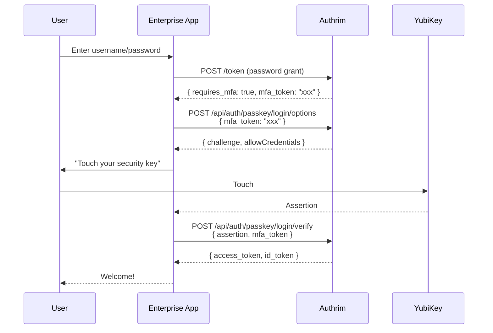
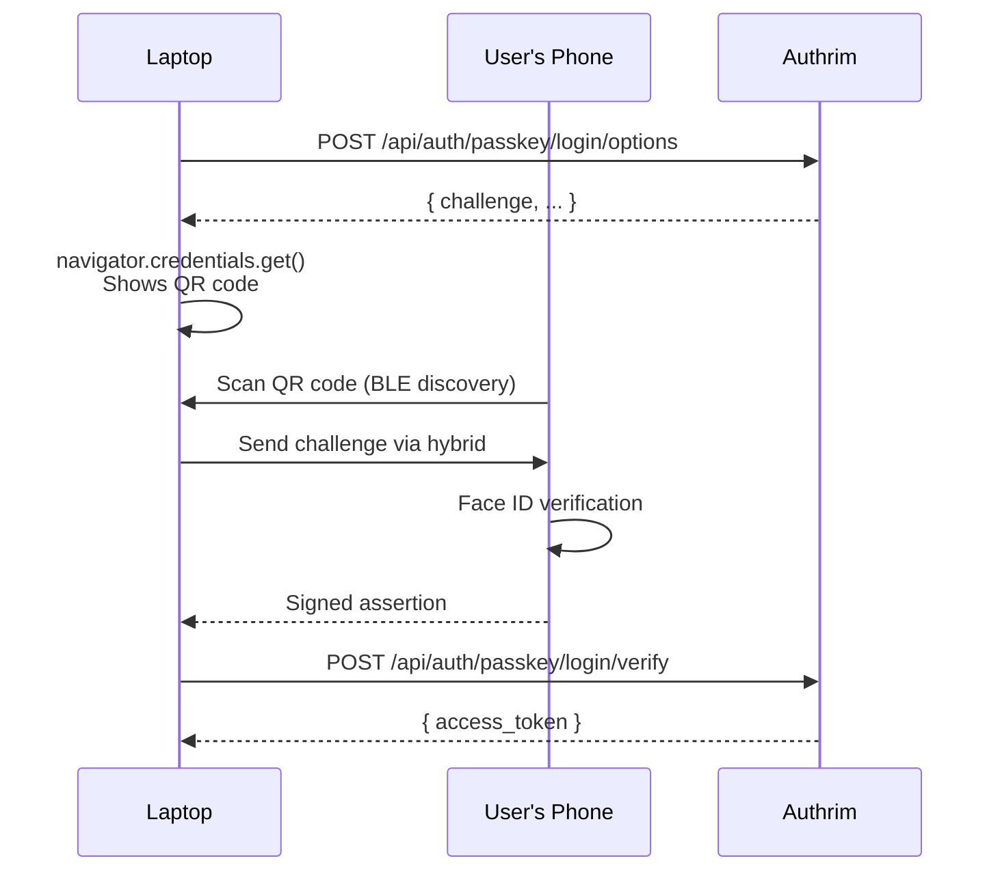

# Passkey & WebAuthn Authentication

Phishing-resistant passwordless authentication using FIDO2/WebAuthn.

## Overview

| Specification                                         | Status         | Protocols    |
| ----------------------------------------------------- | -------------- | ------------ |
| [WebAuthn Level 2](https://www.w3.org/TR/webauthn-2/) | ✅ Implemented | FIDO2        |
| [Passkeys](https://fidoalliance.org/passkeys/)        | ✅ Implemented | Cross-device |

Passkeys provide passwordless, phishing-resistant authentication using public key cryptography. Users authenticate with biometrics (Face ID, Touch ID, Windows Hello) or security keys.

---

## Benefits

| Benefit                | Description                        |
| ---------------------- | ---------------------------------- |
| **Phishing-Resistant** | Credentials bound to origin        |
| **Passwordless**       | No passwords to remember or steal  |
| **Biometric**          | Face ID, Touch ID, fingerprint     |
| **Cross-Device**       | Sync via iCloud, Google, Microsoft |
| **Security Keys**      | YubiKey, Titan, hardware tokens    |

---

## Practical Use Cases

### Use Case 1: Consumer App Passwordless Registration

**Scenario**: A fintech app wants to offer passwordless signup. New users register with Face ID on their iPhone, creating a passkey synced to iCloud Keychain.

**Why Passkeys**: Zero-friction signup. No password to create or forget. Phishing-resistant from day one.



**Implementation**:

```typescript
// Frontend: Passkey registration
async function registerWithPasskey(email: string) {
  // 1. Get registration options from server
  const optionsResponse = await fetch('/api/auth/passkey/register/options', {
    method: 'POST',
    headers: { 'Content-Type': 'application/json' },
    body: JSON.stringify({ email }),
  });

  const options = await optionsResponse.json();

  // 2. Create credential with browser API
  const credential = (await navigator.credentials.create({
    publicKey: {
      challenge: base64ToBuffer(options.challenge),
      rp: {
        name: options.rp.name,
        id: options.rp.id, // e.g., "example.com"
      },
      user: {
        id: base64ToBuffer(options.user.id),
        name: options.user.name,
        displayName: options.user.displayName,
      },
      pubKeyCredParams: [
        { alg: -7, type: 'public-key' }, // ES256
        { alg: -257, type: 'public-key' }, // RS256
      ],
      authenticatorSelection: {
        authenticatorAttachment: 'platform', // Built-in (Face ID, Touch ID)
        residentKey: 'required', // Discoverable credential
        userVerification: 'required', // Biometric required
      },
      timeout: 60000,
      attestation: 'none', // Privacy-preserving
    },
  })) as PublicKeyCredential;

  // 3. Send credential to server
  const attestationResponse = credential.response as AuthenticatorAttestationResponse;

  const verifyResponse = await fetch('/api/auth/passkey/register/verify', {
    method: 'POST',
    headers: { 'Content-Type': 'application/json' },
    body: JSON.stringify({
      id: credential.id,
      rawId: bufferToBase64(credential.rawId),
      type: credential.type,
      response: {
        clientDataJSON: bufferToBase64(attestationResponse.clientDataJSON),
        attestationObject: bufferToBase64(attestationResponse.attestationObject),
      },
    }),
  });

  return verifyResponse.json();
}

// Backend: Registration verification
app.post('/api/auth/passkey/register/verify', async (c) => {
  const body = await c.req.json();

  // Verify attestation
  const verification = await verifyRegistrationResponse({
    response: body,
    expectedChallenge: await getChallenge(body.id),
    expectedOrigin: 'https://app.example.com',
    expectedRPID: 'example.com',
  });

  if (!verification.verified) {
    return c.json({ error: 'Verification failed' }, 400);
  }

  // Store credential
  await storeCredential({
    credentialId: verification.registrationInfo.credentialID,
    publicKey: verification.registrationInfo.credentialPublicKey,
    counter: verification.registrationInfo.counter,
    userId: body.userId,
  });

  // Create session
  const session = await createSession(body.userId);

  return c.json({ success: true, session });
});
```

---

### Use Case 2: Enterprise MFA with Security Keys

**Scenario**: A company requires hardware security keys (YubiKey) for accessing sensitive systems. Passkeys serve as a second factor after password authentication.

**Why Security Keys**: Hardware-bound credentials that cannot be phished or cloned. Required for high-security environments (PCI DSS, SOC 2).



**Implementation**:

```typescript
// Security key MFA flow
async function authenticateWithSecurityKey(mfaToken: string) {
  // 1. Get authentication options
  const optionsResponse = await fetch('/api/auth/passkey/login/options', {
    method: 'POST',
    headers: { 'Content-Type': 'application/json' },
    body: JSON.stringify({ mfa_token: mfaToken }),
  });

  const options = await optionsResponse.json();

  // 2. Request assertion from security key
  const assertion = (await navigator.credentials.get({
    publicKey: {
      challenge: base64ToBuffer(options.challenge),
      timeout: 60000,
      rpId: 'enterprise.example.com',
      // Only allow registered security keys
      allowCredentials: options.allowCredentials.map((cred) => ({
        id: base64ToBuffer(cred.id),
        type: 'public-key',
        transports: ['usb', 'nfc'], // Security key transports
      })),
      userVerification: 'discouraged', // PIN optional for security keys
    },
  })) as PublicKeyCredential;

  // 3. Verify assertion
  const response = assertion.response as AuthenticatorAssertionResponse;

  const verifyResponse = await fetch('/api/auth/passkey/login/verify', {
    method: 'POST',
    headers: { 'Content-Type': 'application/json' },
    body: JSON.stringify({
      id: assertion.id,
      rawId: bufferToBase64(assertion.rawId),
      type: assertion.type,
      response: {
        clientDataJSON: bufferToBase64(response.clientDataJSON),
        authenticatorData: bufferToBase64(response.authenticatorData),
        signature: bufferToBase64(response.signature),
        userHandle: response.userHandle ? bufferToBase64(response.userHandle) : null,
      },
      mfa_token: mfaToken,
    }),
  });

  return verifyResponse.json();
}

// Backend: Security key registration with attestation verification
app.post('/api/auth/passkey/register/verify', async (c) => {
  const body = await c.req.json();

  const verification = await verifyRegistrationResponse({
    response: body,
    expectedChallenge: await getChallenge(body.id),
    expectedOrigin: 'https://enterprise.example.com',
    expectedRPID: 'enterprise.example.com',
    // Require hardware attestation for security keys
    requireUserVerification: false,
  });

  // Verify it's a hardware security key (optional)
  const { aaguid } = verification.registrationInfo;
  const isYubiKey = KNOWN_YUBIKEY_AAGUIDS.includes(aaguid);

  if (!isYubiKey) {
    return c.json({ error: 'Only hardware security keys allowed' }, 400);
  }

  // Store with metadata
  await storeCredential({
    ...verification.registrationInfo,
    authenticatorType: 'security_key',
    aaguid,
  });

  return c.json({ success: true });
});
```

---

### Use Case 3: Cross-Device Authentication with Hybrid Transport

**Scenario**: A user on a work laptop without biometrics wants to log in using their phone's passkey. The laptop shows a QR code, the user scans it with their phone and authenticates with Face ID.

**Why Hybrid Transport**: Enables passkey use on devices without local passkey support. Uses CTAP 2.2 hybrid transport (Bluetooth + Internet).



**Implementation**:

```typescript
// Cross-device passkey authentication
async function authenticateWithCrossDevice() {
  const optionsResponse = await fetch('/api/auth/passkey/login/options', {
    method: 'POST',
    headers: { 'Content-Type': 'application/json' },
    body: JSON.stringify({}), // No username - discoverable credentials
  });

  const options = await optionsResponse.json();

  // Request credential - browser will show QR if no local credentials
  const assertion = (await navigator.credentials.get({
    publicKey: {
      challenge: base64ToBuffer(options.challenge),
      timeout: 300000, // 5 minutes for cross-device
      rpId: 'example.com',
      // Empty allowCredentials for discoverable credential flow
      allowCredentials: [],
      userVerification: 'required',
    },
    // Enable hybrid transport (QR code flow)
    mediation: 'optional',
  })) as PublicKeyCredential;

  // User handle identifies the user (for discoverable credentials)
  const response = assertion.response as AuthenticatorAssertionResponse;
  const userHandle = response.userHandle;

  // Verify on server
  return fetch('/api/auth/passkey/login/verify', {
    method: 'POST',
    headers: { 'Content-Type': 'application/json' },
    body: JSON.stringify({
      id: assertion.id,
      response: {
        clientDataJSON: bufferToBase64(response.clientDataJSON),
        authenticatorData: bufferToBase64(response.authenticatorData),
        signature: bufferToBase64(response.signature),
        userHandle: userHandle ? bufferToBase64(userHandle) : null,
      },
    }),
  }).then((r) => r.json());
}
```

---

## API Reference

### Registration Options

```http
POST /api/auth/passkey/register/options
Content-Type: application/json

{
  "email": "user@example.com"
}

Response:
{
  "challenge": "base64url-encoded",
  "rp": { "name": "Example App", "id": "example.com" },
  "user": { "id": "base64url", "name": "user@example.com", "displayName": "User" },
  "pubKeyCredParams": [{ "alg": -7, "type": "public-key" }],
  "timeout": 60000,
  "attestation": "none"
}
```

### Registration Verify

```http
POST /api/auth/passkey/register/verify
Content-Type: application/json

{
  "id": "credential-id",
  "rawId": "base64url",
  "type": "public-key",
  "response": {
    "clientDataJSON": "base64url",
    "attestationObject": "base64url"
  }
}
```

### Login Options

```http
POST /api/auth/passkey/login/options
Content-Type: application/json

{}

Response:
{
  "challenge": "base64url-encoded",
  "timeout": 60000,
  "rpId": "example.com",
  "allowCredentials": [],
  "userVerification": "required"
}
```

### Login Verify

```http
POST /api/auth/passkey/login/verify
Content-Type: application/json

{
  "id": "credential-id",
  "rawId": "base64url",
  "response": {
    "clientDataJSON": "base64url",
    "authenticatorData": "base64url",
    "signature": "base64url",
    "userHandle": "base64url"
  }
}
```

---

## Security Considerations

| Consideration          | Implementation                       |
| ---------------------- | ------------------------------------ |
| **Origin Binding**     | Credentials tied to RP ID            |
| **Replay Prevention**  | Challenge is single-use              |
| **Counter Validation** | Detect cloned authenticators         |
| **User Verification**  | Biometric required for sensitive ops |

---

## Configuration

### Environment Variables

| Variable          | Description           | Default  |
| ----------------- | --------------------- | -------- |
| `PASSKEY_RP_ID`   | Relying Party ID      | Domain   |
| `PASSKEY_RP_NAME` | Displayed to users    | App name |
| `PASSKEY_TIMEOUT` | Ceremony timeout (ms) | `60000`  |

---

## Implementation Files

| Component      | File                                       | Description         |
| -------------- | ------------------------------------------ | ------------------- |
| Registration   | `packages/op-auth/src/passkey/register.ts` | Registration flow   |
| Authentication | `packages/op-auth/src/passkey/login.ts`    | Login flow          |
| Verification   | `packages/shared/src/utils/webauthn.ts`    | Crypto verification |

---

## References

- [WebAuthn Level 2](https://www.w3.org/TR/webauthn-2/)
- [Passkeys Developer Guide](https://passkeys.dev/)
- [FIDO Alliance](https://fidoalliance.org/)

---

**Last Updated**: 2025-12-20
**Status**: ✅ Fully Implemented
**Implementation**: `packages/op-auth/src/passkey/`
