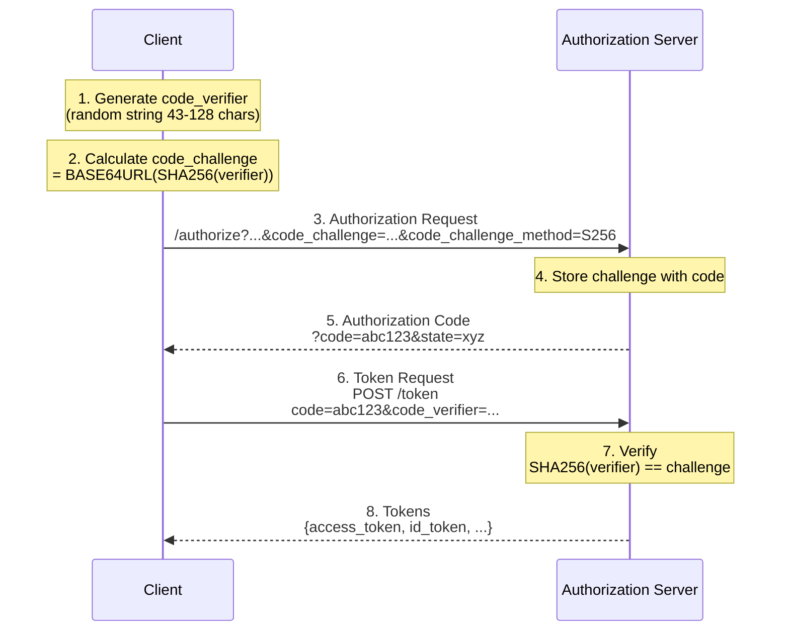

# PKCE (Proof Key for Code Exchange)

## Overview

**RFC 7636** - Proof Key for Code Exchange by OAuth Public Clients

Authrim implements PKCE, a critical security extension that protects authorization codes from interception attacks, especially for public clients (mobile apps, SPAs) that cannot securely store client secrets.

### Specification

| Attribute  | Value                                                                         |
| ---------- | ----------------------------------------------------------------------------- |
| **RFC**    | [RFC 7636 - Proof Key for Code Exchange](https://tools.ietf.org/html/rfc7636) |
| **Status** | ✅ Implemented                                                                |
| **Method** | `S256` (SHA-256) - **Required**                                               |
| **Flows**  | Authorization Code Flow                                                       |

---

## Benefits

### Security Advantages

1. **🔐 Authorization Code Interception Protection**
   - Prevents authorization code theft by malicious apps
   - Protects against code injection attacks
   - Mitigates authorization code interception on mobile
   - Essential for public clients (no client secret)

2. **📱 Mobile & SPA Security**
   - Protects against malicious apps with same custom URI scheme
   - Eliminates need for client secret in browser
   - Recommended by OAuth 2.0 Security Best Current Practice

3. **✅ OAuth 2.1 Compliance**
   - PKCE is **mandatory** in OAuth 2.1
   - Recommended for **all** clients (including confidential)
   - Industry best practice and future-proof

---

## Practical Use Cases

### Use Case 1: E-Commerce Mobile App

**Scenario**: A retail company launches a mobile shopping app where customers browse products, make purchases, and manage their accounts.

**Challenge**: The mobile app cannot securely store a client secret because app binaries can be reverse-engineered. Without PKCE, an attacker who intercepts the authorization code during the redirect could steal the user's session.

**PKCE Solution**:

```
1. Customer opens app and taps "Login"
2. App generates code_verifier: "dBjftJeZ4CVP-mB92K27uhbUJU1p1r_wW1gFWFOEjXk"
3. App calculates code_challenge: "E9Melhoa2OwvFrEMTJguCHaoeK1t8URWbuGJSstw-cM"
4. App opens browser: /authorize?...&code_challenge=E9Melhoa2...&code_challenge_method=S256
5. User authenticates and is redirected back with code
6. App exchanges code with code_verifier
7. Only the legitimate app (with the verifier) can obtain tokens
```

**Result**: Even if a malicious app registers the same custom URL scheme and intercepts the authorization code, it cannot exchange it for tokens without the code_verifier.

---

### Use Case 2: Healthcare Patient Portal (SPA)

**Scenario**: A hospital deploys a React-based patient portal where patients view medical records, schedule appointments, and message doctors.

**Challenge**: Healthcare data (PHI) requires strict security. SPAs run in the browser where secrets cannot be hidden. XSS attacks could potentially steal authorization codes.

**PKCE Solution**:

```typescript
// Patient clicks "Access My Records"
const codeVerifier = generateCodeVerifier(); // Stored in sessionStorage
const codeChallenge = await sha256(codeVerifier);

// Authorization request includes PKCE
redirect(`/authorize?...&code_challenge=${codeChallenge}&code_challenge_method=S256`);

// After redirect, only this session can exchange the code
await fetch('/token', {
  body: {
    grant_type: 'authorization_code',
    code: authCode,
    code_verifier: codeVerifier, // Proves possession
  },
});
```

**Result**: Each authentication session is cryptographically bound. Even if an attacker steals the authorization code via XSS, they cannot complete the flow without the code_verifier stored in the victim's browser session.

---

### Use Case 3: Developer CLI Tool for CI/CD

**Scenario**: A DevOps team uses a CLI tool to deploy applications, manage infrastructure, and access cloud resources from terminals and CI/CD pipelines.

**Challenge**: CLI tools are installed on developer machines and CI servers. Embedding secrets in CLI binaries or environment variables is insecure and makes secret rotation difficult.

**PKCE Solution**:

```bash
# Developer runs: mycloud login
# CLI starts local callback server and opens browser

$ mycloud login
Opening browser for authentication...
Listening on http://localhost:8080/callback

# After browser authentication:
✓ Authorization code received
✓ Exchanging code with PKCE verifier...
✓ Logged in as developer@company.com
Token stored in ~/.mycloud/credentials
```

**Implementation**:

```python
def login():
    verifier = generate_code_verifier()
    challenge = sha256_base64url(verifier)

    # Start temporary local server
    server = start_callback_server(port=8080)

    # Open browser with PKCE
    webbrowser.open(f"{AUTH_URL}?...&code_challenge={challenge}")

    # Wait for callback
    code = server.wait_for_code()

    # Exchange with verifier - no client secret needed
    tokens = exchange_code(code, verifier)
    save_tokens(tokens)
```

**Result**: The CLI authenticates securely without requiring embedded secrets. Each login session uses a unique verifier, and tokens can be refreshed or revoked individually.

---

## How PKCE Works

### Flow Diagram



### PKCE Algorithm

**Step 1: Generate code_verifier**

```
code_verifier = cryptographically_random_string(43-128 characters)
                using [A-Z] [a-z] [0-9] - . _ ~ (unreserved characters)
```

**Step 2: Calculate code_challenge**

```
code_challenge = BASE64URL(SHA-256(ASCII(code_verifier)))
```

**Step 3: Verify at Token Endpoint**

```
If SHA-256(code_verifier) == code_challenge:
  ✅ Issue tokens
Else:
  ❌ Reject request (invalid_grant)
```

---

## API Reference

### Authorization Endpoint

**GET/POST /authorize**

| Parameter               | Required    | Type   | Description                                     |
| ----------------------- | ----------- | ------ | ----------------------------------------------- |
| `code_challenge`        | ✅ Yes\*    | string | Base64url-encoded SHA-256 hash of code_verifier |
| `code_challenge_method` | ✅ Yes\*    | string | Must be `S256` (SHA-256)                        |
| `response_type`         | ✅ Yes      | string | Must be `code`                                  |
| `client_id`             | ✅ Yes      | string | Client identifier                               |
| `redirect_uri`          | ✅ Yes      | string | Callback URI                                    |
| `scope`                 | ✅ Yes      | string | Requested scopes                                |
| `state`                 | Recommended | string | CSRF protection                                 |

\* Required for public clients, recommended for all clients

**Example Request**:

```http
GET /authorize
  ?response_type=code
  &client_id=my_client_id
  &redirect_uri=https://myapp.example.com/callback
  &scope=openid+profile+email
  &state=abc123
  &code_challenge=E9Melhoa2OwvFrEMTJguCHaoeK1t8URWbuGJSstw-cM
  &code_challenge_method=S256
Host: your-tenant.authrim.com
```

---

### Token Endpoint

**POST /token**

| Parameter       | Required | Type   | Description                           |
| --------------- | -------- | ------ | ------------------------------------- |
| `grant_type`    | ✅ Yes   | string | Must be `authorization_code`          |
| `code`          | ✅ Yes   | string | Authorization code from /authorize    |
| `redirect_uri`  | ✅ Yes   | string | Same redirect_uri from /authorize     |
| `client_id`     | ✅ Yes   | string | Client identifier                     |
| `code_verifier` | ✅ Yes\* | string | Original random string (43-128 chars) |

\* Required if code_challenge was provided in authorization request

**Example Request**:

```http
POST /token HTTP/1.1
Host: your-tenant.authrim.com
Content-Type: application/x-www-form-urlencoded

grant_type=authorization_code
&code=abc123...
&redirect_uri=https://myapp.example.com/callback
&client_id=my_client_id
&code_verifier=dBjftJe...z1LTQ
```

**Success Response**:

```json
{
  "access_token": "eyJhbGciOiJSUzI1NiJ9...",
  "token_type": "Bearer",
  "expires_in": 3600,
  "id_token": "eyJhbGciOiJSUzI1NiJ9...",
  "refresh_token": "eyJhbGciOiJSUzI1NiJ9...",
  "scope": "openid profile email"
}
```

**Error Responses**:

| HTTP Status | Error             | Description                                            |
| ----------- | ----------------- | ------------------------------------------------------ |
| 400         | `invalid_request` | code_verifier missing when code_challenge was provided |
| 400         | `invalid_grant`   | code_verifier does not match code_challenge            |
| 400         | `invalid_request` | code_challenge_method must be S256                     |

---

## Usage Examples

### JavaScript/TypeScript (Browser)

```typescript
// PKCE utilities
function generateCodeVerifier(): string {
  const array = new Uint8Array(32);
  crypto.getRandomValues(array);
  return base64urlEncode(array);
}

function base64urlEncode(buffer: Uint8Array): string {
  const base64 = btoa(String.fromCharCode(...buffer));
  return base64.replace(/\+/g, '-').replace(/\//g, '_').replace(/=/g, '');
}

async function generateCodeChallenge(verifier: string): Promise<string> {
  const encoder = new TextEncoder();
  const data = encoder.encode(verifier);
  const hashBuffer = await crypto.subtle.digest('SHA-256', data);
  return base64urlEncode(new Uint8Array(hashBuffer));
}

// Start authorization
async function login() {
  const codeVerifier = generateCodeVerifier();
  const codeChallenge = await generateCodeChallenge(codeVerifier);

  sessionStorage.setItem('code_verifier', codeVerifier);

  const authUrl = new URL('https://your-tenant.authrim.com/authorize');
  authUrl.searchParams.set('response_type', 'code');
  authUrl.searchParams.set('client_id', 'my_client_id');
  authUrl.searchParams.set('redirect_uri', window.location.origin + '/callback');
  authUrl.searchParams.set('scope', 'openid profile email');
  authUrl.searchParams.set('state', crypto.randomUUID());
  authUrl.searchParams.set('code_challenge', codeChallenge);
  authUrl.searchParams.set('code_challenge_method', 'S256');

  window.location.href = authUrl.toString();
}

// Handle callback
async function handleCallback() {
  const params = new URLSearchParams(window.location.search);
  const code = params.get('code');
  const codeVerifier = sessionStorage.getItem('code_verifier');

  const response = await fetch('https://your-tenant.authrim.com/token', {
    method: 'POST',
    headers: { 'Content-Type': 'application/x-www-form-urlencoded' },
    body: new URLSearchParams({
      grant_type: 'authorization_code',
      code: code!,
      redirect_uri: window.location.origin + '/callback',
      client_id: 'my_client_id',
      code_verifier: codeVerifier!,
    }),
  });

  const tokens = await response.json();
  sessionStorage.removeItem('code_verifier');
  return tokens;
}
```

---

### Python (CLI/Server)

```python
import hashlib
import base64
import secrets
import requests

def generate_code_verifier() -> str:
    return base64.urlsafe_b64encode(secrets.token_bytes(32)).decode().rstrip('=')

def generate_code_challenge(verifier: str) -> str:
    digest = hashlib.sha256(verifier.encode()).digest()
    return base64.urlsafe_b64encode(digest).decode().rstrip('=')

def oauth_login():
    code_verifier = generate_code_verifier()
    code_challenge = generate_code_challenge(code_verifier)

    # Build authorization URL
    auth_url = (
        "https://your-tenant.authrim.com/authorize?"
        f"response_type=code&client_id=my_cli&"
        f"redirect_uri=http://localhost:8080/callback&"
        f"scope=openid profile&"
        f"code_challenge={code_challenge}&"
        f"code_challenge_method=S256"
    )

    # ... open browser and wait for callback ...
    authorization_code = wait_for_callback()

    # Exchange code for tokens
    response = requests.post(
        "https://your-tenant.authrim.com/token",
        data={
            "grant_type": "authorization_code",
            "code": authorization_code,
            "redirect_uri": "http://localhost:8080/callback",
            "client_id": "my_cli",
            "code_verifier": code_verifier,
        }
    )
    return response.json()
```

---

### React Native (Mobile)

```typescript
import * as AuthSession from 'expo-auth-session';

const discovery = {
  authorizationEndpoint: 'https://your-tenant.authrim.com/authorize',
  tokenEndpoint: 'https://your-tenant.authrim.com/token',
};

export function useAuth() {
  const [request, response, promptAsync] = AuthSession.useAuthRequest(
    {
      clientId: 'my_mobile_app',
      scopes: ['openid', 'profile', 'email'],
      redirectUri: AuthSession.makeRedirectUri({ scheme: 'myapp' }),
      usePKCE: true, // Enables PKCE automatically
    },
    discovery
  );

  useEffect(() => {
    if (response?.type === 'success') {
      AuthSession.exchangeCodeAsync(
        {
          clientId: 'my_mobile_app',
          code: response.params.code,
          redirectUri: AuthSession.makeRedirectUri({ scheme: 'myapp' }),
          extraParams: { code_verifier: request?.codeVerifier! },
        },
        discovery
      ).then((tokens) => {
        // Store tokens securely
      });
    }
  }, [response]);

  return { login: () => promptAsync() };
}
```

---

## Security Considerations

### code_verifier Security

| Practice   | Recommendation                                       |
| ---------- | ---------------------------------------------------- |
| Generation | Use cryptographically secure random number generator |
| Entropy    | Minimum 256 bits (32 bytes)                          |
| Storage    | sessionStorage (web), Secure Enclave (mobile)        |
| Logging    | Never log or expose code_verifier                    |
| Lifecycle  | Delete immediately after token exchange              |

### Challenge Method

- ✅ **S256** (SHA-256) - Required and default
- ❌ **plain** - Not supported (insecure, deprecated in OAuth 2.1)

### Client Types

| Client Type          | PKCE Requirement                   |
| -------------------- | ---------------------------------- |
| Mobile Apps          | **Mandatory**                      |
| SPAs                 | **Mandatory**                      |
| Desktop Apps         | **Mandatory**                      |
| CLI Tools            | **Mandatory**                      |
| Confidential Clients | **Recommended** (defense-in-depth) |

---

## Configuration

### Discovery Metadata

PKCE support is advertised in OpenID Provider metadata:

```json
{
  "code_challenge_methods_supported": ["S256"]
}
```

### Client Registration

No special configuration required. PKCE is automatically supported for all clients.

---

## Testing

### Test Scenarios

| Scenario                                                  | Expected Result                 |
| --------------------------------------------------------- | ------------------------------- |
| Authorization with code_challenge                         | Challenge stored with auth code |
| Token exchange with correct verifier                      | Tokens issued                   |
| Token exchange without verifier (when challenge provided) | 400 invalid_request             |
| Token exchange with wrong verifier                        | 400 invalid_grant               |
| Authorization with `plain` method                         | 400 invalid_request             |
| code_verifier outside 43-128 char range                   | 400 invalid_request             |

### Running Tests

```bash
pnpm --filter @authrim/op-auth run test
pnpm --filter @authrim/op-token run test
```

---

## Troubleshooting

### "code_verifier is required when code_challenge was provided"

**Cause**: Token request missing code_verifier but authorization used PKCE.

**Solution**: Store code_verifier after generating and include it in token request.

### "code_verifier does not match code_challenge"

**Cause**: Wrong verifier or encoding error.

**Solution**:

- Ensure same verifier used for challenge calculation and token exchange
- Verify SHA-256 hash is base64url-encoded without padding
- Check for character encoding issues (use ASCII/UTF-8)

### "code_challenge_method must be S256"

**Cause**: Using unsupported method like `plain`.

**Solution**: Always use `code_challenge_method=S256`.

---

## References

- [RFC 7636 - Proof Key for Code Exchange](https://tools.ietf.org/html/rfc7636)
- [OAuth 2.1 Draft](https://datatracker.ietf.org/doc/html/draft-ietf-oauth-v2-1)
- [OAuth 2.0 Security Best Current Practice](https://datatracker.ietf.org/doc/html/draft-ietf-oauth-security-topics)
- [FAPI 2.0 Security Profile](https://openid.net/specs/fapi-2_0-security-profile.html)

---

**Last Updated**: 2025-12-20
**Status**: ✅ Implemented
**Implementation**: `packages/op-auth/src/authorize.ts`, `packages/op-token/src/token.ts`
