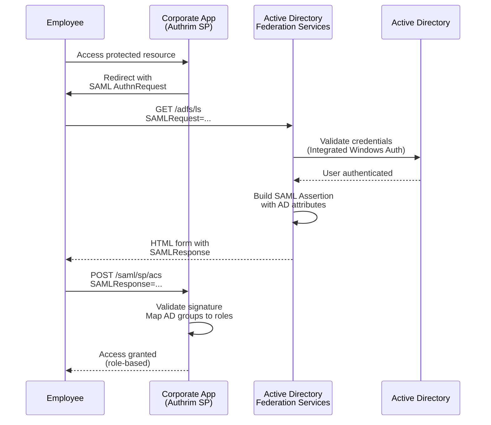
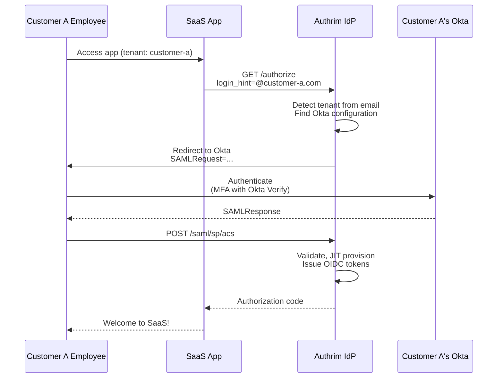
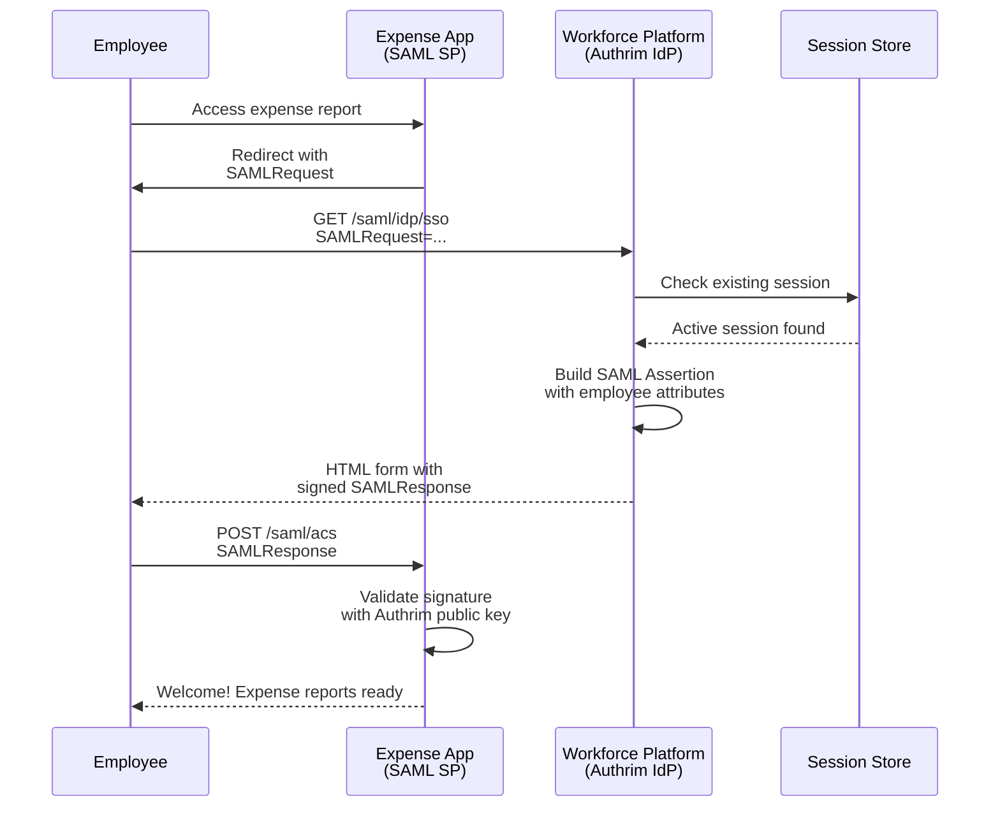
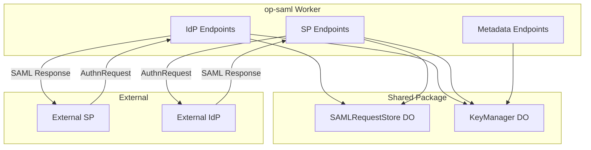

# SAML 2.0 Support

Enterprise-grade SAML 2.0 Identity Provider (IdP) and Service Provider (SP) for secure SSO integration.

## Overview

| Specification                                                                                | Status                      | Roles   |
| -------------------------------------------------------------------------------------------- | --------------------------- | ------- |
| [SAML 2.0 Core](https://docs.oasis-open.org/security/saml/v2.0/saml-core-2.0-os.pdf)         | ✅ Implemented              | IdP, SP |
| [SAML 2.0 Bindings](https://docs.oasis-open.org/security/saml/v2.0/saml-bindings-2.0-os.pdf) | ✅ HTTP-POST, HTTP-Redirect |         |
| [SAML 2.0 Profiles](https://docs.oasis-open.org/security/saml/v2.0/saml-profiles-2.0-os.pdf) | ✅ Web Browser SSO, SLO     |         |

SAML (Security Assertion Markup Language) 2.0 is an XML-based framework for exchanging authentication and authorization data between parties. Authrim supports both IdP and SP roles, enabling enterprise SSO integrations.

---

## Benefits

| Benefit              | Description                                         |
| -------------------- | --------------------------------------------------- |
| **Enterprise SSO**   | Integrate with AD FS, Okta, Azure AD, OneLogin      |
| **Legacy Support**   | Connect with applications that only support SAML    |
| **Federation**       | Establish trust relationships between organizations |
| **Compliance**       | Meet SOC 2, HIPAA, FedRAMP requirements for SSO     |
| **JIT Provisioning** | Auto-create users on first SAML login               |

---

## Practical Use Cases

### Use Case 1: Enterprise AD FS Integration for Corporate SSO

**Scenario**: A Fortune 500 company uses Microsoft Active Directory Federation Services (AD FS) for employee authentication. All internal applications must use AD FS as the identity source. Authrim acts as a Service Provider (SP) that federates with AD FS.

**Why SAML**: AD FS is SAML-native, and many enterprises have invested heavily in AD FS infrastructure. SAML provides the interoperability standard needed for seamless integration.



**Implementation**:

```typescript
// Configure AD FS as external SAML IdP
async function configureADFSProvider(adminToken: string) {
  // 1. Fetch AD FS metadata (contains certificates and endpoints)
  const adfsMetadata = await fetch(
    'https://adfs.corp.example.com/FederationMetadata/2007-06/FederationMetadata.xml'
  );

  // 2. Register AD FS as SAML provider
  const response = await fetch('https://auth.example.com/api/admin/saml/providers', {
    method: 'POST',
    headers: {
      Authorization: `Bearer ${adminToken}`,
      'Content-Type': 'application/json',
    },
    body: JSON.stringify({
      name: 'Corporate AD FS',
      type: 'idp',
      entity_id: 'http://adfs.corp.example.com/adfs/services/trust',
      metadata_url:
        'https://adfs.corp.example.com/FederationMetadata/2007-06/FederationMetadata.xml',

      // NameID format - use UPN for AD users
      name_id_format: 'urn:oasis:names:tc:SAML:1.1:nameid-format:emailAddress',

      // Map AD claims to Authrim claims
      attribute_mappings: [
        {
          saml_attribute: 'http://schemas.xmlsoap.org/ws/2005/05/identity/claims/emailaddress',
          user_claim: 'email',
        },
        {
          saml_attribute: 'http://schemas.xmlsoap.org/ws/2005/05/identity/claims/name',
          user_claim: 'name',
        },
        {
          saml_attribute: 'http://schemas.microsoft.com/ws/2008/06/identity/claims/groups',
          user_claim: 'groups',
        },
        {
          saml_attribute: 'http://schemas.xmlsoap.org/ws/2005/05/identity/claims/upn',
          user_claim: 'upn',
        },
      ],

      // Security settings
      sign_authn_requests: true,
      validate_signature: true,

      // Enable JIT provisioning for new employees
      jit_provisioning: {
        enabled: true,
        default_role: 'employee',
        group_to_role_mappings: {
          'Domain Admins': 'admin',
          'IT Department': 'it_staff',
          Engineering: 'developer',
        },
      },
    }),
  });

  return response.json();
}

// Handle SAML Response from AD FS
app.post('/saml/sp/acs', async (c) => {
  const body = await c.req.parseBody();
  const samlResponse = body.SAMLResponse as string;
  const relayState = body.RelayState as string;

  // Parse and validate SAML Response
  const assertion = await validateSAMLResponse(samlResponse, {
    expectedAudience: 'https://auth.example.com',
    clockSkew: 60, // 60 second tolerance
  });

  // Extract user attributes from AD
  const user = {
    email: assertion.getAttribute('emailaddress'),
    name: assertion.getAttribute('name'),
    groups: assertion.getAttribute('groups'),
    upn: assertion.getAttribute('upn'),
  };

  // JIT provision or update user
  const authrimUser = await jitProvisionUser(user, assertion.issuer);

  // Map AD groups to Authrim roles
  const roles = mapGroupsToRoles(user.groups);

  // Create session and redirect
  const session = await createSession(authrimUser, roles);

  return c.redirect(relayState || '/dashboard');
});
```

**AD FS Claim Rules Configuration**:

```powershell
# PowerShell: Configure AD FS claim rules for Authrim
$relyingPartyTrustName = "Authrim Production"

# Rule 1: Send email claim
$emailRule = @"
@RuleTemplate = "LdapClaims"
@RuleName = "Email Address"
c:[Type == "http://schemas.microsoft.com/ws/2008/06/identity/claims/windowsaccountname"]
 => issue(store = "Active Directory",
    types = ("http://schemas.xmlsoap.org/ws/2005/05/identity/claims/emailaddress"),
    query = ";mail;{0}", param = c.Value);
"@

# Rule 2: Send group memberships
$groupRule = @"
@RuleTemplate = "LdapClaims"
@RuleName = "Group Memberships"
c:[Type == "http://schemas.microsoft.com/ws/2008/06/identity/claims/windowsaccountname"]
 => issue(store = "Active Directory",
    types = ("http://schemas.microsoft.com/ws/2008/06/identity/claims/groups"),
    query = ";tokenGroups(fullDomainQualifiedName);{0}", param = c.Value);
"@

Set-AdfsRelyingPartyTrust -TargetName $relyingPartyTrustName `
  -IssuanceTransformRulesFile "claims.txt"
```

---

### Use Case 2: Multi-Tenant SaaS with Customer-Managed IdP

**Scenario**: A B2B SaaS platform (e.g., project management software) serves multiple enterprise customers. Each customer wants their employees to authenticate using their own corporate IdP (Okta, Azure AD, or AD FS). Authrim acts as an IdP that brokers authentication to customer IdPs.

**Why SAML**: Enterprise customers demand SSO with their existing identity infrastructure. SAML is the universal standard supported by all enterprise IdPs.



**Implementation**:

```typescript
// Multi-tenant SAML provider configuration
interface TenantSAMLConfig {
  tenant_id: string;
  display_name: string;
  email_domains: string[];
  idp_type: 'okta' | 'azure_ad' | 'adfs' | 'generic';
  metadata_url?: string;
  metadata_xml?: string;
  attribute_mappings: AttributeMapping[];
}

// Tenant-aware SAML provider discovery
async function discoverTenantIdP(email: string, env: Env): Promise<TenantSAMLConfig | null> {
  const domain = email.split('@')[1];

  // Look up tenant by email domain
  const tenantMapping = await env.KV.get(`tenant:domain:${domain}`, 'json');
  if (!tenantMapping) return null;

  // Get tenant's SAML configuration
  const samlConfig = (await env.KV.get(
    `saml:provider:${tenantMapping.tenant_id}`,
    'json'
  )) as TenantSAMLConfig;

  return samlConfig;
}

// Admin API: Configure customer's SAML IdP
app.post('/api/admin/tenants/:tenantId/saml', authenticate, async (c) => {
  const tenantId = c.req.param('tenantId');
  const body = await c.req.json();

  // Validate admin has access to this tenant
  const user = c.get('user');
  if (!(await isTenantAdmin(user.sub, tenantId))) {
    return c.json({ error: 'forbidden' }, 403);
  }

  // Fetch and parse IdP metadata
  let parsedMetadata;
  if (body.metadata_url) {
    const metadataXml = await fetch(body.metadata_url).then((r) => r.text());
    parsedMetadata = parseSAMLMetadata(metadataXml);
  } else if (body.metadata_xml) {
    parsedMetadata = parseSAMLMetadata(body.metadata_xml);
  }

  // Store tenant SAML configuration
  const config: TenantSAMLConfig = {
    tenant_id: tenantId,
    display_name: body.display_name,
    email_domains: body.email_domains,
    idp_type: body.idp_type,
    metadata_url: body.metadata_url,
    attribute_mappings: body.attribute_mappings || defaultMappingsForIdP(body.idp_type),
    ...parsedMetadata,
  };

  await c.env.KV.put(`saml:provider:${tenantId}`, JSON.stringify(config));

  // Map email domains to tenant
  for (const domain of body.email_domains) {
    await c.env.KV.put(
      `tenant:domain:${domain}`,
      JSON.stringify({
        tenant_id: tenantId,
        saml_enabled: true,
      })
    );
  }

  return c.json(
    {
      message: 'SAML IdP configured',
      sp_metadata_url: `https://auth.example.com/saml/sp/metadata?tenant=${tenantId}`,
      acs_url: `https://auth.example.com/saml/sp/acs`,
      entity_id: `https://auth.example.com/sp/${tenantId}`,
    },
    201
  );
});

// Modified authorize endpoint with SAML IdP detection
app.get('/authorize', async (c) => {
  const loginHint = c.req.query('login_hint');

  if (loginHint && loginHint.includes('@')) {
    // Check if email domain has SAML IdP configured
    const samlConfig = await discoverTenantIdP(loginHint, c.env);

    if (samlConfig) {
      // Redirect to SAML IdP
      const authnRequest = await buildSAMLAuthnRequest({
        destination: samlConfig.sso_url,
        issuer: `https://auth.example.com/sp/${samlConfig.tenant_id}`,
        acsUrl: 'https://auth.example.com/saml/sp/acs',
      });

      // Store request ID for validation
      await c.env.SAML_REQUEST_STORE.put(
        authnRequest.id,
        JSON.stringify({
          tenant_id: samlConfig.tenant_id,
          original_request: c.req.url,
          created_at: Date.now(),
        }),
        { expirationTtl: 300 }
      );

      // Redirect based on binding
      if (samlConfig.binding === 'HTTP-Redirect') {
        const redirectUrl = buildRedirectBinding(authnRequest, samlConfig.sso_url);
        return c.redirect(redirectUrl);
      } else {
        // HTTP-POST binding
        return c.html(buildPostBindingForm(authnRequest, samlConfig.sso_url));
      }
    }
  }

  // Fall back to standard OAuth/OIDC flow
  return handleStandardAuthorize(c);
});
```

**Customer Self-Service Portal**:

```typescript
// Customer admin configures their IdP
const customerAdminUI = `
<h2>Configure Single Sign-On</h2>

<form id="saml-config">
  <label>Identity Provider Type</label>
  <select name="idp_type" onchange="showConfigFields(this.value)">
    <option value="okta">Okta</option>
    <option value="azure_ad">Azure AD / Entra ID</option>
    <option value="adfs">AD FS</option>
    <option value="generic">Other SAML 2.0 IdP</option>
  </select>

  <label>IdP Metadata URL</label>
  <input type="url" name="metadata_url"
         placeholder="https://yourcompany.okta.com/app/xxx/sso/saml/metadata" />

  <label>Email Domains (one per line)</label>
  <textarea name="email_domains" placeholder="yourcompany.com\nsubsidiary.com"></textarea>

  <h3>Your SP Configuration</h3>
  <p>Configure these in your IdP:</p>
  <table>
    <tr><td>Entity ID</td><td><code>https://auth.saas.com/sp/{{tenant_id}}</code></td></tr>
    <tr><td>ACS URL</td><td><code>https://auth.saas.com/saml/sp/acs</code></td></tr>
    <tr><td>SP Metadata</td><td><a href="/saml/sp/metadata?tenant={{tenant_id}}">Download</a></td></tr>
  </table>

  <button type="submit">Save Configuration</button>
</form>
`;
```

---

### Use Case 3: SaaS Platform Acting as IdP for Partner Applications

**Scenario**: A workforce management platform wants to enable SSO for partner applications (expense tracking, travel booking, benefits portal). Partners only support SAML. Authrim acts as the Identity Provider, allowing employees to access partner apps with a single login.

**Why SAML**: Partner applications in the HR/workforce ecosystem often only support SAML. Acting as an IdP allows the platform to be the identity authority for all integrations.



**Implementation**:

```typescript
// Register partner application as SAML SP
async function registerPartnerSP(partnerConfig: PartnerSPConfig) {
  // Admin API call to register SP
  const sp = await fetch('/api/admin/saml/providers', {
    method: 'POST',
    headers: { 'Content-Type': 'application/json' },
    body: JSON.stringify({
      name: partnerConfig.name,
      type: 'sp',
      entity_id: partnerConfig.entityId,
      acs_url: partnerConfig.acsUrl,
      slo_url: partnerConfig.sloUrl,

      // NameID format based on partner requirements
      name_id_format:
        partnerConfig.nameIdFormat || 'urn:oasis:names:tc:SAML:1.1:nameid-format:emailAddress',

      // Always sign assertions
      sign_assertions: true,
      sign_response: true,

      // Attribute mappings for partner
      attribute_mappings: [
        { saml_attribute: 'email', user_claim: 'email' },
        { saml_attribute: 'displayName', user_claim: 'name' },
        { saml_attribute: 'employeeId', user_claim: 'employee_id' },
        { saml_attribute: 'department', user_claim: 'department' },
        { saml_attribute: 'costCenter', user_claim: 'cost_center' },
        { saml_attribute: 'manager', user_claim: 'manager_email' },
      ],

      // Restrict to specific user roles
      allowed_roles: ['employee', 'manager', 'admin'],
    }),
  });

  return sp.json();
}

// IdP SSO endpoint - handle SAML AuthnRequest
app.all('/saml/idp/sso', async (c) => {
  // 1. Parse AuthnRequest (GET = Redirect binding, POST = POST binding)
  const authnRequest =
    c.req.method === 'GET'
      ? await parseRedirectBinding(c.req.query('SAMLRequest'))
      : await parsePostBinding((await c.req.parseBody()).SAMLRequest as string);

  // 2. Validate request
  const sp = await getRegisteredSP(authnRequest.issuer);
  if (!sp) {
    return c.html(renderError('Unknown Service Provider'));
  }

  // Validate destination
  if (authnRequest.destination !== 'https://auth.example.com/saml/idp/sso') {
    return c.html(renderError('Invalid destination'));
  }

  // Store request for InResponseTo validation
  await c.env.SAML_REQUEST_STORE.put(
    authnRequest.id,
    JSON.stringify({
      sp_entity_id: sp.entity_id,
      acs_url: authnRequest.assertionConsumerServiceURL || sp.acs_url,
      relay_state: c.req.query('RelayState'),
      created_at: Date.now(),
    }),
    { expirationTtl: 300 }
  );

  // 3. Check for existing session
  const session = await getSession(c);
  if (session) {
    // User already authenticated - issue SAML response
    return await issueSAMLResponse(c, session.user, sp, authnRequest.id);
  }

  // 4. No session - redirect to login
  const loginUrl = new URL('/login', c.req.url);
  loginUrl.searchParams.set('saml_request_id', authnRequest.id);
  return c.redirect(loginUrl.toString());
});

// After successful login, issue SAML Response
async function issueSAMLResponse(
  c: Context,
  user: User,
  sp: SAMLServiceProvider,
  inResponseTo: string
) {
  // Get stored request
  const storedRequest = await c.env.SAML_REQUEST_STORE.get(inResponseTo, 'json');
  if (!storedRequest) {
    return c.html(renderError('SAML request expired'));
  }

  // Check user is authorized for this SP
  if (sp.allowed_roles && !sp.allowed_roles.some((r) => user.roles.includes(r))) {
    return c.html(renderError('Access denied to this application'));
  }

  // Build assertion with mapped attributes
  const assertion = buildSAMLAssertion({
    issuer: 'https://auth.example.com',
    inResponseTo,
    recipient: storedRequest.acs_url,
    audience: sp.entity_id,
    nameId: {
      value: user.email,
      format: sp.name_id_format,
    },
    authnContext: 'urn:oasis:names:tc:SAML:2.0:ac:classes:PasswordProtectedTransport',
    sessionIndex: `_${crypto.randomUUID()}`,
    notBefore: new Date(Date.now() - 60000), // 1 minute ago
    notOnOrAfter: new Date(Date.now() + 300000), // 5 minutes from now
    attributes: mapUserToSAMLAttributes(user, sp.attribute_mappings),
  });

  // Sign the assertion
  const signedAssertion = await signSAMLAssertion(assertion, await getIdPSigningKey(c.env));

  // Build and sign response
  const response = buildSAMLResponse({
    inResponseTo,
    destination: storedRequest.acs_url,
    issuer: 'https://auth.example.com',
    assertion: signedAssertion,
    status: 'Success',
  });

  const signedResponse = await signSAMLResponse(response, await getIdPSigningKey(c.env));

  // Return auto-submitting form
  return c.html(`
    <!DOCTYPE html>
    <html>
    <head><title>Redirecting...</title></head>
    <body onload="document.forms[0].submit()">
      <noscript>
        <p>JavaScript is required. Please click the button below.</p>
      </noscript>
      <form method="POST" action="${escapeHtml(storedRequest.acs_url)}">
        <input type="hidden" name="SAMLResponse"
               value="${Buffer.from(signedResponse).toString('base64')}" />
        ${
          storedRequest.relay_state
            ? `<input type="hidden" name="RelayState" value="${escapeHtml(storedRequest.relay_state)}" />`
            : ''
        }
        <noscript>
          <button type="submit">Continue to ${escapeHtml(sp.name)}</button>
        </noscript>
      </form>
    </body>
    </html>
  `);
}
```

**Partner Onboarding Guide**:

```markdown
## Partner Integration Guide

### Step 1: Get Authrim IdP Metadata

Download our SAML metadata from:
https://auth.workforce.example.com/saml/idp/metadata

### Step 2: Configure Your Application

Use these values in your SAML SP configuration:

| Setting       | Value                                             |
| ------------- | ------------------------------------------------- |
| IdP Entity ID | `https://auth.workforce.example.com`              |
| SSO URL       | `https://auth.workforce.example.com/saml/idp/sso` |
| SLO URL       | `https://auth.workforce.example.com/saml/idp/slo` |
| Certificate   | (Download from metadata)                          |
| NameID Format | `emailAddress`                                    |

### Step 3: Register with Us

Contact integrations@workforce.example.com with:

- Your Entity ID
- Assertion Consumer Service URL
- Single Logout URL (optional)
- Required attributes (email, name, department, etc.)
```

---

## Architecture

### Components



### Durable Objects

| Object               | Purpose                                                    |
| -------------------- | ---------------------------------------------------------- |
| **SAMLRequestStore** | AuthnRequest tracking, replay protection, artifact storage |
| **KeyManager**       | X.509 certificates, private keys, key rotation             |

---

## Implementation Status

### Fully Implemented

| Feature                   | IdP | SP  | Notes                          |
| ------------------------- | --- | --- | ------------------------------ |
| **SSO (Single Sign-On)**  | ✅  | ✅  | SP-initiated and IdP-initiated |
| **SLO (Single Logout)**   | ✅  | ✅  | Signature verified             |
| **HTTP-POST Binding**     | ✅  | ✅  | Recommended                    |
| **HTTP-Redirect Binding** | ✅  | ✅  | Deflate encoding               |
| **Metadata Generation**   | ✅  | ✅  | XML metadata                   |
| **XML Signature**         | ✅  | ✅  | RSA-SHA256 (SHA-1 rejected)    |
| **NameID Formats**        | ✅  | ✅  | Email, Persistent, Transient   |
| **Attribute Mapping**     | ✅  | ✅  | Configurable                   |
| **JIT Provisioning**      | -   | ✅  | Auto user creation             |
| **Replay Protection**     | ✅  | ✅  | Request/Assertion ID tracking  |

### Not Implemented

| Feature                   | Reason                               |
| ------------------------- | ------------------------------------ |
| **Assertion Encryption**  | Signing sufficient for most cases    |
| **Artifact Binding**      | SOAP complexity; HTTP-POST preferred |
| **ECP Profile**           | Mobile-specific; out of scope        |
| **Multi-SP Logout Chain** | Complex session propagation          |

---

## API Reference

### IdP Endpoints

| Endpoint             | Method   | Description            |
| -------------------- | -------- | ---------------------- |
| `/saml/idp/metadata` | GET      | IdP metadata document  |
| `/saml/idp/sso`      | GET/POST | Single Sign-On service |
| `/saml/idp/slo`      | GET/POST | Single Logout service  |

### SP Endpoints

| Endpoint            | Method   | Description                |
| ------------------- | -------- | -------------------------- |
| `/saml/sp/metadata` | GET      | SP metadata document       |
| `/saml/sp/acs`      | POST     | Assertion Consumer Service |
| `/saml/sp/slo`      | GET/POST | Single Logout service      |
| `/saml/sp/init`     | GET      | SP-initiated SSO start     |

### Admin API

```bash
# List SAML providers
GET /api/admin/saml/providers

# Register new provider
POST /api/admin/saml/providers
Content-Type: application/json
{
  "name": "Corporate IdP",
  "type": "idp",
  "entity_id": "https://idp.corp.example.com",
  "metadata_url": "https://idp.corp.example.com/metadata"
}

# Update provider
PUT /api/admin/saml/providers/:id

# Delete provider
DELETE /api/admin/saml/providers/:id
```

---

## Security Considerations

| Consideration              | Implementation                      |
| -------------------------- | ----------------------------------- |
| **Signature Algorithm**    | RSA-SHA256 (SHA-1 rejected)         |
| **Replay Protection**      | Request ID + Assertion ID tracking  |
| **Time Validation**        | NotBefore/NotOnOrAfter + 60s skew   |
| **Destination Validation** | Verify against registered endpoints |
| **Audience Restriction**   | Validate audience matches entity ID |

---

## Configuration

### Environment Variables

| Variable                  | Description               | Default            |
| ------------------------- | ------------------------- | ------------------ |
| `SAML_ENTITY_ID`          | IdP Entity ID             | `https://{domain}` |
| `SAML_CERT_VALIDITY_DAYS` | Certificate validity      | `365`              |
| `SAML_REQUEST_TTL`        | Request validity (ms)     | `300000`           |
| `SAML_CLOCK_SKEW`         | Clock tolerance (seconds) | `60`               |

### NameID Formats

| Format     | URI                                                      |
| ---------- | -------------------------------------------------------- |
| Email      | `urn:oasis:names:tc:SAML:1.1:nameid-format:emailAddress` |
| Persistent | `urn:oasis:names:tc:SAML:2.0:nameid-format:persistent`   |
| Transient  | `urn:oasis:names:tc:SAML:2.0:nameid-format:transient`    |

---

## Troubleshooting

### "Invalid signature"

**Cause**: Certificate mismatch or key rotation

**Solution**: Re-import IdP/SP metadata with current certificate

### "Assertion expired"

**Cause**: Clock drift between IdP and SP

**Solution**: Check NTP sync; adjust `SAML_CLOCK_SKEW` if needed

### "Unknown issuer"

**Cause**: Provider not registered or entity_id mismatch

**Solution**: Verify entity_id matches registered provider exactly

---

## Implementation Files

| Component     | File                                                      | Description            |
| ------------- | --------------------------------------------------------- | ---------------------- |
| IdP Handler   | `packages/op-saml/src/idp.ts`                             | SSO, SLO endpoints     |
| SP Handler    | `packages/op-saml/src/sp.ts`                              | ACS, SP-init endpoints |
| Metadata      | `packages/op-saml/src/metadata.ts`                        | XML generation         |
| XML Signing   | `packages/shared/src/utils/xml-signing.ts`                | RSA-SHA256             |
| Request Store | `packages/shared/src/durable-objects/SAMLRequestStore.ts` | State management       |

---

## References

- [SAML 2.0 Core](https://docs.oasis-open.org/security/saml/v2.0/saml-core-2.0-os.pdf)
- [SAML 2.0 Bindings](https://docs.oasis-open.org/security/saml/v2.0/saml-bindings-2.0-os.pdf)
- [SAML 2.0 Profiles](https://docs.oasis-open.org/security/saml/v2.0/saml-profiles-2.0-os.pdf)
- [SAML 2.0 Metadata](https://docs.oasis-open.org/security/saml/v2.0/saml-metadata-2.0-os.pdf)

---

**Last Updated**: 2025-12-20
**Status**: ✅ Fully Implemented
**Tests**: 35+ passing tests
**Implementation**: `packages/op-saml/src/`
