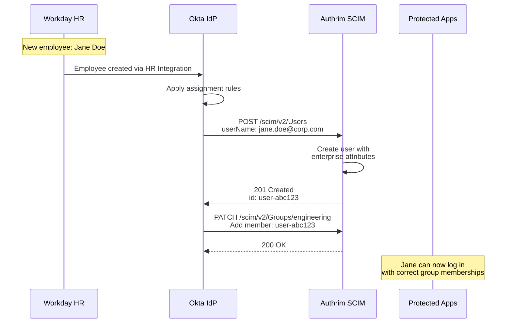
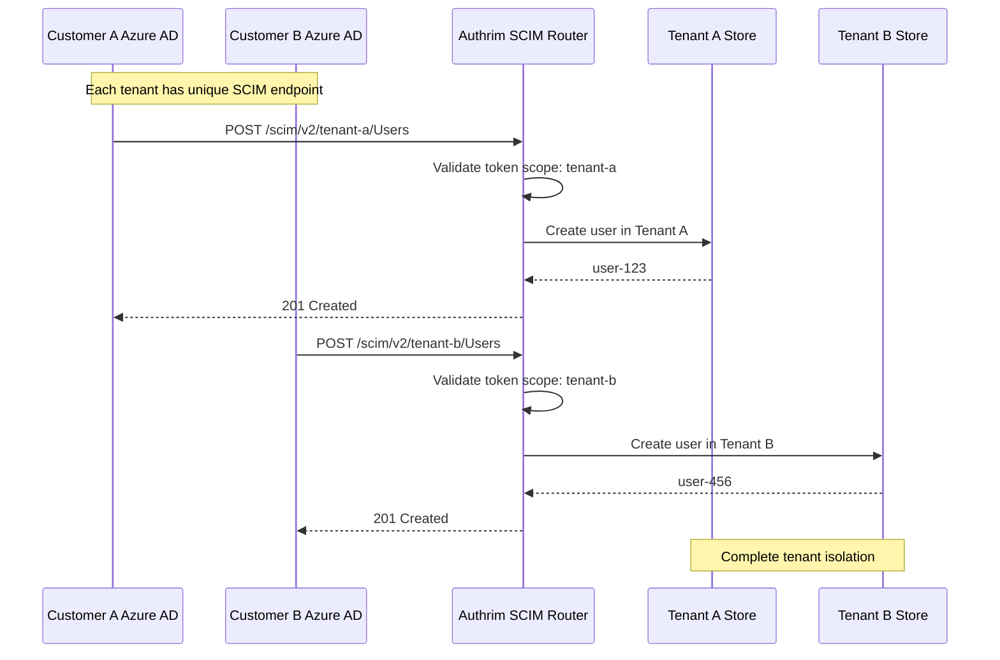
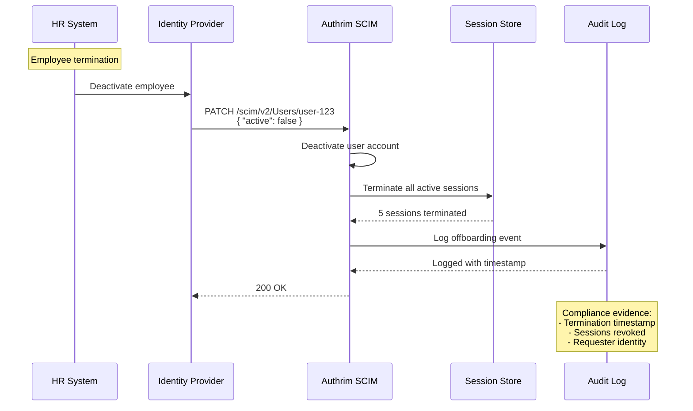

# SCIM 2.0 User Provisioning

Automate user lifecycle management with the industry-standard SCIM protocol for enterprise identity synchronization.

## Overview

| Specification                                                               | Status         | Use Case               |
| --------------------------------------------------------------------------- | -------------- | ---------------------- |
| [RFC 7643: SCIM Core Schema](https://datatracker.ietf.org/doc/html/rfc7643) | ✅ Implemented | User/Group data models |
| [RFC 7644: SCIM Protocol](https://datatracker.ietf.org/doc/html/rfc7644)    | ✅ Implemented | REST API operations    |

SCIM (System for Cross-domain Identity Management) provides a standardized REST API for managing user identities across systems. With SCIM, you can:

- **Automate user provisioning**: Create, update, and delete users automatically
- **Sync user attributes**: Keep user data consistent across systems
- **Manage group memberships**: Automatically assign users to roles/groups
- **Handle lifecycle events**: Deactivate users when they leave

---

## Benefits

| Benefit                      | Description                                           |
| ---------------------------- | ----------------------------------------------------- |
| **Zero Manual Provisioning** | Users provisioned instantly from HR/IdP systems       |
| **Real-time Sync**           | Attribute changes propagate within seconds            |
| **Compliance Ready**         | Automated deprovisioning meets SOC 2/SOX requirements |
| **Multi-IdP Support**        | Works with Okta, Azure AD, OneLogin, Google Workspace |
| **Reduced IT Burden**        | Eliminates manual account creation tickets            |

### Supported Features

- ✅ User CRUD operations (Create, Read, Update, Delete)
- ✅ Group CRUD operations
- ✅ Filtering with SCIM query syntax
- ✅ Pagination with `startIndex` and `count`
- ✅ Resource versioning with ETags
- ✅ Partial updates with PATCH operations
- ✅ Enterprise User extension
- ✅ Bearer token authentication

---

## Practical Use Cases

### Use Case 1: Enterprise Employee Onboarding with Okta

**Scenario**: A 5000-employee enterprise uses Okta as their central IdP. New hires in Workday should automatically get accounts in all connected applications including Authrim-protected services.

**Why SCIM**: Manual account creation delays access by days. SCIM enables same-day access for new employees.



**Implementation - Okta Configuration**:

1. **Generate SCIM Token in Authrim**:

```bash
# Admin API: Create SCIM token
curl -X POST https://auth.example.com/api/admin/scim/tokens \
  -H "Authorization: Bearer $ADMIN_TOKEN" \
  -H "Content-Type: application/json" \
  -d '{
    "description": "Okta HR Provisioning",
    "expires_in_days": 365,
    "scopes": ["users:write", "groups:write"]
  }'

# Response
{
  "token": "scim_live_abc123...",
  "expires_at": "2026-12-20T00:00:00Z"
}
```

2. **Configure Okta SCIM Integration**:

```yaml
# Okta App Configuration
provisioning:
  mode: automatic
  scim:
    base_url: "https://auth.example.com/scim/v2"
    authentication:
      type: http_header
      header: "Authorization"
      value: "Bearer scim_live_abc123..."

  actions:
    create_users: true
    update_user_attributes: true
    deactivate_users: true
    sync_password: false  # Use SSO instead

  attribute_mapping:
    - okta: email → scim: userName
    - okta: firstName → scim: name.givenName
    - okta: lastName → scim: name.familyName
    - okta: department → scim: urn:ietf:params:scim:schemas:extension:enterprise:2.0:User:department
    - okta: manager → scim: urn:ietf:params:scim:schemas:extension:enterprise:2.0:User:manager
```

3. **Authrim SCIM Handler (Server-side)**:

```typescript
// packages/op-scim/src/handlers/users.ts
export async function handleCreateUser(c: Context): Promise<Response> {
  const scimUser = await c.req.json<SCIMUser>();

  // Validate required fields
  if (!scimUser.userName || !scimUser.emails?.[0]?.value) {
    return scimError(c, 400, 'invalidValue', 'userName and email are required');
  }

  // Check for existing user
  const existing = await c.env.USER_STORE.get(scimUser.userName);
  if (existing) {
    return scimError(c, 409, 'uniqueness', 'User already exists');
  }

  // Map SCIM attributes to internal user model
  const user: User = {
    id: crypto.randomUUID(),
    email: scimUser.emails[0].value,
    given_name: scimUser.name?.givenName,
    family_name: scimUser.name?.familyName,
    active: scimUser.active ?? true,
    external_id: scimUser.externalId,
    enterprise: scimUser['urn:ietf:params:scim:schemas:extension:enterprise:2.0:User'],
    created_at: new Date().toISOString(),
    updated_at: new Date().toISOString(),
  };

  await c.env.USER_STORE.put(user.id, JSON.stringify(user));

  // Emit provisioning event
  await c.env.EVENT_BUS.publish({
    type: 'user.provisioned',
    user_id: user.id,
    source: 'scim',
    timestamp: Date.now(),
  });

  return c.json(mapToSCIMUser(user), 201, {
    Location: `${c.env.BASE_URL}/scim/v2/Users/${user.id}`,
  });
}
```

---

### Use Case 2: Multi-Tenant SaaS with Azure AD B2B Provisioning

**Scenario**: A B2B SaaS platform serves multiple enterprise customers. Each customer manages their own Azure AD tenant and wants their employees automatically provisioned into the platform with correct tenant isolation.

**Why SCIM**: Each customer's Azure AD can provision users directly without the SaaS vendor managing credentials. Tenant isolation is enforced at the SCIM endpoint level.



**Implementation**:

1. **Create Per-Tenant SCIM Endpoints**:

```typescript
// Multi-tenant SCIM router
export const scimRouter = new Hono<{ Bindings: Env }>();

// Tenant-specific endpoints
scimRouter.all('/scim/v2/:tenantId/*', async (c) => {
  const tenantId = c.req.param('tenantId');
  const token = extractBearerToken(c.req.header('Authorization'));

  // Validate SCIM token is authorized for this tenant
  const tokenInfo = await validateSCIMToken(c.env, token);
  if (!tokenInfo || tokenInfo.tenant_id !== tenantId) {
    return c.json(
      {
        schemas: ['urn:ietf:params:scim:api:messages:2.0:Error'],
        status: '403',
        detail: 'Token not authorized for this tenant',
      },
      403
    );
  }

  // Inject tenant context
  c.set('tenantId', tenantId);
  c.set('scimToken', tokenInfo);

  return await handleSCIMRequest(c);
});
```

2. **Azure AD Configuration per Customer**:

```json
// Customer A Azure AD Enterprise App Configuration
{
  "name": "SaaS Platform - Customer A",
  "provisioning": {
    "mode": "automatic",
    "connector": "scim",
    "tenantUrl": "https://auth.saasplatform.com/scim/v2/tenant-a",
    "secretToken": "scim_tenant_a_xyz789...",
    "testConnection": true
  },
  "attributeMappings": [
    {
      "source": "userPrincipalName",
      "target": "userName"
    },
    {
      "source": "mail",
      "target": "emails[type eq \"work\"].value"
    },
    {
      "source": "department",
      "target": "urn:ietf:params:scim:schemas:extension:enterprise:2.0:User:department"
    }
  ],
  "scoping": {
    "groups": ["SaaS-Platform-Users"]
  }
}
```

3. **Tenant-Isolated User Storage**:

```typescript
async function createUserInTenant(env: Env, tenantId: string, scimUser: SCIMUser): Promise<User> {
  // Tenant-specific user ID to prevent cross-tenant collisions
  const userId = `${tenantId}:${crypto.randomUUID()}`;

  const user: User = {
    id: userId,
    tenant_id: tenantId,
    email: scimUser.emails?.[0]?.value,
    external_id: scimUser.externalId,
    // ... other attributes
  };

  // Store in tenant-partitioned KV namespace
  const key = `tenant:${tenantId}:user:${userId}`;
  await env.USER_STORE.put(key, JSON.stringify(user));

  // Also index by userName for lookups
  await env.USER_INDEX.put(`tenant:${tenantId}:userName:${scimUser.userName}`, userId);

  return user;
}
```

---

### Use Case 3: Employee Offboarding with Real-time Deprovisioning

**Scenario**: A financial services company must immediately revoke access when employees leave to meet regulatory requirements. HR terminations in Workday must trigger instant deactivation across all systems.

**Why SCIM**: SCIM's PATCH operation with `active: false` provides standardized deactivation that triggers downstream session termination.



**Implementation**:

```typescript
// Deactivation handler with session termination
async function handleUserDeactivation(c: Context, userId: string): Promise<void> {
  const startTime = Date.now();

  // 1. Update user status
  const user = await getUserById(c.env, userId);
  user.active = false;
  user.deactivated_at = new Date().toISOString();
  user.deactivated_by = c.get('scimToken').client_id;
  await saveUser(c.env, user);

  // 2. Terminate ALL active sessions immediately
  const sessions = await c.env.SESSION_STORE.list({
    prefix: `user:${userId}:session:`,
  });

  const terminatedSessions: string[] = [];
  for (const session of sessions.keys) {
    await c.env.SESSION_STORE.delete(session.name);
    terminatedSessions.push(session.name);
  }

  // 3. Revoke all active tokens
  const tokens = await c.env.TOKEN_STORE.list({
    prefix: `user:${userId}:token:`,
  });

  for (const token of tokens.keys) {
    await revokeToken(c.env, token.name);
  }

  // 4. Create compliance audit record
  await c.env.AUDIT_LOG.put(
    `offboarding:${userId}:${Date.now()}`,
    JSON.stringify({
      event_type: 'user.offboarded',
      user_id: userId,
      timestamp: new Date().toISOString(),
      duration_ms: Date.now() - startTime,
      sessions_terminated: terminatedSessions.length,
      tokens_revoked: tokens.keys.length,
      requested_by: c.get('scimToken').client_id,
      source_ip: c.req.header('CF-Connecting-IP'),
      compliance: {
        regulation: 'SOC2',
        requirement: 'CC6.1',
        status: 'compliant',
      },
    })
  );

  // 5. Emit real-time event for downstream systems
  await c.env.EVENT_BUS.publish({
    type: 'user.deactivated',
    user_id: userId,
    immediate_effect: true,
    sessions_killed: terminatedSessions.length,
  });
}

// PATCH operation handler
export async function handlePatchUser(c: Context): Promise<Response> {
  const userId = c.req.param('id');
  const patchRequest = await c.req.json<SCIMPatchRequest>();

  for (const operation of patchRequest.Operations) {
    if (operation.path === 'active' && operation.value === false) {
      // Special handling for deactivation
      await handleUserDeactivation(c, userId);
    } else {
      await applyPatchOperation(c.env, userId, operation);
    }
  }

  const updatedUser = await getUserById(c.env, userId);
  return c.json(mapToSCIMUser(updatedUser));
}
```

**Compliance Reporting**:

```typescript
// Generate compliance report for auditors
async function generateOffboardingReport(
  env: Env,
  startDate: string,
  endDate: string
): Promise<ComplianceReport> {
  const events = await env.AUDIT_LOG.list({
    prefix: 'offboarding:',
  });

  const offboardings = [];
  for (const event of events.keys) {
    const data = await env.AUDIT_LOG.get(event.name, 'json');
    if (data.timestamp >= startDate && data.timestamp <= endDate) {
      offboardings.push({
        user_id: data.user_id,
        termination_time: data.timestamp,
        access_revoked_within_ms: data.duration_ms,
        sessions_terminated: data.sessions_terminated,
        compliant: data.duration_ms < 60000, // Under 1 minute
      });
    }
  }

  return {
    report_type: 'offboarding_compliance',
    period: { start: startDate, end: endDate },
    total_offboardings: offboardings.length,
    compliant_count: offboardings.filter((o) => o.compliant).length,
    average_revocation_time_ms: average(offboardings.map((o) => o.access_revoked_within_ms)),
    details: offboardings,
  };
}
```

---

## Authentication

All SCIM requests require a Bearer token for authentication.

### Creating a SCIM Token

```bash
# Admin API: Create SCIM token
POST /api/admin/scim/tokens
Authorization: Bearer ADMIN_TOKEN
Content-Type: application/json

{
  "description": "Okta SCIM Integration",
  "expires_in_days": 365,
  "scopes": ["users:read", "users:write", "groups:read", "groups:write"]
}
```

### Using the Token

```http
Authorization: Bearer YOUR_SCIM_TOKEN
```

---

## API Reference

### Base URL

```
https://YOUR_DOMAIN/scim/v2
```

### Endpoints Summary

| Endpoint               | Method | Description               |
| ---------------------- | ------ | ------------------------- |
| `/scim/v2/Users`       | GET    | List users with filtering |
| `/scim/v2/Users`       | POST   | Create new user           |
| `/scim/v2/Users/{id}`  | GET    | Get user by ID            |
| `/scim/v2/Users/{id}`  | PUT    | Replace user              |
| `/scim/v2/Users/{id}`  | PATCH  | Partial update            |
| `/scim/v2/Users/{id}`  | DELETE | Delete user               |
| `/scim/v2/Groups`      | GET    | List groups               |
| `/scim/v2/Groups`      | POST   | Create group              |
| `/scim/v2/Groups/{id}` | GET    | Get group by ID           |
| `/scim/v2/Groups/{id}` | PUT    | Replace group             |
| `/scim/v2/Groups/{id}` | PATCH  | Update members            |
| `/scim/v2/Groups/{id}` | DELETE | Delete group              |

### User Schema

```json
{
  "schemas": ["urn:ietf:params:scim:schemas:core:2.0:User"],
  "id": "user-123",
  "externalId": "ext-abc",
  "userName": "john@example.com",
  "name": {
    "givenName": "John",
    "familyName": "Doe",
    "formatted": "John Doe"
  },
  "emails": [
    {
      "value": "john@example.com",
      "type": "work",
      "primary": true
    }
  ],
  "phoneNumbers": [
    {
      "value": "+1234567890",
      "type": "mobile"
    }
  ],
  "active": true,
  "meta": {
    "resourceType": "User",
    "created": "2024-01-01T00:00:00Z",
    "lastModified": "2024-01-02T00:00:00Z",
    "location": "https://auth.example.com/scim/v2/Users/user-123",
    "version": "W/\"1704153600000\""
  }
}
```

### Group Schema

```json
{
  "schemas": ["urn:ietf:params:scim:schemas:core:2.0:Group"],
  "id": "group-123",
  "displayName": "Engineering",
  "members": [
    {
      "value": "user-123",
      "$ref": "https://auth.example.com/scim/v2/Users/user-123",
      "type": "User",
      "display": "john@example.com"
    }
  ],
  "meta": {
    "resourceType": "Group",
    "created": "2024-01-01T00:00:00Z",
    "lastModified": "2024-01-02T00:00:00Z"
  }
}
```

---

## Filtering

SCIM supports complex filtering using a standardized query syntax.

### Filter Operators

| Operator | Description      | Example                          |
| -------- | ---------------- | -------------------------------- |
| `eq`     | Equal            | `userName eq "john@example.com"` |
| `ne`     | Not equal        | `active ne false`                |
| `co`     | Contains         | `userName co "john"`             |
| `sw`     | Starts with      | `userName sw "john"`             |
| `ew`     | Ends with        | `userName ew "example.com"`      |
| `pr`     | Present          | `phoneNumber pr`                 |
| `gt`     | Greater than     | `meta.created gt "2024-01-01"`   |
| `ge`     | Greater or equal | `meta.created ge "2024-01-01"`   |
| `lt`     | Less than        | `meta.created lt "2024-12-31"`   |
| `le`     | Less or equal    | `meta.created le "2024-12-31"`   |

### Logical Operators

| Operator | Example                                    |
| -------- | ------------------------------------------ |
| `and`    | `userName eq "john" and active eq true`    |
| `or`     | `userName eq "john" or userName eq "jane"` |
| `not`    | `not (active eq false)`                    |

### Examples

```bash
# Find user by email
GET /scim/v2/Users?filter=userName eq "john@example.com"

# Find active users in engineering
GET /scim/v2/Users?filter=active eq true and department eq "Engineering"

# Find users created this month
GET /scim/v2/Users?filter=meta.created ge "2024-12-01"
```

---

## Pagination

SCIM uses 1-based pagination with `startIndex` and `count` parameters.

```bash
# First page (items 1-100)
GET /scim/v2/Users?startIndex=1&count=100

# Second page (items 101-200)
GET /scim/v2/Users?startIndex=101&count=100
```

**Response:**

```json
{
  "schemas": ["urn:ietf:params:scim:api:messages:2.0:ListResponse"],
  "totalResults": 250,
  "startIndex": 1,
  "itemsPerPage": 100,
  "Resources": [...]
}
```

---

## Resource Versioning (ETags)

ETags enable optimistic concurrency control.

```http
# Get user with ETag
GET /scim/v2/Users/user-123
Response: ETag: W/"1704153600000"

# Conditional update
PUT /scim/v2/Users/user-123
If-Match: W/"1704153600000"

# Result: 200 OK (version matches) or 412 Precondition Failed
```

---

## Integration Guides

### Okta

| Setting           | Value                         |
| ----------------- | ----------------------------- |
| SCIM Base URL     | `https://YOUR_DOMAIN/scim/v2` |
| Authentication    | HTTP Header                   |
| Authorization     | Bearer `YOUR_TOKEN`           |
| Unique identifier | `userName`                    |

### Azure AD (Entra ID)

| Setting           | Value                         |
| ----------------- | ----------------------------- |
| Provisioning Mode | Automatic                     |
| Tenant URL        | `https://YOUR_DOMAIN/scim/v2` |
| Secret Token      | `YOUR_TOKEN`                  |

### OneLogin

| Setting           | Value                         |
| ----------------- | ----------------------------- |
| SCIM Base URL     | `https://YOUR_DOMAIN/scim/v2` |
| SCIM Bearer Token | `YOUR_TOKEN`                  |
| API Connection    | SCIM 2.0                      |

### Google Workspace

| Setting          | Value                               |
| ---------------- | ----------------------------------- |
| Provisioning URL | `https://YOUR_DOMAIN/scim/v2/Users` |
| Authorization    | Bearer Token                        |

---

## Error Handling

### Error Format

```json
{
  "schemas": ["urn:ietf:params:scim:api:messages:2.0:Error"],
  "status": "400",
  "scimType": "invalidValue",
  "detail": "userName is required"
}
```

### Error Types

| scimType        | HTTP Status | Description                   |
| --------------- | ----------- | ----------------------------- |
| `invalidFilter` | 400         | Invalid filter syntax         |
| `invalidValue`  | 400         | Invalid attribute value       |
| `uniqueness`    | 409         | Resource already exists       |
| `mutability`    | 400         | Modifying read-only attribute |
| `noTarget`      | 404         | Resource not found            |
| `invalidVers`   | 412         | ETag mismatch                 |

---

## Configuration

### Environment Variables

| Variable              | Description            | Default |
| --------------------- | ---------------------- | ------- |
| `SCIM_MAX_PAGE_SIZE`  | Maximum items per page | `1000`  |
| `SCIM_TOKEN_TTL_DAYS` | Default token validity | `365`   |
| `SCIM_RATE_LIMIT`     | Requests per minute    | `100`   |

### Rate Limits

- **100 requests per minute** per token
- **429 Too Many Requests** when exceeded
- `Retry-After` header indicates wait time

---

## Security Considerations

| Consideration       | Recommendation                    |
| ------------------- | --------------------------------- |
| **Token Rotation**  | Rotate tokens every 90 days       |
| **Separate Tokens** | Use unique tokens per integration |
| **Audit Logging**   | Monitor all SCIM operations       |
| **HTTPS Only**      | Never use HTTP for SCIM           |
| **Minimal Scopes**  | Grant only needed permissions     |

---

## Troubleshooting

### Common Issues

#### 401 Unauthorized

- Verify token is correct and not expired
- Check Authorization header format

#### 409 Conflict

- User with same userName already exists
- Use PATCH to update existing user

#### 412 Precondition Failed

- Resource was modified by another client
- Fetch latest version and retry

---

## Implementation Files

| Component         | File                                      | Description           |
| ----------------- | ----------------------------------------- | --------------------- |
| SCIM Router       | `packages/op-scim/src/index.ts`           | SCIM endpoint routing |
| User Handlers     | `packages/op-scim/src/handlers/users.ts`  | User CRUD operations  |
| Group Handlers    | `packages/op-scim/src/handlers/groups.ts` | Group CRUD operations |
| Filter Parser     | `packages/op-scim/src/utils/filter.ts`    | SCIM filter parsing   |
| Schema Validation | `packages/op-scim/src/schemas/`           | Request validation    |

---

## References

- [RFC 7643: SCIM Core Schema](https://datatracker.ietf.org/doc/html/rfc7643)
- [RFC 7644: SCIM Protocol](https://datatracker.ietf.org/doc/html/rfc7644)
- [Okta SCIM Documentation](https://developer.okta.com/docs/reference/scim/)
- [Azure AD SCIM Provisioning](https://docs.microsoft.com/en-us/azure/active-directory/app-provisioning/)

---

**Last Updated**: 2025-12-20
**Status**: ✅ Fully Implemented
**Implementation**: `packages/op-scim/src/`
