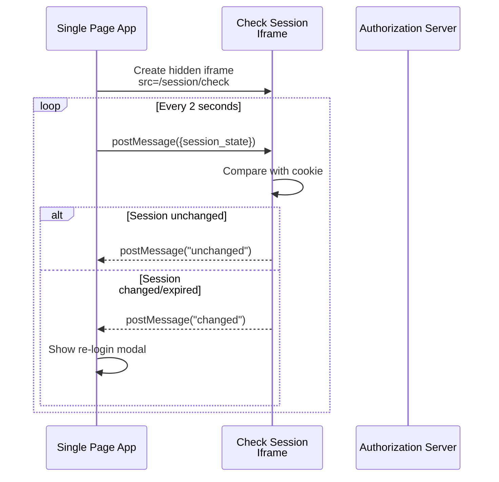
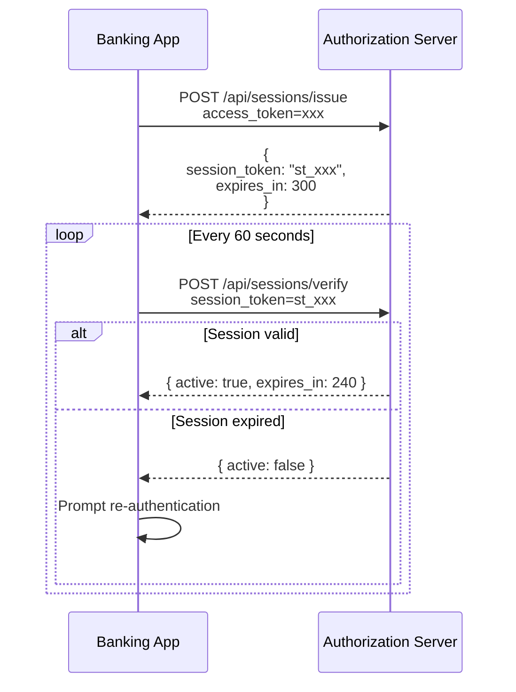
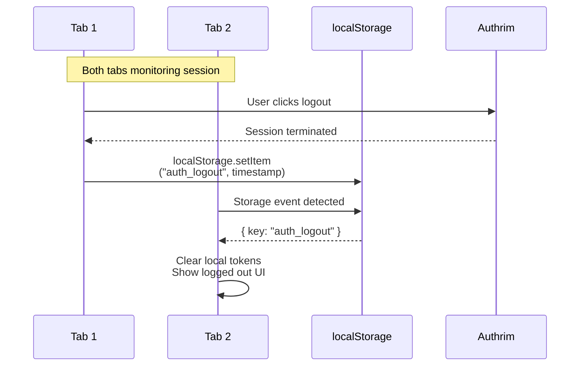

# Session Management

Monitor and manage user authentication sessions with Check Session iframe and ITP-compatible APIs.

## Overview

| Specification                                                                           | Status         | Mechanism            |
| --------------------------------------------------------------------------------------- | -------------- | -------------------- |
| [OIDC Session Management 1.0](https://openid.net/specs/openid-connect-session-1_0.html) | ✅ Implemented | Check Session iframe |
| ITP-Compatible Session API                                                              | ✅ Implemented | Token-based          |

Session Management enables applications to monitor user session state at the authorization server, allowing detection of logout or session changes without full page redirects.

---

## Benefits

| Benefit                | Description                                   |
| ---------------------- | --------------------------------------------- |
| **Session Monitoring** | Detect logout from other apps                 |
| **Silent Checks**      | No user-visible redirects                     |
| **ITP Compatible**     | Works with Safari/Firefox cookie restrictions |
| **Real-time Status**   | Immediate session state awareness             |
| **SSO Coordination**   | Consistent state across applications          |

---

## Mechanisms

### Check Session Iframe (Traditional)

Works by embedding a hidden iframe that checks session state via postMessage.

### ITP-Compatible Token API (Modern)

Uses tokens instead of cookies, working around Intelligent Tracking Prevention.

---

## Practical Use Cases

### Use Case 1: SPA Session Monitoring with Check Session

**Scenario**: A React SPA needs to detect when the user logs out from another tab or application. The app polls the IdP session state and shows a re-login prompt when the session ends.

**Why Check Session**: Non-intrusive session monitoring without redirects. The iframe silently communicates via postMessage.



**Implementation**:

```typescript
// Session monitoring service for SPA
class SessionMonitor {
  private iframe: HTMLIFrameElement | null = null;
  private checkInterval: number | null = null;
  private sessionState: string;
  private clientId: string;

  constructor(config: {
    checkSessionUri: string;
    clientId: string;
    sessionState: string;
    onSessionChange: () => void;
  }) {
    this.sessionState = config.sessionState;
    this.clientId = config.clientId;

    // Create hidden iframe
    this.iframe = document.createElement('iframe');
    this.iframe.src = config.checkSessionUri;
    this.iframe.style.display = 'none';
    this.iframe.setAttribute('sandbox', 'allow-same-origin allow-scripts');
    document.body.appendChild(this.iframe);

    // Listen for messages
    window.addEventListener('message', (event) => {
      if (event.origin !== new URL(config.checkSessionUri).origin) return;

      if (event.data === 'changed') {
        config.onSessionChange();
      }
    });

    // Start polling
    this.startPolling();
  }

  private startPolling() {
    this.checkInterval = window.setInterval(() => {
      this.checkSession();
    }, 2000);
  }

  private checkSession() {
    if (!this.iframe?.contentWindow) return;

    // Send session state to iframe
    const message = `${this.clientId} ${this.sessionState}`;
    this.iframe.contentWindow.postMessage(
      message,
      new URL(this.iframe.src).origin
    );
  }

  stop() {
    if (this.checkInterval) {
      clearInterval(this.checkInterval);
    }
    this.iframe?.remove();
  }
}

// Usage in React app
function App() {
  const { user, sessionState, logout } = useAuth();
  const [showReloginModal, setShowReloginModal] = useState(false);

  useEffect(() => {
    if (!user || !sessionState) return;

    const monitor = new SessionMonitor({
      checkSessionUri: 'https://auth.example.com/session/check',
      clientId: 'spa-client',
      sessionState,
      onSessionChange: () => {
        setShowReloginModal(true);
      }
    });

    return () => monitor.stop();
  }, [user, sessionState]);

  return (
    <>
      {/* App content */}
      {showReloginModal && (
        <Modal>
          <p>Your session has ended. Please log in again.</p>
          <button onClick={() => logout()}>Log In</button>
        </Modal>
      )}
    </>
  );
}
```

---

### Use Case 2: ITP-Compatible Session for Safari/Firefox

**Scenario**: A banking web application needs to maintain session awareness in Safari, which blocks third-party cookies. The Check Session iframe doesn't work. The app uses token-based session APIs instead.

**Why ITP API**: Safari's Intelligent Tracking Prevention (ITP) and Firefox's Enhanced Tracking Protection block third-party cookies, breaking the traditional Check Session iframe. Token-based APIs work around this.



**Implementation**:

```typescript
// ITP-compatible session management
class ITPSessionManager {
  private sessionToken: string | null = null;
  private refreshInterval: number | null = null;

  constructor(private accessToken: string) {}

  // Issue session token (call after login)
  async issueSessionToken(): Promise<void> {
    const response = await fetch('https://auth.example.com/api/sessions/issue', {
      method: 'POST',
      headers: {
        'Content-Type': 'application/json',
        Authorization: `Bearer ${this.accessToken}`,
      },
    });

    const data = await response.json();
    this.sessionToken = data.session_token;

    // Start periodic verification
    this.startVerification(data.expires_in);
  }

  private startVerification(expiresIn: number) {
    // Check at 1/5 of expiry time
    const interval = Math.min((expiresIn * 1000) / 5, 60000);

    this.refreshInterval = window.setInterval(async () => {
      const isValid = await this.verifySession();
      if (!isValid) {
        this.onSessionExpired();
      }
    }, interval);
  }

  async verifySession(): Promise<boolean> {
    if (!this.sessionToken) return false;

    try {
      const response = await fetch('https://auth.example.com/api/sessions/verify', {
        method: 'POST',
        headers: {
          'Content-Type': 'application/json',
        },
        body: JSON.stringify({
          session_token: this.sessionToken,
        }),
      });

      const data = await response.json();
      return data.active === true;
    } catch (error) {
      console.error('Session verification failed', error);
      return false;
    }
  }

  // Extend session (call on user activity)
  async refreshSession(): Promise<void> {
    if (!this.sessionToken) return;

    const response = await fetch('https://auth.example.com/api/sessions/refresh', {
      method: 'POST',
      headers: {
        'Content-Type': 'application/json',
        Authorization: `Bearer ${this.accessToken}`,
      },
      body: JSON.stringify({
        session_token: this.sessionToken,
      }),
    });

    const data = await response.json();
    this.sessionToken = data.session_token;
  }

  private onSessionExpired() {
    this.stop();
    // Emit event or callback
    window.dispatchEvent(new CustomEvent('session-expired'));
  }

  stop() {
    if (this.refreshInterval) {
      clearInterval(this.refreshInterval);
    }
    this.sessionToken = null;
  }
}

// Usage with activity-based refresh
const sessionManager = new ITPSessionManager(accessToken);
await sessionManager.issueSessionToken();

// Refresh on user activity
['click', 'keypress', 'scroll'].forEach((event) => {
  document.addEventListener(
    event,
    () => {
      sessionManager.refreshSession();
    },
    { passive: true }
  );
});

// Handle expiration
window.addEventListener('session-expired', () => {
  showReauthenticationModal();
});
```

---

### Use Case 3: Multi-Tab Session Synchronization

**Scenario**: A user has the same application open in multiple browser tabs. When they log out in one tab, all other tabs should detect this and update their state.

**Why Session Management**: Provides consistent session state across all browser contexts without manual coordination.



**Implementation**:

```typescript
// Cross-tab session synchronization
class CrossTabSessionSync {
  private readonly LOGOUT_KEY = 'auth_logout';
  private readonly SESSION_KEY = 'auth_session';

  constructor(private onLogout: () => void) {
    // Listen for storage events from other tabs
    window.addEventListener('storage', (event) => {
      if (event.key === this.LOGOUT_KEY && event.newValue) {
        // Another tab logged out
        this.handleRemoteLogout();
      }
    });
  }

  // Call this when user logs out in this tab
  broadcastLogout() {
    // Set timestamp to trigger storage event in other tabs
    localStorage.setItem(this.LOGOUT_KEY, Date.now().toString());

    // Clean up immediately
    localStorage.removeItem(this.LOGOUT_KEY);
    localStorage.removeItem(this.SESSION_KEY);
  }

  // Called when another tab logs out
  private handleRemoteLogout() {
    // Clear this tab's session data
    localStorage.removeItem(this.SESSION_KEY);
    sessionStorage.clear();

    // Notify the application
    this.onLogout();
  }

  // Store session data (accessible to all tabs)
  storeSession(session: { accessToken: string; expiresAt: number }) {
    localStorage.setItem(this.SESSION_KEY, JSON.stringify(session));
  }

  // Get current session
  getSession(): { accessToken: string; expiresAt: number } | null {
    const data = localStorage.getItem(this.SESSION_KEY);
    return data ? JSON.parse(data) : null;
  }
}

// Combined with Check Session for comprehensive monitoring
function useSessionManagement() {
  const [isAuthenticated, setIsAuthenticated] = useState(true);

  useEffect(() => {
    // Cross-tab sync
    const crossTab = new CrossTabSessionSync(() => {
      setIsAuthenticated(false);
    });

    // IdP session monitoring
    const monitor = new SessionMonitor({
      checkSessionUri: 'https://auth.example.com/session/check',
      clientId: 'my-app',
      sessionState: getSessionState(),
      onSessionChange: () => {
        setIsAuthenticated(false);
      },
    });

    return () => monitor.stop();
  }, []);

  const logout = () => {
    const crossTab = new CrossTabSessionSync(() => {});
    crossTab.broadcastLogout();
    setIsAuthenticated(false);
    // Redirect to IdP logout
  };

  return { isAuthenticated, logout };
}
```

---

## API Reference

### Check Session Endpoint

```http
GET /session/check
```

Returns an HTML page with JavaScript for session state checking.

### ITP Session APIs

```http
POST /api/sessions/issue
Authorization: Bearer {access_token}

Response:
{
  "session_token": "st_xxx",
  "expires_in": 300
}
```

```http
POST /api/sessions/verify
Content-Type: application/json

{
  "session_token": "st_xxx"
}

Response:
{
  "active": true,
  "expires_in": 240
}
```

```http
POST /api/sessions/refresh
Authorization: Bearer {access_token}
Content-Type: application/json

{
  "session_token": "st_xxx"
}

Response:
{
  "session_token": "st_new",
  "expires_in": 300
}
```

---

## Session State

The session state is a hash that changes when:

- User logs in
- User logs out
- Session expires
- User identity changes

Format: `{state}.{salt}` (e.g., `abc123.xyz789`)

---

## Security Considerations

| Consideration         | Implementation                       |
| --------------------- | ------------------------------------ |
| **Origin Validation** | Check iframe message origin          |
| **Token Binding**     | Session tokens bound to access token |
| **Short TTL**         | Session tokens expire quickly        |
| **Secure Context**    | HTTPS required                       |

---

## Implementation Files

| Component     | File                                                  | Description         |
| ------------- | ----------------------------------------------------- | ------------------- |
| Check Session | `packages/op-auth/src/session-check.ts`               | Iframe endpoint     |
| Session APIs  | `packages/op-auth/src/session-api.ts`                 | ITP-compatible APIs |
| Session Store | `packages/shared/src/durable-objects/SessionStore.ts` | State management    |

---

## References

- [OIDC Session Management 1.0](https://openid.net/specs/openid-connect-session-1_0.html)
- [Safari ITP Documentation](https://webkit.org/blog/10218/full-third-party-cookie-blocking-and-more/)

---

**Last Updated**: 2025-12-20
**Status**: ✅ Fully Implemented
**Implementation**: `packages/op-auth/src/`
