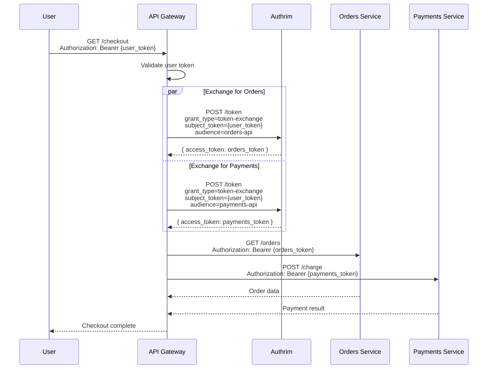
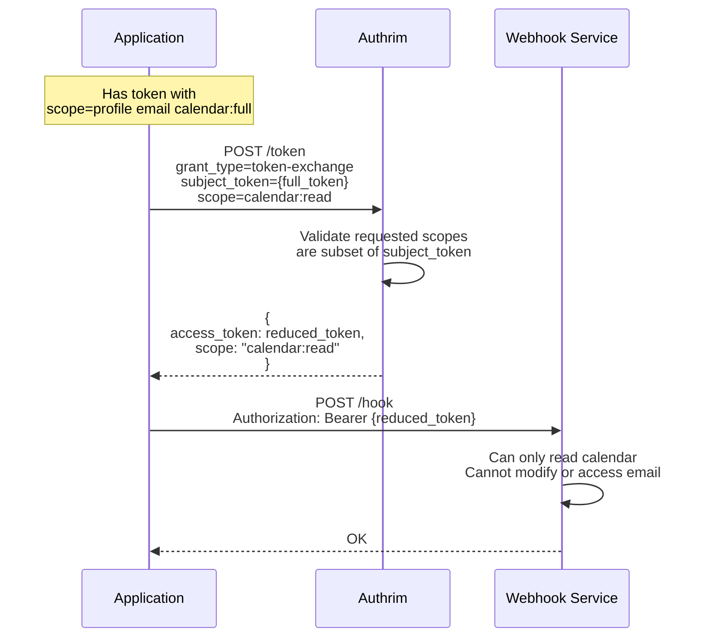
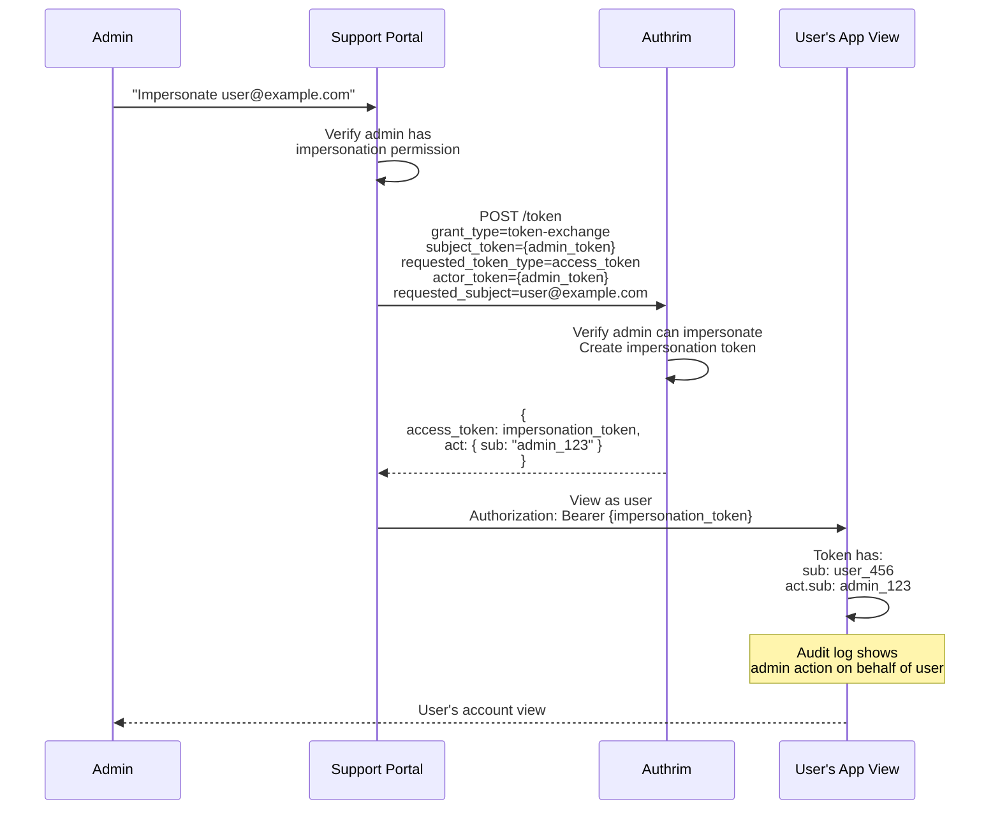

# Token Exchange

Exchange tokens for different audiences, scopes, or token types using RFC 8693.

## Overview

| Specification | Status | Grant Type |
|---------------|--------|------------|
| [RFC 8693](https://datatracker.ietf.org/doc/html/rfc8693) | ✅ Implemented | `urn:ietf:params:oauth:grant-type:token-exchange` |

Token Exchange enables secure token transformation for microservices, delegation, and impersonation scenarios. A client can exchange one token for another with different characteristics.

---

## Benefits

| Benefit | Description |
|---------|-------------|
| **Microservices Auth** | Propagate identity across services |
| **Audience Restriction** | Get tokens for specific APIs |
| **Scope Reduction** | Downscope tokens for least privilege |
| **Delegation** | Act on behalf of users |
| **Impersonation** | Admin access as another user |

---

## Token Exchange Types

| Type | Description | Use Case |
|------|-------------|----------|
| **Audience Exchange** | Change token audience | Service-to-service calls |
| **Scope Reduction** | Reduce token permissions | Least privilege |
| **Delegation** | `may_act` claim | Service acting for user |
| **Impersonation** | Full identity swap | Admin support tools |

---

## Practical Use Cases

### Use Case 1: Microservices Identity Propagation

**Scenario**: An API Gateway receives requests with user access tokens. Backend microservices need tokens scoped to their specific APIs. The gateway exchanges the user token for service-specific tokens.

**Why Token Exchange**: Each microservice needs a token for its own audience. Direct token use violates least privilege. Token exchange creates properly-scoped tokens.



**Implementation**:

```typescript
// API Gateway: Token exchange for downstream services
class TokenExchangeService {
  private tokenCache = new Map<string, { token: string; expiresAt: number }>();

  async getServiceToken(
    userToken: string,
    targetAudience: string,
    requiredScopes: string[]
  ): Promise<string> {
    // Check cache
    const cacheKey = `${userToken}:${targetAudience}`;
    const cached = this.tokenCache.get(cacheKey);
    if (cached && cached.expiresAt > Date.now()) {
      return cached.token;
    }

    // Exchange token
    const response = await fetch('https://auth.example.com/token', {
      method: 'POST',
      headers: {
        'Content-Type': 'application/x-www-form-urlencoded',
        'Authorization': `Basic ${this.gatewayCredentials}`
      },
      body: new URLSearchParams({
        grant_type: 'urn:ietf:params:oauth:grant-type:token-exchange',
        subject_token: userToken,
        subject_token_type: 'urn:ietf:params:oauth:token-type:access_token',
        audience: targetAudience,
        scope: requiredScopes.join(' '),
        requested_token_type: 'urn:ietf:params:oauth:token-type:access_token'
      })
    });

    const result = await response.json();

    // Cache token
    this.tokenCache.set(cacheKey, {
      token: result.access_token,
      expiresAt: Date.now() + (result.expires_in - 60) * 1000
    });

    return result.access_token;
  }
}

// Gateway middleware
async function handleCheckout(req: Request) {
  const userToken = extractBearerToken(req);
  const tokenService = new TokenExchangeService();

  // Get tokens for downstream services
  const [ordersToken, paymentsToken] = await Promise.all([
    tokenService.getServiceToken(userToken, 'https://orders.internal', ['orders:read']),
    tokenService.getServiceToken(userToken, 'https://payments.internal', ['payments:charge'])
  ]);

  // Call downstream services with exchanged tokens
  const [orders, paymentResult] = await Promise.all([
    fetch('https://orders.internal/api/orders', {
      headers: { 'Authorization': `Bearer ${ordersToken}` }
    }),
    fetch('https://payments.internal/api/charge', {
      method: 'POST',
      headers: { 'Authorization': `Bearer ${paymentsToken}` },
      body: JSON.stringify({ amount: 100 })
    })
  ]);

  return { orders: await orders.json(), payment: await paymentResult.json() };
}
```

---

### Use Case 2: Scope Reduction for Third-Party Integration

**Scenario**: A user grants an app full access to their account. When the app calls a third-party webhook service, it should only share minimal permissions (read-only access to specific data).

**Why Scope Reduction**: Principle of least privilege. The third party should not receive full user permissions.



**Implementation**:

```typescript
// Reduce token scope for third-party call
async function callWebhookWithReducedToken(
  userToken: string,
  webhookUrl: string,
  data: any
) {
  // Exchange for reduced-scope token
  const response = await fetch('https://auth.example.com/token', {
    method: 'POST',
    headers: {
      'Content-Type': 'application/x-www-form-urlencoded',
      'Authorization': `Basic ${Buffer.from(
        `${CLIENT_ID}:${CLIENT_SECRET}`
      ).toString('base64')}`
    },
    body: new URLSearchParams({
      grant_type: 'urn:ietf:params:oauth:grant-type:token-exchange',
      subject_token: userToken,
      subject_token_type: 'urn:ietf:params:oauth:token-type:access_token',
      // Request only the scopes needed for this specific operation
      scope: 'calendar:read',
      requested_token_type: 'urn:ietf:params:oauth:token-type:access_token'
    })
  });

  const { access_token: reducedToken } = await response.json();

  // Call webhook with reduced permissions
  return fetch(webhookUrl, {
    method: 'POST',
    headers: {
      'Authorization': `Bearer ${reducedToken}`,
      'Content-Type': 'application/json'
    },
    body: JSON.stringify(data)
  });
}
```

---

### Use Case 3: Admin Impersonation for Support

**Scenario**: A customer support agent needs to troubleshoot a user's account. The admin impersonates the user to see exactly what they see, with full audit logging.

**Why Impersonation**: Support can diagnose issues without asking users for credentials. All actions are logged with both the admin and user identities.



**Implementation**:

```typescript
// Admin impersonation flow
async function impersonateUser(
  adminToken: string,
  targetUserEmail: string
): Promise<ImpersonationResult> {
  // Verify admin has impersonation permission (client-side check)
  const adminClaims = decodeToken(adminToken);
  if (!adminClaims.permissions?.includes('users:impersonate')) {
    throw new Error('Insufficient permissions for impersonation');
  }

  // Exchange for impersonation token
  const response = await fetch('https://auth.example.com/token', {
    method: 'POST',
    headers: {
      'Content-Type': 'application/x-www-form-urlencoded',
      'Authorization': `Basic ${Buffer.from(
        `${SUPPORT_CLIENT_ID}:${SUPPORT_CLIENT_SECRET}`
      ).toString('base64')}`
    },
    body: new URLSearchParams({
      grant_type: 'urn:ietf:params:oauth:grant-type:token-exchange',

      // The admin's token (provides authorization)
      subject_token: adminToken,
      subject_token_type: 'urn:ietf:params:oauth:token-type:access_token',

      // Also include admin as actor (for audit trail)
      actor_token: adminToken,
      actor_token_type: 'urn:ietf:params:oauth:token-type:access_token',

      // Who we want to impersonate
      requested_subject: targetUserEmail,

      // What we're requesting
      requested_token_type: 'urn:ietf:params:oauth:token-type:access_token',
      scope: 'openid profile email' // Limited scope for safety
    })
  });

  if (!response.ok) {
    const error = await response.json();
    throw new Error(`Impersonation failed: ${error.error_description}`);
  }

  const result = await response.json();

  // Log impersonation for audit
  await auditLog({
    event: 'USER_IMPERSONATION',
    admin_id: adminClaims.sub,
    target_user: targetUserEmail,
    timestamp: new Date().toISOString(),
    session_id: result.session_id
  });

  return {
    accessToken: result.access_token,
    expiresIn: result.expires_in,
    impersonatedUser: targetUserEmail,
    actorClaim: result.act // { sub: "admin_123" }
  };
}

// Backend: Handle impersonation token
app.get('/api/profile', authenticate, (req, res) => {
  const token = req.user;

  // Check if this is an impersonation
  if (token.act) {
    console.log(`Admin ${token.act.sub} viewing as user ${token.sub}`);

    // Log all actions with both identities
    auditLog({
      action: 'VIEW_PROFILE',
      real_subject: token.sub,
      acting_as: token.act.sub,
      is_impersonation: true
    });
  }

  // Return data for the subject (impersonated user)
  const profile = await getUserProfile(token.sub);
  res.json(profile);
});
```

---

## API Reference

### Token Exchange Request

```http
POST /token
Content-Type: application/x-www-form-urlencoded

grant_type=urn:ietf:params:oauth:grant-type:token-exchange&
subject_token={token}&
subject_token_type=urn:ietf:params:oauth:token-type:access_token&
audience=https://api.example.com&
scope=read write&
requested_token_type=urn:ietf:params:oauth:token-type:access_token
```

### Request Parameters

| Parameter | Required | Description |
|-----------|----------|-------------|
| `grant_type` | ✅ | `urn:ietf:params:oauth:grant-type:token-exchange` |
| `subject_token` | ✅ | Token to exchange |
| `subject_token_type` | ✅ | Type of subject token |
| `audience` | Optional | Target audience for new token |
| `scope` | Optional | Requested scopes (subset) |
| `requested_token_type` | Optional | Type of requested token |
| `actor_token` | Optional | Token of acting party |
| `actor_token_type` | Conditional | Type of actor token |

### Token Types

| Token Type URI | Description |
|----------------|-------------|
| `urn:ietf:params:oauth:token-type:access_token` | OAuth 2.0 access token |
| `urn:ietf:params:oauth:token-type:refresh_token` | OAuth 2.0 refresh token |
| `urn:ietf:params:oauth:token-type:id_token` | OIDC ID token |
| `urn:ietf:params:oauth:token-type:jwt` | JWT |

### Response

```json
{
  "access_token": "eyJhbGciOiJSUzI1NiIs...",
  "issued_token_type": "urn:ietf:params:oauth:token-type:access_token",
  "token_type": "Bearer",
  "expires_in": 3600,
  "scope": "read",
  "act": {
    "sub": "admin_123"
  }
}
```

---

## Exchanged Token Claims

### Delegation Token (may_act)

```json
{
  "sub": "user_456",
  "aud": "https://api.example.com",
  "scope": "read write",
  "may_act": {
    "sub": "service_123",
    "iss": "https://auth.example.com"
  }
}
```

### Impersonation Token (act)

```json
{
  "sub": "user_456",
  "aud": "https://api.example.com",
  "act": {
    "sub": "admin_123"
  }
}
```

---

## Security Considerations

| Consideration | Implementation |
|---------------|----------------|
| **Scope Validation** | Can only reduce, not expand scopes |
| **Audience Restriction** | Pre-configured allowed audiences |
| **Impersonation Policy** | Explicit permission required |
| **Audit Logging** | Log all exchanges with context |
| **Token Binding** | DPoP tokens bound to new proof |

---

## Configuration

### Enable Token Exchange

```bash
# Via Admin API
curl -X PUT "https://auth.example.com/api/admin/settings/token-exchange" \
  -H "Authorization: Bearer ${ADMIN_TOKEN}" \
  -d '{
    "enabled": true,
    "allowed_audiences": ["https://api.example.com", "https://payments.internal"],
    "impersonation_enabled": true,
    "impersonation_requires_permission": "users:impersonate"
  }'
```

### Client Configuration

```json
{
  "client_id": "api-gateway",
  "grant_types": ["urn:ietf:params:oauth:grant-type:token-exchange"],
  "token_exchange_allowed_audiences": ["https://orders.internal", "https://payments.internal"],
  "token_exchange_allowed_scopes": ["orders:read", "payments:charge"]
}
```

---

## Implementation Files

| Component | File | Description |
|-----------|------|-------------|
| Token Exchange | `packages/op-token/src/token-exchange.ts` | Grant handler |
| Policy | `packages/shared/src/utils/token-exchange-policy.ts` | Validation |
| Audit | `packages/shared/src/utils/audit.ts` | Logging |

---

## References

- [RFC 8693 - Token Exchange](https://datatracker.ietf.org/doc/html/rfc8693)
- [OAuth 2.0 Token Introspection (RFC 7662)](https://datatracker.ietf.org/doc/html/rfc7662)

---

**Last Updated**: 2025-12-20
**Status**: ✅ Fully Implemented
**Implementation**: `packages/op-token/src/token-exchange.ts`
