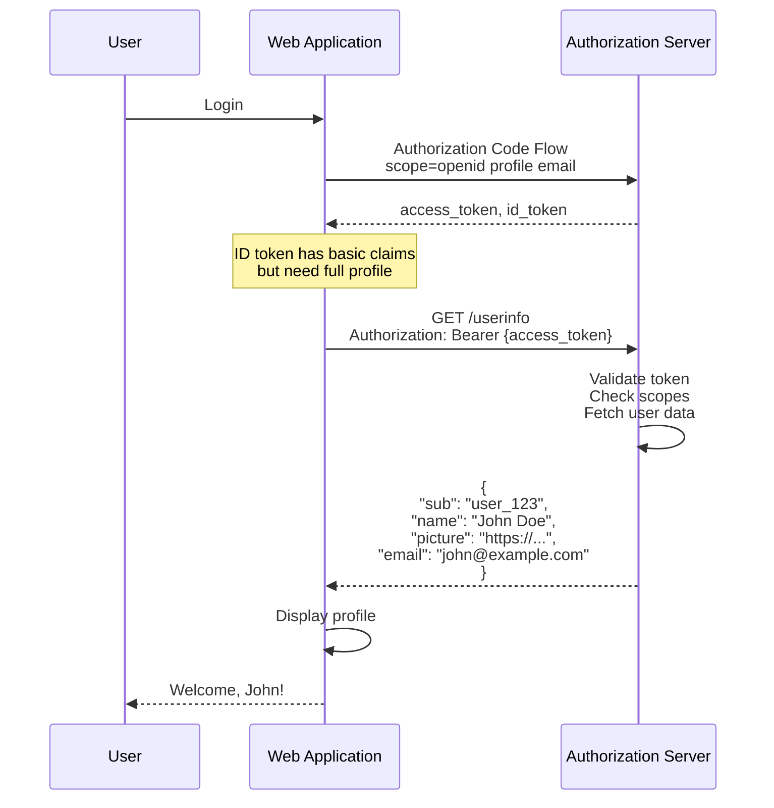
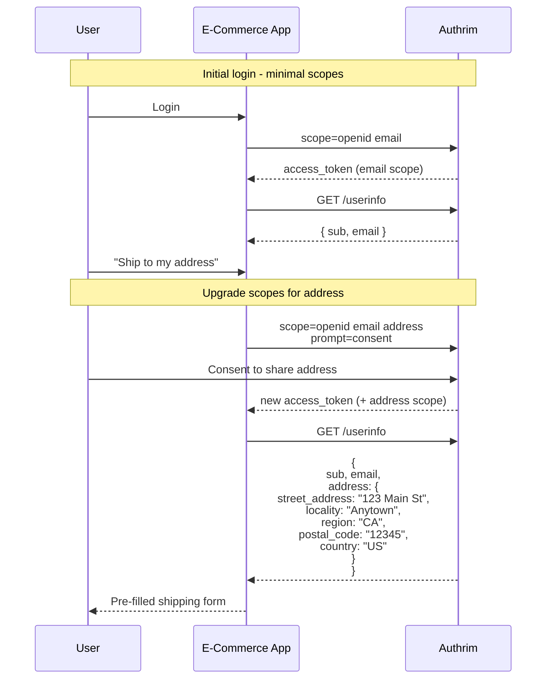
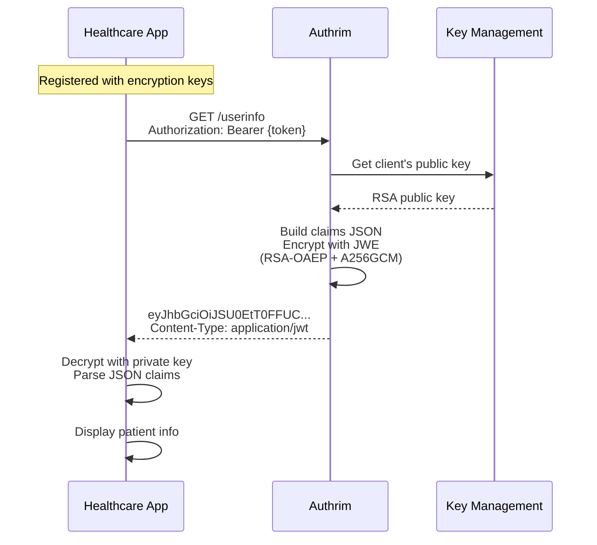

# UserInfo Endpoint

Retrieve authenticated user claims with fine-grained scope control.

## Overview

| Specification | Status | Endpoint |
|---------------|--------|----------|
| [OIDC Core 1.0 Section 5.3](https://openid.net/specs/openid-connect-core-1_0.html#UserInfo) | ✅ Implemented | `/userinfo` |
| [JWE Encryption](https://openid.net/specs/openid-connect-core-1_0.html#UserInfoResponse) | ✅ Implemented | Optional |

The UserInfo endpoint returns claims about the authenticated user. Claims returned depend on the scopes granted during authorization.

---

## Benefits

| Benefit | Description |
|---------|-------------|
| **Scope-Based Access** | Only return claims for granted scopes |
| **Fresh Data** | Real-time user information (vs cached ID token) |
| **Large Claims** | No JWT size limitations |
| **Privacy Control** | Users control what's shared per client |
| **JWE Support** | Encrypted responses for sensitive data |

---

## Practical Use Cases

### Use Case 1: Profile Display in Web Application

**Scenario**: A web application displays user profile information (name, picture, email) after login. The app needs fresh data even if the ID token is cached.

**Why UserInfo**: While ID tokens contain claims, they may be cached. UserInfo provides current data and works when ID token claims are minimal.



**Implementation**:

```typescript
// Fetch user profile after login
async function fetchUserProfile(accessToken: string): Promise<UserProfile> {
  const response = await fetch('https://auth.example.com/userinfo', {
    headers: {
      'Authorization': `Bearer ${accessToken}`
    }
  });

  if (!response.ok) {
    if (response.status === 401) {
      throw new Error('Token expired or invalid');
    }
    throw new Error('Failed to fetch user info');
  }

  const userInfo = await response.json();

  return {
    id: userInfo.sub,
    name: userInfo.name,
    email: userInfo.email,
    picture: userInfo.picture,
    emailVerified: userInfo.email_verified
  };
}

// React hook for user profile
function useUserProfile() {
  const { accessToken } = useAuth();
  const [profile, setProfile] = useState<UserProfile | null>(null);

  useEffect(() => {
    if (accessToken) {
      fetchUserProfile(accessToken)
        .then(setProfile)
        .catch(console.error);
    }
  }, [accessToken]);

  return profile;
}

// Display component
function ProfileCard() {
  const profile = useUserProfile();

  if (!profile) return <Loading />;

  return (
    <div className="profile-card">
      
      <h2>{profile.name}</h2>
      <p>{profile.email}</p>
      {profile.emailVerified && <Badge>Verified</Badge>}
    </div>
  );
}
```

---

### Use Case 2: Progressive Disclosure with Scope Upgrade

**Scenario**: An e-commerce app initially requests minimal scopes. When user wants to use address-based features (shipping), the app requests additional scopes and fetches address from UserInfo.

**Why UserInfo**: Address claims are only returned when `address` scope is granted. Progressive disclosure improves privacy and user trust.



**Implementation**:

```typescript
// Progressive scope management
class ScopeManager {
  private currentScopes: Set<string>;

  constructor(initialScopes: string[]) {
    this.currentScopes = new Set(initialScopes);
  }

  hasScope(scope: string): boolean {
    return this.currentScopes.has(scope);
  }

  async requestAdditionalScope(scope: string): Promise<string> {
    if (this.hasScope(scope)) {
      return this.accessToken;
    }

    // Request new scopes - will prompt for consent
    const newScopes = [...this.currentScopes, scope].join(' ');

    const result = await startAuthFlow({
      scope: newScopes,
      prompt: 'consent' // Force consent for new scope
    });

    this.currentScopes = new Set(result.scope.split(' '));
    this.accessToken = result.access_token;

    return this.accessToken;
  }
}

// Shipping form component
function ShippingForm() {
  const scopeManager = useScopeManager();
  const [address, setAddress] = useState<Address | null>(null);

  const loadSavedAddress = async () => {
    // Request address scope if not already granted
    const token = await scopeManager.requestAdditionalScope('address');

    // Fetch address from UserInfo
    const userInfo = await fetchUserInfo(token);

    if (userInfo.address) {
      setAddress(userInfo.address);
    }
  };

  return (
    <form>
      <button type="button" onClick={loadSavedAddress}>
        Use Saved Address
      </button>

      {address && (
        <AddressDisplay address={address} />
      )}
    </form>
  );
}
```

---

### Use Case 3: Encrypted UserInfo for Healthcare

**Scenario**: A healthcare application receives sensitive patient information (phone number, address) from the IdP. Regulations require encryption of PII in transit and at rest.

**Why Encrypted UserInfo**: JWE-encrypted responses ensure only the intended client can read sensitive claims, even if TLS is terminated at a proxy.



**Implementation**:

```typescript
// Client registration with encryption
const clientRegistration = {
  client_id: 'healthcare-app',
  client_name: 'Patient Portal',

  // Request encrypted userinfo responses
  userinfo_encrypted_response_alg: 'RSA-OAEP',
  userinfo_encrypted_response_enc: 'A256GCM',

  // Provide encryption key
  jwks: {
    keys: [{
      kty: 'RSA',
      use: 'enc',
      kid: 'enc-key-1',
      alg: 'RSA-OAEP',
      n: '...',
      e: 'AQAB'
    }]
  }
};

// Decrypt userinfo response
import * as jose from 'jose';

async function fetchEncryptedUserInfo(accessToken: string): Promise<UserInfo> {
  const response = await fetch('https://auth.example.com/userinfo', {
    headers: {
      'Authorization': `Bearer ${accessToken}`
    }
  });

  const contentType = response.headers.get('content-type');

  if (contentType?.includes('application/jwt')) {
    // Response is encrypted JWE
    const jwe = await response.text();

    // Load private key for decryption
    const privateKey = await loadPrivateKey();

    // Decrypt JWE
    const { plaintext } = await jose.compactDecrypt(jwe, privateKey);

    return JSON.parse(new TextDecoder().decode(plaintext));
  }

  // Plain JSON response
  return response.json();
}

// HIPAA-compliant userinfo handling
async function getPatientInfo(accessToken: string): Promise<PatientInfo> {
  const userInfo = await fetchEncryptedUserInfo(accessToken);

  // Log access for audit trail (no PII in logs)
  await auditLog({
    event: 'PATIENT_INFO_ACCESS',
    patient_id_hash: sha256(userInfo.sub),
    timestamp: new Date().toISOString()
  });

  return {
    id: userInfo.sub,
    name: userInfo.name,
    phone: userInfo.phone_number,
    address: userInfo.address
  };
}
```

---

## Scope to Claims Mapping

| Scope | Claims |
|-------|--------|
| `openid` | `sub` |
| `profile` | `name`, `family_name`, `given_name`, `middle_name`, `nickname`, `preferred_username`, `profile`, `picture`, `website`, `gender`, `birthdate`, `zoneinfo`, `locale`, `updated_at` |
| `email` | `email`, `email_verified` |
| `address` | `address` (structured object) |
| `phone` | `phone_number`, `phone_number_verified` |

---

## API Reference

### Request

```http
GET /userinfo
Authorization: Bearer {access_token}
```

Or:

```http
POST /userinfo
Content-Type: application/x-www-form-urlencoded

access_token={access_token}
```

### Response (JSON)

```json
{
  "sub": "user_123",
  "name": "John Doe",
  "given_name": "John",
  "family_name": "Doe",
  "preferred_username": "johnd",
  "email": "john@example.com",
  "email_verified": true,
  "picture": "https://example.com/johnd/photo.jpg",
  "updated_at": 1703119856
}
```

### Response (JWT - when signed/encrypted)

```http
HTTP/1.1 200 OK
Content-Type: application/jwt

eyJhbGciOiJSUzI1NiIsInR5cCI6IkpXVCJ9...
```

---

## Error Responses

| Status | Error | Description |
|--------|-------|-------------|
| 401 | `invalid_token` | Token expired or invalid |
| 403 | `insufficient_scope` | Token lacks required scope |

```json
{
  "error": "invalid_token",
  "error_description": "The access token has expired"
}
```

---

## Security Considerations

| Consideration | Implementation |
|---------------|----------------|
| **Token Validation** | Verify access token before returning claims |
| **Scope Enforcement** | Only return claims for granted scopes |
| **HTTPS Required** | All requests must use TLS |
| **Token Binding** | Support DPoP-bound access tokens |

---

## Configuration

### Client Configuration

| Field | Description |
|-------|-------------|
| `userinfo_signed_response_alg` | Sign userinfo response (RS256) |
| `userinfo_encrypted_response_alg` | Encrypt userinfo (RSA-OAEP) |
| `userinfo_encrypted_response_enc` | Content encryption (A256GCM) |

---

## Implementation Files

| Component | File | Description |
|-----------|------|-------------|
| UserInfo Handler | `packages/op-userinfo/src/userinfo.ts` | Endpoint logic |
| Claims Builder | `packages/shared/src/utils/claims.ts` | Claim generation |
| JWE Encryption | `packages/shared/src/utils/jwe.ts` | Response encryption |

---

## References

- [OIDC Core 1.0 - UserInfo Endpoint](https://openid.net/specs/openid-connect-core-1_0.html#UserInfo)
- [OIDC Core 1.0 - Standard Claims](https://openid.net/specs/openid-connect-core-1_0.html#StandardClaims)
- [JWT (RFC 7519)](https://datatracker.ietf.org/doc/html/rfc7519)

---

**Last Updated**: 2025-12-20
**Status**: ✅ Fully Implemented
**Implementation**: `packages/op-userinfo/src/`
