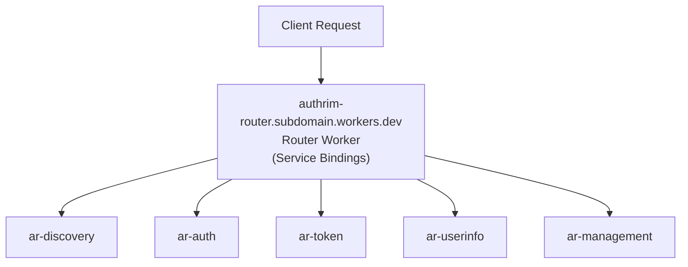

# Authrim Router Worker

The Router Worker provides a unified entry point for all Authrim OpenID Connect endpoints when using workers.dev deployment.

## Purpose

This worker solves the OpenID Connect specification compliance issue where all endpoints must be accessible from a single issuer domain. When deploying to Cloudflare Workers without a custom domain, each worker gets its own subdomain (e.g., `authrim-ar-discovery.subdomain.workers.dev`, `authrim-ar-auth.subdomain.workers.dev`), which violates the OIDC spec.

The Router Worker acts as a single entry point (`authrim-router.subdomain.workers.dev`) and uses Service Bindings to route requests to the appropriate specialized worker.

## Architecture



## Routing Table

| Path Pattern     | Target Worker | Endpoints                           |
| ---------------- | ------------- | ----------------------------------- |
| `/.well-known/*` | ar-discovery  | Discovery, JWKS                     |
| `/authorize`     | ar-auth       | Authorization endpoint              |
| `/as/*`          | ar-auth       | Pushed Authorization Requests (PAR) |
| `/token`         | ar-token      | Token endpoint                      |
| `/userinfo`      | ar-userinfo   | UserInfo endpoint                   |
| `/register`      | ar-management | Dynamic Client Registration         |
| `/introspect`    | ar-management | Token Introspection                 |
| `/revoke`        | ar-management | Token Revocation                    |

## When to Use

**Use Router Worker when:**

- Deploying to workers.dev for testing/development
- You don't have a custom domain
- You need OpenID Connect specification compliance

**Don't use Router Worker when:**

- You have a custom domain managed by Cloudflare
- You're using Cloudflare Routes for direct routing
- You need optimal performance (Routes are faster)

## Configuration

The Router Worker uses Service Bindings, which are automatically configured by `setup-dev.sh`. The bindings are defined in `wrangler.toml`:

```toml
[[services]]
binding = "OP_DISCOVERY"
service = "authrim-ar-discovery"

[[services]]
binding = "OP_AUTH"
service = "authrim-ar-auth"

# ... etc
```

## Deployment

The Router Worker is conditionally deployed based on your deployment mode:

```bash
# Test environment (with Router Worker)
pnpm run deploy:with-router

# Production environment (without Router Worker)
pnpm run deploy
```

## Performance Considerations

- **Latency**: Adds ~1-5ms overhead per request (Service Binding hop)
- **Simplicity**: Trade-off for OpenID Connect compliance on workers.dev
- **Not needed in production**: Use Cloudflare Routes for optimal performance

## Development

```bash
# Generate wrangler.toml with Service Bindings
./scripts/setup-dev.sh

# Start router in development mode
cd packages/router
pnpm run dev
```

The router runs on port 8786 by default.
